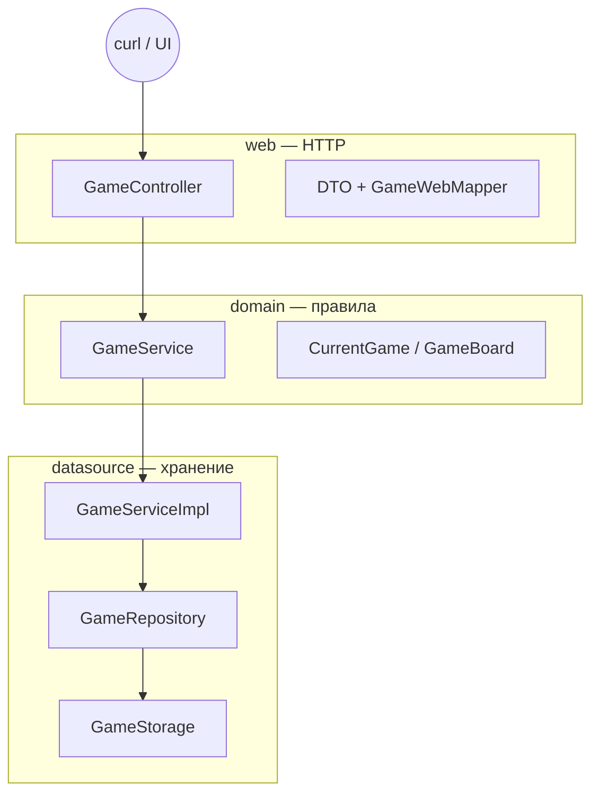

# T04 — Разработка построчно v2: постепенный код + теория

> **Формат v2:** код **наращивается микро-шагами**. Полный файл — только в **«Сверка: файл целиком»**.  
> **Рабочая папка:** `B:\school21\Java\Backend\AP1_Jv_T04B.ID_1421426-1\src\TicTacToe_1.2_sql_auth`  
> **Не подглядывай** в готовый проект до «Проверки» блока.  
> **Теория глубже (опционально):** [`T04_07_ТЕОРИЯ_ПОЛНОСТЬЮ.md`](T04_07_ТЕОРИЯ_ПОЛНОСТЬЮ.md)

---

## Как читать v2

1. **Теория** — до кода.  
2. **Микро-шаги** — дописываешь в IDE **готовый Java-код** из блока «Напиши» (не псевдокод, не `{ ... }`).  
3. **Сверка** — полный файл в конце блока; если микро-шаг кажется обрезанным — **сверка главнее**.  
4. **Проверка** — команда в терминале (`compileJava`, `bootRun`, curl).  
5. **«Сделай паузу»** — опционально, часто «на защиту»; пропускай, если вопрос про код, которого ещё нет. Смотри подсказку под вопросом или блок **«Если сломалось»**.

---

## Оглавление

- [ ] **Этап A** — Среда, Gradle, первый `bootRun`
- [ ] **Этап B** — T03 в памяти (PvE + Minimax)
- [ ] **Этап C** — PostgreSQL + JPA
- [ ] **Этап D** — Basic Auth
- [ ] **Этап E** — PvP + все эндпоинты
- [ ] **Этап F** — curl-сценарии
- [ ] **Этап G** — Браузерный UI

---

## Команды (Windows)

```powershell
cd B:\school21\Java\Backend\AP1_Jv_T04B.ID_1421426-1\src\TicTacToe_1.2_sql_auth
java -version
.\gradlew.bat bootRun
```

<details><summary>Bash (macOS / Linux)</summary>

```bash
cd src/TicTacToe_1.2_sql_auth
export JAVA_HOME=$(/usr/libexec/java_home -v 21)
./gradlew bootRun
```

</details>

---

# Пролог — зачем всё это и куда мы идём

### Теория (прочитай до кода)

**HTTP** — язык, на котором браузер и сервер разговаривают. Клиент шлёт **запрос**: метод (`GET`, `POST`, …), URL (`http://localhost:8080/game/...`), заголовки (`Content-Type: application/json`) и иногда **тело** (body) — текст или байты. Сервер отвечает **статусом** (`200 OK`, `400 Bad Request`, `404 Not Found`, `422 Unprocessable Entity`) и своим телом. Ты не «вызываешь функцию» напрямую — ты отправляешь сообщение по сети и ждёшь ответ.

Для backend-разработчика важно различать **идемпотентность** и **безопасность** методов. `GET` должен только читать данные и не менять состояние на сервере. `POST` создаёт или изменяет ресурс — каждый вызов может дать новый результат. В T03 у нас один `POST /game/{uuid}`: клиент присылает **целую доску** после своего хода, сервер валидирует, считает ответ компьютера и возвращает обновлённую игру.

**REST** (Representational State Transfer) — стиль проектирования API поверх HTTP. Ресурс — «игра», «пользователь» — имеет URL. Состояние передаётся **представлением** (representation), чаще всего JSON. Хороший REST предсказуем: коды ответов честные, ошибки в едином формате (`ErrorResponse`), идентификаторы в пути (`/game/{gameId}`) совпадают с телом запроса.

**JSON** (JavaScript Object Notation) — текстовый формат обмена данными. Spring Boot с библиотекой **Jackson** автоматически превращает JSON в Java-объекты (DTO) и обратно. Вложенность в JSON соответствует полям: `board.board` — это поле `board` внутри объекта `board` в `CurrentGameDto`. Пустые конструкторы и геттеры/сеттеры в DTO нужны именно для Jackson.

**Слои архитектуры** защищают проект от хаоса. **web** знает про HTTP и DTO, но не про Minimax и не про SQL. **domain** знает правила игры и интерфейсы сервисов, но не знает про Tomcat. **datasource** реализует хранение и алгоритмы, связывая domain с памятью (позже — с PostgreSQL). **di** (dependency injection) собирает граф объектов: кто кому передаётся в конструктор.

Представь конвейер одного запроса T03: `GameController` принимает JSON → `GameWebMapper` делает `CurrentGame` → `GameService.validateBoard` сверяет с сохранённым → `GameService.getNextMove` запускает Minimax → результат маппится в DTO → Jackson отдаёт JSON клиенту. Параллельно `GameRepository.save` кладёт игру в `GameStorage`. Ни один слой не делает чужую работу.

**Дорожная карта всего T04:** **Этап A** — JDK, Gradle, первый `bootRun`. **Этап B** — T03 в RAM (~20 блоков). **Этап C** — PostgreSQL + JPA. **Этап D** — регистрация и Basic Auth. **Этап E** — PvP, лобби, все эндпоинты. **Этап F** — полные сценарии curl. **Этап G** — браузерный UI. Не торопись: каждый этап — отдельная «версия продукта».

### Картина в голове

```

Клиент (curl / браузер)

        |  HTTP + JSON

        v

   [ web: Controller, DTO, Mapper ]

        |  вызовы интерфейсов

        v

   [ domain: GameBoard, GameService ]

        |  реализация

        v

   [ datasource: GameServiceImpl, Repository, Storage ]

        |

        v

   RAM (позже PostgreSQL)

```

Твоя задача в части 1 — пройти путь сверху вниз, пока нижний ящик — это `ConcurrentHashMap`, а не база данных.

### Карта архитектуры (mermaid)



### Команды по умолчанию

Перед каждым запуском сервера:

```powershell
cd B:\school21\Java\Backend\AP1_Jv_T04B.ID_1421426-1\src\TicTacToe_1.2_sql_auth
$env:JAVA_HOME = "C:\Program Files\Java\jdk-21"   # путь к твоему JDK 17–21
.\gradlew.bat bootRun
```

<details><summary>Bash (macOS / Linux)</summary>

```bash
cd src/TicTacToe_1.2_sql_auth
export JAVA_HOME=$(/usr/libexec/java_home -v 21)
./gradlew bootRun
```

</details>

---

# Теория перед Этапом A — JDK, Gradle, Spring Boot

### Теория (прочитай до кода)

**JDK** (Java Development Kit) — компилятор `javac`, runtime `java`, стандартная библиотека. Spring Boot 3 требует **Java 17+**. На School21 часто стоит Java 26 — она слишком новая для Gradle/Spring в этом проекте. Выставляй `JAVA_HOME` на **17 или 21** (Eclipse Temurin — хороший выбор).

**Gradle** — система сборки. Файл `build.gradle.kts` (Kotlin DSL) описывает плагины, зависимости, версию Java. Wrapper (`gradlew.bat` / `gradlew`) фиксирует версию Gradle в проекте — не нужно ставить Gradle глобально. Команды: `bootRun` (запуск), `compileJava` (только компиляция), `dependencies` (дерево библиотек).

**Spring Boot** — надстройка над Spring Framework: встраивает Tomcat, автоконфигурирует Jackson, поднимает контекст приложения. Аннотация `@SpringBootApplication` на `TicTacToeApplication` включает сканирование пакета `tictactoe` и всех вложенных. Точка входа — `main`, который вызывает `SpringApplication.run`.

На этапе A мы подключаем только `spring-boot-starter-web` — без JPA, без Security. Этого достаточно, чтобы Tomcat слушал порт **8080** и отвечал на HTTP. Позже, на этапе C, добавишь `data-jpa` и драйвер PostgreSQL — Gradle подтянет новые jar-файлы после Reload.

Связка **JDK + Gradle + Spring Boot** — фундамент. Если JDK неверный, Gradle даже не стартует. Если `build.gradle.kts` битый — `bootRun` не найдёт плагин. Если нет `@SpringBootApplication` — контекст пустой. Этап A проверяет все три звена по отдельности, чтобы на этапе B ты думал о логике игры, а не о среде.

---

# ЭТАП A — Среда и первый запуск

> Цель этапа: JDK на месте, пакеты созданы, Gradle тянет Spring Web, Tomcat слушает 8080. Кода игры пока нет — и это нормально.

## Блок A.1 — JDK и проверка Java

| | |
|---|---|
| **Цель** | Убедиться, что Gradle видит JDK 17–21, не 26. |
| **Время** | 5 мин |
| **Сложность** | ★☆☆ |

### Теория (прочитай до кода)

**JDK** (Java Development Kit) — это не только команда `java`, а весь набор: компилятор, runtime, стандартная библиотека. Gradle при сборке вызывает `javac` из `$JAVA_HOME`. Если там Java 26, а Spring Boot 3.2 рассчитан на 17–21, получишь загадочные ошибки плагинов.

Переменная **`JAVA_HOME`** указывает на корень установки JDK (папка с `bin/java`). На Windows в PowerShell её задают на сессию: `$env:JAVA_HOME = "..."`. Это не ломает систему навсегда — только текущее окно терминала.

School21 часто ставит несколько JDK. **Правило:** перед `./gradlew bootRun` всегда проверяй `java -version`. Нужно увидеть `17` или `21`. Строка `26` — стоп, смени JDK.

Eclipse Temurin (Adoptium) — удобный бесплатный JDK. IntelliJ тоже может скачать JDK 21 в Settings → Build Tools → Gradle → Gradle JVM.

Когда будешь отлаживать **JDK**, держи в голове один вопрос: «какой слой за это отвечает?» Если ошибка в JSON — смотри web/DTO. Если в логике хода — domain/service. Если «игра не сохранилась» — repository/storage.

На защите проекта часто спрашивают про **JDK** не «что написано в коде», а «зачем так». Ответ всегда про разделение ответственности: меньше связей — проще тестировать и менять БД без переписывания контроллера.

Типичная ловушка с **JDK**: скопировать готовый файл целиком и не понять половину строк. Формат v2 как раз против этого — сначала 5–20 строк, разбор, потом сверка. Не пропускай микро-шаги даже если «и так понятно».

### Картина в голове

```

Терминал → JAVA_HOME → java -version → Gradle → Spring Boot

Если первое звено битое — дальше не едет.

```

### Микро-шаг 1 — Путь к JDK

**Добавляем:** Проверь, что папка существует и внутри есть `bin\java.exe`.

**Напиши:**

```powershell
$env:JAVA_HOME = "C:\Program Files\Java\jdk-21"
Test-Path "$env:JAVA_HOME\bin\java.exe"
```

**Разбор:**

| Строка / фрагмент | Код | Что делает |
|-------------------|-----|------------|
| 1 | `$env:JAVA_HOME` | Путь к корню JDK |
| 2 | `Test-Path` | Проверка наличия java.exe |

### Микро-шаг 2 — Версия Java

**Добавляем:** Запусти java из JAVA_HOME — не из случайного PATH.

**Напиши:**

```text
& "$env:JAVA_HOME\bin\java.exe" -version
```

**Разбор:**

| Строка / фрагмент | Код | Что делает |
|-------------------|-----|------------|
| 1 | `java.exe -version` | Печатает версию JVM |
| 2 | `openjdk 21` | Ожидаемый результат |

### Микро-шаг 3 — Gradle JVM

**Добавляем:** Gradle должен использовать тот же JDK (позже в IDE).

**Напиши:**

```powershell
cd B:\school21\Java\Backend\AP1_Jv_T04B.ID_1421426-1\src\TicTacToe_1.2_sql_auth
.\gradlew.bat -version
```

**Разбор:**

| Строка / фрагмент | Код | Что делает |
|-------------------|-----|------------|
| 1 | `gradlew -version` | Показывает JVM Gradle |
| 2 | `Launcher JVM` | Должна совпасть с JAVA_HOME |

### Сверка: файл целиком — `commands-jdk-check.ps1`

```powershell
$env:JAVA_HOME = "C:\Program Files\Java\jdk-21"
& "$env:JAVA_HOME\bin\java.exe" -version
```

### Сделай паузу

**Вопрос:** Почему именно JAVA_HOME, а не просто java в PATH?

### Проверка

**PowerShell (Windows):**

```powershell
$env:JAVA_HOME = "C:\Program Files\Java\jdk-21"
& "$env:JAVA_HOME\bin\java.exe" -version
```

<details><summary>Bash (macOS / Linux)</summary>

```bash
java -version
```

</details>

### Если сломалось

Версия 26.x → установи JDK 21, выставь JAVA_HOME. `java` не найден → добавь `%JAVA_HOME%\bin` в PATH или вызывай полный путь.

### Микро-итог

Java под контролем — полдела с Gradle.

### Дальше

Блок **A.2** — структура пакетов.

---

## Блок A.2 — Структура пакетов

| | |
|---|---|
| **Цель** | Создать дерево пакетов до первого `.java`. |
| **Время** | 10 мин |
| **Сложность** | ★☆☆ |

### Теория (прочитай до кода)

В Java **пакет** — это namespace и одновременно папка под `src/main/java`. Класс `tictactoe.domain.model.GameBoard` лежит в `tictactoe/domain/model/GameBoard.java`.

Мы делим код на **слои**: `domain` (правила), `datasource` (хранение и реализация), `web` (HTTP), `di` (сборка Spring-бинов). Это не требование Java — это дисциплина архитектуры.

Spring Boot сканирует компоненты начиная с пакета `@SpringBootApplication` — у нас `tictactoe`. Все подпакеты `tictactoe.*` попадают в контекст. Если положить контроллер в `com.other` без `@ComponentScan` — Spring его не увидит.

Создавай пакеты **до** классов: в IntelliJ ПКМ → New → Package, вводи полное имя `tictactoe.domain.model`.

Когда будешь отлаживать **пакеты**, держи в голове один вопрос: «какой слой за это отвечает?» Если ошибка в JSON — смотри web/DTO. Если в логике хода — domain/service. Если «игра не сохранилась» — repository/storage.

На защите проекта часто спрашивают про **пакеты** не «что написано в коде», а «зачем так». Ответ всегда про разделение ответственности: меньше связей — проще тестировать и менять БД без переписывания контроллера.

Типичная ловушка с **пакеты**: скопировать готовый файл целиком и не понять половину строк. Формат v2 как раз против этого — сначала 5–20 строк, разбор, потом сверка. Не пропускай микро-шаги даже если «и так понятно».

### Картина в голове

```

src/main/java/tictactoe/

  domain/   web/   datasource/   di/

```

### Микро-шаг 1 — Корень

**Добавляем:** Пакет приложения — `tictactoe`.

**Напиши:**

```text
tictactoe
```

**Разбор:**

| Строка / фрагмент | Код | Что делает |
|-------------------|-----|------------|
| — | `tictactoe` | Корень; Spring сканирует отсюда |

### Микро-шаг 2 — Domain

**Добавляем:** Бизнес-модели и интерфейсы сервисов.

**Напиши:**

```text
tictactoe.domain.model
tictactoe.domain.service
```

**Разбор:**

| Строка / фрагмент | Код | Что делает |
|-------------------|-----|------------|
| — | `domain.model` | GameBoard, CurrentGame |
| — | `domain.service` | GameService interface |

### Микро-шаг 3 — Datasource + Web + DI

**Добавляем:** Остальные слои — по одному пакету на роль.

**Напиши:**

```text
tictactoe.datasource.model
tictactoe.datasource.repository
tictactoe.datasource.mapper
tictactoe.datasource.service
tictactoe.datasource.storage
tictactoe.web.controller
tictactoe.web.model
tictactoe.web.mapper
tictactoe.di
```

**Разбор:**

| Строка / фрагмент | Код | Что делает |
|-------------------|-----|------------|
| — | `datasource.*` | Entity, repo, storage, impl |
| — | `web.*` | Controller, DTO |
| — | `di` | SpringConfig @Bean |

### Сверка: файл целиком — `структура пакетов`

```text
tictactoe
tictactoe.domain.model
tictactoe.domain.service
tictactoe.datasource.model
tictactoe.datasource.repository
tictactoe.datasource.mapper
tictactoe.datasource.service
tictactoe.datasource.storage
tictactoe.web.controller
tictactoe.web.model
tictactoe.web.mapper
tictactoe.di
```

### Сделай паузу

**Вопрос:** Зачем `GameBoard` в domain, а не в web?

### Проверка

**PowerShell (Windows):**

```powershell
# дерево папок как выше
```

<details><summary>Bash (macOS / Linux)</summary>

```bash
# ls -R src/main/java/tictactoe
```

</details>

### Если сломалось

IntelliJ не создаёт вложенные пакеты одним именем — пиши полное имя `tictactoe.domain.model`.

### Микро-итог

Скелет пакетов готов — наполняем на этапе B.

### Дальше

Блок **A.3** — `build.gradle.kts`.

---

## Блок A.3 — `build.gradle.kts` (только Web)

| | |
|---|---|
| **Цель** | Подключить Spring Boot Web для T03. |
| **Время** | 10 мин |
| **Сложность** | ★★☆ |

### Теория (прочитай до кода)

**Gradle** описывает сборку декларативно. Файл `build.gradle.kts` — Kotlin DSL (скобки и строки как в Kotlin). Плагин `org.springframework.boot` добавляет задачу `bootRun` и управление версиями Spring.

`spring-boot-starter-web` — **starter**, набор зависимостей: Spring MVC, embedded Tomcat, Jackson для JSON. Одна строка вместо десяти jar вручную.

`sourceCompatibility = VERSION_17` — bytecode 17. Spring Boot 3 не поддерживает Java 8/11.

После правки — **Gradle Reload** в IDE (иконка слона). Без reload IDE может показывать старые зависимости.

Когда будешь отлаживать **Gradle**, держи в голове один вопрос: «какой слой за это отвечает?» Если ошибка в JSON — смотри web/DTO. Если в логике хода — domain/service. Если «игра не сохранилась» — repository/storage.

На защите проекта часто спрашивают про **Gradle** не «что написано в коде», а «зачем так». Ответ всегда про разделение ответственности: меньше связей — проще тестировать и менять БД без переписывания контроллера.

Типичная ловушка с **Gradle**: скопировать готовый файл целиком и не понять половину строк. Формат v2 как раз против этого — сначала 5–20 строк, разбор, потом сверка. Не пропускай микро-шаги даже если «и так понятно».

### Картина в голове

```

build.gradle.kts → plugins → dependencies → bootRun

```

### Микро-шаг 1 — Плагины

**Добавляем:** Java + Spring Boot 3.2.0 + dependency-management.

**Напиши:**

```kotlin
plugins {
    id("java")
    id("org.springframework.boot") version "3.2.0"
    id("io.spring.dependency-management") version "1.1.4"
}
```

**Разбор:**

| Строка / фрагмент | Код | Что делает |
|-------------------|-----|------------|
| 1-4 | `plugins` | Подключают Java и Spring Boot |

### Микро-шаг 2 — Java 17

**Добавляем:** Минимальная версия для Boot 3.

**Напиши:**

```text
java {
    sourceCompatibility = JavaVersion.VERSION_17
    targetCompatibility = JavaVersion.VERSION_17
}
```

**Разбор:**

| Строка / фрагмент | Код | Что делает |
|-------------------|-----|------------|
| — | `VERSION_17` | Bytecode 17 |

### Микро-шаг 3 — Web starter

**Добавляем:** HTTP API без БД пока.

**Напиши:**

```text
dependencies {
    implementation("org.springframework.boot:spring-boot-starter-web")
    testImplementation(platform("org.junit:junit-bom:5.10.0"))
    testImplementation("org.junit.jupiter:junit-jupiter")
}
```

**Разбор:**

| Строка / фрагмент | Код | Что делает |
|-------------------|-----|------------|
| — | `starter-web` | Tomcat + MVC + Jackson |

### Микро-шаг 4 — JUnit

**Добавляем:** Задача test использует JUnit 5.

**Напиши:**

```text
tasks.test {
    useJUnitPlatform()
}
```

**Разбор:**

| Строка / фрагмент | Код | Что делает |
|-------------------|-----|------------|
| — | `useJUnitPlatform` | JUnit 5 для тестов |

### Сверка: файл целиком — `build.gradle.kts`

```kotlin
plugins {
    id("java")
    id("org.springframework.boot") version "3.2.0"
    id("io.spring.dependency-management") version "1.1.4"
}

group = "org.example"
version = "1.0-SNAPSHOT"

java {
    sourceCompatibility = JavaVersion.VERSION_17
    targetCompatibility = JavaVersion.VERSION_17
}

repositories {
    mavenCentral()
}

dependencies {
    implementation("org.springframework.boot:spring-boot-starter-web")
    testImplementation(platform("org.junit:junit-bom:5.10.0"))
    testImplementation("org.junit.jupiter:junit-jupiter")
}

tasks.test {
    useJUnitPlatform()
}
```

### Сделай паузу

**Вопрос:** Чем `implementation` отличается от `testImplementation`?

### Проверка

**PowerShell (Windows):**

```powershell
cd B:\school21\Java\Backend\AP1_Jv_T04B.ID_1421426-1\src\TicTacToe_1.2_sql_auth
.\gradlew.bat dependencies --configuration compileClasspath | Select-String spring-web
```

<details><summary>Bash (macOS / Linux)</summary>

```bash
./gradlew dependencies --configuration compileClasspath | grep spring-web
```

</details>

### Если сломалось

Gradle sync failed → File → Invalidate Caches. Нет gradlew.bat → скопируй wrapper из соседнего проекта.

### Микро-итог

Gradle знает про Spring Web.

### Дальше

Блок **A.4** — `TicTacToeApplication`.

---

## Блок A.4 — `TicTacToeApplication.java`

| | |
|---|---|
| **Цель** | Точка входа Spring Boot. |
| **Время** | 5 мин |
| **Сложность** | ★☆☆ |

### Теория (прочитай до кода)

`@SpringBootApplication` — мета-аннотация: включает `@Configuration`, `@EnableAutoConfiguration`, `@ComponentScan` для пакета класса и ниже.

`SpringApplication.run` поднимает **ApplicationContext** — контейнер бинов. Tomcat стартует внутри JVM на порту 8080 (если не переопределён).

Класс лежит в `tictactoe` — корне сканирования. Контроллеры и `@Configuration` в подпакетах подхватятся автоматически.

Когда будешь отлаживать **Spring Boot entry point**, держи в голове один вопрос: «какой слой за это отвечает?» Если ошибка в JSON — смотри web/DTO. Если в логике хода — domain/service. Если «игра не сохранилась» — repository/storage.

На защите проекта часто спрашивают про **Spring Boot entry point** не «что написано в коде», а «зачем так». Ответ всегда про разделение ответственности: меньше связей — проще тестировать и менять БД без переписывания контроллера.

Типичная ловушка с **Spring Boot entry point**: скопировать готовый файл целиком и не понять половину строк. Формат v2 как раз против этого — сначала 5–20 строк, разбор, потом сверка. Не пропускай микро-шаги даже если «и так понятно».

### Картина в голове

```

main() → SpringApplication.run → Tomcat :8080

```

### Микро-шаг 1 — Package

**Добавляем:** Корневой пакет приложения.

**Напиши:**

```java
package tictactoe;
```

**Разбор:**

| Строка / фрагмент | Код | Что делает |
|-------------------|-----|------------|
| 1 | `package tictactoe` | Корень сканирования |

### Микро-шаг 2 — Imports + аннотация

**Добавляем:** Spring Boot автоконфигурация.

**Напиши:**

```java
import org.springframework.boot.SpringApplication;
import org.springframework.boot.autoconfigure.SpringBootApplication;

@SpringBootApplication
public class TicTacToeApplication {
```

**Разбор:**

| Строка / фрагмент | Код | Что делает |
|-------------------|-----|------------|
| — | `@SpringBootApplication` | Auto-config + component scan |

### Микро-шаг 3 — main

**Добавляем:** Точка входа JVM.

**Напиши:**

```java
    public static void main(String[] args) {
        SpringApplication.run(TicTacToeApplication.class, args);
    }
}
```

**Разбор:**

| Строка / фрагмент | Код | Что делает |
|-------------------|-----|------------|
| — | `SpringApplication.run` | Стартует embedded Tomcat |

### Сверка: файл целиком — `TicTacToeApplication.java`

```java
package tictactoe;

import org.springframework.boot.SpringApplication;
import org.springframework.boot.autoconfigure.SpringBootApplication;

@SpringBootApplication
public class TicTacToeApplication {

    public static void main(String[] args) {
        SpringApplication.run(TicTacToeApplication.class, args);
    }
}
```

### Сделай паузу

**Вопрос:** Что если класс в `com.other` без @ComponentScan?

### Проверка

**PowerShell (Windows):**

```powershell
cd B:\school21\Java\Backend\AP1_Jv_T04B.ID_1421426-1\src\TicTacToe_1.2_sql_auth
.\gradlew.bat bootRun
# В другом окне:
Invoke-WebRequest http://localhost:8080/ -UseBasicParsing | Select-Object StatusCode
```

<details><summary>Bash (macOS / Linux)</summary>

```bash
./gradlew bootRun & sleep 8 && curl -s -o /dev/null -w '%{http_code}' http://localhost:8080/
```

</details>

### Если сломалось

Порт 8080 занят → netstat -ano | findstr 8080. bootRun not found → нет Spring Boot plugin.

### Микро-итог

Сервер поднимается — этап A закрыт.

### Дальше

Теория перед этапом B, затем блок **B.0**.

---

# Теория перед Этапом B — Domain, DTO, Repository, immutability

### Теория (прочитай до кода)

**Domain-модель** (`GameBoard`, `CurrentGame`) описывает предметную область: правила игры, не JSON и не таблицы SQL. Она не знает про `@RestController` и `@Entity`. Если завтра API станет XML или gRPC — domain останется тем же.

**DTO** (Data Transfer Object) — форма данных для HTTP. `CurrentGameDto` повторяет поля domain, но с сеттерами для Jackson. DTO может иметь `computerStarts`, которого нет в domain — это флаг протокола, не бизнес-сущность.

**Repository** — абстракция хранения. Интерфейс `GameRepository` в datasource объявляет `save` и `findById`. Domain-сервис и контроллер зависят от интерфейса, не от `ConcurrentHashMap`. На этапе C заменишь `GameRepositoryImpl` на JPA — контроллер не тронешь.

**Immutability (неизменяемость)** — `CurrentGame` с `final` полями: новый ход = новый объект с новой доской (`new CurrentGame(id, board.copy())`). Minimax мутирует **копию** доски, не ту, что лежит в storage. Это защита от «тихих» багов, когда два запроса делят один массив.

**Mapper** (`GameMapper`, `GameWebMapper`) — перевод между слоями без `new` в контроллере на десять строк. Один класс — одно направление: entity↔domain, domain↔dto.

Этап B — ~20 блоков от `settings.gradle.kts` до полного curl-теста. Каждый блок — один файл или логическая часть. Не беги: T03 в памяти — фундамент для Postgres и Auth.

---

# ЭТАП B — T03 в памяти (игрок vs компьютер)

> Игра живёт в RAM (`GameStorage`). API: `POST /game/{uuid}`. После этапа C память заменим на PostgreSQL.

## Блок B.0 — `settings.gradle.kts`

| | |
|---|---|
| **Цель** | Имя корневого Gradle-проекта. |
| **Время** | 3 мин |
| **Сложность** | ★☆☆ |

### Теория (прочитай до кода)

Файл `settings.gradle.kts` в корне задаёт **имя проекта** для IDE и артефактов. Одна строка — но без неё Gradle всё равно работает с дефолтным именем папки.

Когда будешь отлаживать **settings.gradle**, держи в голове один вопрос: «какой слой за это отвечает?» Если ошибка в JSON — смотри web/DTO. Если в логике хода — domain/service. Если «игра не сохранилась» — repository/storage.

На защите проекта часто спрашивают про **settings.gradle** не «что написано в коде», а «зачем так». Ответ всегда про разделение ответственности: меньше связей — проще тестировать и менять БД без переписывания контроллера.

### Картина в голове

```

TicTacToe_1.2_sql_auth/settings.gradle.kts

```

### Микро-шаг 1 — Имя проекта

**Добавляем:** rootProject.name для Gradle и IntelliJ.

**Напиши:**

```kotlin
rootProject.name = "TicTacToe"
```

**Разбор:**

| Строка / фрагмент | Код | Что делает |
|-------------------|-----|------------|
| 1 | `rootProject.name` | Отображаемое имя проекта |

### Сверка: файл целиком — `settings.gradle.kts`

```kotlin
rootProject.name = "TicTacToe"
```

### Сделай паузу

**Вопрос:** Зачем отдельный файл settings?

### Проверка

**PowerShell (Windows):**

```powershell
cd B:\school21\Java\Backend\AP1_Jv_T04B.ID_1421426-1\src\TicTacToe_1.2_sql_auth
Get-Content settings.gradle.kts
```

<details><summary>Bash (macOS / Linux)</summary>

```bash
cat settings.gradle.kts
```

</details>

### Если сломалось

Файл не там → положи в корень рядом с build.gradle.kts.

### Микро-итог

Имя проекта зафиксировано.

### Дальше

Блок **B.1** — GameBoard.

---

## Блок B.1 — `GameBoard.java`

| | |
|---|---|
| **Цель** | Модель поля 3×3 в domain. |
| **Время** | 15 мин |
| **Сложность** | ★★☆ |

### Теория (прочитай до кода)

Доска — **сердце** T03. Клетки — `int`: 0 пусто, 1 игрок (X), 2 компьютер (O). Числа проще enum для Minimax и JSON.

`getCells()` и `copy()` возвращают **копии** — инкапсуляция. Снаружи нельзя испортить внутренний массив.

Minimax будет вызывать `set` на копии, откатывая клетки в EMPTY после рекурсии.

Когда будешь отлаживать **GameBoard**, держи в голове один вопрос: «какой слой за это отвечает?» Если ошибка в JSON — смотри web/DTO. Если в логике хода — domain/service. Если «игра не сохранилась» — repository/storage.

На защите проекта часто спрашивают про **GameBoard** не «что написано в коде», а «зачем так». Ответ всегда про разделение ответственности: меньше связей — проще тестировать и менять БД без переписывания контроллера.

Типичная ловушка с **GameBoard**: скопировать готовый файл целиком и не понять половину строк. Формат v2 как раз против этого — сначала 5–20 строк, разбор, потом сверка. Не пропускай микро-шаги даже если «и так понятно».

Сравни **GameBoard** с монолитом «всё в одном Main.java»: там бы HTTP, массив int[][] и SQL в одной куче. Слои дороже по файлам, но дешевле по нервам при T04, когда добавятся Postgres, Security и PvP.

### Картина в голове

```

GameBoard: int[3][3], константы, get/set, copy

```

### Микро-шаг 1 — Константы

**Добавляем:** SIZE, EMPTY, PLAYER, COMPUTER — контракт всего проекта.

**Напиши:**

```java
package tictactoe.domain.model;

public class GameBoard {
    public static final int SIZE = 3;
    public static final int EMPTY = 0;
    public static final int PLAYER = 1;
    public static final int COMPUTER = 2;
```

**Разбор:**

| Строка / фрагмент | Код | Что делает |
|-------------------|-----|------------|
| — | `SIZE = 3` | Поле 3x3 |
| — | `0/1/2` | Пусто / X / O |

### Микро-шаг 2 — Поле cells

**Добавляем:** Двумерный массив — состояние доски.

**Напиши:**

```text
    private final int[][] cells;

    public GameBoard() {
        this.cells = new int[SIZE][SIZE];
    }
```

**Разбор:**

| Строка / фрагмент | Код | Что делает |
|-------------------|-----|------------|
| — | `final int[][]` | Ссылка не меняется, содержимое — да |

### Микро-шаг 3 — Копирующий конструктор

**Добавляем:** Безопасное клонирование из другого массива.

**Напиши:**

```text
    public GameBoard(int[][] cells) {
        this.cells = new int[SIZE][SIZE];
        for (int i = 0; i < SIZE; i++) {
            System.arraycopy(cells[i], 0, this.cells[i], 0, SIZE);
        }
    }
```

**Разбор:**

| Строка / фрагмент | Код | Что делает |
|-------------------|-----|------------|
| — | `arraycopy` | Копия строки массива |

### Микро-шаг 4 — get / set

**Добавляем:** Доступ к клетке по row, col.

**Напиши:**

```text
    public int get(int row, int col) {
        return cells[row][col];
    }

    public void set(int row, int col, int value) {
        cells[row][col] = value;
    }
```

**Разбор:**

| Строка / фрагмент | Код | Что делает |
|-------------------|-----|------------|
| — | `get/set` | Minimax мутирует через set |

### Микро-шаг 5 — getCells и copy

**Добавляем:** Наружу только копии.

**Напиши:**

```text
    public int[][] getCells() {
        int[][] copy = new int[SIZE][SIZE];
        for (int i = 0; i < SIZE; i++) {
            System.arraycopy(cells[i], 0, copy[i], 0, SIZE);
        }
        return copy;
    }

    public GameBoard copy() {
        return new GameBoard(cells);
    }
}
```

**Разбор:**

| Строка / фрагмент | Код | Что делает |
|-------------------|-----|------------|
| — | `getCells()` | Защита инкапсуляции |
| — | `copy()` | Новая доска для хода |

### Сверка: файл целиком — `GameBoard.java`

```java
package tictactoe.domain.model;

/**
 * Игровое поле 3x3.
 * 0 — пусто, 1 — X (игрок), 2 — O (компьютер).
 */
public class GameBoard {

    public static final int SIZE = 3;
    public static final int EMPTY = 0;
    public static final int PLAYER = 1;    // X
    public static final int COMPUTER = 2;  // O

    private final int[][] cells;

    public GameBoard() {
        this.cells = new int[SIZE][SIZE];
    }

    public GameBoard(int[][] cells) {
        this.cells = new int[SIZE][SIZE];
        for (int i = 0; i < SIZE; i++) {
            System.arraycopy(cells[i], 0, this.cells[i], 0, SIZE);
        }
    }

    public int get(int row, int col) {
        return cells[row][col];
    }

    public void set(int row, int col, int value) {
        cells[row][col] = value;
    }

    public int[][] getCells() {
        int[][] copy = new int[SIZE][SIZE];
        for (int i = 0; i < SIZE; i++) {
            System.arraycopy(cells[i], 0, copy[i], 0, SIZE);
        }
        return copy;
    }

    public GameBoard copy() {
        return new GameBoard(cells);
    }
}
```

### Сделай паузу

**Вопрос:** Что сломается, если getCells() вернёт cells без копии?

### Проверка

**PowerShell (Windows):**

```powershell
# файл создан — compileJava позже
```

<details><summary>Bash (macOS / Linux)</summary>

```bash
# то же
```

</details>

### Если сломалось

cannot find symbol → проверь package и имя файла.

### Микро-итог

Есть тип «доска» — можно хранить состояние.

### Дальше

Блок **B.2** — CurrentGame.

---

## Блок B.2 — `CurrentGame.java`

| | |
|---|---|
| **Цель** | Игра = UUID + доска (T03). |
| **Время** | 10 мин |
| **Сложность** | ★☆☆ |

### Теория (прочитай до кода)

`CurrentGame` — агрегат: идентификатор сессии и снимок доски. В T03 клиент сам генерирует UUID и шлёт в URL и JSON.

Поля `final`: логически «новый ход» = новый объект, не мутация старого.

Когда будешь отлаживать **CurrentGame**, держи в голове один вопрос: «какой слой за это отвечает?» Если ошибка в JSON — смотри web/DTO. Если в логике хода — domain/service. Если «игра не сохранилась» — repository/storage.

На защите проекта часто спрашивают про **CurrentGame** не «что написано в коде», а «зачем так». Ответ всегда про разделение ответственности: меньше связей — проще тестировать и менять БД без переписывания контроллера.

Типичная ловушка с **CurrentGame**: скопировать готовый файл целиком и не понять половину строк. Формат v2 как раз против этого — сначала 5–20 строк, разбор, потом сверка. Не пропускай микро-шаги даже если «и так понятно».

### Картина в голове

```

UUID id + GameBoard board

```

### Микро-шаг 1 — Package и поля

**Добавляем:** id и board — final.

**Напиши:**

```java
package tictactoe.domain.model;

import java.util.UUID;

public class CurrentGame {
    private final UUID id;
    private final GameBoard board;
```

**Разбор:**

| Строка / фрагмент | Код | Что делает |
|-------------------|-----|------------|
| — | `final UUID` | Не меняется после создания |

### Микро-шаг 2 — Конструктор и геттеры

**Добавляем:** Доступ к полям.

**Напиши:**

```text
    public CurrentGame(UUID id, GameBoard board) {
        this.id = id;
        this.board = board;
    }

    public UUID getId() { return id; }
    public GameBoard getBoard() { return board; }
}
```

**Разбор:**

| Строка / фрагмент | Код | Что делает |
|-------------------|-----|------------|
| — | `getBoard()` | Сервис делает copy() перед ходом |

### Сверка: файл целиком — `CurrentGame.java`

```java
package tictactoe.domain.model;

import java.util.UUID;

/**
 * Текущая игра: id + доска.
 */
public class CurrentGame {

    private final UUID id;
    private final GameBoard board;

    public CurrentGame(UUID id, GameBoard board) {
        this.id = id;
        this.board = board;
    }

    public UUID getId() {
        return id;
    }

    public GameBoard getBoard() {
        return board;
    }
}
```

### Сделай паузу

**Вопрос:** Почему id и board final?

### Проверка

**PowerShell (Windows):**

```powershell
# компиляция позже
```

<details><summary>Bash (macOS / Linux)</summary>

```bash
# то же
```

</details>

### Если сломалось

getBoard() отдаёт ссылку → сервис всегда copy() перед ходом.

### Микро-итог

Минимальная модель «текущая игра» готова.

### Дальше

Блок **B.3** — GameService.

---

## Блок B.3 — интерфейс `GameService.java`

| | |
|---|---|
| **Цель** | Контракт правил в domain. |
| **Время** | 10 мин |
| **Сложность** | ★★☆ |

### Теория (прочитай до кода)

Интерфейс в **domain** — контроллер знает «что нужно», не «как Minimax устроен».

Четыре метода покрывают T03 API: ход ИИ, валидация, конец игры, первый ход компьютера.

Когда будешь отлаживать **GameService**, держи в голове один вопрос: «какой слой за это отвечает?» Если ошибка в JSON — смотри web/DTO. Если в логике хода — domain/service. Если «игра не сохранилась» — repository/storage.

На защите проекта часто спрашивают про **GameService** не «что написано в коде», а «зачем так». Ответ всегда про разделение ответственности: меньше связей — проще тестировать и менять БД без переписывания контроллера.

Типичная ловушка с **GameService**: скопировать готовый файл целиком и не понять половину строк. Формат v2 как раз против этого — сначала 5–20 строк, разбор, потом сверка. Не пропускай микро-шаги даже если «и так понятно».

### Картина в голове

```

GameService: getNextMove, validateBoard, isGameEnded, getFirstMove

```

### Микро-шаг 1 — Interface

**Добавляем:** Объявление методов без реализации.

**Напиши:**

```java
package tictactoe.domain.service;

import tictactoe.domain.model.CurrentGame;

public interface GameService {
```

**Разбор:**

| Строка / фрагмент | Код | Что делает |
|-------------------|-----|------------|
| — | `interface` | Контракт для impl |

### Микро-шаг 2 — Методы

**Добавляем:** Четыре операции T03.

**Напиши:**

```text
    CurrentGame getNextMove(CurrentGame game);
    boolean validateBoard(CurrentGame game);
    boolean isGameEnded(CurrentGame game);
    CurrentGame getFirstMove(CurrentGame game);
}
```

**Разбор:**

| Строка / фрагмент | Код | Что делает |
|-------------------|-----|------------|
| — | `getNextMove` | Minimax после хода X |
| — | `validateBoard` | Античит |

### Сверка: файл целиком — `GameService.java`

```java
package tictactoe.domain.service;

import tictactoe.domain.model.CurrentGame;

public interface GameService {

    /** Ход компьютера (Minimax) после хода игрока. */
    CurrentGame getNextMove(CurrentGame game);

    /** Проверка: клиент не изменил старые клетки. */
    boolean validateBoard(CurrentGame game);

    /** Игра завершена (победа или ничья)? */
    boolean isGameEnded(CurrentGame game);

    /** Первый ход компьютера (игрок играет за O). */
    CurrentGame getFirstMove(CurrentGame game);
}
```

### Сделай паузу

**Вопрос (на потом, ответ в B.9):** Зачем сначала пишем `interface GameService`, а `GameServiceImpl` — только в B.9?

**Краткий ответ:** контроллер зависит от **контракта**, не от Minimax. Реализация (`GameServiceImpl`) появится позже — это нормальный порядок слоёв.

### Проверка

**PowerShell (Windows):**

```powershell
.\gradlew.bat compileJava
# Достаточно, что GameService.java компилируется. Impl — в B.9.
```

<details><summary>Bash (macOS / Linux)</summary>

```bash
# то же
```

</details>

### Если сломалось

—

### Микро-итог

Domain-контракт записан.

### Дальше

Блок **B.4** — GameBoardEntity.

---

## Блок B.4 — `GameBoardEntity.java`

| | |
|---|---|
| **Цель** | Зеркало доски для слоя хранения. |
| **Время** | 10 мин |
| **Сложность** | ★☆☆ |

### Теория (прочитай до кода)

Entity — POJO для storage/JPA. Domain `GameBoard` и entity разделены: смена БД не трогает domain.

Поле `cells` не final — JPA на этапе C попросит setter.

Когда будешь отлаживать **GameBoardEntity**, держи в голове один вопрос: «какой слой за это отвечает?» Если ошибка в JSON — смотри web/DTO. Если в логике хода — domain/service. Если «игра не сохранилась» — repository/storage.

На защите проекта часто спрашивают про **GameBoardEntity** не «что написано в коде», а «зачем так». Ответ всегда про разделение ответственности: меньше связей — проще тестировать и менять БД без переписывания контроллера.

### Картина в голове

```

GameBoardEntity ≈ GameBoard, но в datasource.model

```

### Микро-шаг 1 — Класс и пустой конструктор

**Добавляем:** Файл `GameBoardEntity.java` в `datasource/model`.

**Напиши:**

```java
package tictactoe.datasource.model;

import tictactoe.domain.model.GameBoard;

public class GameBoardEntity {
    private int[][] cells;

    public GameBoardEntity() {
        this.cells = new int[GameBoard.SIZE][GameBoard.SIZE];
    }
```

**Разбор:**

| Строка / фрагмент | Код | Что делает |
|-------------------|-----|------------|
| — | `GameBoard.SIZE` | Без magic number 3 |

### Микро-шаг 2 — Конструктор из массива

**Добавляем:** Нужен для `GameMapper.toEntityBoard` в блоке B.7 — `new GameBoardEntity(board.getCells())`.

**Напиши:**

```java
    public GameBoardEntity(int[][] cells) {
        this.cells = new int[GameBoard.SIZE][GameBoard.SIZE];
        for (int i = 0; i < GameBoard.SIZE; i++) {
            System.arraycopy(cells[i], 0, this.cells[i], 0, GameBoard.SIZE);
        }
    }
```

**Разбор:**

| Строка / фрагмент | Код | Что делает |
|-------------------|-----|------------|
| — | `new int[SIZE][SIZE]` | Свой массив, не ссылка на чужой |
| — | `arraycopy` | Построчное копирование |

### Микро-шаг 3 — getCells / setCells

**Добавляем:** Копирование при чтении и записи (как в `GameBoard`).

**Напиши:**

```java
    public int[][] getCells() {
        int[][] copy = new int[GameBoard.SIZE][GameBoard.SIZE];
        for (int i = 0; i < GameBoard.SIZE; i++) {
            System.arraycopy(cells[i], 0, copy[i], 0, GameBoard.SIZE);
        }
        return copy;
    }

    public void setCells(int[][] cells) {
        this.cells = new int[GameBoard.SIZE][GameBoard.SIZE];
        for (int i = 0; i < GameBoard.SIZE; i++) {
            System.arraycopy(cells[i], 0, this.cells[i], 0, GameBoard.SIZE);
        }
    }
```

**Разбор:**

| Строка / фрагмент | Код | Что делает |
|-------------------|-----|------------|
| — | `int[][] copy = new ...` | `copy` — локальная переменная, которую ты создаёшь здесь |
| — | `setCells` | Нужен для JPA позже |

### Сверка: файл целиком — `GameBoardEntity.java`

```java
package tictactoe.datasource.model;

import tictactoe.domain.model.GameBoard;

public class GameBoardEntity {

    private int[][] cells;

    public GameBoardEntity() {
        this.cells = new int[GameBoard.SIZE][GameBoard.SIZE];
    }

    public GameBoardEntity(int[][] cells) {
        this.cells = new int[GameBoard.SIZE][GameBoard.SIZE];
        for (int i = 0; i < GameBoard.SIZE; i++) {
            System.arraycopy(cells[i], 0, this.cells[i], 0, GameBoard.SIZE);
        }
    }

    public int[][] getCells() {
        int[][] copy = new int[GameBoard.SIZE][GameBoard.SIZE];
        for (int i = 0; i < GameBoard.SIZE; i++) {
            System.arraycopy(cells[i], 0, copy[i], 0, GameBoard.SIZE);
        }
        return copy;
    }

    public void setCells(int[][] cells) {
        this.cells = new int[GameBoard.SIZE][GameBoard.SIZE];
        for (int i = 0; i < GameBoard.SIZE; i++) {
            System.arraycopy(cells[i], 0, this.cells[i], 0, GameBoard.SIZE);
        }
    }
}
```

### Сделай паузу

**Вопрос:** Чем entity от domain GameBoard?

### Проверка

**PowerShell (Windows):**

```powershell
# —
```

<details><summary>Bash (macOS / Linux)</summary>

```bash
# —
```

</details>

### Если сломалось

`Expected no arguments but found 1` на `new GameBoardEntity(...)` в B.7 → в B.4 не добавлен конструктор `GameBoardEntity(int[][] cells)`. Вернись к сверке B.4.

### Микро-итог

Entity доски готова (включая конструктор из массива — без него B.7 не соберётся).

### Дальше

Блок **B.5** — CurrentGameEntity.

---

## Блок B.5 — `CurrentGameEntity.java`

| | |
|---|---|
| **Цель** | Entity игры: UUID + GameBoardEntity. |
| **Время** | 8 мин |
| **Сложность** | ★☆☆ |

### Теория (прочитай до кода)

Аналог `CurrentGame`, но с сеттерами для persistence.

Пустой конструктор — требование JPA/Hibernate позже.

Когда будешь отлаживать **CurrentGameEntity**, держи в голове один вопрос: «какой слой за это отвечает?» Если ошибка в JSON — смотри web/DTO. Если в логике хода — domain/service. Если «игра не сохранилась» — repository/storage.

На защите проекта часто спрашивают про **CurrentGameEntity** не «что написано в коде», а «зачем так». Ответ всегда про разделение ответственности: меньше связей — проще тестировать и менять БД без переписывания контроллера.

### Картина в голове

```

CurrentGameEntity: id + board entity

```

### Микро-шаг 1 — Поля

**Добавляем:** UUID и вложенная entity доски.

**Напиши:**

```java
package tictactoe.datasource.model;

import java.util.UUID;

public class CurrentGameEntity {
    private UUID id;
    private GameBoardEntity board;
```

**Разбор:**

| Строка / фрагмент | Код | Что делает |
|-------------------|-----|------------|
| — | `GameBoardEntity` | Вложенный объект |

### Микро-шаг 2 — Конструктор (id + board) и accessors

**Добавляем:** Пустой конструктор, конструктор с полями, геттеры/сеттеры.

**Напиши:**

```java
    public CurrentGameEntity() {
    }

    public CurrentGameEntity(UUID id, GameBoardEntity board) {
        this.id = id;
        this.board = board;
    }

    public UUID getId() {
        return id;
    }

    public void setId(UUID id) {
        this.id = id;
    }

    public GameBoardEntity getBoard() {
        return board;
    }

    public void setBoard(GameBoardEntity board) {
        this.board = board;
    }
}
```

**Разбор:**

| Строка / фрагмент | Код | Что делает |
|-------------------|-----|------------|
| — | `CurrentGameEntity()` | Пустой — нужен JPA позже |
| — | `setBoard` | Hibernate запишет embedded-доску |

### Сверка: файл целиком — `CurrentGameEntity.java`

```java
package tictactoe.datasource.model;

import java.util.UUID;

public class CurrentGameEntity {

    private UUID id;
    private GameBoardEntity board;

    public CurrentGameEntity() {
    }

    public CurrentGameEntity(UUID id, GameBoardEntity board) {
        this.id = id;
        this.board = board;
    }

    public UUID getId() {
        return id;
    }

    public void setId(UUID id) {
        this.id = id;
    }

    public GameBoardEntity getBoard() {
        return board;
    }

    public void setBoard(GameBoardEntity board) {
        this.board = board;
    }
}
```

### Сделай паузу

**Вопрос:** Зачем пустой конструктор?

### Проверка

**PowerShell (Windows):**

```powershell
# —
```

<details><summary>Bash (macOS / Linux)</summary>

```bash
# —
```

</details>

### Если сломалось

—

### Микро-итог

Entity игры готова.

### Дальше

Блок **B.6** — GameMapper.

---

## Блок B.6 — `GameMapper.java`

| | |
|---|---|
| **Цель** | Перевод entity ↔ domain. |
| **Время** | 12 мин |
| **Сложность** | ★★☆ |

### Теория (прочитай до кода)

Mapper — статические методы, private constructor. Нет Spring-бина — просто утилита.

null-safe: if (entity == null) return null.

Когда будешь отлаживать **GameMapper**, держи в голове один вопрос: «какой слой за это отвечает?» Если ошибка в JSON — смотри web/DTO. Если в логике хода — domain/service. Если «игра не сохранилась» — repository/storage.

На защите проекта часто спрашивают про **GameMapper** не «что написано в коде», а «зачем так». Ответ всегда про разделение ответственности: меньше связей — проще тестировать и менять БД без переписывания контроллера.

### Картина в голове

```

toDomain / toEntity / toDomainBoard / toEntityBoard

```

### Микро-шаг 1 — Класс

**Добавляем:** final + private ctor.

**Напиши:**

```java
package tictactoe.datasource.mapper;

public final class GameMapper {
    private GameMapper() {}
```

**Разбор:**

| Строка / фрагмент | Код | Что делает |
|-------------------|-----|------------|
| — | `private GameMapper()` | Утилита, не new |

### Микро-шаг 2 — toDomain и toEntity

**Добавляем:** CurrentGame ↔ CurrentGameEntity (пока только id + board).

**Напиши:**

```java
import tictactoe.datasource.model.CurrentGameEntity;
import tictactoe.datasource.model.GameBoardEntity;
import tictactoe.domain.model.CurrentGame;
import tictactoe.domain.model.GameBoard;

    public static CurrentGame toDomain(CurrentGameEntity entity) {
        if (entity == null) {
            return null;
        }
        GameBoard board = toDomainBoard(entity.getBoard());
        return new CurrentGame(entity.getId(), board);
    }

    public static CurrentGameEntity toEntity(CurrentGame game) {
        if (game == null) {
            return null;
        }
        return new CurrentGameEntity(game.getId(), toEntityBoard(game.getBoard()));
    }
```

**Разбор:**

| Строка / фрагмент | Код | Что делает |
|-------------------|-----|------------|
| — | `toDomain` | Entity → domain перед сервисом |
| — | `new CurrentGameEntity(...)` | Нужен конструктор из B.5 |

### Микро-шаг 3 — toDomainBoard / toEntityBoard

**Добавляем:** Маппинг доски. **Важно:** в B.4 должен быть `GameBoardEntity(int[][] cells)`.

**Напиши:**

```java
    public static GameBoard toDomainBoard(GameBoardEntity entity) {
        if (entity == null) {
            return null;
        }
        return new GameBoard(entity.getCells());
    }

    public static GameBoardEntity toEntityBoard(GameBoard board) {
        if (board == null) {
            return null;
        }
        return new GameBoardEntity(board.getCells());
    }
}
```

**Разбор:**

| Строка / фрагмент | Код | Что делает |
|-------------------|-----|------------|
| — | `new GameBoard(entity.getCells())` | Domain-доска из entity |
| — | `new GameBoardEntity(board.getCells())` | Ошибка «Expected no arguments» → нет конструктора в B.4 |

### Сверка: файл целиком — `GameMapper.java`

```java
package tictactoe.datasource.mapper;

import tictactoe.datasource.model.CurrentGameEntity;
import tictactoe.datasource.model.GameBoardEntity;
import tictactoe.domain.model.CurrentGame;
import tictactoe.domain.model.GameBoard;

public final class GameMapper {

    private GameMapper() {
    }

    public static CurrentGame toDomain(CurrentGameEntity entity) {
        if (entity == null) {
            return null;
        }
        GameBoard board = toDomainBoard(entity.getBoard());
        return new CurrentGame(entity.getId(), board);
    }

    public static CurrentGameEntity toEntity(CurrentGame game) {
        if (game == null) {
            return null;
        }
        return new CurrentGameEntity(game.getId(), toEntityBoard(game.getBoard()));
    }

    public static GameBoard toDomainBoard(GameBoardEntity entity) {
        if (entity == null) {
            return null;
        }
        return new GameBoard(entity.getCells());
    }

    public static GameBoardEntity toEntityBoard(GameBoard board) {
        if (board == null) {
            return null;
        }
        return new GameBoardEntity(board.getCells());
    }
}
```

### Сделай паузу

**Вопрос:** Почему mapper не в domain?

### Проверка

**PowerShell (Windows):**

```powershell
cd B:\school21\Java\Backend\AP1_Jv_T04B.ID_1421426-1\src\TicTacToe_1.2_sql_auth
$env:JAVA_HOME = "C:\Program Files\Java\jdk-21"
.\gradlew.bat compileJava
```

<details><summary>Bash (macOS / Linux)</summary>

```bash
./gradlew compileJava
```

</details>

### Если сломалось

`Expected no arguments but found 1` в `toEntityBoard` → в `GameBoardEntity` нет конструктора `GameBoardEntity(int[][] cells)`. Добавь из **сверки B.4** (микро-шаг 2).

### Микро-итог

Маппинг storage↔domain есть.

### Дальше

Блок **B.7** — GameStorage.

---

## Блок B.7 — `GameStorage.java`

| | |
|---|---|
| **Цель** | In-memory Map UUID → игра. |
| **Время** | 10 мин |
| **Сложность** | ★☆☆ |

### Теория (прочитай до кода)

`ConcurrentHashMap` — потокобезопасность при параллельных POST.

На этапе C **удалишь** этот класс — заменит PostgreSQL.

Когда будешь отлаживать **GameStorage**, держи в голове один вопрос: «какой слой за это отвечает?» Если ошибка в JSON — смотри web/DTO. Если в логике хода — domain/service. Если «игра не сохранилась» — repository/storage.

На защите проекта часто спрашивают про **GameStorage** не «что написано в коде», а «зачем так». Ответ всегда про разделение ответственности: меньше связей — проще тестировать и менять БД без переписывания контроллера.

Типичная ловушка с **GameStorage**: скопировать готовый файл целиком и не понять половину строк. Формат v2 как раз против этого — сначала 5–20 строк, разбор, потом сверка. Не пропускай микро-шаги даже если «и так понятно».

### Картина в голове

```

Map<UUID, CurrentGameEntity> in RAM

```

### Микро-шаг 1 — Поле map

**Добавляем:** ConcurrentHashMap.

**Напиши:**

```java
package tictactoe.datasource.storage;

import tictactoe.datasource.model.CurrentGameEntity;

import java.util.Map;
import java.util.Optional;
import java.util.UUID;
import java.util.concurrent.ConcurrentHashMap;

public class GameStorage {
    private final Map<UUID, CurrentGameEntity> games = new ConcurrentHashMap<>();
```

**Разбор:**

| Строка / фрагмент | Код | Что делает |
|-------------------|-----|------------|
| — | `ConcurrentHashMap` | Thread-safe |
| — | `import java.util.UUID` | Без него UUID не найдётся |

### Микро-шаг 2 — put / get

**Добавляем:** Сохранение и поиск.

**Напиши:**

```java
    public void put(UUID id, CurrentGameEntity game) {
        games.put(id, game);
    }

    public Optional<CurrentGameEntity> get(UUID id) {
        return Optional.ofNullable(games.get(id));
    }
}
```

**Разбор:**

| Строка / фрагмент | Код | Что делает |
|-------------------|-----|------------|
| — | `Optional` | Игра может не существовать |

### Сверка: файл целиком — `GameStorage.java`

```java
package tictactoe.datasource.storage;

import tictactoe.datasource.model.CurrentGameEntity;

import java.util.Map;
import java.util.Optional;
import java.util.UUID;
import java.util.concurrent.ConcurrentHashMap;

/**
 * In-memory хранилище. В T04 Задание 1 — УДАЛИШЬ этот класс.
 */
public class GameStorage {

    private final Map<UUID, CurrentGameEntity> games = new ConcurrentHashMap<>();

    public void put(UUID id, CurrentGameEntity game) {
        games.put(id, game);
    }

    public Optional<CurrentGameEntity> get(UUID id) {
        return Optional.ofNullable(games.get(id));
    }
}
```

### Сделай паузу

**Вопрос:** Зачем Concurrent, не HashMap?

### Проверка

**PowerShell (Windows):**

```powershell
# —
```

<details><summary>Bash (macOS / Linux)</summary>

```bash
# —
```

</details>

### Если сломалось

—

### Микро-итог

RAM-хранилище работает.

### Дальше

Блок **B.8** — Repository.

---

## Блок B.8 — `GameRepository` + `GameRepositoryImpl`

| | |
|---|---|
| **Цель** | Абстракция save/findById. |
| **Время** | 15 мин |
| **Сложность** | ★★☆ |

### Теория (прочитай до кода)

Repository скрывает storage и mapper от сервиса.

Impl — единственное место, где вызывается GameMapper.toEntity.

Когда будешь отлаживать **GameRepository**, держи в голове один вопрос: «какой слой за это отвечает?» Если ошибка в JSON — смотри web/DTO. Если в логике хода — domain/service. Если «игра не сохранилась» — repository/storage.

На защите проекта часто спрашивают про **GameRepository** не «что написано в коде», а «зачем так». Ответ всегда про разделение ответственности: меньше связей — проще тестировать и менять БД без переписывания контроллера.

Типичная ловушка с **GameRepository**: скопировать готовый файл целиком и не понять половину строк. Формат v2 как раз против этого — сначала 5–20 строк, разбор, потом сверка. Не пропускай микро-шаги даже если «и так понятно».

### Картина в голове

```

GameRepository interface → GameRepositoryImpl(storage)

```

### Микро-шаг 1 — Interface

**Добавляем:** save + findById.

**Напиши:**

```java
package tictactoe.datasource.repository;

public interface GameRepository {
    void save(CurrentGame game);
    Optional<CurrentGame> findById(UUID id);
}
```

**Разбор:**

| Строка / фрагмент | Код | Что делает |
|-------------------|-----|------------|
| — | `save` | После каждого хода |

### Микро-шаг 2 — Impl

**Добавляем:** Делегирует storage + mapper.

**Напиши:**

```java
public class GameRepositoryImpl implements GameRepository {
    private final GameStorage storage;
    public void save(CurrentGame game) { storage.put(game.getId(), GameMapper.toEntity(game)); }
    public Optional<CurrentGame> findById(UUID id) { return storage.get(id).map(GameMapper::toDomain); }
}
```

**Разбор:**

| Строка / фрагмент | Код | Что делает |
|-------------------|-----|------------|
| — | `GameMapper::toDomain` | Method reference |

### Сверка: файл целиком — `GameRepository.java + GameRepositoryImpl.java`

```java
package tictactoe.datasource.repository;

import tictactoe.domain.model.CurrentGame;

import java.util.Optional;
import java.util.UUID;

public interface GameRepository {

    void save(CurrentGame game);

    Optional<CurrentGame> findById(UUID id);
}

// --- GameRepositoryImpl ---

package tictactoe.datasource.repository;

import tictactoe.datasource.mapper.GameMapper;
import tictactoe.datasource.storage.GameStorage;
import tictactoe.domain.model.CurrentGame;

import java.util.Optional;
import java.util.UUID;

public class GameRepositoryImpl implements GameRepository {

    private final GameStorage storage;

    public GameRepositoryImpl(GameStorage storage) {
        this.storage = storage;
    }

    @Override
    public void save(CurrentGame game) {
        storage.put(game.getId(), GameMapper.toEntity(game));
    }

    @Override
    public Optional<CurrentGame> findById(UUID id) {
        return storage.get(id).map(GameMapper::toDomain);
    }
}
```

### Сделай паузу

**Вопрос:** Зачем interface, если impl один?

### Проверка

**PowerShell (Windows):**

```powershell
# —
```

<details><summary>Bash (macOS / Linux)</summary>

```bash
# —
```

</details>

### Если сломалось

—

### Микро-итог

Репозиторий прячет storage.

### Дальше

Блок **B.9a** — теория Minimax.

---

## Блок B.9a — Разбор Minimax на примере

| | |
|---|---|
| **Цель** | Понять рекурсию до отладки. |
| **Время** | 20 мин |
| **Сложность** | ★★★ |

### Теория (прочитай до кода)

**Minimax** — алгоритм для нулевой суммы: компьютер (max) максимизирует score, игрок (min) минимизирует.

Листья: победа O → +10, победа X → −10, ничья → 0. **`depth`** сдвигает score, чтобы выбирать **быструю** победу.

На доске 3×3 полный перебор мал — рекурсия без alpha-beta всё равно мгновенная.

Когда будешь отлаживать **Minimax**, держи в голове один вопрос: «какой слой за это отвечает?» Если ошибка в JSON — смотри web/DTO. Если в логике хода — domain/service. Если «игра не сохранилась» — repository/storage.

На защите проекта часто спрашивают про **Minimax** не «что написано в коде», а «зачем так». Ответ всегда про разделение ответственности: меньше связей — проще тестировать и менять БД без переписывания контроллера.

Типичная ловушка с **Minimax**: скопировать готовый файл целиком и не понять половину строк. Формат v2 как раз против этого — сначала 5–20 строк, разбор, потом сверка. Не пропускай микро-шаги даже если «и так понятно».

Сравни **Minimax** с монолитом «всё в одном Main.java»: там бы HTTP, массив int[][] и SQL в одной куче. Слои дороже по файлам, но дешевле по нервам при T04, когда добавятся Postgres, Security и PvP.

Если застрял на **Minimax** больше 30 минут — остановись, прочитай «Картину в голове» ещё раз, ответь на вопрос в «Сделай паузу» вслух. Часто проблема не в синтаксисе Java, а в неверном пакете или пропущенном `@Bean`.

### Картина в голове

```

findBestMove → для каждой пустой: поставить O → minimax → откат

```

### Микро-шаг 1 — Пример доски

**Добавляем:** X в центре, компьютер выбирает угол или ребро.

**Напиши:**

```text
Доска после хода X в (1,1):
  . | . | .
  ---
  . | X | .
  ---
  . | . | .
```

**Разбор:**

| Строка / фрагмент | Код | Что делает |
|-------------------|-----|------------|
| — | `(1,1)` | PLAYER в центре |

### Микро-шаг 2 — Один вариант O

**Добавляем:** Пробуем O в (0,0), рекурсия для X.

**Напиши:**

```text
Компьютер пробует O в (0,0):
  O | . | .
  ---
  . | X | .
  ---
  . | . | .

minimax(..., isMax=false) — ход X в детях.
```

**Разбор:**

| Строка / фрагмент | Код | Что делает |
|-------------------|-----|------------|
| — | `isMax=false` | Следующий — min (игрок) |

### Микро-шаг 3 — Выбор

**Добавляем:** max score среди всех первых ходов O.

**Напиши:**

```text
Счёт листа: +10 O win, -10 X win, 0 draw.
Лучший ход = клетка с максимальным score на верхнем уровне.
```

**Разбор:**

| Строка / фрагмент | Код | Что делает |
|-------------------|-----|------------|
| — | `findBestMove` | Внешний цикл по клеткам |

### Сверка: файл целиком — `trace-minimax.txt`

```text
Доска после хода X в (1,1):
  . | . | .
  ---
  . | X | .
  ---
  . | . | .

Компьютер пробует O в (0,0) → minimax → score
choose max среди детей верхнего уровня.
```

### Сделай паузу

**Вопрос:** На листе дерева кто ходит — max или min?

### Проверка

**PowerShell (Windows):**

```powershell
# теория — код в B.9
```

<details><summary>Bash (macOS / Linux)</summary>

```bash
# то же
```

</details>

### Если сломалось

—

### Микро-итог

Minimax в голове, не только в коде.

### Дальше

Блок **B.9** — GameServiceImpl.

---

## Блок B.9 — `GameServiceImpl.java` (Minimax)

| | |
|---|---|
| **Цель** | Вся логика PvE: валидация, win/draw, ИИ. |
| **Время** | 45 мин |
| **Сложность** | ★★★ |

### Теория (прочитай до кода)

Самый плотный файл T03. Реализует `GameService` и содержит Minimax.

Пиши **микро-шагами** — не вставляй 170 строк сразу, если впервые видишь алгоритм.

Ключ: после каждого рекурсивного `set` — откат `set(..., EMPTY)`.

Когда будешь отлаживать **GameServiceImpl**, держи в голове один вопрос: «какой слой за это отвечает?» Если ошибка в JSON — смотри web/DTO. Если в логике хода — domain/service. Если «игра не сохранилась» — repository/storage.

На защите проекта часто спрашивают про **GameServiceImpl** не «что написано в коде», а «зачем так». Ответ всегда про разделение ответственности: меньше связей — проще тестировать и менять БД без переписывания контроллера.

Типичная ловушка с **GameServiceImpl**: скопировать готовый файл целиком и не понять половину строк. Формат v2 как раз против этого — сначала 5–20 строк, разбор, потом сверка. Не пропускай микро-шаги даже если «и так понятно».

Сравни **GameServiceImpl** с монолитом «всё в одном Main.java»: там бы HTTP, массив int[][] и SQL в одной куче. Слои дороже по файлам, но дешевле по нервам при T04, когда добавятся Postgres, Security и PvP.

Если застрял на **GameServiceImpl** больше 30 минут — остановись, прочитай «Картину в голове» ещё раз, ответь на вопрос в «Сделай паузу» вслух. Часто проблема не в синтаксисе Java, а в неверном пакете или пропущенном `@Bean`.

### Картина в голове

```

skeleton → moves → validate → win/draw → findBestMove → minimax → evaluate

```

### Микро-шаг 1 — Skeleton

**Добавляем:** Класс, repository, constructor.

**Напиши:**

```java
package tictactoe.datasource.service;

public class GameServiceImpl implements GameService {
    private final GameRepository repository;
    public GameServiceImpl(GameRepository repository) { this.repository = repository; }
```

**Разбор:**

| Строка / фрагмент | Код | Что делает |
|-------------------|-----|------------|
| — | `GameRepository` | Для validateBoard |

### Микро-шаг 2 — getNextMove + getFirstMove

**Добавляем:** Ход компьютера (findBestMove добавишь в микро-шаге 7).

**Напиши:**

```java
import tictactoe.domain.model.CurrentGame;
import tictactoe.domain.model.GameBoard;
import tictactoe.domain.service.GameService;
import tictactoe.datasource.repository.GameRepository;

    @Override
    public CurrentGame getNextMove(CurrentGame game) {
        GameBoard board = game.getBoard().copy();
        int[] bestMove = findBestMove(board);
        if (bestMove != null) {
            board.set(bestMove[0], bestMove[1], GameBoard.COMPUTER);
        }
        return new CurrentGame(game.getId(), board);
    }

    @Override
    public CurrentGame getFirstMove(CurrentGame game) {
        GameBoard board = game.getBoard().copy();
        board.set(1, 1, GameBoard.COMPUTER);
        return new CurrentGame(game.getId(), board);
    }
```

**Разбор:**

| Строка / фрагмент | Код | Что делает |
|-------------------|-----|------------|
| — | `copy()` | Не мутируем доску из repository |

### Микро-шаг 3 — validateBoard

**Добавляем:** Сверка с сохранённой игрой или первый ход.

**Напиши:**

```java
    @Override
    public boolean validateBoard(CurrentGame game) {
        return repository.findById(game.getId())
                .map(stored -> boardsMatchExceptOnePlayerMove(stored.getBoard(), game.getBoard()))
                .orElseGet(() -> isFirstMoveOnlyOnePlayer(game.getBoard()));
    }
```

**Разбор:**

| Строка / фрагмент | Код | Что делает |
|-------------------|-----|------------|
| — | `orElseGet` | Игра не в БД — допустим только первый X |

### Микро-шаг 4 — isFirstMove + boardsMatch

**Добавляем:** Античит: ровно одна новая клетка X.

**Напиши:**

```java
    private boolean isFirstMoveOnlyOnePlayer(GameBoard board) {
        int count = 0;
        for (int i = 0; i < GameBoard.SIZE; i++) {
            for (int j = 0; j < GameBoard.SIZE; j++) {
                if (board.get(i, j) == GameBoard.PLAYER) {
                    count++;
                } else if (board.get(i, j) != GameBoard.EMPTY) {
                    return false;
                }
            }
        }
        return count == 1;
    }

    private boolean boardsMatchExceptOnePlayerMove(GameBoard stored, GameBoard incoming) {
        int playerDiff = 0;
        for (int i = 0; i < GameBoard.SIZE; i++) {
            for (int j = 0; j < GameBoard.SIZE; j++) {
                int s = stored.get(i, j);
                int inc = incoming.get(i, j);
                if (s != inc) {
                    if (s == GameBoard.EMPTY && inc == GameBoard.PLAYER) {
                        playerDiff++;
                    } else {
                        return false;
                    }
                }
            }
        }
        return playerDiff == 1;
    }
```

**Разбор:**

| Строка / фрагмент | Код | Что делает |
|-------------------|-----|------------|
| — | `playerDiff == 1` | Клиент добавил ровно один X |

### Микро-шаг 5 — isGameEnded, isDraw, hasWinner

**Добавляем:** Проверка конца партии.

**Напиши:**

```java
    @Override
    public boolean isGameEnded(CurrentGame game) {
        GameBoard board = game.getBoard();
        return hasWinner(board) || isDraw(board);
    }

    private boolean hasWinner(GameBoard board) {
        return evaluate(board) != 0;
    }

    private boolean isDraw(GameBoard board) {
        for (int i = 0; i < GameBoard.SIZE; i++) {
            for (int j = 0; j < GameBoard.SIZE; j++) {
                if (board.get(i, j) == GameBoard.EMPTY) {
                    return false;
                }
            }
        }
        return true;
    }
```

**Разбор:**

| Строка / фрагмент | Код | Что делает |
|-------------------|-----|------------|
| — | `evaluate != 0` | Есть выигрышная линия |
| — | `isDraw` | Все клетки заняты, победы нет |

### Микро-шаг 6 — findBestMove

**Добавляем:** Перебор пустых клеток для O.

**Напиши:**

```java
    private int[] findBestMove(GameBoard board) {
        int bestScore = Integer.MIN_VALUE;
        int[] bestMove = null;
        for (int i = 0; i < GameBoard.SIZE; i++) {
            for (int j = 0; j < GameBoard.SIZE; j++) {
                if (board.get(i, j) == GameBoard.EMPTY) {
                    board.set(i, j, GameBoard.COMPUTER);
                    int score = minimax(board, 0, false);
                    board.set(i, j, GameBoard.EMPTY);
                    if (score > bestScore) {
                        bestScore = score;
                        bestMove = new int[]{i, j};
                    }
                }
            }
        }
        return bestMove;
    }
```

**Разбор:**

| Строка / фрагмент | Код | Что делает |
|-------------------|-----|------------|
| — | `set ... EMPTY` после minimax | **Откат** — обязателен |
| — | `isMax=false` в minimax | После хода O ходит X (min) |

### Микро-шаг 7 — minimax

**Добавляем:** Рекурсия max/min.

**Напиши:**

```java
    private int minimax(GameBoard board, int depth, boolean isMax) {
        int score = evaluate(board);
        if (score == 10) return score - depth;
        if (score == -10) return score + depth;
        if (isDraw(board)) return 0;

        if (isMax) {
            int best = Integer.MIN_VALUE;
            for (int i = 0; i < GameBoard.SIZE; i++) {
                for (int j = 0; j < GameBoard.SIZE; j++) {
                    if (board.get(i, j) == GameBoard.EMPTY) {
                        board.set(i, j, GameBoard.COMPUTER);
                        best = Math.max(best, minimax(board, depth + 1, false));
                        board.set(i, j, GameBoard.EMPTY);
                    }
                }
            }
            return best;
        } else {
            int best = Integer.MAX_VALUE;
            for (int i = 0; i < GameBoard.SIZE; i++) {
                for (int j = 0; j < GameBoard.SIZE; j++) {
                    if (board.get(i, j) == GameBoard.EMPTY) {
                        board.set(i, j, GameBoard.PLAYER);
                        best = Math.min(best, minimax(board, depth + 1, true));
                        board.set(i, j, GameBoard.EMPTY);
                    }
                }
            }
            return best;
        }
    }
```

**Разбор:**

| Строка / фрагмент | Код | Что делает |
|-------------------|-----|------------|
| — | `score - depth` | Быстрая победа O лучше медленной |
| — | `isMax` | true = ход O (COMPUTER) |

### Микро-шаг 8 — evaluate

**Добавляем:** Оценка 8 линий доски.

**Напиши:**

```java
    private int evaluate(GameBoard board) {
        for (int i = 0; i < GameBoard.SIZE; i++) {
            if (board.get(i, 0) == board.get(i, 1) && board.get(i, 1) == board.get(i, 2) && board.get(i, 0) != GameBoard.EMPTY) {
                return board.get(i, 0) == GameBoard.COMPUTER ? 10 : -10;
            }
            if (board.get(0, i) == board.get(1, i) && board.get(1, i) == board.get(2, i) && board.get(0, i) != GameBoard.EMPTY) {
                return board.get(0, i) == GameBoard.COMPUTER ? 10 : -10;
            }
        }
        if (board.get(0, 0) == board.get(1, 1) && board.get(1, 1) == board.get(2, 2) && board.get(0, 0) != GameBoard.EMPTY) {
            return board.get(0, 0) == GameBoard.COMPUTER ? 10 : -10;
        }
        if (board.get(0, 2) == board.get(1, 1) && board.get(1, 1) == board.get(2, 0) && board.get(0, 2) != GameBoard.EMPTY) {
            return board.get(0, 2) == GameBoard.COMPUTER ? 10 : -10;
        }
        return 0;
    }
}
```

**Разбор:**

| Строка / фрагмент | Код | Что делает |
|-------------------|-----|------------|
| — | `10 / -10` | O выиграл / X выиграл |
| — | `return 0` | Линии нет — игра продолжается |

### Сверка: файл целиком — `GameServiceImpl.java`

```java
package tictactoe.datasource.service;

import tictactoe.domain.model.CurrentGame;
import tictactoe.domain.model.GameBoard;
import tictactoe.domain.service.GameService;
import tictactoe.datasource.repository.GameRepository;

public class GameServiceImpl implements GameService {

    private final GameRepository repository;

    public GameServiceImpl(GameRepository repository) {
        this.repository = repository;
    }

    @Override
    public CurrentGame getNextMove(CurrentGame game) {
        GameBoard board = game.getBoard().copy();
        int[] bestMove = findBestMove(board);
        if (bestMove != null) {
            board.set(bestMove[0], bestMove[1], GameBoard.COMPUTER);
        }
        return new CurrentGame(game.getId(), board);
    }

    @Override
    public CurrentGame getFirstMove(CurrentGame game) {
        GameBoard board = game.getBoard().copy();
        board.set(1, 1, GameBoard.COMPUTER);
        return new CurrentGame(game.getId(), board);
    }

    @Override
    public boolean validateBoard(CurrentGame game) {
        return repository.findById(game.getId())
                .map(stored -> boardsMatchExceptOnePlayerMove(stored.getBoard(), game.getBoard()))
                .orElseGet(() -> isFirstMoveOnlyOnePlayer(game.getBoard()));
    }

    private boolean isFirstMoveOnlyOnePlayer(GameBoard board) {
        int count = 0;
        for (int i = 0; i < GameBoard.SIZE; i++) {
            for (int j = 0; j < GameBoard.SIZE; j++) {
                if (board.get(i, j) == GameBoard.PLAYER) {
                    count++;
                } else if (board.get(i, j) != GameBoard.EMPTY) {
                    return false;
                }
            }
        }
        return count == 1;
    }

    @Override
    public boolean isGameEnded(CurrentGame game) {
        GameBoard board = game.getBoard();
        return hasWinner(board) || isDraw(board);
    }

    private boolean boardsMatchExceptOnePlayerMove(GameBoard stored, GameBoard incoming) {
        int playerDiff = 0;
        for (int i = 0; i < GameBoard.SIZE; i++) {
            for (int j = 0; j < GameBoard.SIZE; j++) {
                int s = stored.get(i, j);
                int inc = incoming.get(i, j);
                if (s != inc) {
                    if (s == GameBoard.EMPTY && inc == GameBoard.PLAYER) {
                        playerDiff++;
                    } else {
                        return false;
                    }
                }
            }
        }
        return playerDiff == 1;
    }

    private boolean hasWinner(GameBoard board) {
        return evaluate(board) != 0;
    }

    private boolean isDraw(GameBoard board) {
        for (int i = 0; i < GameBoard.SIZE; i++) {
            for (int j = 0; j < GameBoard.SIZE; j++) {
                if (board.get(i, j) == GameBoard.EMPTY) {
                    return false;
                }
            }
        }
        return true;
    }

    private int[] findBestMove(GameBoard board) {
        int bestScore = Integer.MIN_VALUE;
        int[] bestMove = null;
        for (int i = 0; i < GameBoard.SIZE; i++) {
            for (int j = 0; j < GameBoard.SIZE; j++) {
                if (board.get(i, j) == GameBoard.EMPTY) {
                    board.set(i, j, GameBoard.COMPUTER);
                    int score = minimax(board, 0, false);
                    board.set(i, j, GameBoard.EMPTY);
                    if (score > bestScore) {
                        bestScore = score;
                        bestMove = new int[]{i, j};
                    }
                }
            }
        }
        return bestMove;
    }

    private int minimax(GameBoard board, int depth, boolean isMax) {
        int score = evaluate(board);
        if (score == 10) return score - depth;
        if (score == -10) return score + depth;
        if (isDraw(board)) return 0;

        if (isMax) {
            int best = Integer.MIN_VALUE;
            for (int i = 0; i < GameBoard.SIZE; i++) {
                for (int j = 0; j < GameBoard.SIZE; j++) {
                    if (board.get(i, j) == GameBoard.EMPTY) {
                        board.set(i, j, GameBoard.COMPUTER);
                        best = Math.max(best, minimax(board, depth + 1, false));
                        board.set(i, j, GameBoard.EMPTY);
                    }
                }
            }
            return best;
        } else {
            int best = Integer.MAX_VALUE;
            for (int i = 0; i < GameBoard.SIZE; i++) {
                for (int j = 0; j < GameBoard.SIZE; j++) {
                    if (board.get(i, j) == GameBoard.EMPTY) {
                        board.set(i, j, GameBoard.PLAYER);
                        best = Math.min(best, minimax(board, depth + 1, true));
                        board.set(i, j, GameBoard.EMPTY);
                    }
                }
            }
            return best;
        }
    }

    private int evaluate(GameBoard board) {
        for (int i = 0; i < GameBoard.SIZE; i++) {
            if (board.get(i, 0) == board.get(i, 1) && board.get(i, 1) == board.get(i, 2) && board.get(i, 0) != GameBoard.EMPTY) {
                return board.get(i, 0) == GameBoard.COMPUTER ? 10 : -10;
            }
            if (board.get(0, i) == board.get(1, i) && board.get(1, i) == board.get(2, i) && board.get(0, i) != GameBoard.EMPTY) {
                return board.get(0, i) == GameBoard.COMPUTER ? 10 : -10;
            }
        }
        if (board.get(0, 0) == board.get(1, 1) && board.get(1, 1) == board.get(2, 2) && board.get(0, 0) != GameBoard.EMPTY) {
            return board.get(0, 0) == GameBoard.COMPUTER ? 10 : -10;
        }
        if (board.get(0, 2) == board.get(1, 1) && board.get(1, 1) == board.get(2, 0) && board.get(0, 2) != GameBoard.EMPTY) {
            return board.get(0, 2) == GameBoard.COMPUTER ? 10 : -10;
        }
        return 0;
    }
}
```

### Сделай паузу

**Вопрос:** Почему в score вычитаем depth при победе O?

### Проверка

**PowerShell (Windows):**

```powershell
cd B:\school21\Java\Backend\AP1_Jv_T04B.ID_1421426-1\src\TicTacToe_1.2_sql_auth
.\gradlew.bat compileJava
```

<details><summary>Bash (macOS / Linux)</summary>

```bash
./gradlew compileJava
```

</details>

### Если сломалось

StackOverflow → проверь откат клетки в EMPTY после рекурсии.

### Микро-итог

Компьютер играет умно.

### Дальше

Блок **B.10** — DTO.

---

## Блок B.10 — DTO: ErrorResponse, GameBoardDto, CurrentGameDto

| | |
|---|---|
| **Цель** | JSON-формы запроса/ответа. |
| **Время** | 15 мин |
| **Сложность** | ★★☆ |

### Теория (прочитай до кода)

DTO ≠ domain. Jackson нужны пустой конструктор + getters/setters.

`computerStarts` — только в DTO, флаг протокола.

Когда будешь отлаживать **DTO**, держи в голове один вопрос: «какой слой за это отвечает?» Если ошибка в JSON — смотри web/DTO. Если в логике хода — domain/service. Если «игра не сохранилась» — repository/storage.

На защите проекта часто спрашивают про **DTO** не «что написано в коде», а «зачем так». Ответ всегда про разделение ответственности: меньше связей — проще тестировать и менять БД без переписывания контроллера.

Типичная ловушка с **DTO**: скопировать готовый файл целиком и не понять половину строк. Формат v2 как раз против этого — сначала 5–20 строк, разбор, потом сверка. Не пропускай микро-шаги даже если «и так понятно».

### Картина в голове

```

web/model: ErrorResponse, GameBoardDto, CurrentGameDto

```

### Микро-шаг 1 — ErrorResponse

**Добавляем:** Поле error для 400/422.

**Напиши:**

```java
package tictactoe.web.model;

public class ErrorResponse {
    private String error;
    public ErrorResponse() {}
    public ErrorResponse(String error) { this.error = error; }
    // getter setter
}
```

**Разбор:**

| Строка / фрагмент | Код | Что делает |
|-------------------|-----|------------|
| — | `error` | Текст для клиента |

### Микро-шаг 2 — GameBoardDto

**Добавляем:** Обёртка int[][] board.

**Напиши:**

```java
public class GameBoardDto {
    private int[][] board;
    public GameBoardDto() { this.board = new int[GameBoard.SIZE][GameBoard.SIZE]; }
}
```

**Разбор:**

| Строка / фрагмент | Код | Что делает |
|-------------------|-----|------------|
| — | `board` | JSON: board.board |

### Микро-шаг 3 — CurrentGameDto

**Добавляем:** id + board + computerStarts.

**Напиши:**

```java
public class CurrentGameDto {
    private UUID id;
    private GameBoardDto board;
    private Boolean computerStarts;
}
```

**Разбор:**

| Строка / фрагмент | Код | Что делает |
|-------------------|-----|------------|
| — | `computerStarts` | Режим «я O» |

### Сверка: файл целиком — `ErrorResponse.java, GameBoardDto.java, CurrentGameDto.java`

```java
package tictactoe.web.model;

public class ErrorResponse {

    private String error;

    public ErrorResponse() {
    }

    public ErrorResponse(String error) {
        this.error = error;
    }

    public String getError() {
        return error;
    }

    public void setError(String error) {
        this.error = error;
    }
}

// --- GameBoardDto ---

package tictactoe.web.model;

import tictactoe.domain.model.GameBoard;

public class GameBoardDto {

    private int[][] board;

    public GameBoardDto() {
        this.board = new int[GameBoard.SIZE][GameBoard.SIZE];
    }

    public GameBoardDto(int[][] board) {
        this.board = board;
    }

    public int[][] getBoard() {
        return board;
    }

    public void setBoard(int[][] board) {
        this.board = board;
    }
}

// --- CurrentGameDto ---

package tictactoe.web.model;

import java.util.UUID;

public class CurrentGameDto {

    private UUID id;
    private GameBoardDto board;
    private Boolean computerStarts;

    public CurrentGameDto() {
    }

    public CurrentGameDto(UUID id, GameBoardDto board) {
        this.id = id;
        this.board = board;
    }

    public UUID getId() {
        return id;
    }

    public void setId(UUID id) {
        this.id = id;
    }

    public GameBoardDto getBoard() {
        return board;
    }

    public void setBoard(GameBoardDto board) {
        this.board = board;
    }

    public Boolean getComputerStarts() {
        return computerStarts;
    }

    public void setComputerStarts(Boolean computerStarts) {
        this.computerStarts = computerStarts;
    }
}
```

### Сделай паузу

**Вопрос:** Зачем DTO, если есть domain?

### Проверка

**PowerShell (Windows):**

```powershell
# —
```

<details><summary>Bash (macOS / Linux)</summary>

```bash
# —
```

</details>

### Если сломалось

—

### Микро-итог

JSON-модели готовы.

### Дальше

Блок **B.11** — GameWebMapper.

---

## Блок B.11 — `GameWebMapper.java`

| | |
|---|---|
| **Цель** | Domain ↔ DTO для HTTP. |
| **Время** | 12 мин |
| **Сложность** | ★★☆ |

### Теория (прочитай до кода)

Зеркало GameMapper, но web↔domain.

Контроллер не создаёт CurrentGame вручную.

Когда будешь отлаживать **GameWebMapper**, держи в голове один вопрос: «какой слой за это отвечает?» Если ошибка в JSON — смотри web/DTO. Если в логике хода — domain/service. Если «игра не сохранилась» — repository/storage.

На защите проекта часто спрашивают про **GameWebMapper** не «что написано в коде», а «зачем так». Ответ всегда про разделение ответственности: меньше связей — проще тестировать и менять БД без переписывания контроллера.

### Картина в голове

```

toDto(CurrentGame) / toDomain(CurrentGameDto)

```

### Микро-шаг 1 — Класс

**Добавляем:** static util.

**Напиши:**

```java
package tictactoe.web.mapper;

public final class GameWebMapper {
    private GameWebMapper() {}
```

**Разбор:**

| Строка / фрагмент | Код | Что делает |
|-------------------|-----|------------|
| — | `final class` | Только static |

### Микро-шаг 2 — toDto / toDomain + board helpers

**Добавляем:** CurrentGame ↔ CurrentGameDto и GameBoard ↔ GameBoardDto.

**Напиши:**

```java
import tictactoe.domain.model.CurrentGame;
import tictactoe.domain.model.GameBoard;
import tictactoe.web.model.CurrentGameDto;
import tictactoe.web.model.GameBoardDto;

    public static CurrentGameDto toDto(CurrentGame game) {
        if (game == null) {
            return null;
        }
        return new CurrentGameDto(game.getId(), toDto(game.getBoard()));
    }

    public static CurrentGame toDomain(CurrentGameDto dto) {
        if (dto == null) {
            return null;
        }
        return new CurrentGame(dto.getId(), toDomainBoard(dto.getBoard()));
    }

    public static GameBoardDto toDto(GameBoard board) {
        if (board == null) {
            return null;
        }
        return new GameBoardDto(board.getCells());
    }

    public static GameBoard toDomainBoard(GameBoardDto dto) {
        if (dto == null || dto.getBoard() == null) {
            return null;
        }
        return new GameBoard(dto.getBoard());
    }
}
```

**Разбор:**

| Строка / фрагмент | Код | Что делает |
|-------------------|-----|------------|
| — | `toDomainBoard` | GameBoardDto → GameBoard |

### Сверка: файл целиком — `GameWebMapper.java`

```java
package tictactoe.web.mapper;

import tictactoe.domain.model.CurrentGame;
import tictactoe.domain.model.GameBoard;
import tictactoe.web.model.CurrentGameDto;
import tictactoe.web.model.GameBoardDto;

public final class GameWebMapper {

    private GameWebMapper() {
    }

    public static CurrentGameDto toDto(CurrentGame game) {
        if (game == null) {
            return null;
        }
        return new CurrentGameDto(game.getId(), toDto(game.getBoard()));
    }

    public static CurrentGame toDomain(CurrentGameDto dto) {
        if (dto == null) {
            return null;
        }
        return new CurrentGame(dto.getId(), toDomainBoard(dto.getBoard()));
    }

    public static GameBoardDto toDto(GameBoard board) {
        if (board == null) {
            return null;
        }
        return new GameBoardDto(board.getCells());
    }

    public static GameBoard toDomainBoard(GameBoardDto dto) {
        if (dto == null || dto.getBoard() == null) {
            return null;
        }
        return new GameBoard(dto.getBoard());
    }
}
```

### Сделай паузу

**Вопрос:** Почему два mapper — GameMapper и GameWebMapper?

### Проверка

**PowerShell (Windows):**

```powershell
# —
```

<details><summary>Bash (macOS / Linux)</summary>

```bash
# —
```

</details>

### Если сломалось

—

### Микро-итог

HTTP-слой маппит JSON.

### Дальше

Блок **B.12** — GameController.

---

## Блок B.12 — `GameController.java` (T03)

| | |
|---|---|
| **Цель** | REST POST /game/{gameId}. |
| **Время** | 25 мин |
| **Сложность** | ★★★ |

### Теория (прочитай до кода)

`@RestController` + `@PostMapping`. Валидация → service → save → DTO.

422 UNPROCESSABLE_ENTITY для читерства и завершённой игры.

Когда будешь отлаживать **GameController**, держи в голове один вопрос: «какой слой за это отвечает?» Если ошибка в JSON — смотри web/DTO. Если в логике хода — domain/service. Если «игра не сохранилась» — repository/storage.

На защите проекта часто спрашивают про **GameController** не «что написано в коде», а «зачем так». Ответ всегда про разделение ответственности: меньше связей — проще тестировать и менять БД без переписывания контроллера.

Типичная ловушка с **GameController**: скопировать готовый файл целиком и не понять половину строк. Формат v2 как раз против этого — сначала 5–20 строк, разбор, потом сверка. Не пропускай микро-шаги даже если «и так понятно».

Сравни **GameController** с монолитом «всё в одном Main.java»: там бы HTTP, массив int[][] и SQL в одной куче. Слои дороже по файлам, но дешевле по нервам при T04, когда добавятся Postgres, Security и PvP.

### Картина в голове

```

POST /game/{uuid} → validate → getNextMove → save → 200

```

### Микро-шаг 1 — Class + mapping + constructor

**Добавляем:** RestController, зависимости, конструктор.

**Напиши:**

```java
package tictactoe.web.controller;

import org.springframework.http.HttpStatus;
import org.springframework.http.ResponseEntity;
import org.springframework.web.bind.annotation.PathVariable;
import org.springframework.web.bind.annotation.PostMapping;
import org.springframework.web.bind.annotation.RequestBody;
import org.springframework.web.bind.annotation.RequestMapping;
import org.springframework.web.bind.annotation.RestController;
import tictactoe.domain.model.CurrentGame;
import tictactoe.domain.model.GameBoard;
import tictactoe.domain.service.GameService;
import tictactoe.datasource.repository.GameRepository;
import tictactoe.web.mapper.GameWebMapper;
import tictactoe.web.model.CurrentGameDto;
import tictactoe.web.model.ErrorResponse;

import java.util.UUID;

@RestController
@RequestMapping("/game")
public class GameController {

    private final GameService gameService;
    private final GameRepository gameRepository;

    public GameController(GameService gameService, GameRepository gameRepository) {
        this.gameService = gameService;
        this.gameRepository = gameRepository;
    }
```

**Разбор:**

| Строка / фрагмент | Код | Что делает |
|-------------------|-----|------------|
| — | `/game` | Base path API |
| — | конструктор | Spring инжектит бины |

### Микро-шаг 2 — makeMove signature + проверка тела

**Добавляем:** POST /{gameId}, 400 на плохой JSON.

**Напиши:**

```java
    @PostMapping("/{gameId}")
    public ResponseEntity<?> makeMove(@PathVariable("gameId") UUID gameId,
                                      @RequestBody CurrentGameDto request) {
        if (request == null || request.getBoard() == null) {
            return ResponseEntity.badRequest()
                    .body(new ErrorResponse("Некорректный запрос: отсутствует игровое поле"));
        }
        if (!gameId.equals(request.getId())) {
            return ResponseEntity.badRequest()
                    .body(new ErrorResponse("UUID в пути и в теле запроса не совпадают"));
        }

        CurrentGame game = GameWebMapper.toDomain(request);
        if (game.getBoard() == null) {
            return ResponseEntity.badRequest()
                    .body(new ErrorResponse("Некорректное игровое поле"));
        }
```

**Разбор:**

| Строка / фрагмент | Код | Что делает |
|-------------------|-----|------------|
| — | `@RequestBody` | Jackson → DTO |
| — | `gameId.equals(request.getId())` | Честный контракт URL/body |

### Микро-шаг 3 — computerStarts, validate, ход O

**Добавляем:** 422 и успешный ответ.

**Напиши:**

```java
        if (Boolean.TRUE.equals(request.getComputerStarts()) && isBoardEmpty(game.getBoard())) {
            CurrentGame withFirstMove = gameService.getFirstMove(game);
            gameRepository.save(withFirstMove);
            return ResponseEntity.ok(GameWebMapper.toDto(withFirstMove));
        }

        if (!gameService.validateBoard(game)) {
            return ResponseEntity.status(HttpStatus.UNPROCESSABLE_ENTITY)
                    .body(new ErrorResponse("Некорректное состояние игры"));
        }

        if (gameService.isGameEnded(game)) {
            return ResponseEntity.status(HttpStatus.UNPROCESSABLE_ENTITY)
                    .body(new ErrorResponse("Игра уже завершена"));
        }

        CurrentGame withComputerMove = gameService.getNextMove(game);
        gameRepository.save(withComputerMove);

        return ResponseEntity.ok(GameWebMapper.toDto(withComputerMove));
    }

    private static boolean isBoardEmpty(GameBoard board) {
        for (int i = 0; i < GameBoard.SIZE; i++) {
            for (int j = 0; j < GameBoard.SIZE; j++) {
                if (board.get(i, j) != GameBoard.EMPTY) {
                    return false;
                }
            }
        }
        return true;
    }
}
```

**Разбор:**

| Строка / фрагмент | Код | Что делает |
|-------------------|-----|------------|
| — | `validateBoard` | Античит |

### Сверка: файл целиком — `GameController.java`

```java
package tictactoe.web.controller;

import org.springframework.http.HttpStatus;
import org.springframework.http.ResponseEntity;
import org.springframework.web.bind.annotation.PathVariable;
import org.springframework.web.bind.annotation.PostMapping;
import org.springframework.web.bind.annotation.RequestBody;
import org.springframework.web.bind.annotation.RequestMapping;
import org.springframework.web.bind.annotation.RestController;
import tictactoe.domain.model.CurrentGame;
import tictactoe.domain.model.GameBoard;
import tictactoe.domain.service.GameService;
import tictactoe.datasource.repository.GameRepository;
import tictactoe.web.mapper.GameWebMapper;
import tictactoe.web.model.CurrentGameDto;
import tictactoe.web.model.ErrorResponse;

import java.util.UUID;

@RestController
@RequestMapping("/game")
public class GameController {

    private final GameService gameService;
    private final GameRepository gameRepository;

    public GameController(GameService gameService, GameRepository gameRepository) {
        this.gameService = gameService;
        this.gameRepository = gameRepository;
    }

    @PostMapping("/{gameId}")
    public ResponseEntity<?> makeMove(@PathVariable("gameId") UUID gameId,
                                      @RequestBody CurrentGameDto request) {
        if (request == null || request.getBoard() == null) {
            return ResponseEntity.badRequest()
                    .body(new ErrorResponse("Некорректный запрос: отсутствует игровое поле"));
        }
        if (!gameId.equals(request.getId())) {
            return ResponseEntity.badRequest()
                    .body(new ErrorResponse("UUID в пути и в теле запроса не совпадают"));
        }

        CurrentGame game = GameWebMapper.toDomain(request);
        if (game.getBoard() == null) {
            return ResponseEntity.badRequest()
                    .body(new ErrorResponse("Некорректное игровое поле"));
        }

        if (Boolean.TRUE.equals(request.getComputerStarts()) && isBoardEmpty(game.getBoard())) {
            CurrentGame withFirstMove = gameService.getFirstMove(game);
            gameRepository.save(withFirstMove);
            return ResponseEntity.ok(GameWebMapper.toDto(withFirstMove));
        }

        if (!gameService.validateBoard(game)) {
            return ResponseEntity.status(HttpStatus.UNPROCESSABLE_ENTITY)
                    .body(new ErrorResponse("Некорректное состояние игры"));
        }

        if (gameService.isGameEnded(game)) {
            return ResponseEntity.status(HttpStatus.UNPROCESSABLE_ENTITY)
                    .body(new ErrorResponse("Игра уже завершена"));
        }

        CurrentGame withComputerMove = gameService.getNextMove(game);
        gameRepository.save(withComputerMove);

        return ResponseEntity.ok(GameWebMapper.toDto(withComputerMove));
    }

    private static boolean isBoardEmpty(GameBoard board) {
        for (int i = 0; i < GameBoard.SIZE; i++) {
            for (int j = 0; j < GameBoard.SIZE; j++) {
                if (board.get(i, j) != GameBoard.EMPTY) {
                    return false;
                }
            }
        }
        return true;
    }
}
```

### Сделай паузу

**Вопрос:** Почему controller вызывает repository.save?

### Проверка

**PowerShell (Windows):**

```powershell
# compileJava
```

<details><summary>Bash (macOS / Linux)</summary>

```bash
./gradlew compileJava
```

</details>

### Если сломалось

Bean not found → проверь SpringConfig.

### Микро-итог

REST для T03 готов.

### Дальше

Блок **B.13** — SpringConfig.

---

## Блок B.13 — `SpringConfig.java`

| | |
|---|---|
| **Цель** | Ручная сборка графа бинов. |
| **Время** | 15 мин |
| **Сложность** | ★★☆ |

### Теория (прочитай до кода)

`@Configuration` + `@Bean` — цепочка Storage → Repository → Service.

Spring подставляет аргументы в @Bean методы.

Когда будешь отлаживать **SpringConfig DI**, держи в голове один вопрос: «какой слой за это отвечает?» Если ошибка в JSON — смотри web/DTO. Если в логике хода — domain/service. Если «игра не сохранилась» — repository/storage.

На защите проекта часто спрашивают про **SpringConfig DI** не «что написано в коде», а «зачем так». Ответ всегда про разделение ответственности: меньше связей — проще тестировать и менять БД без переписывания контроллера.

Типичная ловушка с **SpringConfig DI**: скопировать готовый файл целиком и не понять половину строк. Формат v2 как раз против этого — сначала 5–20 строк, разбор, потом сверка. Не пропускай микро-шаги даже если «и так понятно».

### Картина в голове

```

GameStorage → GameRepositoryImpl → GameServiceImpl

```

### Микро-шаг 1 — Configuration

**Добавляем:** Класс с @Bean методами.

**Напиши:**

```java
package tictactoe.di;

import org.springframework.context.annotation.Bean;
import org.springframework.context.annotation.Configuration;
import tictactoe.datasource.repository.GameRepository;
import tictactoe.datasource.repository.GameRepositoryImpl;
import tictactoe.datasource.service.GameServiceImpl;
import tictactoe.datasource.storage.GameStorage;
import tictactoe.domain.service.GameService;

@Configuration
public class SpringConfig {
```

**Разбор:**

| Строка / фрагмент | Код | Что делает |
|-------------------|-----|------------|
| — | `@Configuration` | Spring читает @Bean-методы |

### Микро-шаг 2 — Beans

**Добавляем:** Три @Bean метода — цепочка storage → repository → service.

**Напиши:**

```java
    @Bean
    public GameStorage gameStorage() {
        return new GameStorage();
    }

    @Bean
    public GameRepository gameRepository(GameStorage gameStorage) {
        return new GameRepositoryImpl(gameStorage);
    }

    @Bean
    public GameService gameService(GameRepository gameRepository) {
        return new GameServiceImpl(gameRepository);
    }
}
```

**Разбор:**

| Строка / фрагмент | Код | Что делает |
|-------------------|-----|------------|
| — | `gameService` | Inject в Controller |

### Сверка: файл целиком — `SpringConfig.java`

```java
package tictactoe.di;

import org.springframework.context.annotation.Bean;
import org.springframework.context.annotation.Configuration;
import tictactoe.datasource.repository.GameRepository;
import tictactoe.datasource.repository.GameRepositoryImpl;
import tictactoe.datasource.service.GameServiceImpl;
import tictactoe.datasource.storage.GameStorage;
import tictactoe.domain.service.GameService;

@Configuration
public class SpringConfig {

    @Bean
    public GameStorage gameStorage() {
        return new GameStorage();
    }

    @Bean
    public GameRepository gameRepository(GameStorage gameStorage) {
        return new GameRepositoryImpl(gameStorage);
    }

    @Bean
    public GameService gameService(GameRepository gameRepository) {
        return new GameServiceImpl(gameRepository);
    }
}
```

### Сделай паузу

**Вопрос:** Кто вызывает gameRepository(gameStorage) — ты или Spring?

### Проверка

**PowerShell (Windows):**

```powershell
$gameId = [guid]::NewGuid().ToString()
$body = '{"id":"' + $gameId + '","board":{"board":[[0,0,0],[0,1,0],[0,0,0]]}}'
Invoke-RestMethod -Uri "http://localhost:8080/game/$gameId" -Method POST -ContentType "application/json" -Body $body
```

<details><summary>Bash (macOS / Linux)</summary>

```bash
GAME_ID=$(uuidgen | tr '[:upper:]' '[:lower:]')
curl -s -X POST "http://localhost:8080/game/$GAME_ID" -H "Content-Type: application/json" -d "{\"id\":\"$GAME_ID\",\"board\":{\"board\":[[0,0,0],[0,1,0],[0,0,0]]}}"
```

</details>

### Если сломалось

Ответ без 2 на доске → GameServiceImpl не в контексте. Connection refused → bootRun.

### Микро-итог

T03 в памяти работает — ядро этапа B закрыто.

### Дальше

Блоки **B.14–B.20** — доводка и сценарии.

---

## Блок B.14 — Проверка компиляции (`compileJava`)

| | |
|---|---|
| **Цель** | Убедиться, что все слои собираются без bootRun. |
| **Время** | 5 мин |
| **Сложность** | ★☆☆ |

### Теория (прочитай до кода)

`compileJava` быстрее `bootRun` — ловит ошибки пакетов и import до запуска Tomcat.

Когда будешь отлаживать **compileJava**, держи в голове один вопрос: «какой слой за это отвечает?» Если ошибка в JSON — смотри web/DTO. Если в логике хода — domain/service. Если «игра не сохранилась» — repository/storage.

На защите проекта часто спрашивают про **compileJava** не «что написано в коде», а «зачем так». Ответ всегда про разделение ответственности: меньше связей — проще тестировать и менять БД без переписывания контроллера.

### Картина в голове

```

gradlew compileJava → BUILD SUCCESSFUL

```

### Микро-шаг 1 — Команда

**Добавляем:** Компиляция main sources.

**Напиши:**

```powershell
cd B:\school21\Java\Backend\AP1_Jv_T04B.ID_1421426-1\src\TicTacToe_1.2_sql_auth
.\gradlew.bat compileJava --no-daemon
```

**Разбор:**

| Строка / фрагмент | Код | Что делает |
|-------------------|-----|------------|
| — | `compileJava` | Только javac, без Tomcat |

### Сверка: файл целиком — `compile-check.ps1`

```powershell
cd B:\school21\Java\Backend\AP1_Jv_T04B.ID_1421426-1\src\TicTacToe_1.2_sql_auth
.\gradlew.bat compileJava --no-daemon
```

### Сделай паузу

**Вопрос:** Чем compileJava отличается от bootRun?

### Проверка

**PowerShell (Windows):**

```powershell
cd B:\school21\Java\Backend\AP1_Jv_T04B.ID_1421426-1\src\TicTacToe_1.2_sql_auth
.\gradlew.bat compileJava
```

<details><summary>Bash (macOS / Linux)</summary>

```bash
./gradlew compileJava
```

</details>

### Если сломалось

cannot find symbol → открой файл из ошибки, сверь package.

### Микро-итог

Проект компилируется.

### Дальше

Блок **B.15** — application.properties.

---

## Блок B.15 — `application.properties`

| | |
|---|---|
| **Цель** | Порт и имя приложения. |
| **Время** | 5 мин |
| **Сложность** | ★☆☆ |

### Теория (прочитай до кода)

Spring Boot читает `src/main/resources/application.properties`. Порт 8080 по умолчанию — явно задаём для ясности.

Когда будешь отлаживать **application.properties**, держи в голове один вопрос: «какой слой за это отвечает?» Если ошибка в JSON — смотри web/DTO. Если в логике хода — domain/service. Если «игра не сохранилась» — repository/storage.

На защите проекта часто спрашивают про **application.properties** не «что написано в коде», а «зачем так». Ответ всегда про разделение ответственности: меньше связей — проще тестировать и менять БД без переписывания контроллера.

### Картина в голове

```

server.port=8080

```

### Микро-шаг 1 — Properties

**Добавляем:** Минимальный конфиг T03.

**Напиши:**

```properties
server.port=8080
spring.application.name=TicTacToe
# PostgreSQL — добавим на этапе C
# spring.datasource.url=jdbc:postgresql://localhost:5432/tictactoe
```

**Разбор:**

| Строка / фрагмент | Код | Что делает |
|-------------------|-----|------------|
| — | `server.port` | Tomcat слушает 8080 |

### Сверка: файл целиком — `application.properties`

```properties
server.port=8080
spring.application.name=TicTacToe
# PostgreSQL — добавим на этапе C
# spring.datasource.url=jdbc:postgresql://localhost:5432/tictactoe
```

### Сделай паузу

**Вопрос:** Где Spring ищет properties?

### Проверка

**PowerShell (Windows):**

```powershell
cd B:\school21\Java\Backend\AP1_Jv_T04B.ID_1421426-1\src\TicTacToe_1.2_sql_auth
Get-Content src\main\resources\application.properties
```

<details><summary>Bash (macOS / Linux)</summary>

```bash
cat src/main/resources/application.properties
```

</details>

### Если сломалось

Файл не в resources → Spring не видит.

### Микро-итог

Конфиг на месте.

### Дальше

Блок **B.16** — curl сценарии.

---

## Блок B.16 — Сценарии curl — полная партия

| | |
|---|---|
| **Цель** | Пройти игру от первого POST до ничьей/победы. |
| **Время** | 20 мин |
| **Сложность** | ★★☆ |

### Теория (прочитай до кода)

Клиент шлёт **целую доску** каждый раз. UUID в URL = UUID в JSON.

После каждого 200 сохраняй доску из ответа для следующего хода.

Когда будешь отлаживать **curl сценарии**, держи в голове один вопрос: «какой слой за это отвечает?» Если ошибка в JSON — смотри web/DTO. Если в логике хода — domain/service. Если «игра не сохранилась» — repository/storage.

На защите проекта часто спрашивают про **curl сценарии** не «что написано в коде», а «зачем так». Ответ всегда про разделение ответственности: меньше связей — проще тестировать и менять БД без переписывания контроллера.

Типичная ловушка с **curl сценарии**: скопировать готовый файл целиком и не понять половину строк. Формат v2 как раз против этого — сначала 5–20 строк, разбор, потом сверка. Не пропускай микро-шаги даже если «и так понятно».

Сравни **curl сценарии** с монолитом «всё в одном Main.java»: там бы HTTP, массив int[][] и SQL в одной куче. Слои дороже по файлам, но дешевле по нервам при T04, когда добавятся Postgres, Security и PvP.

### Картина в голове

```

POST → 200 + доска с 2 → POST → ...

```

### Микро-шаг 1 — Старт

**Добавляем:** Новый UUID, X в центр.

**Напиши:**

```powershell
$gameId = [guid]::NewGuid().ToString()
$body = '{"id":"' + $gameId + '","board":{"board":[[0,0,0],[0,1,0],[0,0,0]]}}'
Invoke-RestMethod -Uri "http://localhost:8080/game/$gameId" -Method POST -ContentType "application/json" -Body $body
```

**Разбор:**

| Строка / фрагмент | Код | Что делает |
|-------------------|-----|------------|
| — | `[0,1,0]` | PLAYER в центре |

### Микро-шаг 2 — Второй ход

**Добавляем:** Подставь доску из ответа, добавь свой X.

**Напиши:**

```text
# Возьми board из JSON ответа, поставь 1 в свободную клетку, POST снова
```

**Разбор:**

| Строка / фрагмент | Код | Что делает |
|-------------------|-----|------------|
| — | `2 в ответе` | COMPUTER сходил |

### Сверка: файл целиком — `curl-scenarios.ps1`

```text
# см. микро-шаги + bash в проверке
```

### Сделай паузу

**Вопрос:** Почему UUID и в path, и в body?

### Проверка

**PowerShell (Windows):**

```powershell
cd B:\school21\Java\Backend\AP1_Jv_T04B.ID_1421426-1\src\TicTacToe_1.2_sql_auth
.\gradlew.bat bootRun
# второй терминал — curl из микро-шага 1
```

<details><summary>Bash (macOS / Linux)</summary>

```bash
./gradlew bootRun & sleep 10 && curl ...
```

</details>

### Если сломалось

422 → validateBoard: ты изменил две клетки или старые.

### Микро-итог

Полный цикл API понятен.

### Дальше

Блок **B.17** — computerStarts.

---

## Блок B.17 — Режим `computerStarts`

| | |
|---|---|
| **Цель** | Игрок играет за O — компьютер ходит первым. |
| **Время** | 10 мин |
| **Сложность** | ★★☆ |

### Теория (прочитай до кода)

`computerStarts: true` + пустая доска → `getFirstMove` ставит O в центр (1,1).

Проверка `isBoardEmpty` в контроллере.

Когда будешь отлаживать **computerStarts**, держи в голове один вопрос: «какой слой за это отвечает?» Если ошибка в JSON — смотри web/DTO. Если в логике хода — domain/service. Если «игра не сохранилась» — repository/storage.

На защите проекта часто спрашивают про **computerStarts** не «что написано в коде», а «зачем так». Ответ всегда про разделение ответственности: меньше связей — проще тестировать и менять БД без переписывания контроллера.

Типичная ловушка с **computerStarts**: скопировать готовый файл целиком и не понять половину строк. Формат v2 как раз против этого — сначала 5–20 строк, разбор, потом сверка. Не пропускай микро-шаги даже если «и так понятно».

### Картина в голове

```

POST с computerStarts:true и нулями → ответ с 2 в центре

```

### Микро-шаг 1 — JSON

**Добавляем:** Флаг computerStarts.

**Напиши:**

```text
{"id":"<uuid>","computerStarts":true,"board":{"board":[[0,0,0],[0,0,0],[0,0,0]]}}
```

**Разбор:**

| Строка / фрагмент | Код | Что делает |
|-------------------|-----|------------|
| — | `computerStarts` | Boolean в DTO |

### Сверка: файл целиком — `computerStarts-request.json`

```text
{"id":"<uuid>","computerStarts":true,"board":{"board":[[0,0,0],[0,0,0],[0,0,0]]}}
```

### Сделай паузу

**Вопрос:** Где обрабатывается computerStarts — controller или service?

### Проверка

**PowerShell (Windows):**

```powershell
$gameId = [guid]::NewGuid().ToString()
$body = '{"id":"' + $gameId + '","computerStarts":true,"board":{"board":[[0,0,0],[0,0,0],[0,0,0]]}}'
```

<details><summary>Bash (macOS / Linux)</summary>

```bash
curl -X POST ... -d '{"computerStarts":true,...}'
```

</details>

### Если сломалось

200 без 2 в (1,1) → проверь getFirstMove и isBoardEmpty.

### Микро-итог

Режим «компьютер первым» работает.

### Дальше

Блок **B.18** — античит.

---

## Блок B.18 — Античит — `validateBoard`

| | |
|---|---|
| **Цель** | 422 при подмене старых клеток. |
| **Время** | 15 мин |
| **Сложность** | ★★☆ |

### Теория (прочитай до кода)

Клиент не может «стереть» ход компьютера или поставить две X за раз.

`boardsMatchExceptOnePlayerMove` — ровно одна новая PLAYER.

Когда будешь отлаживать **validateBoard античит**, держи в голове один вопрос: «какой слой за это отвечает?» Если ошибка в JSON — смотри web/DTO. Если в логике хода — domain/service. Если «игра не сохранилась» — repository/storage.

На защите проекта часто спрашивают про **validateBoard античит** не «что написано в коде», а «зачем так». Ответ всегда про разделение ответственности: меньше связей — проще тестировать и менять БД без переписывания контроллера.

Типичная ловушка с **validateBoard античит**: скопировать готовый файл целиком и не понять половину строк. Формат v2 как раз против этого — сначала 5–20 строк, разбор, потом сверка. Не пропускай микро-шаги даже если «и так понятно».

Сравни **validateBoard античит** с монолитом «всё в одном Main.java»: там бы HTTP, массив int[][] и SQL в одной куче. Слои дороже по файлам, но дешевле по нервам при T04, когда добавятся Postgres, Security и PvP.

### Картина в голове

```

Измени старую 2 на 0 → 422

```

### Микро-шаг 1 — Читерский запрос

**Добавляем:** Две единицы без сохранённой игры или смена 2.

**Напиши:**

```text
# Отправь доску с двумя новыми 1 или удали 2 с прошлого ответа
```

**Разбор:**

| Строка / фрагмент | Код | Что делает |
|-------------------|-----|------------|
| — | `422` | UNPROCESSABLE_ENTITY |

### Сверка: файл целиком — `anti-cheat-test`

```text
# тест вручную через curl
```

### Сделай паузу

**Вопрос:** Почему 422, а не 400?

### Проверка

**PowerShell (Windows):**

```powershell
# Ожидай ErrorResponse с текстом про некорректное состояние
```

<details><summary>Bash (macOS / Linux)</summary>

```bash
# curl с двумя единицами
```

</details>

### Если сломалось

400 только для битого JSON; логика игры — 422.

### Микро-итог

Античит проверен.

### Дальше

Блок **B.19** — Gradle Wrapper.

---

## Блок B.19 — Gradle Wrapper

| | |
|---|---|
| **Цель** | gradlew.bat / gradlew без глобального Gradle. |
| **Время** | 5 мин |
| **Сложность** | ★☆☆ |

### Теория (прочитай до кода)

Wrapper фиксирует версию Gradle в `gradle/wrapper/gradle-wrapper.properties`.

На Windows — `gradlew.bat`, на Unix — `./gradlew`.

Когда будешь отлаживать **Gradle Wrapper**, держи в голове один вопрос: «какой слой за это отвечает?» Если ошибка в JSON — смотри web/DTO. Если в логике хода — domain/service. Если «игра не сохранилась» — repository/storage.

На защите проекта часто спрашивают про **Gradle Wrapper** не «что написано в коде», а «зачем так». Ответ всегда про разделение ответственности: меньше связей — проще тестировать и менять БД без переписывания контроллера.

### Картина в голове

```

gradle/wrapper/ + gradlew*

```

### Микро-шаг 1 — Проверка wrapper

**Добавляем:** Версия Gradle из wrapper.

**Напиши:**

```powershell
cd B:\school21\Java\Backend\AP1_Jv_T04B.ID_1421426-1\src\TicTacToe_1.2_sql_auth
.\gradlew.bat --version
```

**Разбор:**

| Строка / фрагмент | Код | Что делает |
|-------------------|-----|------------|
| — | `Gradle` | Версия из wrapper |

### Сверка: файл целиком — `gradle-wrapper`

```powershell
cd B:\school21\Java\Backend\AP1_Jv_T04B.ID_1421426-1\src\TicTacToe_1.2_sql_auth
.\gradlew.bat --version
```

### Сделай паузу

**Вопрос:** Зачем wrapper, если Gradle в IDE?

### Проверка

**PowerShell (Windows):**

```powershell
cd B:\school21\Java\Backend\AP1_Jv_T04B.ID_1421426-1\src\TicTacToe_1.2_sql_auth
.\gradlew.bat --version
```

<details><summary>Bash (macOS / Linux)</summary>

```bash
./gradlew --version
```

</details>

### Если сломалось

Нет gradlew → скопируй из шаблонного Spring Boot проекта.

### Микро-итог

Wrapper на месте.

### Дальше

Блок **B.20** — milestone.

---

## Блок B.20 — Milestone — T03 в памяти ✅

| | |
|---|---|
| **Цель** | Зафиксировать результат части 1. |
| **Время** | 10 мин |
| **Сложность** | ★☆☆ |

### Теория (прочитай до кода)

**Часть 1 завершена**, когда: `bootRun` стартует, POST /game/{uuid} возвращает 200, на доске появляется 2 после хода X, computerStarts работает, читерство → 422.

Дальше: PostgreSQL, JPA, Security, PvP (этапы C–E) — но фундамент T03 уже твой.

Опционально: [`T04_07_ТЕОРИЯ_ПОЛНОСТЬЮ.md`](T04_07_ТЕОРИЯ_ПОЛНОСТЬЮ.md) для углубления.

Когда будешь отлаживать **milestone T03**, держи в голове один вопрос: «какой слой за это отвечает?» Если ошибка в JSON — смотри web/DTO. Если в логике хода — domain/service. Если «игра не сохранилась» — repository/storage.

На защите проекта часто спрашивают про **milestone T03** не «что написано в коде», а «зачем так». Ответ всегда про разделение ответственности: меньше связей — проще тестировать и менять БД без переписывания контроллера.

Типичная ловушка с **milestone T03**: скопировать готовый файл целиком и не понять половину строк. Формат v2 как раз против этого — сначала 5–20 строк, разбор, потом сверка. Не пропускай микро-шаги даже если «и так понятно».

Сравни **milestone T03** с монолитом «всё в одном Main.java»: там бы HTTP, массив int[][] и SQL в одной куче. Слои дороже по файлам, но дешевле по нервам при T04, когда добавятся Postgres, Security и PvP.

### Картина в голове

```

✅ JDK ✅ Gradle ✅ Spring ✅ Domain ✅ Minimax ✅ REST ✅ RAM storage

```

### Микро-шаг 1 — Чеклист

**Добавляем:** Отметь галочки.

**Напиши:**

```text
- [ ] bootRun без ошибок
- [ ] POST /game → 200 + computer move
- [ ] computerStarts → O в центре
- [ ] validateBoard → 422 на чит
- [ ] compileJava SUCCESS
```

**Разбор:**

| Строка / фрагмент | Код | Что делает |
|-------------------|-----|------------|
| — | `чеклист` | Критерии части 1 |

### Сверка: файл целиком — `milestone-part1.md`

```text
- [ ] bootRun
- [ ] POST /game
- [ ] computerStarts
- [ ] anti-cheat 422
- [ ] compileJava
```

### Сделай паузу

**Вопрос:** Какой один файл ты бы объяснил на защите первым?

### Проверка

**PowerShell (Windows):**

```powershell
cd B:\school21\Java\Backend\AP1_Jv_T04B.ID_1421426-1\src\TicTacToe_1.2_sql_auth
.\gradlew.bat bootRun
```

<details><summary>Bash (macOS / Linux)</summary>

```bash
./gradlew bootRun
```

</details>

### Если сломалось

Если что-то из чеклиста нет — вернись к блоку, не к готовому проекту.

### Микро-итог

🎉 **Часть 1 закрыта.** T03 в памяти работает. Часть 2 — PostgreSQL и задания T04.

### Дальше

Продолжение в части 2 генератора / следующем файле туториала.

---

## FAQ — частые вопросы по части 1

**Почему не один Main.java?** Слои позволяют менять БД и API независимо. На T04 это окупится.

**Зачем entity, если есть domain?** Разделение storage и правил. JPA аннотации не должны быть в domain.

**Minimax обязателен?** Для PvE vs компьютер — да. Алгоритм в GameServiceImpl — ядро задания.

**Можно ли пропустить этап A?** Только если JDK и bootRun уже работают. Иначе отладка B будет адом.

**Где PostgreSQL?** Часть 2. Сейчас GameStorage — намеренно временный.

## Шпаргалка: коды HTTP в T03

| Код | Когда |
|-----|-------|
| 200 | Успешный ход, доска с ответом компьютера |
| 400 | Битый JSON, нет board, UUID не совпадает |
| 422 | Чит, игра уже ended |

## Шпаргалка: значения клеток

| int | Кто |
|-----|-----|
| 0 | Пусто |
| 1 | Игрок (X) |
| 2 | Комputer (O) |

### Слой `domain.model`

Чистые модели без Spring. Файлы: **GameBoard, CurrentGame**.

Если ошибка компиляции в этом слое — не трогай другие пакеты, пока не закроешь «Сверку» для текущего блока.

Перед коммитом (когда будешь готов) мысленно проговори: кто вызывает кого сверху вниз. Controller → GameService (interface) → GameServiceImpl → GameRepository → GameStorage.

### Слой `domain.service`

Интерфейсы правил. Файлы: **GameService**.

Если ошибка компиляции в этом слое — не трогай другие пакеты, пока не закроешь «Сверку» для текущего блока.

Перед коммитом (когда будешь готов) мысленно проговори: кто вызывает кого сверху вниз. Controller → GameService (interface) → GameServiceImpl → GameRepository → GameStorage.

### Слой `datasource.model`

Entity для storage. Файлы: **GameBoardEntity, CurrentGameEntity**.

Если ошибка компиляции в этом слое — не трогай другие пакеты, пока не закроешь «Сверку» для текущего блока.

Перед коммитом (когда будешь готов) мысленно проговори: кто вызывает кого сверху вниз. Controller → GameService (interface) → GameServiceImpl → GameRepository → GameStorage.

### Слой `datasource.mapper`

entity↔domain. Файлы: **GameMapper**.

Если ошибка компиляции в этом слое — не трогай другие пакеты, пока не закроешь «Сверку» для текущего блока.

Перед коммитом (когда будешь готов) мысленно проговори: кто вызывает кого сверху вниз. Controller → GameService (interface) → GameServiceImpl → GameRepository → GameStorage.

### Слой `datasource.storage`

RAM. Файлы: **GameStorage**.

Если ошибка компиляции в этом слое — не трогай другие пакеты, пока не закроешь «Сверку» для текущего блока.

Перед коммитом (когда будешь готов) мысленно проговори: кто вызывает кого сверху вниз. Controller → GameService (interface) → GameServiceImpl → GameRepository → GameStorage.

### Слой `datasource.repository`

save/findById. Файлы: **GameRepository, GameRepositoryImpl**.

Если ошибка компиляции в этом слое — не трогай другие пакеты, пока не закроешь «Сверку» для текущего блока.

Перед коммитом (когда будешь готов) мысленно проговори: кто вызывает кого сверху вниз. Controller → GameService (interface) → GameServiceImpl → GameRepository → GameStorage.

### Слой `datasource.service`

Minimax + validation. Файлы: **GameServiceImpl**.

Если ошибка компиляции в этом слое — не трогай другие пакеты, пока не закроешь «Сверку» для текущего блока.

Перед коммитом (когда будешь готов) мысленно проговори: кто вызывает кого сверху вниз. Controller → GameService (interface) → GameServiceImpl → GameRepository → GameStorage.

### Слой `web.model`

JSON DTO. Файлы: **ErrorResponse, GameBoardDto, CurrentGameDto**.

Если ошибка компиляции в этом слое — не трогай другие пакеты, пока не закроешь «Сверку» для текущего блока.

Перед коммитом (когда будешь готов) мысленно проговори: кто вызывает кого сверху вниз. Controller → GameService (interface) → GameServiceImpl → GameRepository → GameStorage.

### Слой `web.mapper`

dto↔domain. Файлы: **GameWebMapper**.

Если ошибка компиляции в этом слое — не трогай другие пакеты, пока не закроешь «Сверку» для текущего блока.

Перед коммитом (когда будешь готов) мысленно проговори: кто вызывает кого сверху вниз. Controller → GameService (interface) → GameServiceImpl → GameRepository → GameStorage.

### Слой `web.controller`

HTTP. Файлы: **GameController**.

Если ошибка компиляции в этом слое — не трогай другие пакеты, пока не закроешь «Сверку» для текущего блока.

Перед коммитом (когда будешь готов) мысленно проговори: кто вызывает кого сверху вниз. Controller → GameService (interface) → GameServiceImpl → GameRepository → GameStorage.

### Слой `di`

Beans. Файлы: **SpringConfig**.

Если ошибка компиляции в этом слое — не трогай другие пакеты, пока не закроешь «Сверку» для текущего блока.

Перед коммитом (когда будешь готов) мысленно проговори: кто вызывает кого сверху вниз. Controller → GameService (interface) → GameServiceImpl → GameRepository → GameStorage.

---

## Конец части 1

Ты прошёл путь от JDK до работающего REST API с Minimax в памяти. **Не удаляй** код — на нём построим PostgreSQL в части 2.

# Справочник — повторение ключевых идей

## Справочник 1: HTTP-запрос

Метод + URL + заголовки + тело. Для T03: POST, Content-Type: application/json, тело CurrentGameDto.

**Связь с проектом:** рабочая папка `B:\school21\Java\Backend\AP1_Jv_T04B.ID_1421426-1\src\TicTacToe_1.2_sql_auth`. Открой соответствующий блок B.x и сверь «Сверку: файл целиком».

**Типичная ошибка:** перепутать слои — положить `@RestController` в domain или Minimax в controller. Архитектура T04 строится на разделении.

**Мини-упражнение:** объясни вслух одним предложением, зачем нужен этот элемент. Если не можешь — перечитай «Теорию» блока, где он впервые появился.

---

## Справочник 2: HTTP-ответ

Статус + тело. 200 + JSON доски или 422 + ErrorResponse.

**Связь с проектом:** рабочая папка `B:\school21\Java\Backend\AP1_Jv_T04B.ID_1421426-1\src\TicTacToe_1.2_sql_auth`. Открой соответствующий блок B.x и сверь «Сверку: файл целиком».

**Типичная ошибка:** перепутать слои — положить `@RestController` в domain или Minimax в controller. Архитектура T04 строится на разделении.

**Мини-упражнение:** объясни вслух одним предложением, зачем нужен этот элемент. Если не можешь — перечитай «Теорию» блока, где он впервые появился.

---

## Справочник 3: REST

Ресурс «игра» по URL /game/{id}. Состояние в теле JSON.

**Связь с проектом:** рабочая папка `B:\school21\Java\Backend\AP1_Jv_T04B.ID_1421426-1\src\TicTacToe_1.2_sql_auth`. Открой соответствующий блок B.x и сверь «Сверку: файл целиком».

**Типичная ошибка:** перепутать слои — положить `@RestController` в domain или Minimax в controller. Архитектура T04 строится на разделении.

**Мини-упражнение:** объясни вслух одним предложением, зачем нужен этот элемент. Если не можешь — перечитай «Теорию» блока, где он впервые появился.

---

## Справочник 4: JSON

Текстовый формат. Jackson маппит на DTO с getters/setters.

**Связь с проектом:** рабочая папка `B:\school21\Java\Backend\AP1_Jv_T04B.ID_1421426-1\src\TicTacToe_1.2_sql_auth`. Открой соответствующий блок B.x и сверь «Сверку: файл целиком».

**Типичная ошибка:** перепутать слои — положить `@RestController` в domain или Minimax в controller. Архитектура T04 строится на разделении.

**Мини-упражнение:** объясни вслух одним предложением, зачем нужен этот элемент. Если не можешь — перечитай «Теорию» блока, где он впервые появился.

---

## Справочник 5: Domain

GameBoard, CurrentGame, GameService — без Spring и SQL.

**Связь с проектом:** рабочая папка `B:\school21\Java\Backend\AP1_Jv_T04B.ID_1421426-1\src\TicTacToe_1.2_sql_auth`. Открой соответствующий блок B.x и сверь «Сверку: файл целиком».

**Типичная ошибка:** перепутать слои — положить `@RestController` в domain или Minimax в controller. Архитектура T04 строится на разделении.

**Мини-упражнение:** объясни вслух одним предложением, зачем нужен этот элемент. Если не можешь — перечитай «Теорию» блока, где он впервые появился.

---

## Справочник 6: DTO

CurrentGameDto для wire format. computerStarts только здесь.

**Связь с проектом:** рабочая папка `B:\school21\Java\Backend\AP1_Jv_T04B.ID_1421426-1\src\TicTacToe_1.2_sql_auth`. Открой соответствующий блок B.x и сверь «Сверку: файл целиком».

**Типичная ошибка:** перепутать слои — положить `@RestController` в domain или Minimax в controller. Архитектура T04 строится на разделении.

**Мини-упражнение:** объясни вслух одним предложением, зачем нужен этот элемент. Если не можешь — перечитай «Теорию» блока, где он впервые появился.

---

## Справочник 7: Repository

save/findById — абстракция над storage.

**Связь с проектом:** рабочая папка `B:\school21\Java\Backend\AP1_Jv_T04B.ID_1421426-1\src\TicTacToe_1.2_sql_auth`. Открой соответствующий блок B.x и сверь «Сверку: файл целиком».

**Типичная ошибка:** перепутать слои — положить `@RestController` в domain или Minimax в controller. Архитектура T04 строится на разделении.

**Мини-упражнение:** объясни вслух одним предложением, зачем нужен этот элемент. Если не можешь — перечитай «Теорию» блока, где он впервые появился.

---

## Справочник 8: Mapper

Перевод между слоями без дублирования логики в controller.

**Связь с проектом:** рабочая папка `B:\school21\Java\Backend\AP1_Jv_T04B.ID_1421426-1\src\TicTacToe_1.2_sql_auth`. Открой соответствующий блок B.x и сверь «Сверку: файл целиком».

**Типичная ошибка:** перепутать слои — положить `@RestController` в domain или Minimax в controller. Архитектура T04 строится на разделении.

**Мини-упражнение:** объясни вслух одним предложением, зачем нужен этот элемент. Если не можешь — перечитай «Теорию» блока, где он впервые появился.

---

## Справочник 9: DI

SpringConfig @Bean — ручная сборка на этапе B.

**Связь с проектом:** рабочая папка `B:\school21\Java\Backend\AP1_Jv_T04B.ID_1421426-1\src\TicTacToe_1.2_sql_auth`. Открой соответствующий блок B.x и сверь «Сверку: файл целиком».

**Типичная ошибка:** перепутать слои — положить `@RestController` в domain или Minimax в controller. Архитектура T04 строится на разделении.

**Мини-упражнение:** объясни вслух одним предложением, зачем нужен этот элемент. Если не можешь — перечитай «Теорию» блока, где он впервые появился.

---

## Справочник 10: Minimax

max/min рекурсия, score ±10, depth для быстрой победы.

**Связь с проектом:** рабочая папка `B:\school21\Java\Backend\AP1_Jv_T04B.ID_1421426-1\src\TicTacToe_1.2_sql_auth`. Открой соответствующий блок B.x и сверь «Сверку: файл целиком».

**Типичная ошибка:** перепутать слои — положить `@RestController` в domain или Minimax в controller. Архитектура T04 строится на разделении.

**Мини-упражнение:** объясни вслух одним предложением, зачем нужен этот элемент. Если не можешь — перечитай «Теорию» блока, где он впервые появился.

---

## Справочник 11: Immutability

copy() доски, new CurrentGame после хода.

**Связь с проектом:** рабочая папка `B:\school21\Java\Backend\AP1_Jv_T04B.ID_1421426-1\src\TicTacToe_1.2_sql_auth`. Открой соответствующий блок B.x и сверь «Сверку: файл целиком».

**Типичная ошибка:** перепутать слои — положить `@RestController` в domain или Minimax в controller. Архитектура T04 строится на разделении.

**Мини-упражнение:** объясни вслух одним предложением, зачем нужен этот элемент. Если не можешь — перечитай «Теорию» блока, где он впервые появился.

---

## Справочник 12: ConcurrentHashMap

Потокобезопасное RAM-хранилище.

**Связь с проектом:** рабочая папка `B:\school21\Java\Backend\AP1_Jv_T04B.ID_1421426-1\src\TicTacToe_1.2_sql_auth`. Открой соответствующий блок B.x и сверь «Сверку: файл целиком».

**Типичная ошибка:** перепутать слои — положить `@RestController` в domain или Minimax в controller. Архитектура T04 строится на разделении.

**Мини-упражнение:** объясни вслух одним предложением, зачем нужен этот элемент. Если не можешь — перечитай «Теорию» блока, где он впервые появился.

---

## Справочник 13: validateBoard

Ровно одна новая клетка PLAYER vs stored.

**Связь с проектом:** рабочая папка `B:\school21\Java\Backend\AP1_Jv_T04B.ID_1421426-1\src\TicTacToe_1.2_sql_auth`. Открой соответствующий блок B.x и сверь «Сверку: файл целиком».

**Типичная ошибка:** перепутать слои — положить `@RestController` в domain или Minimax в controller. Архитектура T04 строится на разделении.

**Мини-упражнение:** объясни вслух одним предложением, зачем нужен этот элемент. Если не можешь — перечитай «Теорию» блока, где он впервые появился.

---

## Справочник 14: Gradle

build.gradle.kts, bootRun, compileJava, wrapper.

**Связь с проектом:** рабочая папка `B:\school21\Java\Backend\AP1_Jv_T04B.ID_1421426-1\src\TicTacToe_1.2_sql_auth`. Открой соответствующий блок B.x и сверь «Сверку: файл целиком».

**Типичная ошибка:** перепутать слои — положить `@RestController` в domain или Minimax в controller. Архитектура T04 строится на разделении.

**Мини-упражнение:** объясни вслух одним предложением, зачем нужен этот элемент. Если не можешь — перечитай «Теорию» блока, где он впервые появился.

---

## Справочник 15: Spring Boot

@SpringBootApplication, embedded Tomcat :8080.

**Связь с проектом:** рабочая папка `B:\school21\Java\Backend\AP1_Jv_T04B.ID_1421426-1\src\TicTacToe_1.2_sql_auth`. Открой соответствующий блок B.x и сверь «Сверку: файл целиком».

**Типичная ошибка:** перепутать слои — положить `@RestController` в domain или Minimax в controller. Архитектура T04 строится на разделении.

**Мини-упражнение:** объясни вслух одним предложением, зачем нужен этот элемент. Если не можешь — перечитай «Теорию» блока, где он впервые появился.

---

# Пошаговый trace одного POST-запроса

1. Клиент генерирует UUID и формирует JSON с доской (одна клетка = 1).
2. HTTP POST на http://localhost:8080/game/{uuid}.
3. Tomcat принимает соединение, Spring MVC находит GameController.makeMove.
4. Jackson десериализует body в CurrentGameDto.
5. Controller проверяет gameId == request.id, board != null.
6. GameWebMapper.toDomain → CurrentGame.
7. Если computerStarts и пустая доска → getFirstMove → save → 200.
8. Иначе validateBoard: repository.findById, сравнение досок.
9. Если isGameEnded → 422.
10. gameService.getNextMove: copy board, findBestMove (Minimax), set COMPUTER.
11. gameRepository.save(withComputerMove).
12. GameWebMapper.toDto → JSON response 200.

---

# Глоссарий

| Термин | Кратко |
|--------|--------|
| Bean | Объект в Spring Context, созданный @Bean или @Component. |
| Starter | Набор зависимостей Spring Boot (starter-web). |
| Wrapper | gradlew — фиксированная версия Gradle. |
| Entity | POJO слоя storage (позже @Entity JPA). |
| Optional | Java wrapper — findById может быть пустым. |
| 422 | Unprocessable Entity — логика игры отклонила запрос. |
| PvE | Player vs Environment — человек против компьютера. |
| UUID | 128-bit id игры, клиент задаёт сам. |
| Tomcat | Embedded servlet container в Spring Boot. |
| Jackson | Библиотека JSON ↔ Java. |

---

# Таблица всех блоков части 1

| Блок | Фокус | Ключевое |
|------|-------|----------|
| A.1 | JDK 17–21 | java -version |
| A.2 | Пакеты слоёв | tictactoe.* |
| A.3 | build.gradle.kts web | starter-web |
| A.4 | TicTacToeApplication | bootRun |
| B.0 | settings.gradle.kts | rootProject.name |
| B.1 | GameBoard | SIZE, copy |
| B.2 | CurrentGame | UUID + board |
| B.3 | GameService | interface |
| B.4 | GameBoardEntity | storage POJO |
| B.5 | CurrentGameEntity | id + board entity |
| B.6 | GameMapper | entity↔domain |
| B.7 | GameStorage | ConcurrentHashMap |
| B.8 | GameRepository | save/findById |
| B.9a | Minimax theory | trace |
| B.9 | GameServiceImpl | Minimax code |
| B.10 | DTO trio | JSON models |
| B.11 | GameWebMapper | dto↔domain |
| B.12 | GameController | POST /game |
| B.13 | SpringConfig | @Bean chain |
| B.14 | compileJava | compile check |
| B.15 | application.properties | port 8080 |
| B.16 | curl scenarios | full game |
| B.17 | computerStarts | O first |
| B.18 | anti-cheat | 422 |
| B.19 | Gradle wrapper | gradlew |
| B.20 | milestone | part 1 done |

---

# Minimax — дополнительные примеры (ASCII)

### Доска: Пустая

```
. . .
. . .
. . .
```

Представь, как findBestMove перебирает пустые клетки на этой позиции. Для пустой — 9 веток на первом уровне; для почти полной — 1–2.

### Доска: X центр

```
. . .
. X .
. . .
```

Представь, как findBestMove перебирает пустые клетки на этой позиции. Для пустой — 9 веток на первом уровне; для почти полной — 1–2.

### Доска: После O

```
O . .
. X .
. . .
```

Представь, как findBestMove перебирает пустые клетки на этой позиции. Для пустой — 9 веток на первом уровне; для почти полной — 1–2.

### Доска: Ничья

```
X O X
O O X
O X O
```

Представь, как findBestMove перебирает пустые клетки на этой позиции. Для пустой — 9 веток на первом уровне; для почти полной — 1–2.

---

# Углубление: почему слои не «для галочки»

**Параграф 1.** На реальном backend изменения приходят по одному: новый формат JSON, смена БД, добавление auth. Если web, domain и storage смешаны, каждое изменение ломает всё. В T03 controller не импортирует GameStorage — он не знает, RAM это или Postgres. GameServiceImpl не знает про HTTP status codes. Так ты меняешь **один** слой за раз. Это не академическая схема — это то, как переживают T04 без переписывания с нуля.

*Связанные блоки для повторения (параграф 1):* A.1–A.4 (среда), B.1–B.3 (domain), B.4–B.8 (storage), B.9 (Minimax), B.10–B.13 (REST), B.14–B.20 (доводка).

**Параграф 2.** На реальном backend изменения приходят по одному: новый формат JSON, смена БД, добавление auth. Если web, domain и storage смешаны, каждое изменение ломает всё. В T03 controller не импортирует GameStorage — он не знает, RAM это или Postgres. GameServiceImpl не знает про HTTP status codes. Так ты меняешь **один** слой за раз. Это не академическая схема — это то, как переживают T04 без переписывания с нуля.

*Связанные блоки для повторения (параграф 2):* A.1–A.4 (среда), B.1–B.3 (domain), B.4–B.8 (storage), B.9 (Minimax), B.10–B.13 (REST), B.14–B.20 (доводка).

**Параграф 3.** На реальном backend изменения приходят по одному: новый формат JSON, смена БД, добавление auth. Если web, domain и storage смешаны, каждое изменение ломает всё. В T03 controller не импортирует GameStorage — он не знает, RAM это или Postgres. GameServiceImpl не знает про HTTP status codes. Так ты меняешь **один** слой за раз. Это не академическая схема — это то, как переживают T04 без переписывания с нуля.

*Связанные блоки для повторения (параграф 3):* A.1–A.4 (среда), B.1–B.3 (domain), B.4–B.8 (storage), B.9 (Minimax), B.10–B.13 (REST), B.14–B.20 (доводка).

**Параграф 4.** На реальном backend изменения приходят по одному: новый формат JSON, смена БД, добавление auth. Если web, domain и storage смешаны, каждое изменение ломает всё. В T03 controller не импортирует GameStorage — он не знает, RAM это или Postgres. GameServiceImpl не знает про HTTP status codes. Так ты меняешь **один** слой за раз. Это не академическая схема — это то, как переживают T04 без переписывания с нуля.

*Связанные блоки для повторения (параграф 4):* A.1–A.4 (среда), B.1–B.3 (domain), B.4–B.8 (storage), B.9 (Minimax), B.10–B.13 (REST), B.14–B.20 (доводка).

**Параграф 5.** На реальном backend изменения приходят по одному: новый формат JSON, смена БД, добавление auth. Если web, domain и storage смешаны, каждое изменение ломает всё. В T03 controller не импортирует GameStorage — он не знает, RAM это или Postgres. GameServiceImpl не знает про HTTP status codes. Так ты меняешь **один** слой за раз. Это не академическая схема — это то, как переживают T04 без переписывания с нуля.

*Связанные блоки для повторения (параграф 5):* A.1–A.4 (среда), B.1–B.3 (domain), B.4–B.8 (storage), B.9 (Minimax), B.10–B.13 (REST), B.14–B.20 (доводка).

**Параграф 6.** На реальном backend изменения приходят по одному: новый формат JSON, смена БД, добавление auth. Если web, domain и storage смешаны, каждое изменение ломает всё. В T03 controller не импортирует GameStorage — он не знает, RAM это или Postgres. GameServiceImpl не знает про HTTP status codes. Так ты меняешь **один** слой за раз. Это не академическая схема — это то, как переживают T04 без переписывания с нуля.

*Связанные блоки для повторения (параграф 6):* A.1–A.4 (среда), B.1–B.3 (domain), B.4–B.8 (storage), B.9 (Minimax), B.10–B.13 (REST), B.14–B.20 (доводка).

**Параграф 7.** На реальном backend изменения приходят по одному: новый формат JSON, смена БД, добавление auth. Если web, domain и storage смешаны, каждое изменение ломает всё. В T03 controller не импортирует GameStorage — он не знает, RAM это или Postgres. GameServiceImpl не знает про HTTP status codes. Так ты меняешь **один** слой за раз. Это не академическая схема — это то, как переживают T04 без переписывания с нуля.

*Связанные блоки для повторения (параграф 7):* A.1–A.4 (среда), B.1–B.3 (domain), B.4–B.8 (storage), B.9 (Minimax), B.10–B.13 (REST), B.14–B.20 (доводка).

**Параграф 8.** На реальном backend изменения приходят по одному: новый формат JSON, смена БД, добавление auth. Если web, domain и storage смешаны, каждое изменение ломает всё. В T03 controller не импортирует GameStorage — он не знает, RAM это или Postgres. GameServiceImpl не знает про HTTP status codes. Так ты меняешь **один** слой за раз. Это не академическая схема — это то, как переживают T04 без переписывания с нуля.

*Связанные блоки для повторения (параграф 8):* A.1–A.4 (среда), B.1–B.3 (domain), B.4–B.8 (storage), B.9 (Minimax), B.10–B.13 (REST), B.14–B.20 (доводка).

**Параграф 9.** На реальном backend изменения приходят по одному: новый формат JSON, смена БД, добавление auth. Если web, domain и storage смешаны, каждое изменение ломает всё. В T03 controller не импортирует GameStorage — он не знает, RAM это или Postgres. GameServiceImpl не знает про HTTP status codes. Так ты меняешь **один** слой за раз. Это не академическая схема — это то, как переживают T04 без переписывания с нуля.

*Связанные блоки для повторения (параграф 9):* A.1–A.4 (среда), B.1–B.3 (domain), B.4–B.8 (storage), B.9 (Minimax), B.10–B.13 (REST), B.14–B.20 (доводка).

**Параграф 10.** На реальном backend изменения приходят по одному: новый формат JSON, смена БД, добавление auth. Если web, domain и storage смешаны, каждое изменение ломает всё. В T03 controller не импортирует GameStorage — он не знает, RAM это или Postgres. GameServiceImpl не знает про HTTP status codes. Так ты меняешь **один** слой за раз. Это не академическая схема — это то, как переживают T04 без переписывания с нуля.

*Связанные блоки для повторения (параграф 10):* A.1–A.4 (среда), B.1–B.3 (domain), B.4–B.8 (storage), B.9 (Minimax), B.10–B.13 (REST), B.14–B.20 (доводка).

**Параграф 11.** На реальном backend изменения приходят по одному: новый формат JSON, смена БД, добавление auth. Если web, domain и storage смешаны, каждое изменение ломает всё. В T03 controller не импортирует GameStorage — он не знает, RAM это или Postgres. GameServiceImpl не знает про HTTP status codes. Так ты меняешь **один** слой за раз. Это не академическая схема — это то, как переживают T04 без переписывания с нуля.

*Связанные блоки для повторения (параграф 11):* A.1–A.4 (среда), B.1–B.3 (domain), B.4–B.8 (storage), B.9 (Minimax), B.10–B.13 (REST), B.14–B.20 (доводка).

**Параграф 12.** На реальном backend изменения приходят по одному: новый формат JSON, смена БД, добавление auth. Если web, domain и storage смешаны, каждое изменение ломает всё. В T03 controller не импортирует GameStorage — он не знает, RAM это или Postgres. GameServiceImpl не знает про HTTP status codes. Так ты меняешь **один** слой за раз. Это не академическая схема — это то, как переживают T04 без переписывания с нуля.

*Связанные блоки для повторения (параграф 12):* A.1–A.4 (среда), B.1–B.3 (domain), B.4–B.8 (storage), B.9 (Minimax), B.10–B.13 (REST), B.14–B.20 (доводка).

**Параграф 13.** На реальном backend изменения приходят по одному: новый формат JSON, смена БД, добавление auth. Если web, domain и storage смешаны, каждое изменение ломает всё. В T03 controller не импортирует GameStorage — он не знает, RAM это или Postgres. GameServiceImpl не знает про HTTP status codes. Так ты меняешь **один** слой за раз. Это не академическая схема — это то, как переживают T04 без переписывания с нуля.

*Связанные блоки для повторения (параграф 13):* A.1–A.4 (среда), B.1–B.3 (domain), B.4–B.8 (storage), B.9 (Minimax), B.10–B.13 (REST), B.14–B.20 (доводка).

**Параграф 14.** На реальном backend изменения приходят по одному: новый формат JSON, смена БД, добавление auth. Если web, domain и storage смешаны, каждое изменение ломает всё. В T03 controller не импортирует GameStorage — он не знает, RAM это или Postgres. GameServiceImpl не знает про HTTP status codes. Так ты меняешь **один** слой за раз. Это не академическая схема — это то, как переживают T04 без переписывания с нуля.

*Связанные блоки для повторения (параграф 14):* A.1–A.4 (среда), B.1–B.3 (domain), B.4–B.8 (storage), B.9 (Minimax), B.10–B.13 (REST), B.14–B.20 (доводка).

**Параграф 15.** На реальном backend изменения приходят по одному: новый формат JSON, смена БД, добавление auth. Если web, domain и storage смешаны, каждое изменение ломает всё. В T03 controller не импортирует GameStorage — он не знает, RAM это или Postgres. GameServiceImpl не знает про HTTP status codes. Так ты меняешь **один** слой за раз. Это не академическая схема — это то, как переживают T04 без переписывания с нуля.

*Связанные блоки для повторения (параграф 15):* A.1–A.4 (среда), B.1–B.3 (domain), B.4–B.8 (storage), B.9 (Minimax), B.10–B.13 (REST), B.14–B.20 (доводка).

**Параграф 16.** На реальном backend изменения приходят по одному: новый формат JSON, смена БД, добавление auth. Если web, domain и storage смешаны, каждое изменение ломает всё. В T03 controller не импортирует GameStorage — он не знает, RAM это или Postgres. GameServiceImpl не знает про HTTP status codes. Так ты меняешь **один** слой за раз. Это не академическая схема — это то, как переживают T04 без переписывания с нуля.

*Связанные блоки для повторения (параграф 16):* A.1–A.4 (среда), B.1–B.3 (domain), B.4–B.8 (storage), B.9 (Minimax), B.10–B.13 (REST), B.14–B.20 (доводка).

**Параграф 17.** На реальном backend изменения приходят по одному: новый формат JSON, смена БД, добавление auth. Если web, domain и storage смешаны, каждое изменение ломает всё. В T03 controller не импортирует GameStorage — он не знает, RAM это или Postgres. GameServiceImpl не знает про HTTP status codes. Так ты меняешь **один** слой за раз. Это не академическая схема — это то, как переживают T04 без переписывания с нуля.

*Связанные блоки для повторения (параграф 17):* A.1–A.4 (среда), B.1–B.3 (domain), B.4–B.8 (storage), B.9 (Minimax), B.10–B.13 (REST), B.14–B.20 (доводка).

**Параграф 18.** На реальном backend изменения приходят по одному: новый формат JSON, смена БД, добавление auth. Если web, domain и storage смешаны, каждое изменение ломает всё. В T03 controller не импортирует GameStorage — он не знает, RAM это или Postgres. GameServiceImpl не знает про HTTP status codes. Так ты меняешь **один** слой за раз. Это не академическая схема — это то, как переживают T04 без переписывания с нуля.

*Связанные блоки для повторения (параграф 18):* A.1–A.4 (среда), B.1–B.3 (domain), B.4–B.8 (storage), B.9 (Minimax), B.10–B.13 (REST), B.14–B.20 (доводка).

**Параграф 19.** На реальном backend изменения приходят по одному: новый формат JSON, смена БД, добавление auth. Если web, domain и storage смешаны, каждое изменение ломает всё. В T03 controller не импортирует GameStorage — он не знает, RAM это или Postgres. GameServiceImpl не знает про HTTP status codes. Так ты меняешь **один** слой за раз. Это не академическая схема — это то, как переживают T04 без переписывания с нуля.

*Связанные блоки для повторения (параграф 19):* A.1–A.4 (среда), B.1–B.3 (domain), B.4–B.8 (storage), B.9 (Minimax), B.10–B.13 (REST), B.14–B.20 (доводка).

**Параграф 20.** На реальном backend изменения приходят по одному: новый формат JSON, смена БД, добавление auth. Если web, domain и storage смешаны, каждое изменение ломает всё. В T03 controller не импортирует GameStorage — он не знает, RAM это или Postgres. GameServiceImpl не знает про HTTP status codes. Так ты меняешь **один** слой за раз. Это не академическая схема — это то, как переживают T04 без переписывания с нуля.

*Связанные блоки для повторения (параграф 20):* A.1–A.4 (среда), B.1–B.3 (domain), B.4–B.8 (storage), B.9 (Minimax), B.10–B.13 (REST), B.14–B.20 (доводка).

**Параграф 21.** На реальном backend изменения приходят по одному: новый формат JSON, смена БД, добавление auth. Если web, domain и storage смешаны, каждое изменение ломает всё. В T03 controller не импортирует GameStorage — он не знает, RAM это или Postgres. GameServiceImpl не знает про HTTP status codes. Так ты меняешь **один** слой за раз. Это не академическая схема — это то, как переживают T04 без переписывания с нуля.

*Связанные блоки для повторения (параграф 21):* A.1–A.4 (среда), B.1–B.3 (domain), B.4–B.8 (storage), B.9 (Minimax), B.10–B.13 (REST), B.14–B.20 (доводка).

**Параграф 22.** На реальном backend изменения приходят по одному: новый формат JSON, смена БД, добавление auth. Если web, domain и storage смешаны, каждое изменение ломает всё. В T03 controller не импортирует GameStorage — он не знает, RAM это или Postgres. GameServiceImpl не знает про HTTP status codes. Так ты меняешь **один** слой за раз. Это не академическая схема — это то, как переживают T04 без переписывания с нуля.

*Связанные блоки для повторения (параграф 22):* A.1–A.4 (среда), B.1–B.3 (domain), B.4–B.8 (storage), B.9 (Minimax), B.10–B.13 (REST), B.14–B.20 (доводка).

**Параграф 23.** На реальном backend изменения приходят по одному: новый формат JSON, смена БД, добавление auth. Если web, domain и storage смешаны, каждое изменение ломает всё. В T03 controller не импортирует GameStorage — он не знает, RAM это или Postgres. GameServiceImpl не знает про HTTP status codes. Так ты меняешь **один** слой за раз. Это не академическая схема — это то, как переживают T04 без переписывания с нуля.

*Связанные блоки для повторения (параграф 23):* A.1–A.4 (среда), B.1–B.3 (domain), B.4–B.8 (storage), B.9 (Minimax), B.10–B.13 (REST), B.14–B.20 (доводка).

**Параграф 24.** На реальном backend изменения приходят по одному: новый формат JSON, смена БД, добавление auth. Если web, domain и storage смешаны, каждое изменение ломает всё. В T03 controller не импортирует GameStorage — он не знает, RAM это или Postgres. GameServiceImpl не знает про HTTP status codes. Так ты меняешь **один** слой за раз. Это не академическая схема — это то, как переживают T04 без переписывания с нуля.

*Связанные блоки для повторения (параграф 24):* A.1–A.4 (среда), B.1–B.3 (domain), B.4–B.8 (storage), B.9 (Minimax), B.10–B.13 (REST), B.14–B.20 (доводка).

**Параграф 25.** На реальном backend изменения приходят по одному: новый формат JSON, смена БД, добавление auth. Если web, domain и storage смешаны, каждое изменение ломает всё. В T03 controller не импортирует GameStorage — он не знает, RAM это или Postgres. GameServiceImpl не знает про HTTP status codes. Так ты меняешь **один** слой за раз. Это не академическая схема — это то, как переживают T04 без переписывания с нуля.

*Связанные блоки для повторения (параграф 25):* A.1–A.4 (среда), B.1–B.3 (domain), B.4–B.8 (storage), B.9 (Minimax), B.10–B.13 (REST), B.14–B.20 (доводка).

**Параграф 26.** На реальном backend изменения приходят по одному: новый формат JSON, смена БД, добавление auth. Если web, domain и storage смешаны, каждое изменение ломает всё. В T03 controller не импортирует GameStorage — он не знает, RAM это или Postgres. GameServiceImpl не знает про HTTP status codes. Так ты меняешь **один** слой за раз. Это не академическая схема — это то, как переживают T04 без переписывания с нуля.

*Связанные блоки для повторения (параграф 26):* A.1–A.4 (среда), B.1–B.3 (domain), B.4–B.8 (storage), B.9 (Minimax), B.10–B.13 (REST), B.14–B.20 (доводка).

**Параграф 27.** На реальном backend изменения приходят по одному: новый формат JSON, смена БД, добавление auth. Если web, domain и storage смешаны, каждое изменение ломает всё. В T03 controller не импортирует GameStorage — он не знает, RAM это или Postgres. GameServiceImpl не знает про HTTP status codes. Так ты меняешь **один** слой за раз. Это не академическая схема — это то, как переживают T04 без переписывания с нуля.

*Связанные блоки для повторения (параграф 27):* A.1–A.4 (среда), B.1–B.3 (domain), B.4–B.8 (storage), B.9 (Minimax), B.10–B.13 (REST), B.14–B.20 (доводка).

**Параграф 28.** На реальном backend изменения приходят по одному: новый формат JSON, смена БД, добавление auth. Если web, domain и storage смешаны, каждое изменение ломает всё. В T03 controller не импортирует GameStorage — он не знает, RAM это или Postgres. GameServiceImpl не знает про HTTP status codes. Так ты меняешь **один** слой за раз. Это не академическая схема — это то, как переживают T04 без переписывания с нуля.

*Связанные блоки для повторения (параграф 28):* A.1–A.4 (среда), B.1–B.3 (domain), B.4–B.8 (storage), B.9 (Minimax), B.10–B.13 (REST), B.14–B.20 (доводка).

**Параграф 29.** На реальном backend изменения приходят по одному: новый формат JSON, смена БД, добавление auth. Если web, domain и storage смешаны, каждое изменение ломает всё. В T03 controller не импортирует GameStorage — он не знает, RAM это или Postgres. GameServiceImpl не знает про HTTP status codes. Так ты меняешь **один** слой за раз. Это не академическая схема — это то, как переживают T04 без переписывания с нуля.

*Связанные блоки для повторения (параграф 29):* A.1–A.4 (среда), B.1–B.3 (domain), B.4–B.8 (storage), B.9 (Minimax), B.10–B.13 (REST), B.14–B.20 (доводка).

**Параграф 30.** На реальном backend изменения приходят по одному: новый формат JSON, смена БД, добавление auth. Если web, domain и storage смешаны, каждое изменение ломает всё. В T03 controller не импортирует GameStorage — он не знает, RAM это или Postgres. GameServiceImpl не знает про HTTP status codes. Так ты меняешь **один** слой за раз. Это не академическая схема — это то, как переживают T04 без переписывания с нуля.

*Связанные блоки для повторения (параграф 30):* A.1–A.4 (среда), B.1–B.3 (domain), B.4–B.8 (storage), B.9 (Minimax), B.10–B.13 (REST), B.14–B.20 (доводка).

**Параграф 31.** На реальном backend изменения приходят по одному: новый формат JSON, смена БД, добавление auth. Если web, domain и storage смешаны, каждое изменение ломает всё. В T03 controller не импортирует GameStorage — он не знает, RAM это или Postgres. GameServiceImpl не знает про HTTP status codes. Так ты меняешь **один** слой за раз. Это не академическая схема — это то, как переживают T04 без переписывания с нуля.

*Связанные блоки для повторения (параграф 31):* A.1–A.4 (среда), B.1–B.3 (domain), B.4–B.8 (storage), B.9 (Minimax), B.10–B.13 (REST), B.14–B.20 (доводка).

**Параграф 32.** На реальном backend изменения приходят по одному: новый формат JSON, смена БД, добавление auth. Если web, domain и storage смешаны, каждое изменение ломает всё. В T03 controller не импортирует GameStorage — он не знает, RAM это или Postgres. GameServiceImpl не знает про HTTP status codes. Так ты меняешь **один** слой за раз. Это не академическая схема — это то, как переживают T04 без переписывания с нуля.

*Связанные блоки для повторения (параграф 32):* A.1–A.4 (среда), B.1–B.3 (domain), B.4–B.8 (storage), B.9 (Minimax), B.10–B.13 (REST), B.14–B.20 (доводка).

**Параграф 33.** На реальном backend изменения приходят по одному: новый формат JSON, смена БД, добавление auth. Если web, domain и storage смешаны, каждое изменение ломает всё. В T03 controller не импортирует GameStorage — он не знает, RAM это или Postgres. GameServiceImpl не знает про HTTP status codes. Так ты меняешь **один** слой за раз. Это не академическая схема — это то, как переживают T04 без переписывания с нуля.

*Связанные блоки для повторения (параграф 33):* A.1–A.4 (среда), B.1–B.3 (domain), B.4–B.8 (storage), B.9 (Minimax), B.10–B.13 (REST), B.14–B.20 (доводка).

**Параграф 34.** На реальном backend изменения приходят по одному: новый формат JSON, смена БД, добавление auth. Если web, domain и storage смешаны, каждое изменение ломает всё. В T03 controller не импортирует GameStorage — он не знает, RAM это или Postgres. GameServiceImpl не знает про HTTP status codes. Так ты меняешь **один** слой за раз. Это не академическая схема — это то, как переживают T04 без переписывания с нуля.

*Связанные блоки для повторения (параграф 34):* A.1–A.4 (среда), B.1–B.3 (domain), B.4–B.8 (storage), B.9 (Minimax), B.10–B.13 (REST), B.14–B.20 (доводка).

**Параграф 35.** На реальном backend изменения приходят по одному: новый формат JSON, смена БД, добавление auth. Если web, domain и storage смешаны, каждое изменение ломает всё. В T03 controller не импортирует GameStorage — он не знает, RAM это или Postgres. GameServiceImpl не знает про HTTP status codes. Так ты меняешь **один** слой за раз. Это не академическая схема — это то, как переживают T04 без переписывания с нуля.

*Связанные блоки для повторения (параграф 35):* A.1–A.4 (среда), B.1–B.3 (domain), B.4–B.8 (storage), B.9 (Minimax), B.10–B.13 (REST), B.14–B.20 (доводка).

**Параграф 36.** На реальном backend изменения приходят по одному: новый формат JSON, смена БД, добавление auth. Если web, domain и storage смешаны, каждое изменение ломает всё. В T03 controller не импортирует GameStorage — он не знает, RAM это или Postgres. GameServiceImpl не знает про HTTP status codes. Так ты меняешь **один** слой за раз. Это не академическая схема — это то, как переживают T04 без переписывания с нуля.

*Связанные блоки для повторения (параграф 36):* A.1–A.4 (среда), B.1–B.3 (domain), B.4–B.8 (storage), B.9 (Minimax), B.10–B.13 (REST), B.14–B.20 (доводка).

**Параграф 37.** На реальном backend изменения приходят по одному: новый формат JSON, смена БД, добавление auth. Если web, domain и storage смешаны, каждое изменение ломает всё. В T03 controller не импортирует GameStorage — он не знает, RAM это или Postgres. GameServiceImpl не знает про HTTP status codes. Так ты меняешь **один** слой за раз. Это не академическая схема — это то, как переживают T04 без переписывания с нуля.

*Связанные блоки для повторения (параграф 37):* A.1–A.4 (среда), B.1–B.3 (domain), B.4–B.8 (storage), B.9 (Minimax), B.10–B.13 (REST), B.14–B.20 (доводка).

**Параграф 38.** На реальном backend изменения приходят по одному: новый формат JSON, смена БД, добавление auth. Если web, domain и storage смешаны, каждое изменение ломает всё. В T03 controller не импортирует GameStorage — он не знает, RAM это или Postgres. GameServiceImpl не знает про HTTP status codes. Так ты меняешь **один** слой за раз. Это не академическая схема — это то, как переживают T04 без переписывания с нуля.

*Связанные блоки для повторения (параграф 38):* A.1–A.4 (среда), B.1–B.3 (domain), B.4–B.8 (storage), B.9 (Minimax), B.10–B.13 (REST), B.14–B.20 (доводка).

**Параграф 39.** На реальном backend изменения приходят по одному: новый формат JSON, смена БД, добавление auth. Если web, domain и storage смешаны, каждое изменение ломает всё. В T03 controller не импортирует GameStorage — он не знает, RAM это или Postgres. GameServiceImpl не знает про HTTP status codes. Так ты меняешь **один** слой за раз. Это не академическая схема — это то, как переживают T04 без переписывания с нуля.

*Связанные блоки для повторения (параграф 39):* A.1–A.4 (среда), B.1–B.3 (domain), B.4–B.8 (storage), B.9 (Minimax), B.10–B.13 (REST), B.14–B.20 (доводка).

**Параграф 40.** На реальном backend изменения приходят по одному: новый формат JSON, смена БД, добавление auth. Если web, domain и storage смешаны, каждое изменение ломает всё. В T03 controller не импортирует GameStorage — он не знает, RAM это или Postgres. GameServiceImpl не знает про HTTP status codes. Так ты меняешь **один** слой за раз. Это не академическая схема — это то, как переживают T04 без переписывания с нуля.

*Связанные блоки для повторения (параграф 40):* A.1–A.4 (среда), B.1–B.3 (domain), B.4–B.8 (storage), B.9 (Minimax), B.10–B.13 (REST), B.14–B.20 (доводка).

---

# ЭТАП C — Задание 1: PostgreSQL + JPA

> **Стратегия:** файлы из этапа B с пометкой «замени целиком». Удали `GameStorage.java` и `GameRepositoryImpl.java`.

### Теория (прочитай до кода)

**SQL и реляционные БД.** До этапа C игра жила в `HashMap` — при перезапуске JVM всё исчезало. PostgreSQL — реляционная СУБД: данные лежат в **таблицах** (строки и колонки), связи описываются ключами. `CREATE DATABASE tictactoe` создаёт отдельное пространство для нашего проекта. Spring Boot подключается по URL `jdbc:postgresql://localhost:5432/tictactoe`.

**JDBC — мост Java ↔ БД.** JDBC (Java Database Connectivity) — низкоуровневый API: `Connection`, `PreparedStatement`, `ResultSet`. Вручную писать `INSERT INTO games VALUES (?, ?, …)` для каждого поля утомительно и легко ошибиться. Spring Boot скрывает JDBC за абстракциями, но под капотом всё равно открывается соединение из пула (HikariCP).

**JPA — объектно-реляционное отображение.** JPA (Jakarta Persistence API) — спецификация: Java-класс ↔ таблица, поле ↔ колонка. Ты описываешь `@Entity`, а фреймворк генерирует SQL. **Hibernate** — самая популярная реализация JPA в Spring; именно он создаёт таблицы и выполняет `save()`.

**Spring Data JPA.** Интерфейс `GameRepository extends CrudRepository<CurrentGameEntity, UUID>` — Spring **сам** пишет реализацию: `save`, `findById`, `delete`. Метод `findByState(GameState state)` превращается в `SELECT * FROM games WHERE state = ?` по соглашению об именах. Класс `GameRepositoryImpl` из этапа B больше не нужен.

**@Entity vs @Embeddable.** `@Entity` — отдельная таблица (`games`, `users`). `@Embeddable` — «кусок» entity, колонки которого **встраиваются** в таблицу хозяина. Доска 3×3 — не отдельная таблица `boards`, а девять колонок `cell_00`…`cell_22` внутри `games`. JPA плохо маппит `int[][]` напрямую — поэтому раскладываем на поля.

**ddl-auto и схема.** Свойство `spring.jpa.hibernate.ddl-auto=update` говорит Hibernate: при старте **сравни** entity с таблицами и **добавь** недостающие колонки. Удобно для учёбы; в продакшене используют миграции (Flyway/Liquibase). `show-sql=true` печатает SQL в консоль — видишь, что реально уходит в Postgres.

**Слои после этапа C.** `GameServiceImpl` вызывает `gameRepository.save(GameMapper.toEntity(game))`. `GameMapper` переводит `CurrentGame` (domain) ↔ `CurrentGameEntity` (JPA). Domain по-прежнему не знает про `@Column` — чистая архитектура сохраняется.

### Картина в голове

```
GameServiceImpl  →  GameMapper.toEntity()  →  GameRepository.save()
                                                      ↓
                                              Hibernate / JDBC
                                                      ↓
                                              PostgreSQL (таблица games)
```

---

## Блок C.1 — Установка PostgreSQL и базы `tictactoe`

| | |
|---|---|
| **Цель** | Поднять СУБД локально и создать отдельную базу для проекта. |
| **Время** | 20 мин |
| **Сложность** | ★★☆ |

### Теория (прочитай до кода)

**Зачем отдельная СУБД.** На этапе B игра жила в оперативной памяти JVM — перезапуск Tomcat стирал все партии. PostgreSQL — промышленная реляционная СУБД: данные переживают рестарт сервера, их можно бэкапить и читать SQL-запросами. Для учебного проекта мы поднимаем один инстанс Postgres на `localhost:5432`.

**Установка.** Скачай установщик с [postgresql.org](https://www.postgresql.org/download/). На Windows запомни пароль суперпользователя `postgres` — он понадобится при первом входе. Служба `postgresql-x64-16` должна стартовать автоматически; проверь в `services.msc`, если `psql` отвечает `Connection refused`.

**База `tictactoe`.** Одна инстанция Postgres может держать много баз. `CREATE DATABASE tictactoe` выделяет изолированное пространство: таблицы `games` и `users` не смешаются с чужими проектами. URL в `application.properties` указывает именно на эту базу: `jdbc:postgresql://localhost:5432/tictactoe`.

**Порт 5432.** Это стандартный порт Postgres. `localhost` означает «этот компьютер»; в Docker или на удалённом сервере хост будет другим. Пока всё локально — не меняй порт без необходимости.

**Связь с Spring.** Spring Boot не создаёт базу сам — только таблицы внутри уже существующей БД. Если `tictactoe` не создана, при `bootRun` увидишь `FATAL: database "tictactoe" does not exist`. Создай базу один раз — дальше Hibernate займётся таблицами.

### Картина в голове

```
PostgreSQL (localhost:5432)
    └── database: tictactoe
            └── (позже) tables: games, users
```

### Микро-шаг 1 — Создать базу данных

**Добавляем:** SQL-команду в psql или pgAdmin

**Напиши:**
```
CREATE DATABASE tictactoe;
```

**Разбор:**
| Строка | Код | Что делает |
|--------|-----|------------|
| 1 | `CREATE DATABASE` | Создаёт пустую БД с именем tictactoe |

### Микро-шаг 2 — Проверить подключение

**Добавляем:** Команду psql из терминала

**Напиши:**
```
psql -U postgres -c "SELECT 1;"
```

**Разбор:**
| Строка | Код | Что делает |
|--------|-----|------------|
| 1 | `psql -U postgres` | Клиент PostgreSQL под пользователем postgres |
| 1 | `SELECT 1` | Простейший запрос — если вернул 1, сервер жив |

### Сверка: файл целиком — `CREATE DATABASE tictactoe`

```sql
CREATE DATABASE tictactoe;
```

### Сделай паузу
**Вопрос:** Чем `localhost:5432` в URL отличается от имени базы `tictactoe`?

### Проверка
**PowerShell (Windows):**
```powershell
psql -U postgres -c "SELECT 1;"
# или
& "C:\Program Files\PostgreSQL\16\bin\psql.exe" -U postgres -c "SELECT 1;"
```

<details><summary>Bash (macOS / Linux)</summary>

```bash
psql -U postgres -c 'SELECT 1;'
```

</details>

### Если сломалось
Connection refused → служба PostgreSQL не запущена. Database does not exist → выполни `CREATE DATABASE tictactoe`.

### Микро-итог
Postgres слушает порт 5432, база `tictactoe` готова принять таблицы Spring.

### Дальше
Блок **C.2** — добавим JPA и драйвер в `build.gradle.kts`.

---

## Блок C.2 — `build.gradle.kts` — JPA, Security, PostgreSQL

| | |
|---|---|
| **Цель** | Заменить файл целиком: подключить Spring Data JPA, Security и JDBC-драйвер. |
| **Время** | 10 мин |
| **Сложность** | ★★☆ |

### Теория (прочитай до кода)

**Gradle как менеджер зависимостей.** Файл `build.gradle.kts` описывает, какие библиотеки попадут в classpath при компиляции и запуске. Spring Boot plugin подтягивает совместимые версии через BOM (Bill of Materials) — тебе не нужно вручную согласовывать Hibernate и Spring.

**spring-boot-starter-data-jpa.** Это «стартер»: одна строка тянет Hibernate, Spring Data JPA, транзакции, пул соединений HikariCP. После Reload IDE появятся аннотации `jakarta.persistence.*` и интерфейс `CrudRepository`.

**postgresql runtimeOnly.** JDBC-драйвер нужен только в runtime — при компиляции твой код не ссылается на классы драйвера напрямую. `runtimeOnly` кладёт jar в classpath `bootRun`, но не в compile classpath — чище и быстрее сборка.

**spring-boot-starter-security.** Понадобится уже на этапе D: без него нет `SecurityFilterChain` и цепочки фильтров. Добавляем сейчас, чтобы не пересобирать проект дважды. После добавления Spring Security по умолчанию блокирует все URL — на этапе D настроим исключения.

**Версия Java 17.** Spring Boot 3.x требует минимум Java 17. Блок `java { sourceCompatibility … }` гарантирует, что компилятор и bytecode согласованы с JDK на машине.

### Картина в голове

```
build.gradle.kts
  ├── starter-web        (Tomcat, Jackson, MVC)
  ├── starter-data-jpa   (Hibernate, репозитории)
  ├── starter-security   (фильтры, SecurityFilterChain)
  └── postgresql         (JDBC-драйвер, runtime)
```

### Микро-шаг 1 — Секция plugins

**Добавляем:** Три плагина: java, spring-boot, dependency-management

**Напиши:**
```
plugins {
    id("java")
    id("org.springframework.boot") version "3.2.0"
    id("io.spring.dependency-management") version "1.1.4"
}
```

**Разбор:**
| Строка | Код | Что делает |
|--------|-----|------------|
| 2 | `org.springframework.boot` | Плагин Spring Boot + управление версиями |
| 3 | `dependency-management` | BOM для совместимых зависимостей |

### Микро-шаг 2 — Java 17

**Добавляем:** Блок совместимости bytecode

**Напиши:**
```
java {
    sourceCompatibility = JavaVersion.VERSION_17
    targetCompatibility = JavaVersion.VERSION_17
}
```

**Разбор:**
| Строка | Код | Что делает |
|--------|-----|------------|
| 2 | `VERSION_17` | Минимум для Spring Boot 3.x |

### Микро-шаг 3 — Зависимости JPA и Postgres

**Добавляем:** implementation data-jpa + runtimeOnly postgresql

**Напиши:**
```
dependencies {
    implementation("org.springframework.boot:spring-boot-starter-web")
    implementation("org.springframework.boot:spring-boot-starter-data-jpa")
    runtimeOnly("org.postgresql:postgresql")
}
```

**Разбор:**
| Строка | Код | Что делает |
|--------|-----|------------|
| 2 | `starter-data-jpa` | Hibernate + Spring Data |
| 3 | `runtimeOnly postgresql` | Драйвер только при запуске |

### Микро-шаг 4 — Spring Security

**Добавляем:** Строку starter-security

**Напиши:**
```
    implementation("org.springframework.boot:spring-boot-starter-security")
```

**Разбор:**
| Строка | Код | Что делает |
|--------|-----|------------|
| 1 | `starter-security` | Фильтры и SecurityFilterChain для этапа D |

### Сверка: файл целиком — `build.gradle.kts`

```kotlin
plugins {
    id("java")
    id("org.springframework.boot") version "3.2.0"
    id("io.spring.dependency-management") version "1.1.4"
}

group = "org.example"
version = "1.0-SNAPSHOT"

java {
    sourceCompatibility = JavaVersion.VERSION_17
    targetCompatibility = JavaVersion.VERSION_17
}

repositories {
    mavenCentral()
}

dependencies {
    implementation("org.springframework.boot:spring-boot-starter-web")
    implementation("org.springframework.boot:spring-boot-starter-data-jpa")
    implementation("org.springframework.boot:spring-boot-starter-security") // включает Spring Security. Без него не будет SecurityFilterChain и фильтров. После добавления все /game/* по умолчанию начнут требовать auth
    runtimeOnly("org.postgresql:postgresql")
    testImplementation(platform("org.junit:junit-bom:5.10.0"))
    testImplementation("org.junit.jupiter:junit-jupiter")
}

tasks.test {
    useJUnitPlatform()
}

/* добавили две зависимости — data-jpa (Hibernate + репозитории) и драйвер PostgreSQL.
Без них Spring не знает как ходить в БД. После Reload IDE подтянет jakarta.persistence.*/
```

### Сделай паузу
**Вопрос:** Почему драйвер PostgreSQL — `runtimeOnly`, а не `implementation`?

### Проверка
**PowerShell (Windows):**
```powershell
.\gradlew.bat dependencies --configuration runtimeClasspath | Select-String postgresql
```

<details><summary>Bash (macOS / Linux)</summary>

```bash
./gradlew dependencies --configuration runtimeClasspath | grep postgresql
```

</details>

### Если сломалось
Unresolved dependency → проверь интернет и `mavenCentral()`. Ошибка Java version → JDK 17+.

### Микро-итог
Gradle тянет JPA, Security и драйвер Postgres.

### Дальше
Блок **C.3** — `application.properties` с плейсхолдерами **ТВОЙ_ЛОГИН** / **ТВОЙ_ПАРОЛЬ**.

---

## Блок C.3 — `application.properties`

| | |
|---|---|
| **Цель** | Настроить JDBC-подключение к Postgres (плейсхолдеры вместо реальных секретов). |
| **Время** | 5 мин |
| **Сложность** | ★☆☆ |

### Теория (прочитай до кода)

**application.properties — конфиг Spring Boot.** Файл лежит в `src/main/resources/` и попадает в jar без перекомпиляции. Свойства `spring.datasource.*` читает автоконфигурация DataSource: Spring создаёт пул HikariCP с указанным URL, логином и паролем.

**Плейсхолдеры ТВОЙ_ЛОГИН и ТВОЙ_ПАРОЛЬ.** Никогда не коммить реальный пароль Postgres в публичный репозиторий. В туториале пишем явные плейсхолдеры — замени их на свои credentials локально. Для school21 часто логин совпадает с ником в системе.

**ddl-auto=update.** Hibernate при старте сравнивает `@Entity` с реальными таблицами и добавляет недостающие колонки. Удобно для учёбы; в продакшене используют Flyway/Liquibase. Значение `create` пересоздаёт таблицы и **стирает данные** — не ставь его случайно.

**show-sql=true.** В консоли `bootRun` увидишь `Hibernate: insert into games …` — это помогает понять, что реально уходит в БД. На проде отключают — лишний шум и утечка структуры.

**Диалект PostgreSQL.** `hibernate.dialect=PostgreSQLDialect` подсказывает Hibernate генерировать SQL с синтаксисом Postgres (типы UUID, boolean и т.д.). Без диалекта Hibernate пытается угадать — на Postgres обычно угадывает, но явное указание надёжнее.

### Картина в голове

```
application.properties  →  DataSource (HikariCP)  →  PostgreSQL
spring.jpa.*            →  Hibernate (DDL, SQL-лог)
```

### Микро-шаг 1 — Datasource URL и credentials

**Добавляем:** Три строки spring.datasource.*

**Напиши:**
```
spring.datasource.url=jdbc:postgresql://localhost:5432/tictactoe
spring.datasource.username=ТВОЙ_ЛОГИН
spring.datasource.password=ТВОЙ_ПАРОЛЬ
```

**Разбор:**
| Строка | Код | Что делает |
|--------|-----|------------|
| 1 | `jdbc:postgresql://…` | JDBC URL: хост, порт, имя базы |
| 2 | `ТВОЙ_ЛОГИН` | Замени на своего пользователя Postgres |

### Микро-шаг 2 — JPA / Hibernate

**Добавляем:** ddl-auto, show-sql, dialect

**Напиши:**
```
spring.jpa.hibernate.ddl-auto=update
spring.jpa.show-sql=true
spring.jpa.properties.hibernate.dialect=org.hibernate.dialect.PostgreSQLDialect
```

**Разбор:**
| Строка | Код | Что делает |
|--------|-----|------------|
| 1 | `ddl-auto=update` | Авто-миграция схемы при старте |
| 2 | `show-sql=true` | Печать SQL в консоль |

### Сверка: файл целиком — `application.properties`

```properties
spring.datasource.url=jdbc:postgresql://localhost:5432/tictactoe
spring.datasource.username=ТВОЙ_ЛОГИН
spring.datasource.password=ТВОЙ_ПАРОЛЬ

spring.jpa.hibernate.ddl-auto=update
spring.jpa.show-sql=true
spring.jpa.properties.hibernate.dialect=org.hibernate.dialect.PostgreSQLDialect
```

### Сделай паузу
**Вопрос:** Что произойдёт с таблицей `games`, если добавить новое поле в entity при `ddl-auto=update`?

### Проверка
**PowerShell (Windows):**
```powershell
.\gradlew.bat bootRun
# В логах ищи: HikariPool-1 - Start completed
```

<details><summary>Bash (macOS / Linux)</summary>

```bash
./gradlew bootRun
```

</details>

### Если сломалось
FATAL: password authentication failed → проверь ТВОЙ_ЛОГИН/ТВОЙ_ПАРОЛЬ. database does not exist → CREATE DATABASE tictactoe.

### Микро-итог
Spring видит Postgres; credentials — твои локальные.

### Дальше
Блок **C.4** — `GameBoardEntity` с девятью колонками cell_XY.

---

## Блок C.4 — `GameBoardEntity.java` (JPA Embeddable)

| | |
|---|---|
| **Цель** | Заменить целиком: доска 3×3 как встраиваемый объект с 9 колонками. |
| **Время** | 20 мин |
| **Сложность** | ★★★ |

### Теория (прочитай до кода)

**Проблема int[][] в JPA.** Hibernate умеет маппить примитивы и простые типы в колонки, но двумерный массив `int[][]` не ложится на реляционную модель напрямую. Варианты: JSON-колонка, отдельная таблица `cells`, или — наш путь — девять скалярных полей.

**@Embeddable vs @Entity.** `@Entity` создаёт отдельную таблицу. `@Embeddable` — «кусок» другой entity: колонки `cell_00`…`cell_22` физически лежат в таблице `games`, без JOIN. Это композиция, не агрегация с внешним ключом.

**Имена колонок @Column(name=…).** В Java поле `cell00`, в SQL — `cell_00`. Подчёркивание в имени колонки — читаемость в pgAdmin. Hibernate при `ddl-auto=update` создаст все девять колонок при первом старте.

**Метод set(row, col, value).** Switch по линейному индексу `row * SIZE + col` — единая точка записи в нужное поле. Маппер вызывает `setFromBoard(int[][])` для массового копирования из domain `GameBoard`.

**Связь с domain.** `GameBoardEntity` живёт в слое datasource; domain `GameBoard` по-прежнему использует `int[][]`. `GameMapper` переводит между ними — domain не знает про JPA.

### Картина в голове

```
games (таблица)
  id UUID
  cell_00 … cell_22   ← @Embedded GameBoardEntity
```

### Микро-шаг 1 — Аннотации и поля cell_*

**Добавляем:** @Embeddable + 9 полей с @Column

**Напиши:**
```
@Embeddable
public class GameBoardEntity {
    @Column(name = "cell_00") private int cell00;
    @Column(name = "cell_01") private int cell01;
    // … cell_02 … cell_22
```

**Разбор:**
| Строка | Код | Что делает |
|--------|-----|------------|
| 1 | `@Embeddable` | Не отдельная таблица — часть games |
| 3 | `@Column(name="cell_00")` | Имя колонки в SQL |

### Микро-шаг 2 — Конструкторы и getCells

**Добавляем:** Пустой конструктор + копирование из int[][]

**Напиши:**
```
    public GameBoardEntity() {
    }

    public int[][] getCells() {
        return new int[][]{
                {cell00, cell01, cell02},
                {cell10, cell11, cell12},
                {cell20, cell21, cell22}
        };
    }
```

**Разбор:**
| Строка | Код | Что делает |
|--------|-----|------------|
| 1 | `GameBoardEntity()` | Нужен JPA/Hibernate |
| 4 | `getCells()` | Собирает int[][] для domain |

### Микро-шаг 3 — setFromBoard и set(row,col)

**Добавляем:** Массовое и точечное обновление ячеек

**Напиши:**
```
    public void setFromBoard(int[][] cells) {
        cell00 = cells[0][0]; cell01 = cells[0][1]; /* … */
    }

    public void set(int row, int col, int value) {
        switch (row * GameBoard.SIZE + col) {
            case 0 -> cell00 = value;
            /* … */
        }
    }
```

**Разбор:**
| Строка | Код | Что делает |
|--------|-----|------------|
| 1 | `setFromBoard` | Маппер копирует доску целиком |
| 5 | `switch` | Запись в одну ячейку по координатам |

### Сверка: файл целиком — `GameBoardEntity.java`

```java
package tictactoe.datasource.model;

import jakarta.persistence.Column;
import jakarta.persistence.Embeddable;
import tictactoe.domain.model.GameBoard;

/**
 * Доска 3x3 как встраиваемый объект в таблице games.
 * 9 отдельных колонок: cell_00 ... cell_22
 */
@Embeddable
public class GameBoardEntity {

    @Column(name = "cell_00") private int cell00;
    @Column(name = "cell_01") private int cell01;
    @Column(name = "cell_02") private int cell02;
    @Column(name = "cell_10") private int cell10;
    @Column(name = "cell_11") private int cell11;
    @Column(name = "cell_12") private int cell12;
    @Column(name = "cell_20") private int cell20;
    @Column(name = "cell_21") private int cell21;
    @Column(name = "cell_22") private int cell22;

    public GameBoardEntity() {
    }

    public GameBoardEntity(int[][] cells) {
        cell00 = cells[0][0]; cell01 = cells[0][1]; cell02 = cells[0][2];
        cell10 = cells[1][0]; cell11 = cells[1][1]; cell12 = cells[1][2];
        cell20 = cells[2][0]; cell21 = cells[2][1]; cell22 = cells[2][2];
    }

    public int[][] getCells() {
        return new int[][]{
                {cell00, cell01, cell02},
                {cell10, cell11, cell12},
                {cell20, cell21, cell22}
        };
    }

    public void setFromBoard(int[][] cells) {
        cell00 = cells[0][0]; cell01 = cells[0][1]; cell02 = cells[0][2];
        cell10 = cells[1][0]; cell11 = cells[1][1]; cell12 = cells[1][2];
        cell20 = cells[2][0]; cell21 = cells[2][1]; cell22 = cells[2][2];
    }

    public int get(int row, int col) {
        return getCells()[row][col];
    }

    public void set(int row, int col, int value) {
        switch (row * GameBoard.SIZE + col) {
            case 0 -> cell00 = value;
            case 1 -> cell01 = value;
            case 2 -> cell02 = value;
            case 3 -> cell10 = value;
            case 4 -> cell11 = value;
            case 5 -> cell12 = value;
            case 6 -> cell20 = value;
            case 7 -> cell21 = value;
            case 8 -> cell22 = value;
            default -> throw new IllegalArgumentException("Invalid cell");
        }
    }
}

//Замена двумерных массивов, т.к jpa плохо хранит двумерные массивы
//@Embeddable — «кусок таблицы», не отдельная таблица. Доска ляжет колонками cell_00…cell_22 внутри games.
//setFromBoard нужен мапперу — копирует int[][] в поля.
```

### Сделай паузу
**Вопрос:** Почему `@Embeddable`, а не отдельная `@Entity` для доски?

### Проверка
**PowerShell (Windows):**
```powershell
# Компиляция после сохранения файла
.\gradlew.bat compileJava
```

<details><summary>Bash (macOS / Linux)</summary>

```bash
./gradlew compileJava
```

</details>

### Если сломалось
cannot find symbol GameBoard → проверь import domain.model.GameBoard.

### Микро-итог
Доска маппится в 9 колонок таблицы games.

### Дальше
Блок **C.5** — `CurrentGameEntity` (пока только id + board).

---

## Блок C.5 — `CurrentGameEntity.java` (JPA Entity, этап C)

| | |
|---|---|
| **Цель** | Таблица games: UUID первичный ключ и вложенная доска. |
| **Время** | 15 мин |
| **Сложность** | ★★☆ |

### Теория (прочитай до кода)

**@Entity — строка таблицы games.** Каждый экземпляр `CurrentGameEntity` соответствует одной строке в PostgreSQL. Первичный ключ — `UUID id`, тот же идентификатор, что клиент видит в URL `/game/{uuid}`.

**@Embedded board.** Поле типа `GameBoardEntity` встраивает девять колонок `cell_*` в ту же строку. Hibernate не создаёт таблицу `game_board_entity` — только расширяет `games`.

**Минимальная версия на этапе C.** Пока храним только `id` и `board` — этого достаточно, чтобы T03-подобный PvE переживал рестарт. Поля PvP (`player1Id`, `state`, …) добавим на этапе E; Hibernate потом сделает `ALTER TABLE` благодаря `ddl-auto=update`.

**Пустой конструктор.** JPA требует no-arg constructor для создания прокси и десериализации из ResultSet. В конструкторе инициализируем `board = new GameBoardEntity()`, чтобы не получить NPE при первом save.

**Геттеры/сеттеры.** Hibernate читает и пишет поля через рефлексию; публичные accessor'ы — стандартный стиль и удобство для маппера.

### Картина в голове

```
CurrentGameEntity
  @Id UUID id
  @Embedded GameBoardEntity board  →  cell_00…cell_22
```

### Микро-шаг 1 — Аннотации класса

**Добавляем:** @Entity, @Table(name="games")

**Напиши:**
```
@Entity
@Table(name = "games")
public class CurrentGameEntity {
```

**Разбор:**
| Строка | Код | Что делает |
|--------|-----|------------|
| 1 | `@Entity` | JPA-сущность — строка в БД |
| 2 | `@Table(name="games")` | Имя таблицы в Postgres |

### Микро-шаг 2 — Поля id и board

**Добавляем:** @Id UUID + @Embedded доска

**Напиши:**
```
    @Id
    private UUID id;

    @Embedded
    private GameBoardEntity board;
```

**Разбор:**
| Строка | Код | Что делает |
|--------|-----|------------|
| 2 | `@Id` | Первичный ключ |
| 5 | `@Embedded` | Встроенная доска — 9 колонок |

### Микро-шаг 3 — Конструктор и accessors

**Добавляем:** Инициализация board, геттеры/сеттеры

**Напиши:**
```
    public CurrentGameEntity() {
        this.board = new GameBoardEntity();
    }

    public UUID getId() { return id; }
    public void setId(UUID id) { this.id = id; }
```

**Разбор:**
| Строка | Код | Что делает |
|--------|-----|------------|
| 2 | `new GameBoardEntity()` | Пустая доска по умолчанию |
| 6 | `getId/setId` | Доступ для маппера и Hibernate |

### Сверка: файл целиком — `CurrentGameEntity.java (этап C)`

```java
package tictactoe.datasource.model;

import jakarta.persistence.Embedded;
import jakarta.persistence.Entity;
import jakarta.persistence.Id;
import jakarta.persistence.Table;

import java.util.UUID;

@Entity
@Table(name = "games")
public class CurrentGameEntity {

    @Id
    private UUID id;

    @Embedded
    private GameBoardEntity board;

    public CurrentGameEntity() {
        this.board = new GameBoardEntity();
    }

    public UUID getId() { return id; }
    public void setId(UUID id) { this.id = id; }
    public GameBoardEntity getBoard() { return board; }
    public void setBoard(GameBoardEntity board) { this.board = board; }
}
```

### Сделай паузу
**Вопрос:** Где физически лежат колонки cell_00 — в отдельной таблице или внутри games?

### Проверка
**PowerShell (Windows):**
```powershell
.\gradlew.bat bootRun
# В логах Hibernate: create table games (...)
```

<details><summary>Bash (macOS / Linux)</summary>

```bash
./gradlew bootRun
```

</details>

### Если сломалось
Table doesn't exist после первого старта → проверь ddl-auto=update и подключение к БД.

### Микро-итог
Entity games с id и вложенной доской готова.

### Дальше
Блок **C.6** — `GameRepository` на Spring Data JPA.

---

## Блок C.6 — `GameRepository.java` (Spring Data)

| | |
|---|---|
| **Цель** | Заменить интерфейс: CrudRepository вместо ручного GameRepositoryImpl. |
| **Время** | 10 мин |
| **Сложность** | ★★☆ |

### Теория (прочитай до кода)

**Паттерн Repository.** Слой datasource скрывает детали хранения от `GameServiceImpl`. На этапе B ты писал `GameRepositoryImpl` с `HashMap`. Теперь Spring Data JPA генерирует реализацию в runtime — писать SQL вручную не нужно.

**CrudRepository<Entity, Id>.** Интерфейс из Spring Data даёт `save`, `findById`, `findAll`, `deleteById` без единой строки кода. Типы `CurrentGameEntity` и `UUID` говорят фреймворку, с какой таблицей и ключом работать.

**Query methods по имени.** `findByState(GameState state)` превращается в `SELECT * FROM games WHERE state = ?`. Правило: `findBy` + имя поля entity в camelCase. Метод понадобится на этапе E для лобби `GET /game/available`.

**Удали GameRepositoryImpl.** Два бина репозитория вызовут конфликт. После удаления impl убедись, что `GameServiceImpl` инжектит интерфейс `GameRepository` — Spring подставит прокси JPA.

**Транзакции.** `save()` в Spring Data JPA по умолчанию `@Transactional` — одна операция INSERT/UPDATE в рамках транзакции. Для учебного проекта этого достаточно.

### Картина в голове

```
GameServiceImpl  →  GameRepository (интерфейс)
                         ↓
              Spring Data JPA (прокси)  →  SQL  →  games
```

### Микро-шаг 1 — Объявление интерфейса

**Добавляем:** extends CrudRepository

**Напиши:**
```
public interface GameRepository extends CrudRepository<CurrentGameEntity, UUID>{
```

**Разбор:**
| Строка | Код | Что делает |
|--------|-----|------------|
| 1 | `CrudRepository<…>` | CRUD из коробки |
| 1 | `CurrentGameEntity, UUID` | Тип entity и тип @Id |

### Микро-шаг 2 — Метод findByState

**Добавляем:** Query method для лобби (этап E)

**Напиши:**
```
    List<CurrentGameEntity> findByState(GameState state);
```

**Разбор:**
| Строка | Код | Что делает |
|--------|-----|------------|
| 1 | `findByState` | Spring генерирует WHERE state = ? |

### Микро-шаг 3 — Удалить impl

**Добавляем:** Файл GameRepositoryImpl.java — в корзину

**Напиши:**
```
# Удали src/.../GameRepositoryImpl.java
# Оставь только интерфейс GameRepository.java
```

**Разбор:**
| Строка | Код | Что делает |
|--------|-----|------------|
| 1 | `удалить impl` | Один бин репозитория — только JPA |

### Сверка: файл целиком — `GameRepository.java`

```java
package tictactoe.datasource.repository;

import org.springframework.data.repository.CrudRepository;
import tictactoe.datasource.model.CurrentGameEntity;
import tictactoe.domain.model.CurrentGame;
import tictactoe.domain.model.GameState;

import java.util.List;
import java.util.UUID;

public interface GameRepository extends CrudRepository<CurrentGameEntity, UUID>{
    List<CurrentGameEntity> findByState(GameState state);
}

//findByState(WAITING_FOR_PLAYERS) — список игр для GET /game/available.
// Spring Data снова генерирует SQL по имени метода.
```

### Сделай паузу
**Вопрос:** Кто теперь создаёт реализацию GameRepository — ты или Spring?

### Проверка
**PowerShell (Windows):**
```powershell
# Убедись, что GameRepositoryImpl удалён
.\gradlew.bat compileJava
```

<details><summary>Bash (macOS / Linux)</summary>

```bash
./gradlew compileJava
```

</details>

### Если сломалось
BeanDefinitionOverrideException → где-то остался старый @Repository impl.

### Микро-итог
JPA-репозиторий объявлен; impl из этапа B больше не нужен.

### Дальше
Блок **C.7** — обновить `GameMapper` под Embeddable.

---

## Блок C.7 — `GameMapper.java` — под Embeddable

| | |
|---|---|
| **Цель** | Заменить целиком: маппинг через setFromBoard и entity-сеттеры. |
| **Время** | 10 мин |
| **Сложность** | ★★☆ |

### Теория (прочитай до кода)

**Два мира: domain и entity.** `CurrentGame` в domain — чистая Java-модель без JPA. `CurrentGameEntity` — то же для Hibernate. `GameMapper` — единственный мост между ними в слое datasource. Web-слой использует отдельный `GameWebMapper` (этап E).

**toEntity: сеттеры вместо конструктора.** JPA entity часто требует пустой конструктор; поэтому создаём `new CurrentGameEntity()` и вызываем `setId`, `setBoard`. Так Hibernate может подгрузить объект из БД и заполнить поля.

**toEntityBoard и setFromBoard.** `GameBoard` domain хранит `int[][]`; entity — девять int-полей. `entity.setFromBoard(board.getCells())` копирует массив в колонки. Обратно — `new GameBoard(entity.getCells())`.

**Упрощённый toDomain на этапе C.** Пока в entity только id и board — `new CurrentGame(entity.getId(), board)` вызывает совместимый конструктор T03. На этапе E расширим маппер под все поля PvP.

**Статический utility-класс.** `private GameMapper() {}` — запрет инстанцирования. Все методы static — вызываем `GameMapper.toEntity(game)` без бина Spring.

### Картина в голове

```
CurrentGame (domain)  ←→  GameMapper  ←→  CurrentGameEntity (JPA)
GameBoard             ←→  toEntityBoard / toDomainBoard
```

### Микро-шаг 1 — toDomain

**Добавляем:** entity → domain через toDomainBoard

**Напиши:**
```
    public static CurrentGame toDomain(CurrentGameEntity entity) {
        if (entity == null) return null;
        GameBoard board = toDomainBoard(entity.getBoard());
        return new CurrentGame(entity.getId(), board);
    }
```

**Разбор:**
| Строка | Код | Что делает |
|--------|-----|------------|
| 3 | `toDomainBoard` | GameBoardEntity → GameBoard |
| 4 | `new CurrentGame(id, board)` | Конструктор T03-совместимости |

### Микро-шаг 2 — toEntity

**Добавляем:** domain → entity, setter-стиль

**Напиши:**
```
    public static CurrentGameEntity toEntity(CurrentGame game) {
        if (game == null) return null;
        CurrentGameEntity entity = new CurrentGameEntity();
        entity.setId(game.getId());
        entity.setBoard(toEntityBoard(game.getBoard()));
        return entity;
    }
```

**Разбор:**
| Строка | Код | Что делает |
|--------|-----|------------|
| 3 | `new CurrentGameEntity()` | Пустой entity для JPA |
| 5 | `setBoard(toEntityBoard(...))` | Вложенная доска |

### Микро-шаг 3 — toEntityBoard

**Добавляем:** setFromBoard из int[][]

**Напиши:**
```
    public static GameBoardEntity toEntityBoard(GameBoard board) {
        if (board == null) return null;
        GameBoardEntity entity = new GameBoardEntity();
        entity.setFromBoard(board.getCells());
        return entity;
    }
```

**Разбор:**
| Строка | Код | Что делает |
|--------|-----|------------|
| 3 | `setFromBoard` | Копия ячеек в cell_* |

### Сверка: файл целиком — `GameMapper.java (этап C)`

```java
package tictactoe.datasource.mapper;

import tictactoe.datasource.model.CurrentGameEntity;
import tictactoe.datasource.model.GameBoardEntity;
import tictactoe.domain.model.CurrentGame;
import tictactoe.domain.model.GameBoard;

public final class GameMapper {

    private GameMapper() {
    }

    public static CurrentGame toDomain(CurrentGameEntity entity) {
        if (entity == null) {
            return null;
        }
        GameBoard board = toDomainBoard(entity.getBoard());
        return new CurrentGame(entity.getId(), board);
    }

    public static CurrentGameEntity toEntity(CurrentGame game) {
        if (game == null) {
            return null;
        }
        CurrentGameEntity entity = new CurrentGameEntity();
        entity.setId(game.getId());
        entity.setBoard(toEntityBoard(game.getBoard()));
        return entity;
    }

    public static GameBoard toDomainBoard(GameBoardEntity entity) {
        if (entity == null) {
            return null;
        }
        return new GameBoard(entity.getCells());
    }

    public static GameBoardEntity toEntityBoard(GameBoard board) {
        if (board == null) {
            return null;
        }
        GameBoardEntity entity = new GameBoardEntity();
        entity.setFromBoard(board.getCells());
        return entity;
    }
}
```

### Сделай паузу
**Вопрос:** Почему в toEntity используем сеттеры, а не один большой конструктор?

### Проверка
**PowerShell (Windows):**
```powershell
.\gradlew.bat compileJava
```

<details><summary>Bash (macOS / Linux)</summary>

```bash
./gradlew compileJava
```

</details>

### Если сломалось
NullPointerException в маппере → проверь null-check в начале каждого метода.

### Микро-итог
Маппер совместим с Embeddable-доской.

### Дальше
Блок **C.8** — удалить memory-слой и упростить SpringConfig.

---

## Блок C.8 — Удалить memory-слой, упростить SpringConfig

| | |
|---|---|
| **Цель** | GameStorage и GameRepositoryImpl — удалить; бины через @Service и Spring Data. |
| **Время** | 10 мин |
| **Сложность** | ★☆☆ |

### Теория (прочитай до кода)

**Конец эпохи HashMap.** `GameStorage` и `GameRepositoryImpl` из этапа B хранили игры в `ConcurrentHashMap`. После перехода на JPA они не только лишние — их наличие создаст дублирующие бины и путаницу, куда реально пишутся данные.

**Автоконфигурация Spring Boot.** `@Service` на `GameServiceImpl` и интерфейс `GameRepository extends CrudRepository` регистрируются component-scan'ом. Явный `@Bean GameRepository` в `SpringConfig` больше не нужен — как и `@Bean GameService`.

**Пустой SpringConfig.** Класс с `@Configuration` можно оставить пустым «на вырост» или для будущих `@Bean`. Главное — убрать ручную сборку графа, которую Spring Data уже делает сам.

**Проверка персистентности.** Сыграй партию T03, перезапусти `bootRun`, сделай ход с тем же UUID — игра должна подгрузиться из Postgres. Если после рестарта 404 — save идёт не в JPA.

**GameServiceImpl @Service.** Убедись, что на классе есть `@Service` (добавится явно на этапе E, если ещё нет). Без аннотации Spring не создаст бин сервиса.

### Картина в голове

```
УДАЛИТЬ: GameStorage.java, GameRepositoryImpl.java
ОСТАВИТЬ: SpringConfig { }  — пустая @Configuration
GameServiceImpl @Service  +  GameRepository (JPA)
```

### Микро-шаг 1 — Удалить файлы памяти

**Добавляем:** GameStorage.java, GameRepositoryImpl.java

**Напиши:**
```
# Удали:
#   datasource/storage/GameStorage.java
#   datasource/repository/GameRepositoryImpl.java
```

**Разбор:**
| Строка | Код | Что делает |
|--------|-----|------------|
| 1 | `GameStorage` | In-memory больше не используется |

### Микро-шаг 2 — Упростить SpringConfig

**Добавляем:** Пустой @Configuration

**Напиши:**
```
@Configuration
public class SpringConfig {
}
```

**Разбор:**
| Строка | Код | Что делает |
|--------|-----|------------|
| 1 | `@Configuration` | Класс конфигурации остаётся |
| 2 | `пустое тело` | Бины — автоматически |

### Микро-шаг 3 — Проверка save через JPA

**Добавляем:** GameServiceImpl должен вызывать repository.save

**Напиши:**
```
    public void saveGame(CurrentGame game) {
        gameRepository.save(GameMapper.toEntity(game));
    }
```

**Разбор:**
| Строка | Код | Что делает |
|--------|-----|------------|
| 2 | `repository.save` | Персистентность в Postgres |

### Сверка: файл целиком — `SpringConfig.java`

```java
package tictactoe.di;

import org.springframework.context.annotation.Configuration;

/**
 * GameServiceImpl и GameRepository — Spring создаёт автоматически
 * (@Service и CrudRepository).
 */
@Configuration
public class SpringConfig {
}
```

### Сделай паузу
**Вопрос:** Кто теперь создаёт бин GameRepository?

### Проверка
**PowerShell (Windows):**
```powershell
# Удали memory-файлы, затем:
.\gradlew.bat bootRun
# Сыграй ход, рестарт, тот же UUID — игра жива
```

<details><summary>Bash (macOS / Linux)</summary>

```bash
./gradlew bootRun
```

</details>

### Если сломалось
Table doesn't exist → ddl-auto=update. No qualifying bean → проверь @Service и CrudRepository.

### Микро-итог
**Этап C выполнен:** данные в PostgreSQL.

### Дальше
Переходи к **этапу D** — пользователи и Basic Auth.

---


# ЭТАП D — Задание 2: пользователи и Basic Auth

> После этого этапа `POST /game` без заголовка `Authorization` → **401**. Регистрация и логин — публичные.

### Теория (прочитай до кода)

**Идентификация, аутентификация, авторизация — три разных вопроса.** Идентификация: «кто ты?» — логин `alice`. Аутентификация: «докажи» — пароль `secret` или заголовок Basic Auth. Авторизация: «что тебе можно?» — например, ходить только в свою очередь. В T04 этап D закрывает первые два; проверка «твой ход» — на этапе E в `GameServiceImpl`.

**RFC 7617 — HTTP Basic Authentication.** Клиент шлёт заголовок `Authorization: Basic <base64>`, где base64 — это `логин:пароль` в UTF-8. Пример: `alice:secret` → байты → Base64 → `YWxpY2U6c2VjcmV0` → полный заголовок `Authorization: Basic YWxpY2U6c2VjcmV0`. Base64 — **не шифрование**, любой декодирует за секунду. В продакшене Basic Auth только поверх HTTPS.

**Цепочка фильтров (filter chain).** Запрос Tomcat проходит цепочку `Filter` до `DispatcherServlet` и контроллера. Наш `AuthFilter` стоит **до** контроллера: нет валидного auth → `401` и `return` без `chain.doFilter`. Есть auth → кладём `userId` в `request.setAttribute` и пускаем дальше. `GameController` читает этот attribute — «кто создаёт игру».

**401 Unauthorized vs 403 Forbidden.** **401** — «не представился или неверный пароль»: нет заголовка, опечатка `Autorization`, неверный Base64. **403** — «личность известна, но доступ запрещён»: типичная ошибка — поставить `anyRequest().authenticated()` в Spring Security без настройки SecurityContext: Spring видит «не аутентифицирован» и даёт 403 даже с правильным Basic Auth. У нас проверку делает **наш** AuthFilter; в SecurityConfig — `permitAll()` + `addFilterBefore`.

**Таблица users и plain text пароль.** Учебный проект хранит пароль как строку без bcrypt. В реальности — хеш + salt. `UserEntity` в datasource; domain знает только `UserService.register/authenticate`. Пароль никогда не попадает в `UserDto` для клиента.

**Публичные пути isPublicPath.** `/auth/register`, `/auth/login`, статика `/css/**`, `/js/**` проходят без Authorization. Дублируем логику в `SecurityConfig.requestMatchers().permitAll()` **и** в `AuthFilter.isPublicPath` — иначе один слой заблокирует то, что другой открыл.

### Картина в голове

```
HTTP Request
    → Spring Security (permitAll / csrf off)
    → AuthFilter (401 или userId в attribute)
    → GameController / AuthController
```

**Base64 пример:** `alice:secret` → `YWxpY2U6c2VjcmV0`

---

## Блок D.1 — `UserEntity.java`

| | |
|---|---|
| **Цель** | JPA-сущность пользователя: login уникален, пароль в колонке password. |
| **Время** | 15 мин |
| **Сложность** | ★★☆ |

### Теория (прочитай до кода)

**Пользователь как отдельная таблица.** `users` не связана внешним ключом с `games` на уровне JPA — мы храним `UUID player1Id` в игре как скаляр. Это гибче: один пользователь — много игр.

**@Column(unique = true) на login.** База данных гарантирует уникальность: второй `register` с тем же логином получит ошибку на уровне `existsByLogin` в сервисе. Два пользователя с логином `alice` невозможны.

**UUID как @Id.** Как и у игры — случайный UUID при регистрации. Клиент после login получает UUID в теле ответа и использует его в логике игры; в заголовках по-прежнему login:password.

**Пароль в datasource, не в web DTO.** `UserDto` на этапе D.9 отдаёт только id и login. Утечка пароля через API исключена архитектурно.

**Hibernate создаёт таблицу.** При первом `bootRun` после добавления entity увидишь `create table users` в логах — аналогично `games` на этапе C.

### Картина в голове

```
users
  id UUID PK
  login VARCHAR UNIQUE
  password VARCHAR
```

### Микро-шаг 1 — Аннотации и поля

**Добавляем:** @Entity, @Table(users), id, login, password

**Напиши:**
```
@Entity
@Table(name = "users")
public class UserEntity {
    @Id
    private UUID id;
    @Column(nullable = false, unique = true)
    private String login;
    @Column(nullable = false)
    private String password;
```

**Разбор:**
| Строка | Код | Что делает |
|--------|-----|------------|
| 2 | `@Table(users)` | Отдельная таблица |
| 5 | `unique = true` | Уникальный логин |

### Микро-шаг 2 — Конструкторы и accessors

**Добавляем:** no-arg + (id, login, password)

**Напиши:**
```
    public UserEntity(UUID id, String login, String password) {
        this.id = id;
        this.login = login;
        this.password = password;
    }
```

**Разбор:**
| Строка | Код | Что делает |
|--------|-----|------------|
| 1 | `UserEntity(...)` | Удобно при register в сервисе |

### Сверка: файл целиком — `UserEntity.java`

```java
package tictactoe.datasource.model;

import jakarta.persistence.Column;
import jakarta.persistence.Entity;
import jakarta.persistence.Id;
import jakarta.persistence.Table;

import java.util.UUID;

@Entity
@Table(name = "users")
public class UserEntity {
    @Id
    private UUID id;

    @Column(nullable = false, unique = true)
    private String login;

    @Column(nullable = false)
    private String password;

    public UserEntity(){
    }

    public UserEntity(UUID id, String login, String password) {
        this.id = id;
        this.login = login;
        this.password = password;
    }

    public UUID getId() {
        return id;
    }

    public void setId(UUID id) {
        this.id = id;
    }

    public String getLogin() {
        return login;
    }

    public void setLogin(String login) {
        this.login = login;
    }

    public String getPassword() {
        return password;
    }

    public void setPassword(String password) {
        this.password = password;
    }
}

// таблица users — login уникальный, пароль пока plain text
// @Entity + @Table — Hibernate создаст таблицу при старте, как с games.
```

### Сделай паузу
**Вопрос:** Почему пароль хранится в entity datasource, а не в domain CurrentGame?

### Проверка
**PowerShell (Windows):**
```powershell
.\gradlew.bat bootRun
# Ищи: create table users
```

<details><summary>Bash (macOS / Linux)</summary>

```bash
./gradlew bootRun
```

</details>

### Если сломалось
unique constraint violation при register → логин уже занят.

### Микро-итог
Таблица users готова к регистрации.

### Дальше
Блок **D.2** — `UserRepository`.

---

## Блок D.2 — `UserRepository.java`

| | |
|---|---|
| **Цель** | Spring Data: findByLogin и existsByLogin. |
| **Время** | 10 мин |
| **Сложность** | ★☆☆ |

### Теория (прочитай до кода)

**Симметрия с GameRepository.** Тот же паттерн: интерфейс, Spring генерирует SQL. Для пользователей нужны не только CRUD, но и поиск по логину — имя метода описывает запрос.

**Optional<UserEntity> findByLogin.** Если логин не найден — `Optional.empty()`, без null и NPE. `authenticate` в сервисе делает `.filter(user -> password.equals(...))`.

**boolean existsByLogin.** Быстрая проверка перед insert при register. Возвращает true/false без загрузки всей entity — Spring Data оптимизирует в `SELECT EXISTS` или `COUNT`.

**Никакого UserRepositoryImpl.** Как и с играми — одна декларация интерфейса. Ошибка «expected single matching bean» означает, что где-то осталась ручная реализация.

**Пакет datasource.repository.** Web-слой не импортирует репозиторий напрямую — только через `UserService` / `UserServiceImpl`.

### Картина в голове

```
UserServiceImpl → UserRepository → users (SQL)
```

### Микро-шаг 1 — Интерфейс CrudRepository

**Добавляем:** extends CrudRepository<UserEntity, UUID>

**Напиши:**
```
public interface UserRepository extends CrudRepository<UserEntity, UUID> {
```

**Разбор:**
| Строка | Код | Что делает |
|--------|-----|------------|
| 1 | `CrudRepository` | save, findById из коробки |

### Микро-шаг 2 — Query methods

**Добавляем:** findByLogin + existsByLogin

**Напиши:**
```
    Optional<UserEntity> findByLogin(String login);
    boolean existsByLogin(String login);
```

**Разбор:**
| Строка | Код | Что делает |
|--------|-----|------------|
| 1 | `findByLogin` | SELECT по login |
| 2 | `existsByLogin` | Проверка занятости логина |

### Сверка: файл целиком — `UserRepository.java`

```java
package tictactoe.datasource.repository;

import org.springframework.data.repository.CrudRepository;
import tictactoe.datasource.model.UserEntity;

import java.util.Optional;
import java.util.UUID;

public interface UserRepository extends CrudRepository<UserEntity, UUID> {
    Optional<UserEntity> findByLogin(String login);

    boolean existsByLogin(String login);
}

//findByLogin и existsByLogin — Spring Data сам сгенерирует SQL по имени метода.
// Не нужно писать SELECT * FROM users WHERE login = ?.
```

### Сделай паузу
**Вопрос:** Как Spring узнаёт SQL для findByLogin без @Query?

### Проверка
**PowerShell (Windows):**
```powershell
.\gradlew.bat compileJava
```

<details><summary>Bash (macOS / Linux)</summary>

```bash
./gradlew compileJava
```

</details>

### Если сломалось
—

### Микро-итог
Репозиторий пользователей объявлен.

### Дальше
Блок **D.3** — `UserService` + `UserServiceImpl`.

---

## Блок D.3 — `UserService` + `UserServiceImpl`

| | |
|---|---|
| **Цель** | Регистрация, аутентификация, поиск login по id. |
| **Время** | 20 мин |
| **Сложность** | ★★☆ |

### Теория (прочитай до кода)

**Интерфейс в domain, реализация в datasource.** `UserService` — контракт для web и auth слоёв. `UserServiceImpl` — `@Service`, знает про `UserRepository` и `UserEntity`. Domain не импортирует JPA.

**register возвращает boolean.** true — пользователь создан; false — пустые поля или логин занят. Контроллер маппит false в 400 Bad Request. Не бросаем исключения на «бизнес-отказ» — проще для REST.

**authenticate → Optional<UUID>.** Успех — UUID пользователя; неудача — empty. `AuthServiceImpl` превратит empty в null для фильтра. Сравнение пароля — plain `equals` (учебный проект).

**findLoginById для UserController.** GET `/user/{uuid}` отдаёт ник соперника в PvP без пароля. Optional цепочка в контроллере → 404 если id не найден.

**Валидация null и blank.** `login.isBlank()` отсекает пробелы. Защита от мусорных запросов до обращения к БД.

### Картина в голове

```
AuthController → AuthService → UserService → UserRepository
```

### Микро-шаг 1 — Интерфейс UserService

**Добавляем:** Три метода в domain/service

**Напиши:**
```
public interface UserService {
    boolean register(String login, String password);
    Optional<UUID> authenticate(String login, String password);
    Optional<String> findLoginById(UUID id);
}
```

**Разбор:**
| Строка | Код | Что делает |
|--------|-----|------------|
| 2 | `register` | Создание пользователя |
| 3 | `authenticate` | Проверка credentials |

### Микро-шаг 2 — register в impl

**Добавляем:** @Service, existsByLogin, save

**Напиши:**
```
    public boolean register(String login, String password) {
        if (login == null || password == null || login.isBlank() || password.isBlank()) return false;
        if (userRepository.existsByLogin(login)) return false;
        UUID id = UUID.randomUUID();
        userRepository.save(new UserEntity(id, login, password));
        return true;
    }
```

**Разбор:**
| Строка | Код | Что делает |
|--------|-----|------------|
| 2 | `existsByLogin` | Дубликат логина |
| 4 | `save(new UserEntity(...))` | INSERT в users |

### Микро-шаг 3 — authenticate

**Добавляем:** findByLogin + filter password

**Напиши:**
```
    public Optional<UUID> authenticate(String login, String password) {
        return userRepository.findByLogin(login)
                .filter(user -> user.getPassword().equals(password))
                .map(UserEntity::getId);
    }
```

**Разбор:**
| Строка | Код | Что делает |
|--------|-----|------------|
| 2 | `filter(password)` | Неверный пароль → empty |

### Сверка: файл целиком — `UserService.java + UserServiceImpl.java`

```java
package tictactoe.domain.service;

import java.util.Optional;
import java.util.UUID;

public interface UserService {
    boolean register(String login, String password); // Вернет тру - если успешная авторизация
    Optional<UUID> authenticate(String login, String password); // Вернет айди если авторизация успешна
    Optional<String> findLoginById(UUID id);
}

package tictactoe.datasource.service;

import org.springframework.stereotype.Service;
import tictactoe.datasource.model.UserEntity;
import tictactoe.datasource.repository.UserRepository;
import tictactoe.domain.service.UserService;

import java.util.Optional;
import java.util.UUID;

@Service
public class UserServiceImpl implements UserService {
    private final UserRepository userRepository;

    public UserServiceImpl(UserRepository userRepository) {
        this.userRepository = userRepository;
    }

    @Override
    public boolean register(String login, String password) {
        if (login == null || password == null || login.isBlank() || password.isBlank()) return false;
        if (userRepository.existsByLogin(login)) return false;
        UUID id = UUID.randomUUID();
        userRepository.save(new UserEntity(id, login, password));
        return true;
    }

    @Override
    public Optional<UUID> authenticate(String login, String password) {
        return userRepository.findByLogin(login)
                .filter(user -> user.getPassword().equals(password))
                .map(UserEntity::getId);
    }

    @Override
    public Optional<String> findLoginById(UUID id) {
        return userRepository.findById(id).map(UserEntity::getLogin);
    }
}
```

### Сделай паузу
**Вопрос:** Почему authenticate возвращает Optional<UUID>, а не boolean?

### Проверка
**PowerShell (Windows):**
```powershell
.\gradlew.bat compileJava
```

<details><summary>Bash (macOS / Linux)</summary>

```bash
./gradlew compileJava
```

</details>

### Если сломалось
Bean not found UserService → проверь @Service на UserServiceImpl.

### Микро-итог
Бизнес-логика пользователей в сервисе.

### Дальше
Блок **D.4** — DTO `SignUpRequest`.

---

## Блок D.4 — `SignUpRequest.java`

| | |
|---|---|
| **Цель** | JSON-тело для POST /auth/register. |
| **Время** | 10 мин |
| **Сложность** | ★☆☆ |

### Теория (прочитай до кода)

**DTO для входящего JSON.** Клиент шлёт `{"login":"alice","password":"secret"}`. Jackson маппит на `SignUpRequest` благодаря пустому конструктору и геттерам/сеттерам.

**Почему не Map<String,String>.** Типизированный класс — автодополнение в IDE, валидация на уровне компиляции, явный контракт API. Один файл — одна ответственность.

**Пакет web.model.** SignUpRequest — HTTP-слой; domain `UserService.register` принимает две строки — AuthService разбирает DTO.

**Без аннотаций валидации.** В учебном проекте проверка в сервисе. В продакшене добавили бы `@NotBlank` + `@Valid` в контроллере.

**Симметрия с UserDto.** Request — вход регистрации; Dto — выход профиля без пароля.

### Картина в голове

```
JSON body → SignUpRequest → AuthService.register
```

### Микро-шаг 1 — Поля и конструкторы

**Добавляем:** login, password, no-arg

**Напиши:**
```
public class SignUpRequest {
    private String login;
    private String password;
    public SignUpRequest() {
    }
```

**Разбор:**
| Строка | Код | Что делает |
|--------|-----|------------|
| 2 | `login, password` | Поля JSON |
| 4 | `SignUpRequest()` | Для Jackson |

### Микро-шаг 2 — Геттеры и сеттеры

**Добавляем:** Стандартный JavaBean

**Напиши:**
```
    public String getLogin() { return login; }
    public void setLogin(String login) { this.login = login; }
```

**Разбор:**
| Строка | Код | Что делает |
|--------|-----|------------|
| 1 | `get/set` | Jackson читает и пишет поля |

### Сверка: файл целиком — `SignUpRequest.java`

```java
package tictactoe.web.model;

public class SignUpRequest {

    private String login;
    private String password;

    public SignUpRequest() {
    }

    public SignUpRequest(String login, String password) {
        this.login = login;
        this.password = password;
    }

    public String getLogin() {
        return login;
    }

    public void setLogin(String login) {
        this.login = login;
    }

    public String getPassword() {
        return password;
    }

    public void setPassword(String password) {
        this.password = password;
    }
}
```

### Сделай паузу
**Вопрос:** Зачем пустой конструктор, если есть конструктор (login, password)?

### Проверка
**PowerShell (Windows):**
```powershell
.\gradlew.bat compileJava
```

<details><summary>Bash (macOS / Linux)</summary>

```bash
./gradlew compileJava
```

</details>

### Если сломалось
—

### Микро-итог
DTO регистрации готов.

### Дальше
Блок **D.5** — `AuthService` + `AuthServiceImpl` (parseBasicAuth).

---

## Блок D.5 — `AuthService` + `AuthServiceImpl`

| | |
|---|---|
| **Цель** | Регистрация через UserService; разбор RFC 7617 Basic Auth. |
| **Время** | 25 мин |
| **Сложность** | ★★★ |

### Теория (прочитай до кода)

**AuthService — фасад для web.** Контроллеры не вызывают UserRepository напрямую. `register(SignUpRequest)` делегирует в `UserService`. `authorize(header)` — единая точка проверки заголовка для login и AuthFilter.

**Алгоритм parseBasicAuth.** (1) header == null или не начинается с `Basic ` → null. (2) Отрезать 6 символов `Basic `. (3) Base64 decode в UTF-8. (4) Найти первый `:`, слева login, справа password (пароль может содержать `:` — RFC допускает, мы режем по первому). (5) IllegalArgumentException при битом Base64 → null.

**Пример alice:secret.** Строка `alice:secret` → Base64 `YWxpY2U6c2VjcmV0`. В Postman/curl: `-H "Authorization: Basic YWxpY2U6c2VjcmV0"`. Проверь на [base64encode.org](https://www.base64encode.org/) для своих credentials.

**authorize возвращает UUID или null.** null — фильтр ставит 401. Не бросаем исключения наружу — фильтр ожидает простую проверку.

**Разделение register и authorize.** Register — тело JSON, публичный путь. Authorize — только заголовок, используется и в POST /auth/login, и в каждом защищённом запросе.

### Картина в голове

```
Authorization: Basic YWxpY2U6c2VjcmV0
    → parseBasicAuth → [alice, secret]
    → userService.authenticate → UUID
```

### Микро-шаг 1 — Интерфейс AuthService

**Добавляем:** register + authorize

**Напиши:**
```
public interface AuthService {
    boolean register(SignUpRequest request);
    UUID authorize(String authorizationHeader);
}
```

**Разбор:**
| Строка | Код | Что делает |
|--------|-----|------------|
| 2 | `authorize` | null если невалидный auth |

### Микро-шаг 2 — register

**Добавляем:** Делегирование в UserService

**Напиши:**
```
    public boolean register(SignUpRequest request) {
        if (request == null) return false;
        return userService.register(request.getLogin(), request.getPassword());
    }
```

**Разбор:**
| Строка | Код | Что делает |
|--------|-----|------------|
| 2 | `userService.register` | Бизнес-логика в UserService |

### Микро-шаг 3 — authorize

**Добавляем:** parseBasicAuth + authenticate

**Напиши:**
```
    public UUID authorize(String authorizationHeader) {
        String[] credentials = parseBasicAuth(authorizationHeader);
        if (credentials == null) return null;
        return userService.authenticate(credentials[0], credentials[1]).orElse(null);
    }
```

**Разбор:**
| Строка | Код | Что делает |
|--------|-----|------------|
| 2 | `parseBasicAuth` | Декодирование заголовка |
| 4 | `orElse(null)` | Неудача → null |

### Микро-шаг 4 — parseBasicAuth

**Добавляем:** Basic prefix, Base64, split по :

**Напиши:**
```
    private String[] parseBasicAuth(String header) {
        if (header == null || !header.startsWith("Basic ")) return null;
        String base64 = header.substring(6).trim();
        String decoded = new String(Base64.getDecoder().decode(base64), StandardCharsets.UTF_8);
        int colonIndex = decoded.indexOf(':');
        if (colonIndex < 0) return null;
        return new String[]{decoded.substring(0, colonIndex), decoded.substring(colonIndex + 1)};
    }
```

**Разбор:**
| Строка | Код | Что делает |
|--------|-----|------------|
| 2 | `startsWith("Basic ")` | Только схема Basic |
| 4 | `Base64.getDecoder()` | RFC 7617 |

### Сверка: файл целиком — `AuthService.java + AuthServiceImpl.java`

```java
package tictactoe.domain.service;

import tictactoe.web.model.SignUpRequest;

import java.util.UUID;

public interface AuthService {

    boolean register(SignUpRequest request);

    /** @return UUID пользователя или null если неверные credentials */
    UUID authorize(String authorizationHeader);
}

package tictactoe.datasource.service;

import org.springframework.stereotype.Service;
import tictactoe.domain.service.AuthService;
import tictactoe.domain.service.UserService;
import tictactoe.web.model.SignUpRequest;

import java.nio.charset.StandardCharsets;
import java.util.Base64;
import java.util.UUID;

@Service
public class AuthServiceImpl implements AuthService {
    private final UserService userService;

    public AuthServiceImpl(UserService userService) {
        this.userService = userService;
    }

    @Override
    public boolean register(SignUpRequest request) {
        if (request == null) return false;
        return userService.register(request.getLogin(), request.getPassword());
    }

    @Override
    public UUID authorize(String authorizationHeader) {
        String[] credentials = parseBasicAuth(authorizationHeader);
        if (credentials == null) {
            return null;
        }
        return userService.authenticate(credentials[0], credentials[1]).orElse(null);
    }

    private String[] parseBasicAuth(String header) {
        if (header == null || !header.startsWith("Basic ")) {
            return null;
        }
        try {
            String base64 = header.substring(6).trim();
            String decoded = new String(Base64.getDecoder().decode(base64), StandardCharsets.UTF_8);
            int colonIndex = decoded.indexOf(':');
            if (colonIndex < 0) {
                return null;
            }
            String login = decoded.substring(0, colonIndex);
            String password = decoded.substring(colonIndex + 1);
            return new String[]{login, password};
        } catch (IllegalArgumentException e) {
            return null;
        }
    }
}


//parseBasicAuth — сердце Basic Auth. Берёт заголовок, отрезает "Basic ", декодирует Base64,
// режет по первому :. Если что-то не так — null, фильтр вернёт 401.
```

### Сделай паузу
**Вопрос:** Чему равен Base64 для `alice:secret`?

### Проверка
**PowerShell (Windows):**
```powershell
.\gradlew.bat compileJava
```

<details><summary>Bash (macOS / Linux)</summary>

```bash
./gradlew compileJava
```

</details>

### Если сломалось
IllegalArgumentException в decode → клиент прислал не Base64.

### Микро-итог
parseBasicAuth — сердце Basic Auth.

### Дальше
Блок **D.6** — `AuthController`.

---

## Блок D.6 — `AuthController.java`

| | |
|---|---|
| **Цель** | POST /auth/register и POST /auth/login. |
| **Время** | 15 мин |
| **Сложность** | ★★☆ |

### Теория (прочитай до кода)

**Публичные эндпоинты /auth/**.** Не требуют Authorization (прописано в AuthFilter.isPublicPath и SecurityConfig). Register создаёт пользователя; login **проверяет** credentials и возвращает UUID — полезно для клиента, но защита API идёт через заголовок на каждом запросе.

**POST /auth/register.** Тело `SignUpRequest`. Успех — 200 пустое тело. Неудача — 400 + `ErrorResponse` с текстом. Не раскрываем, занят логин или пустой пароль — достаточно общего сообщения.

**POST /auth/login.** Читает `@RequestHeader Authorization` (required=false). Успех — 200 + UUID в JSON. Неудача — **401** + ErrorResponse. Это единственный login-эндпоинт, который явно возвращает 401 при неверном пароле.

**@RestController + @RequestMapping("/auth").** Классический Spring MVC. ResponseEntity<?> — гибкие коды ответа.

**ErrorResponse.** Единый формат ошибок T04 — поле message в JSON. Клиент и curl всегда знают, что парсить.

### Картина в голове

```
POST /auth/register  {login, password}
POST /auth/login     Authorization: Basic …
```

### Микро-шаг 1 — Класс и register

**Добавляем:** @RestController, POST /register

**Напиши:**
```
@RestController
@RequestMapping("/auth")
public class AuthController {
    @PostMapping("/register")
    public ResponseEntity<?> register(@RequestBody SignUpRequest request) {
        boolean success = authService.register(request);
        if (success) return ResponseEntity.ok().build();
        return ResponseEntity.badRequest().body(new ErrorResponse("Registration failed: login may already exist"));
    }
```

**Разбор:**
| Строка | Код | Что делает |
|--------|-----|------------|
| 3 | `@PostMapping("/register")` | Публичная регистрация |
| 6 | `badRequest` | 400 при неудаче |

### Микро-шаг 2 — login

**Добавляем:** Authorization header → authorize

**Напиши:**
```
    @PostMapping("/login")
    public ResponseEntity<?> login(@RequestHeader(value = "Authorization", required = false) String authHeader) {
        UUID userId = authService.authorize(authHeader);
        if (userId == null) return ResponseEntity.status(401).body(new ErrorResponse("Unauthorized"));
        return ResponseEntity.ok(userId);
    }
```

**Разбор:**
| Строка | Код | Что делает |
|--------|-----|------------|
| 3 | `authorize(authHeader)` | Тот же код, что в фильтре |
| 4 | `status(401)` | Неверные credentials |

### Сверка: файл целиком — `AuthController.java`

```java
package tictactoe.web.controller;

import org.springframework.http.ResponseEntity;
import org.springframework.web.bind.annotation.PostMapping;
import org.springframework.web.bind.annotation.RequestBody;
import org.springframework.web.bind.annotation.RequestHeader;
import org.springframework.web.bind.annotation.RequestMapping;
import org.springframework.web.bind.annotation.RestController;
import tictactoe.domain.service.AuthService;
import tictactoe.web.model.ErrorResponse;
import tictactoe.web.model.SignUpRequest;

import java.util.UUID;

@RestController
@RequestMapping("/auth")
public class AuthController {
    private final AuthService authService;

    public AuthController(AuthService authService) {
        this.authService = authService;
    }

    @PostMapping("/register")
    public ResponseEntity<?> register(@RequestBody SignUpRequest request) {
        boolean success = authService.register(request);
        if (success) return ResponseEntity.ok().build();
        return ResponseEntity.badRequest()
                .body(new ErrorResponse("Registration failed: login may already exist"));
    }

    @PostMapping("/login")
    public ResponseEntity<?> login(@RequestHeader(value = "Authorization", required = false) String authHeader) {
        UUID userId = authService.authorize(authHeader);
        if (userId == null) return ResponseEntity.status(401)
                .body(new ErrorResponse("Unauthorized"));
        return ResponseEntity.ok(userId);
    }

}
```

### Сделай паузу
**Вопрос:** Почему login читает Authorization, а register — тело JSON?

### Проверка
**PowerShell (Windows):**
```powershell
.\gradlew.bat bootRun
# curl register + login — см. этап F
```

<details><summary>Bash (macOS / Linux)</summary>

```bash
./gradlew bootRun
```

</details>

### Если сломалось
403 на register → проверь permitAll и isPublicPath для /auth/register.

### Микро-итог
Публичные auth-эндпоинты работают.

### Дальше
Блок **D.7** — `AuthFilter` (микро-шаги).

---

## Блок D.7 — `AuthFilter.java`

| | |
|---|---|
| **Цель** | Фильтр до контроллера: 401 без auth, userId в request attribute. |
| **Время** | 30 мин |
| **Сложность** | ★★★ |

### Теория (прочитай до кода)

**GenericFilterBean в Spring.** Наследуем `GenericFilterBean` — интеграция с Spring lifecycle. `doFilter` вызывается для каждого HTTP-запроса до servlet/controller.

**Критично: не вызывать chain при 401.** `return` после `setStatus(401)` — запрос **не доходит** до GameController. Иначе получишь и 401, и обработку в контроллере — двойное поведение.

**CURRENT_USER_ID_ATTR.** Строковый ключ `"currentUserId"` в `request.setAttribute`. `GameController.currentUserId(httpRequest)` читает UUID — кто создаёт игру, кто ходит. Без фильтра attribute null → NPE или чужие ходы.

**isPublicPath — белый список.** Точное совпадение `/auth/register`, `/auth/login`; статика `/css/`, `/js/`; корень и html. Всё остальное — включая `/game/**` — требует Basic Auth.

**Дублирование с SecurityConfig.** `permitAll` в Spring Security не отменяет наш фильтр. Оба слоя должны согласованно открывать публичные URL. Иначе Spring пустит, а AuthFilter вернёт 401 на `/index.html`.

**SC_UNAUTHORIZED = 401.** Константа из `HttpServletResponse`. Тело ответа пустое — для API достаточно кода; клиент знает: нужен заголовок Authorization.

### Картина в голове

```
Request → isPublicPath? → да → chain
         → нет → authorize → null? → 401 STOP
                         → UUID → setAttribute → chain
```

### Микро-шаг 1 — Класс и константа

**Добавляем:** extends GenericFilterBean, CURRENT_USER_ID_ATTR

**Напиши:**
```
public class AuthFilter extends GenericFilterBean {
    public static final String CURRENT_USER_ID_ATTR = "currentUserId";
    private final AuthService authService;
    public AuthFilter(AuthService authService) { this.authService = authService; }
```

**Разбор:**
| Строка | Код | Что делает |
|--------|-----|------------|
| 2 | `CURRENT_USER_ID_ATTR` | Ключ для GameController |
| 4 | `AuthService` | Проверка credentials |

### Микро-шаг 2 — doFilter: cast и path

**Добавляем:** HttpServletRequest/Response, getRequestURI

**Напиши:**
```
        HttpServletRequest httpRequest = (HttpServletRequest) request;
        HttpServletResponse httpResponse = (HttpServletResponse) response;
        String path = httpRequest.getRequestURI();
```

**Разбор:**
| Строка | Код | Что делает |
|--------|-----|------------|
| 1 | `HttpServletRequest` | Доступ к URI и заголовкам |

### Микро-шаг 3 — Публичные пути

**Добавляем:** isPublicPath → chain.doFilter return

**Напиши:**
```
        if (isPublicPath(path)) {
            chain.doFilter(request, response);
            return;
        }
```

**Разбор:**
| Строка | Код | Что делает |
|--------|-----|------------|
| 1 | `isPublicPath` | Белый список без auth |

### Микро-шаг 4 — Проверка Authorization

**Добавляем:** authorize → 401 или attribute

**Напиши:**
```
        String authHeader = httpRequest.getHeader("Authorization");
        UUID userId = authService.authorize(authHeader);
        if (userId == null) {
            httpResponse.setStatus(HttpServletResponse.SC_UNAUTHORIZED);
            return;
        }
        httpRequest.setAttribute(CURRENT_USER_ID_ATTR, userId);
        chain.doFilter(request, response);
```

**Разбор:**
| Строка | Код | Что делает |
|--------|-----|------------|
| 2 | `authorize` | Тот же AuthServiceImpl |
| 4 | `return без chain` | 401 — стоп |
| 7 | `setAttribute` | userId для контроллера |

### Микро-шаг 5 — isPublicPath

**Добавляем:** register, login, static

**Напиши:**
```
    private static boolean isPublicPath(String path) {
        if ("/auth/register".equals(path) || "/auth/login".equals(path)) return true;
        if ("/".equals(path) || "/index.html".equals(path) || "/game.html".equals(path)) return true;
        return path.startsWith("/css/") || path.startsWith("/js/") || path.endsWith(".txt");
    }
```

**Разбор:**
| Строка | Код | Что делает |
|--------|-----|------------|
| 2 | `/auth/register` | Публичная регистрация |
| 4 | `startsWith("/css/")` | Статика |

### Сверка: файл целиком — `AuthFilter.java`

```java
package tictactoe.web.filter;

import jakarta.servlet.*;
import jakarta.servlet.http.HttpServletRequest;
import jakarta.servlet.http.HttpServletResponse;
import org.springframework.web.filter.GenericFilterBean;
import tictactoe.domain.service.AuthService;

import java.io.IOException;
import java.util.UUID;

public class AuthFilter extends GenericFilterBean {
    public static final String CURRENT_USER_ID_ATTR = "currentUserId";

    private final AuthService authService;

    public AuthFilter(AuthService authService) {
        this.authService = authService;
    }

    @Override
    public void doFilter(ServletRequest request, ServletResponse response, FilterChain chain)
            throws IOException, ServletException {

        HttpServletRequest httpRequest = (HttpServletRequest) request;
        HttpServletResponse httpResponse = (HttpServletResponse) response;

        String path = httpRequest.getRequestURI();
        if (isPublicPath(path)) {
            chain.doFilter(request, response);
            return;
        }

        String authHeader = httpRequest.getHeader("Authorization");
        UUID userId = authService.authorize(authHeader);

        if (userId == null) {
            httpResponse.setStatus(HttpServletResponse.SC_UNAUTHORIZED);
            return; // НЕ вызываем chain.doFilter — запрос не доходит до контроллера
        }

        httpRequest.setAttribute(CURRENT_USER_ID_ATTR, userId);
        chain.doFilter(request, response);
    }

    private static boolean isPublicPath(String path) {
        if ("/auth/register".equals(path) || "/auth/login".equals(path)) {
            return true;
        }
        if ("/".equals(path) || "/index.html".equals(path) || "/game.html".equals(path)) {
            return true;
        }
        return path.startsWith("/css/") || path.startsWith("/js/")
                || path.endsWith(".txt"); // test.txt при проверке шага 6.1
    }
}

//фильтр стоит до контроллера. Нет auth → 401, запрос не доходит до GameController.
// Есть auth → кладём userId в request attribute — в PvP (Задание 3) оттуда узнаем «кто ходит».
```

### Сделай паузу
**Вопрос:** Что случится, если при userId==null всё равно вызвать chain.doFilter?

### Проверка
**PowerShell (Windows):**
```powershell
.\gradlew.bat bootRun
# POST /game без Authorization → ожидай 401
```

<details><summary>Bash (macOS / Linux)</summary>

```bash
./gradlew bootRun
```

</details>

### Если сломалось
401 на /auth/register → добавь путь в isPublicPath.

### Микро-итог
Фильтр режет неавторизованные запросы.

### Дальше
Блок **D.8** — `SecurityConfig` (микро-шаги).

---

## Блок D.8 — `SecurityConfig.java`

| | |
|---|---|
| **Цель** | SecurityFilterChain: csrf off, permitAll, AuthFilter в цепочке. |
| **Время** | 25 мин |
| **Сложность** | ★★★ |

### Теория (прочитай до кода)

**@EnableWebSecurity.** Включает Spring Security filter chain. Без этой аннотации `@Bean SecurityFilterChain` может не подхватиться.

**csrf.disable().** CSRF защищает браузерные формы с cookie-сессией. REST API с Basic Auth на каждый запрос CSRF не требует — отключаем, иначе POST /game получит 403 Forbidden от Spring.

**permitAll для auth и статики.** `requestMatchers("/auth/register", "/auth/login").permitAll()` — Spring Security не требует своей аутентификации. Статика `/css/**`, `/js/**` — то же. Иначе браузер не загрузит CSS без пароля.

**anyRequest().permitAll() — осознанный выбор.** Мы **не** используем `authenticated()` Spring Security — проверку делает AuthFilter. Если поставить `authenticated()` без SecurityContext, получишь **403** даже с верным Basic Auth. Комментарий в коде: 401/403 даёт наш фильтр.

**addFilterBefore(authFilter, UsernamePasswordAuthenticationFilter.class).** Вставляем кастомный фильтр в цепочку Spring Security **перед** стандартным username/password. Порядок фильтров критичен.

**@Bean AuthFilter.** Spring создаёт фильтр с инжектом AuthService. Один экземпляр на приложение.

### Картина в голове

```
SecurityFilterChain:
  csrf OFF → authorizeHttpRequests (permitAll) → AuthFilter BEFORE UsernamePassword…
```

### Микро-шаг 1 — Аннотации класса

**Добавляем:** @Configuration @EnableWebSecurity

**Напиши:**
```
@Configuration
@EnableWebSecurity
public class SecurityConfig {
```

**Разбор:**
| Строка | Код | Что делает |
|--------|-----|------------|
| 2 | `@EnableWebSecurity` | Включает security filter chain |

### Микро-шаг 2 — Bean AuthFilter

**Добавляем:** Фабрика фильтра

**Напиши:**
```
    @Bean
    public AuthFilter authFilter(AuthService authService) {
        return new AuthFilter(authService);
    }
```

**Разбор:**
| Строка | Код | Что делает |
|--------|-----|------------|
| 2 | `@Bean authFilter` | Spring управляет жизненным циклом |

### Микро-шаг 3 — csrf disable

**Добавляем:** Первая настройка HttpSecurity

**Напиши:**
```
        http.csrf(csrf -> csrf.disable())
```

**Разбор:**
| Строка | Код | Что делает |
|--------|-----|------------|
| 1 | `csrf.disable` | REST без CSRF-токена |

### Микро-шаг 4 — authorizeHttpRequests

**Добавляем:** permitAll для auth и static

**Напиши:**
```
                .authorizeHttpRequests(auth -> auth
                        .requestMatchers("/auth/register", "/auth/login").permitAll()
                        .requestMatchers("/", "/index.html", "/game.html", "/css/**", "/js/**").permitAll()
                        .anyRequest().permitAll())
```

**Разбор:**
| Строка | Код | Что делает |
|--------|-----|------------|
| 2 | `permitAll /auth/*` | Регистрация без пароля |
| 4 | `anyRequest().permitAll()` | 401 — задаёт AuthFilter, не Spring |

### Микро-шаг 5 — addFilterBefore

**Добавляем:** AuthFilter в цепочку

**Напиши:**
```
                .addFilterBefore(authFilter, UsernamePasswordAuthenticationFilter.class);
        return http.build();
```

**Разбор:**
| Строка | Код | Что делает |
|--------|-----|------------|
| 1 | `addFilterBefore` | Наш фильтр до стандартного auth |

### Сверка: файл целиком — `SecurityConfig.java`

```java
package tictactoe.di;

import org.springframework.context.annotation.Bean;
import org.springframework.context.annotation.Configuration;
import org.springframework.security.config.annotation.web.builders.HttpSecurity;
import org.springframework.security.config.annotation.web.configuration.EnableWebSecurity;
import org.springframework.security.web.SecurityFilterChain;
import org.springframework.security.web.authentication.UsernamePasswordAuthenticationFilter;
import tictactoe.domain.service.AuthService;
import tictactoe.web.filter.AuthFilter;

@Configuration
@EnableWebSecurity
public class SecurityConfig {
    @Bean
    public AuthFilter authFilter(AuthService authService) {
        return new AuthFilter(authService);
    }

    @Bean
    public SecurityFilterChain securityFilterChain(HttpSecurity http, AuthFilter authFilter) throws Exception {
        http
                .csrf(csrf -> csrf.disable())
                .authorizeHttpRequests(auth -> auth
                        .requestMatchers("/auth/register", "/auth/login").permitAll()
                        .requestMatchers(
                                "/",
                                "/index.html",
                                "/game.html",
                                "/css/**",
                                "/js/**"
                        ).permitAll()
                        .anyRequest().permitAll()
                )
                .addFilterBefore(authFilter, UsernamePasswordAuthenticationFilter.class);

        return http.build();
    }
}
//csrf.disable() — REST API без форм, CSRF не нужен
//permitAll для /auth/register, /auth/login — без Authorization
//anyRequest().permitAll() — Spring Security не дублирует проверку; 401/403 даёт AuthFilter
//addFilterBefore — наш фильтр в цепочке Spring Security
//Spring Security по умолчанию блокирует всё. Мы открываем только register/login, остальное — через наш AuthFilter.
// csrf.disable() — для REST без браузерных форм.

//permitAll — без заголовка Authorization
//game/** API не в списке — ходы по-прежнему только с Basic Auth
//Статику открываем, API — защищаем
```

### Сделай паузу
**Вопрос:** Почему anyRequest().permitAll(), а не authenticated()?

### Проверка
**PowerShell (Windows):**
```powershell
.\gradlew.bat bootRun
# Статика /css/app.css без 401
```

<details><summary>Bash (macOS / Linux)</summary>

```bash
./gradlew bootRun
```

</details>

### Если сломалось
403 на /game с правильным Basic Auth → убери authenticated(), оставь permitAll + AuthFilter.

### Микро-итог
Spring Security и AuthFilter согласованы.

### Дальше
Блок **D.9** — `UserDto` + `UserController`.

---

## Блок D.9 — `UserDto` + `UserController`

| | |
|---|---|
| **Цель** | GET /user/{userId} — login по UUID без пароля. |
| **Время** | 15 мин |
| **Сложность** | ★☆☆ |

### Теория (прочитай до кода)

**Профиль без секретов.** `UserDto` содержит только `id` и `login`. Пароль никогда не сериализуется в JSON — даже случайно через Jackson.

**GET /user/{userId}.** Публичный в смысле «не меняет состояние», но **требует Basic Auth** (не в isPublicPath). В PvP второй игрок узнаёт ник соперника по UUID из `player1Id` / `player2Id` в игре.

**Optional → ResponseEntity.** `findLoginById` → map в UserDto → 200, или `notFound()` → 404. Честные HTTP-коды.

**Разделение Auth и User контроллеров.** `/auth` — register/login. `/user` — чтение профиля. Single Responsibility на уровне URL.

**Завершение этапа D.** После этого блока любой `/game/*` без заголовка Authorization получает 401 от AuthFilter. Register/login работают без заголовка.

### Картина в голове

```
GET /user/{uuid} + Basic Auth → {id, login}
```

### Микро-шаг 1 — UserDto

**Добавляем:** id + login, конструкторы

**Напиши:**
```
public class UserDto {
    private UUID id;
    private String login;
    public UserDto(UUID id, String login) { this.id = id; this.login = login; }
```

**Разбор:**
| Строка | Код | Что делает |
|--------|-----|------------|
| 2 | `login без password` | Безопасный ответ API |

### Микро-шаг 2 — UserController

**Добавляем:** GET /{userId}

**Напиши:**
```
    @GetMapping("/{userId}")
    public ResponseEntity<?> getUser(@PathVariable UUID userId) {
        return userService.findLoginById(userId)
                .map(login -> ResponseEntity.ok(new UserDto(userId, login)))
                .orElse(ResponseEntity.notFound().build());
    }
```

**Разбор:**
| Строка | Код | Что делает |
|--------|-----|------------|
| 2 | `findLoginById` | Опциональный login из БД |
| 3 | `orElse(notFound())` | 404 если нет пользователя |

### Сверка: файл целиком — `UserDto.java + UserController.java`

```java
package tictactoe.web.model;

import java.util.UUID;

public class UserDto {

    private UUID id;
    private String login;

    public UserDto() {
    }

    public UserDto(UUID id, String login) {
        this.id = id;
        this.login = login;
    }

    public UUID getId() {
        return id;
    }

    public void setId(UUID id) {
        this.id = id;
    }

    public String getLogin() {
        return login;
    }

    public void setLogin(String login) {
        this.login = login;
    }
}


package tictactoe.web.controller;

import org.springframework.http.ResponseEntity;
import org.springframework.web.bind.annotation.GetMapping;
import org.springframework.web.bind.annotation.PathVariable;
import org.springframework.web.bind.annotation.RequestMapping;
import org.springframework.web.bind.annotation.RestController;
import tictactoe.domain.service.UserService;
import tictactoe.web.model.UserDto;

import java.util.UUID;

@RestController
@RequestMapping("/user")
public class UserController {

    private final UserService userService;

    public UserController(UserService userService) {
        this.userService = userService;
    }

    @GetMapping("/{userId}")
    public ResponseEntity<?> getUser(@PathVariable UUID userId) {
        return userService.findLoginById(userId)
                .map(login -> ResponseEntity.ok(new UserDto(userId, login)))
                .orElse(ResponseEntity.notFound().build());
    }
}
// GET /user/{uuid} — посмотреть login по id (например, узнать ник соперника). Пароль не отдаём — только UserDto.
```

### Сделай паузу
**Вопрос:** Почему UserDto не содержит поле password?

### Проверка
**PowerShell (Windows):**
```powershell
.\gradlew.bat bootRun
# GET /user/{uuid} с Basic Auth
```

<details><summary>Bash (macOS / Linux)</summary>

```bash
./gradlew bootRun
```

</details>

### Если сломалось
404 → неверный UUID. 401 → нет Authorization.

### Микро-итог
**Этап D выполнен:** Basic Auth защищает API.

### Дальше
Переходи к **этапу E** — PvP и полная модель игры.

---


# ЭТАП E — Задание 3: PvP и полная модель игры

> **Замени целиком:** `CurrentGame`, `GameState`, `Symbol`, `GameService`, `GameServiceImpl`, `CurrentGameEntity`, `GameMapper`, `GameRepository`, `GameWebMapper`, `CurrentGameDto`, `CreateGameRequest`, `GameController`.

### Теория (прочитай до кода)

**Машина состояний (state machine).** Игра — не просто доска, а состояние из enum `GameState`: `WAITING_FOR_PLAYERS` (лобби PvP), `PLAYER_TURN` (ход человека), `WIN`, `DRAW`. Переходы только через `GameServiceImpl`: join меняет WAITING→TURN, makeMove может привести к WIN/DRAW или смене `currentTurnPlayerId`. Недопустимый переход — `IllegalStateException` → 422 в контроллере.

**Паттерн лобби (lobby).** Создатель PvP-игры получает `WAITING_FOR_PLAYERS` и `player2Id=null`. `GET /game/available` возвращает список таких игр. Второй игрок `POST /game/{id}/join` — становится player2, state→`PLAYER_TURN`, ход у player1 (X). Это классический matchmaking без WebSocket: клиент опрашивает available или знает uuid по ссылке.

**PvE vs PvP.** Флаг `vsComputer` в `CreateGameRequest`. PvE: сразу `PLAYER_TURN`, player1 против Minimax, после хода человека `getNextMove`. PvP: после join ходы чередуются по `currentTurnPlayerId`; Minimax не вызывается. Один `GameServiceImpl` обслуживает оба режима — ветка `if (stored.isVsComputer())` в `makeMove`.

**Immutable CurrentGame.** Методы `withBoard`, `withState`, `withCurrentTurn`, `withWinner`, `asDraw` создают **новый** объект вместо мутации. Упрощает reasoning: после `makeMove` старая ссылка на игру не «портится» случайно. Сервис всегда возвращает свежий `CurrentGame` и сохраняет через `saveGame`.

**Полная entity и мапперы.** `CurrentGameEntity` получает все колонки PvP; `GameMapper` и `GameWebMapper` синхронно расширяются. DTO `CurrentGameDto` отдаёт клиенту state, player ids, symbols, чей ход — фронт рисует UI без угадывания.

**GameController и userId из фильтра.** `currentUserId(httpRequest)` читает `AuthFilter.CURRENT_USER_ID_ATTR`. Создание игры привязывает `player1Id`; ход проверяет `currentTurnPlayerId` в сервисе. Без этапа D attribute был бы null.

### Картина в голове

```
WAITING_FOR_PLAYERS  --join-->  PLAYER_TURN  --move-->  WIN | DRAW | PLAYER_TURN
     ^ PvP lobby              ^ PvE: + Minimax после хода
```

**Эндпоинты:** `POST /game`, `GET /game/available`, `POST /game/{id}/join`, `GET /game/{id}`, `POST /game/{id}` (ход).

---

## Блок E.1 — `GameState.java` и `Symbol.java`

| | |
|---|---|
| **Цель** | Enum состояний игры и символов X/O с маппингом на 1/2. |
| **Время** | 10 мин |
| **Сложность** | ★☆☆ |

### Теория (прочитай до кода)

**GameState — четыре значения.** Соответствуют диаграмме из задания T04. `WAITING_FOR_PLAYERS` только для PvP до join. `PLAYER_TURN` — активная партия. Терминальные: `WIN`, `DRAW` — повторные ходы запрещены в `makeMove`.

**Symbol vs int на доске.** На `GameBoard` по-прежнему 0/1/2 (EMPTY/PLAYER/COMPUTER в PvE). `Symbol.X` → 1, `Symbol.O` → 2 через `toBoardValue()`. Enum даёт типобезопасность в domain; доска остаётся int[][] для Minimax из T03.

**@Enumerated(STRING) в entity.** В Postgres колонка `state` хранит `WAITING_FOR_PLAYERS`, не `0`. Читаемо в SQL и устойчиво к перестановке ordinal.

**fromBoardValue.** Обратный маппинг при определении победителя: линия из троек 1 → Symbol.X → player1Id или player2Id через `getPlayerIdBySymbol`.

**Два файла в одном блоке.** Оба enum в `domain/model` — нулевые зависимости от Spring и JPA.

### Картина в голове

```
GameState: WAITING | PLAYER_TURN | WIN | DRAW
Symbol: X (1), O (2)
```

### Микро-шаг 1 — GameState enum

**Добавляем:** Четыре константы

**Напиши:**
```
public enum GameState {
    WAITING_FOR_PLAYERS,
    PLAYER_TURN,
    DRAW,
    WIN
}
```

**Разбор:**
| Строка | Код | Что делает |
|--------|-----|------------|
| 2 | `WAITING_FOR_PLAYERS` | Лобби PvP |

### Микро-шаг 2 — Symbol + toBoardValue

**Добавляем:** X→1, O→2

**Напиши:**
```
public enum Symbol {
    X, O;
    public int toBoardValue() { return this == X ? 1 : 2; }
    public static Symbol fromBoardValue(int value) { return value == 1 ? X : O; }
}
```

**Разбор:**
| Строка | Код | Что делает |
|--------|-----|------------|
| 3 | `toBoardValue` | Связь enum ↔ доска |

### Сверка: файл целиком — `GameState.java + Symbol.java`

```java
package tictactoe.domain.model;

public enum GameState {
    WAITING_FOR_PLAYERS, // ждём второго игрока
    PLAYER_TURN, // ход игрока
    DRAW, // ничья
    WIN //Победа
}

package tictactoe.domain.model;

public enum Symbol {
    X, O;

    public int toBoardValue() {
        return this == X ? 1 : 2;
    }

    public static Symbol fromBoardValue(int value) {
        return value == 1 ? X : O;
    }
}
// Меняем крестики и нолики на 1 и 2 И наоборот
```

### Сделай паузу
**Вопрос:** Зачем Symbol, если на доске уже 1 и 2?

### Проверка
**PowerShell (Windows):**
```powershell
.\gradlew.bat compileJava
```

<details><summary>Bash (macOS / Linux)</summary>

```bash
./gradlew compileJava
```

</details>

### Если сломалось
—

### Микро-итог
Типы состояний и символов готовы.

### Дальше
Блок **E.2** — полный `CurrentGame.java`.

---

## Блок E.2 — `CurrentGame.java` (полная версия)

| | |
|---|---|
| **Цель** | Игроки, символы, чей ход, победитель, PvE/PvP; immutable with*-методы. |
| **Время** | 30 мин |
| **Сложность** | ★★★ |

### Теория (прочитай до кода)

**Расширение модели.** Помимо `id` и `board` — `player1Id`, `player2Id` (null в PvE или до join), `player1Symbol`/`player2Symbol`, `currentTurnPlayerId`, `winnerId`, `vsComputer`. Все поля `final` — immutability.

**Конструктор T03-совместимости.** `CurrentGame(UUID id, GameBoard board)` делегирует в полный с PvE по умолчанию: `PLAYER_TURN`, vsComputer=true, X/O. Старый код T03 компилируется.

**with*-методы.** Каждый возвращает новый `CurrentGame` с одним изменённым полем. `withWinner` фиксирует `GameState.WIN` и обнуляет `currentTurnPlayerId`. `asDraw` — терминальная ничья.

**getPlayerIdBySymbol / getSymbolByPlayerId.** Связь «кто играет X» с UUID для валидации хода и отображения победителя. `validateBoard` в сервисе берёт symbol игрока по `playerId`.

**player2Id null.** Означает «ждём второго» или «против компьютера». Не путать с «пустая клетка» на доске — там 0.

### Картина в голове

```
CurrentGame (immutable)
  id, board, state, players, symbols, turn, winner, vsComputer
```

### Микро-шаг 1 — Поля и полный конструктор

**Добавляем:** Все final поля

**Напиши:**
```
    private final UUID id;
    private final GameBoard board;
    private final GameState state;
    private final UUID player1Id;
    private final UUID player2Id;
```

**Разбор:**
| Строка | Код | Что делает |
|--------|-----|------------|
| 2 | `final` | Иммутабельность |

### Микро-шаг 2 — Конструктор T03

**Добавляем:** CurrentGame(id, board)

**Напиши:**
```
    public CurrentGame(UUID id, GameBoard board) {
        this(id, board, GameState.PLAYER_TURN, null, null, Symbol.X, Symbol.O, null, null, true);
    }
```

**Разбор:**
| Строка | Код | Что делает |
|--------|-----|------------|
| 2 | `vsComputer true` | Обратная совместимость PvE |

### Микро-шаг 3 — withBoard, withState, withCurrentTurn

**Добавляем:** Копии с изменением

**Напиши:**
```
    public CurrentGame withBoard(GameBoard newBoard) {
        return new CurrentGame(id, newBoard, state, player1Id, player2Id,
                player1Symbol, player2Symbol, currentTurnPlayerId, winnerId, vsComputer);
    }
```

**Разбор:**
| Строка | Код | Что делает |
|--------|-----|------------|
| 1 | `withBoard` | Новая доска — новый объект |

### Микро-шаг 4 — withWinner, asDraw, getPlayerIdBySymbol

**Добавляем:** Терминальные и хелперы

**Напиши:**
```
    public CurrentGame withWinner(UUID winner) {
        return new CurrentGame(id, board, GameState.WIN, player1Id, player2Id,
                player1Symbol, player2Symbol, null, winner, vsComputer);
    }
```

**Разбор:**
| Строка | Код | Что делает |
|--------|-----|------------|
| 1 | `withWinner` | Победа + state WIN |

### Сверка: файл целиком — `CurrentGame.java`

```java
package tictactoe.domain.model;

import java.util.UUID;

public class CurrentGame {

    private final UUID id;
    private final GameBoard board;
    private final GameState state;
    private final UUID player1Id;
    private final UUID player2Id;           // null если vsComputer или ждём игрока
    private final Symbol player1Symbol;
    private final Symbol player2Symbol;
    private final UUID currentTurnPlayerId; // чей ход (при PLAYER_TURN)
    private final UUID winnerId;            // кто победил (при WIN)
    private final boolean vsComputer;

    public CurrentGame(UUID id, GameBoard board, GameState state,
                       UUID player1Id, UUID player2Id,
                       Symbol player1Symbol, Symbol player2Symbol,
                       UUID currentTurnPlayerId, UUID winnerId,
                       boolean vsComputer) {
        this.id = id;
        this.board = board;
        this.state = state;
        this.player1Id = player1Id;
        this.player2Id = player2Id;
        this.player1Symbol = player1Symbol;
        this.player2Symbol = player2Symbol;
        this.currentTurnPlayerId = currentTurnPlayerId;
        this.winnerId = winnerId;
        this.vsComputer = vsComputer;
    }

    /** Упрощённый конструктор для обратной совместимости (T03) */
    public CurrentGame(UUID id, GameBoard board) {
        this(id, board, GameState.PLAYER_TURN,
                null, null, Symbol.X, Symbol.O,
                null, null, true);
    }

    public UUID getId() { return id; }
    public GameBoard getBoard() { return board; }
    public GameState getState() { return state; }
    public UUID getPlayer1Id() { return player1Id; }
    public UUID getPlayer2Id() { return player2Id; }
    public Symbol getPlayer1Symbol() { return player1Symbol; }
    public Symbol getPlayer2Symbol() { return player2Symbol; }
    public UUID getCurrentTurnPlayerId() { return currentTurnPlayerId; }
    public UUID getWinnerId() { return winnerId; }
    public boolean isVsComputer() { return vsComputer; }

    public CurrentGame withBoard(GameBoard newBoard) {
        return new CurrentGame(id, newBoard, state, player1Id, player2Id,
                player1Symbol, player2Symbol, currentTurnPlayerId, winnerId, vsComputer);
    }

    public CurrentGame withState(GameState newState) {
        return new CurrentGame(id, board, newState, player1Id, player2Id,
                player1Symbol, player2Symbol, currentTurnPlayerId, winnerId, vsComputer);
    }

    public CurrentGame withCurrentTurn(UUID turnPlayerId) {
        return new CurrentGame(id, board, state, player1Id, player2Id,
                player1Symbol, player2Symbol, turnPlayerId, winnerId, vsComputer);
    }

    public CurrentGame withPlayer2(UUID p2) {
        return new CurrentGame(id, board, state, player1Id, p2,
                player1Symbol, player2Symbol, currentTurnPlayerId, winnerId, vsComputer);
    }

    public CurrentGame withWinner(UUID winner) {
        return new CurrentGame(id, board, GameState.WIN, player1Id, player2Id,
                player1Symbol, player2Symbol, null, winner, vsComputer);
    }

    public CurrentGame asDraw() {
        return new CurrentGame(id, board, GameState.DRAW, player1Id, player2Id,
                player1Symbol, player2Symbol, null, null, vsComputer);
    }

    /** UUID игрока, у которого symbol X или O */
    public UUID getPlayerIdBySymbol(Symbol symbol) {
        if (symbol == player1Symbol) return player1Id;
        if (symbol == player2Symbol) return player2Id;
        return null;
    }

    public Symbol getSymbolByPlayerId(UUID playerId) {
        if (playerId != null && playerId.equals(player1Id)) return player1Symbol;
        if (playerId != null && playerId.equals(player2Id)) return player2Symbol;
        return null;
    }
}

// раньше игра = id + доска. Теперь ещё игроки, символы, чей ход,
// победитель, PvE или PvP. Методы withBoard, withState… — immutable-стиль:
// не мутируем объект, а создаём копию с изменением (удобно в сервисе).
```

### Сделай паузу
**Вопрос:** Почему withBoard создаёт новый объект?

### Проверка
**PowerShell (Windows):**
```powershell
.\gradlew.bat compileJava
```

<details><summary>Bash (macOS / Linux)</summary>

```bash
./gradlew compileJava
```

</details>

### Если сломалось
—

### Микро-итог
Domain-модель игры полная.

### Дальше
Блок **E.3** — интерфейс `GameService`.

---

## Блок E.3 — `GameService.java` (интерфейс T04)

| | |
|---|---|
| **Цель** | create, join, available, makeMove, save + методы T03 Minimax. |
| **Время** | 15 мин |
| **Сложность** | ★★☆ |

### Теория (прочитай до кода)

**Контракт domain для web.** `GameController` зависит только от интерфейса. Реализация `GameServiceImpl` в datasource — можно подменить на mock в тестах.

**Новые методы T04.** `createGame(creatorId, vsComputer)`, `getAvailableGames()`, `joinGame(gameId, playerId)`, `getGame`, `makeMove` с `playerId`, `saveGame`. creatorId/playerId приходят из AuthFilter.

**Наследие T03.** `getNextMove`, `getFirstMove`, `validateBoard`, `updateGameState` — Minimax и проверка одного хода. Сигнатура `validateBoard` расширена `UUID playerId` — чей символ на доске ожидаем.

**saveGame явный.** Контроллер после каждой мутации вызывает save — персистентность не спрятана внутри makeMove. Прозрачно для отладки SQL.

**List vs Optional.** Список лобби всегда возвращает массив (возможно пустой). Одна игра — Optional для 404 в GET.

### Картина в голове

```
GameController → GameService (interface) → GameServiceImpl
```

### Микро-шаг 1 — Методы T04

**Добавляем:** create, available, join, get, makeMove, save

**Напиши:**
```
    CurrentGame createGame(UUID creatorId, boolean vsComputer);
    List<CurrentGame> getAvailableGames();
    CurrentGame joinGame(UUID gameId, UUID playerId);
```

**Разбор:**
| Строка | Код | Что делает |
|--------|-----|------------|
| 1 | `createGame` | PvE или лобби PvP |

### Микро-шаг 2 — Методы T03

**Добавляем:** Minimax и валидация

**Напиши:**
```
    CurrentGame getNextMove(CurrentGame game);
    boolean validateBoard(CurrentGame stored, CurrentGame incoming, UUID playerId);
    CurrentGame updateGameState(CurrentGame game);
```

**Разбор:**
| Строка | Код | Что делает |
|--------|-----|------------|
| 2 | `validateBoard + playerId` | Символ ходящего |

### Сверка: файл целиком — `GameService.java`

```java
package tictactoe.domain.service;

import tictactoe.domain.model.CurrentGame;

import java.util.List;
import java.util.Optional;
import java.util.UUID;

public interface GameService {

    CurrentGame createGame(UUID creatorId, boolean vsComputer);

    List<CurrentGame> getAvailableGames();

    CurrentGame joinGame(UUID gameId, UUID playerId);

    Optional<CurrentGame> getGame(UUID gameId);

    CurrentGame makeMove(UUID gameId, CurrentGame incoming, UUID playerId);

    void saveGame(CurrentGame game);

    // --- методы T03 (Minimax PvE) ---
    CurrentGame getNextMove(CurrentGame game);
    CurrentGame getFirstMove(CurrentGame game);
    boolean validateBoard(CurrentGame stored, CurrentGame incoming, UUID playerId);
    CurrentGame updateGameState(CurrentGame game);
}
```

### Сделай паузу
**Вопрос:** Кто передаёт creatorId в createGame?

### Проверка
**PowerShell (Windows):**
```powershell
.\gradlew.bat compileJava
```

<details><summary>Bash (macOS / Linux)</summary>

```bash
./gradlew compileJava
```

</details>

### Если сломалось
—

### Микро-итог
Интерфейс сервиса T04 объявлен.

### Дальше
Блок **E.4** — полный `CurrentGameEntity`.

---

## Блок E.4 — `CurrentGameEntity.java` (все колонки)

| | |
|---|---|
| **Цель** | Заменить упрощённую версию C.5 на полную JPA entity с PvP полями. |
| **Время** | 20 мин |
| **Сложность** | ★★☆ |

### Теория (прочитай до кода)

**Миграция схемы ddl-auto=update.** Hibernate добавит колонки `state`, `player1_id`, … к существующей таблице `games`. Старые строки получат default из конструктора entity при следующем save.

**@Enumerated(STRING) для state и symbols.** В БД текст `PLAYER_TURN`, не ordinal 1. Устойчиво при добавлении новых enum значений в будущем.

**vsComputer boolean.** `nullable = false` — каждая игра либо PvE, либо PvP. Default `false` в no-arg конструкторе; createGame в сервисе выставляет явно.

**Имена колонок snake_case.** `player1_id` в SQL, `player1Id` в Java — `@Column(name = "player1_id")` маппинг.

**Симметрия с CurrentGame.** Поля entity 1:1 с domain — маппер тривиален, без потери данных при round-trip save/load.

### Картина в голове

```
games: id, cell_*, state, player1_id, player2_id, symbols, turn, winner, vs_computer
```

### Микро-шаг 1 — state и vsComputer

**Добавляем:** Enum + boolean колонки

**Напиши:**
```
    @Enumerated(EnumType.STRING)
    @Column(nullable = false)
    private GameState state;
```

**Разбор:**
| Строка | Код | Что делает |
|--------|-----|------------|
| 2 | `EnumType.STRING` | Текст в Postgres |

### Микро-шаг 2 — Игроки и символы

**Добавляем:** UUID + Symbol поля

**Напиши:**
```
    @Column(name = "player1_id") private UUID player1Id;
    @Column(name = "player2_id") private UUID player2Id;
```

**Разбор:**
| Строка | Код | Что делает |
|--------|-----|------------|
| 1 | `player1_id` | Создатель лобби |

### Микро-шаг 3 — Ход и победитель

**Добавляем:** currentTurnPlayerId, winnerId

**Напиши:**
```
    @Column(name = "current_turn_player_id") private UUID currentTurnPlayerId;
    @Column(name = "winner_id") private UUID winnerId;
```

**Разбор:**
| Строка | Код | Что делает |
|--------|-----|------------|
| 1 | `current_turn_player_id` | Чей ход в PvP |

### Сверка: файл целиком — `CurrentGameEntity.java (полная)`

```java
package tictactoe.datasource.model;

import jakarta.persistence.Column;
import jakarta.persistence.Embedded;
import jakarta.persistence.Entity;
import jakarta.persistence.EnumType;
import jakarta.persistence.Enumerated;
import jakarta.persistence.Id;
import jakarta.persistence.Table;
import tictactoe.domain.model.GameState;
import tictactoe.domain.model.Symbol;

import java.util.UUID;

@Entity
@Table(name = "games")
public class CurrentGameEntity {

    @Id
    private UUID id;

    @Embedded
    private GameBoardEntity board;

    @Enumerated(EnumType.STRING)
    @Column(nullable = false)
    private GameState state;

    @Column(name = "player1_id")
    private UUID player1Id;

    @Column(name = "player2_id")
    private UUID player2Id;

    @Enumerated(EnumType.STRING)
    @Column(name = "player1_symbol")
    private Symbol player1Symbol;

    @Enumerated(EnumType.STRING)
    @Column(name = "player2_symbol")
    private Symbol player2Symbol;

    @Column(name = "current_turn_player_id")
    private UUID currentTurnPlayerId;

    @Column(name = "winner_id")
    private UUID winnerId;

    @Column(name = "vs_computer", nullable = false)
    private boolean vsComputer;

    public CurrentGameEntity() {
        this.board = new GameBoardEntity();
        this.state = GameState.PLAYER_TURN;
        this.vsComputer = false;
    }

    public UUID getId() { return id; }
    public void setId(UUID id) { this.id = id; }

    public GameBoardEntity getBoard() { return board; }
    public void setBoard(GameBoardEntity board) { this.board = board; }

    public GameState getState() { return state; }
    public void setState(GameState state) { this.state = state; }

    public UUID getPlayer1Id() { return player1Id; }
    public void setPlayer1Id(UUID player1Id) { this.player1Id = player1Id; }

    public UUID getPlayer2Id() { return player2Id; }
    public void setPlayer2Id(UUID player2Id) { this.player2Id = player2Id; }

    public Symbol getPlayer1Symbol() { return player1Symbol; }
    public void setPlayer1Symbol(Symbol player1Symbol) { this.player1Symbol = player1Symbol; }

    public Symbol getPlayer2Symbol() { return player2Symbol; }
    public void setPlayer2Symbol(Symbol player2Symbol) { this.player2Symbol = player2Symbol; }

    public UUID getCurrentTurnPlayerId() { return currentTurnPlayerId; }
    public void setCurrentTurnPlayerId(UUID currentTurnPlayerId) { this.currentTurnPlayerId = currentTurnPlayerId; }

    public UUID getWinnerId() { return winnerId; }
    public void setWinnerId(UUID winnerId) { this.winnerId = winnerId; }

    public boolean isVsComputer() { return vsComputer; }
    public void setVsComputer(boolean vsComputer) { this.vsComputer = vsComputer; }
}

// те же поля, что в domain, но с JPA-колонками. Hibernate добавит колонки в games (или обновит схему).
// @Enumerated(STRING) — в БД хранится WAITING_FOR_PLAYERS, а не число.
```

### Сделай паузу
**Вопрос:** Что сделает Hibernate со старой таблицей games?

### Проверка
**PowerShell (Windows):**
```powershell
.\gradlew.bat bootRun
```

<details><summary>Bash (macOS / Linux)</summary>

```bash
./gradlew bootRun
```

</details>

### Если сломалось
—

### Микро-итог
Entity синхронна с domain CurrentGame.

### Дальше
Блок **E.5** — финальные `GameRepository` + `GameMapper`.

---

## Блок E.5 — `GameRepository` + `GameMapper` (финал)

| | |
|---|---|
| **Цель** | findByState для лобби; маппер со всеми полями PvP. |
| **Время** | 15 мин |
| **Сложность** | ★★☆ |

### Теория (прочитай до кода)

**GameRepository без изменений интерфейса.** `findByState(WAITING_FOR_PLAYERS)` уже объявлен на этапе C — теперь реально используется в `getAvailableGames`. Spring Data SQL не менялся — менилась только наполненность entity.

**GameMapper toDomain полный.** Все десять аргументов конструктора `CurrentGame`. Null entity → null domain — защита от NPE в цепочках Optional.

**GameMapper toEntity.** Каждый getter domain → setter entity. Порядок не важен; важно не забыть `vsComputer` и `state` — иначе после load игра «сбросится» в default.

**Два маппера не смешивать.** `GameMapper` — entity↔domain. `GameWebMapper` — DTO↔domain. Entity никогда не уходит в JSON напрямую — только через domain и DTO.

**Round-trip тест мысленно.** save(load(game)) должно восстановить идентичную логическую игру. Если player2Id теряется — баг в маппере.

### Картина в голове

```
Entity ←GameMapper→ Domain ←GameWebMapper→ DTO
```

### Микро-шаг 1 — toDomain все поля

**Добавляем:** Полный конструктор CurrentGame

**Напиши:**
```
        return new CurrentGame(
                entity.getId(), board, entity.getState(),
                entity.getPlayer1Id(), entity.getPlayer2Id(),
                entity.getPlayer1Symbol(), entity.getPlayer2Symbol(),
                entity.getCurrentTurnPlayerId(), entity.getWinnerId(),
                entity.isVsComputer());
```

**Разбор:**
| Строка | Код | Что делает |
|--------|-----|------------|
| 2 | `entity.getState()` | Состояние из БД |

### Микро-шаг 2 — toEntity все сеттеры

**Добавляем:** Копия каждого поля

**Напиши:**
```
        entity.setState(game.getState());
        entity.setPlayer1Id(game.getPlayer1Id());
        entity.setVsComputer(game.isVsComputer());
```

**Разбор:**
| Строка | Код | Что делает |
|--------|-----|------------|
| 1 | `setState` | Персистентность state |

### Сверка: файл целиком — `GameRepository.java + GameMapper.java`

```java
package tictactoe.datasource.repository;

import org.springframework.data.repository.CrudRepository;
import tictactoe.datasource.model.CurrentGameEntity;
import tictactoe.domain.model.CurrentGame;
import tictactoe.domain.model.GameState;

import java.util.List;
import java.util.UUID;

public interface GameRepository extends CrudRepository<CurrentGameEntity, UUID>{
    List<CurrentGameEntity> findByState(GameState state);
}

//findByState(WAITING_FOR_PLAYERS) — список игр для GET /game/available.
// Spring Data снова генерирует SQL по имени метода.

package tictactoe.datasource.mapper;

import tictactoe.datasource.model.CurrentGameEntity;
import tictactoe.datasource.model.GameBoardEntity;
import tictactoe.domain.model.CurrentGame;
import tictactoe.domain.model.GameBoard;

public final class GameMapper {

    private GameMapper() {
    }

    public static CurrentGame toDomain(CurrentGameEntity entity) {
        if (entity == null) {
            return null;
        }
        GameBoard board = toDomainBoard(entity.getBoard());
        return new CurrentGame(
                entity.getId(),
                board,
                entity.getState(),
                entity.getPlayer1Id(),
                entity.getPlayer2Id(),
                entity.getPlayer1Symbol(),
                entity.getPlayer2Symbol(),
                entity.getCurrentTurnPlayerId(),
                entity.getWinnerId(),
                entity.isVsComputer()
        );
    }

    public static CurrentGameEntity toEntity(CurrentGame game) {
        if (game == null) {
            return null;
        }
        CurrentGameEntity entity = new CurrentGameEntity();
        entity.setId(game.getId());
        entity.setBoard(toEntityBoard(game.getBoard()));
        entity.setState(game.getState());
        entity.setPlayer1Id(game.getPlayer1Id());
        entity.setPlayer2Id(game.getPlayer2Id());
        entity.setPlayer1Symbol(game.getPlayer1Symbol());
        entity.setPlayer2Symbol(game.getPlayer2Symbol());
        entity.setCurrentTurnPlayerId(game.getCurrentTurnPlayerId());
        entity.setWinnerId(game.getWinnerId());
        entity.setVsComputer(game.isVsComputer());
        return entity;
    }

    public static GameBoard toDomainBoard(GameBoardEntity entity) {
        if (entity == null) {
            return null;
        }
        return new GameBoard(entity.getCells());
    }

    public static GameBoardEntity toEntityBoard(GameBoard board) {
        if (board == null) {
            return null;
        }
        GameBoardEntity entity = new GameBoardEntity();
        entity.setFromBoard(board.getCells());
        return entity;
    }
}

// маппер расширили под новые поля.
// Репозиторий по-прежнему работает только с entity — domain остаётся чистым от @Column.
```

### Сделай паузу
**Вопрос:** Чем GameMapper отличается от GameWebMapper?

### Проверка
**PowerShell (Windows):**
```powershell
.\gradlew.bat compileJava
```

<details><summary>Bash (macOS / Linux)</summary>

```bash
./gradlew compileJava
```

</details>

### Если сломалось
—

### Микро-итог
Персистентность и маппинг PvP полей готовы.

### Дальше
Блок **E.6** — `GameServiceImpl` (микро-шаги).

---

## Блок E.6 — `GameServiceImpl.java` (финал)

| | |
|---|---|
| **Цель** | create/join/available, makeMove PvP/PvE, Minimax, updateGameState. |
| **Время** | 45 мин |
| **Сложность** | ★★★★ |

### Теория (прочитай до кода)

**@Service и инжект GameRepository.** Spring создаёт один бин `GameServiceImpl` на приложение. Все операции с играми проходят через `gameRepository.save(GameMapper.toEntity(...))` в `saveGame` — вызывается из контроллера после каждой мутации.

**createGame — ветка PvE и PvP.** `vsComputer=true` → сразу `PLAYER_TURN`, `currentTurnPlayerId=creatorId`, player2 null. `vsComputer=false` → `WAITING_FOR_PLAYERS`, ход ещё не назначен — ждём join.

**joinGame — правила лобби.** Игра должна быть в WAITING; нельзя join к себе; player2 получает Symbol.O; первый ход у player1 (X). Исключения — IllegalArgumentException/IllegalStateException.

**makeMove — ядро.** Проверки: state PLAYER_TURN, currentTurnPlayerId == playerId, validateBoard (ровно одна новая клетка символа игрока). После хода — updateGameState. Если не конец и PvE — getNextMove (Minimax) + снова updateGameState. Если PvP — смена currentTurnPlayerId на соперника.

**updateGameState и победа компьютера.** Если winnerSymbol O в PvE — winnerId=null (победа компьютера, не пользователя). Линии проверяет evaluateWinner как в T03.

**Minimax без изменений.** findBestMove, minimax, evaluateMinimax — перенос из этапа B. COMPUTER=2, PLAYER=1 на доске.

### Картина в голове

```
makeMove: validate → updateState → [PvE: getNextMove] → updateState → return
createGame: vsComputer? PLAYER_TURN : WAITING_FOR_PLAYERS
```

### Микро-шаг 1 — Класс, saveGame, createGame PvE

**Добавляем:** @Service, repository, ветка vsComputer

**Напиши:**
```
@Service
public class GameServiceImpl implements GameService {
    public void saveGame(CurrentGame game) {
        gameRepository.save(GameMapper.toEntity(game));
    }
    // createGame: if (vsComputer) return new CurrentGame(..., PLAYER_TURN, creatorId, ..., true);
```

**Разбор:**
| Строка | Код | Что делает |
|--------|-----|------------|
| 1 | `@Service` | Бин Spring |
| 3 | `saveGame` | INSERT/UPDATE в games |

### Микро-шаг 2 — createGame PvP и getAvailableGames

**Добавляем:** WAITING_FOR_PLAYERS + findByState

**Напиши:**
```
        return new CurrentGame(gameId, emptyBoard, GameState.WAITING_FOR_PLAYERS, creatorId, null, Symbol.X, Symbol.O, null, null, false);
    }
    public List<CurrentGame> getAvailableGames() {
        return gameRepository.findByState(GameState.WAITING_FOR_PLAYERS).stream().map(GameMapper::toDomain).toList();
    }
```

**Разбор:**
| Строка | Код | Что делает |
|--------|-----|------------|
| 1 | `WAITING_FOR_PLAYERS` | Лобби |
| 4 | `findByState` | SQL для available |

### Микро-шаг 3 — joinGame

**Добавляем:** Проверки и назначение player2

**Напиши:**
```
        if (game.getState() != GameState.WAITING_FOR_PLAYERS) throw new IllegalStateException("Game is not waiting for players");
        return new CurrentGame(game.getId(), game.getBoard(), GameState.PLAYER_TURN, game.getPlayer1Id(), playerId, game.getPlayer1Symbol(), Symbol.O, game.getPlayer1Id(), null, false);
```

**Разбор:**
| Строка | Код | Что делает |
|--------|-----|------------|
| 1 | `WAITING check` | Только лобби |
| 2 | `Symbol.O player2` | Второй игрок — нолики |

### Микро-шаг 4 — makeMove — проверки

**Добавляем:** state, turn, validateBoard

**Напиши:**
```
        if (stored.getState() != GameState.PLAYER_TURN) throw new IllegalStateException("Game is not in progress");
        if (!playerId.equals(stored.getCurrentTurnPlayerId())) throw new IllegalStateException("Not your turn");
        if (!validateBoard(stored, incoming, playerId)) throw new IllegalStateException("Invalid board");
```

**Разбор:**
| Строка | Код | Что делает |
|--------|-----|------------|
| 1 | `PLAYER_TURN` | Игра идёт |
| 2 | `Not your turn` | PvP очередь |

### Микро-шаг 5 — makeMove — PvE Minimax и PvP смена хода

**Добавляем:** getNextMove или withCurrentTurn

**Напиши:**
```
        if (stored.isVsComputer()) {
            CurrentGame afterComputer = getNextMove(afterPlayerMoveChecked);
            return updateGameState(afterComputer);
        }
        UUID nextPlayer = stored.getPlayer1Id().equals(playerId) ? stored.getPlayer2Id() : stored.getPlayer1Id();
        return updateGameState(afterPlayerMoveChecked.withCurrentTurn(nextPlayer));
```

**Разбор:**
| Строка | Код | Что делает |
|--------|-----|------------|
| 1 | `isVsComputer` | Ветка PvE |
| 5 | `withCurrentTurn` | Смена хода PvP |

### Микро-шаг 6 — validateBoard и updateGameState

**Добавляем:** symbol по playerId, победа/ничья

**Напиши:**
```
        Symbol playerSymbol = stored.getSymbolByPlayerId(playerId);
        int expectedValue = playerSymbol.toBoardValue();
        return boardsMatchExceptOneMove(...);
    // updateGameState: evaluateWinner → withWinner или asDraw
```

**Разбор:**
| Строка | Код | Что делает |
|--------|-----|------------|
| 1 | `getSymbolByPlayerId` | Чей символ на доске |
| 4 | `withWinner` | Терминальное WIN |

### Микро-шаг 7 — Minimax findBestMove

**Добавляем:** Без изменений из T03

**Напиши:**
```
    private int[] findBestMove(GameBoard board) {
        // перебор пустых клеток, minimax, лучший score
    }
```

**Разбор:**
| Строка | Код | Что делает |
|--------|-----|------------|
| 1 | `findBestMove` | Ход компьютера |

### Сверка: файл целиком — `GameServiceImpl.java`

```java
package tictactoe.datasource.service;

import org.springframework.stereotype.Service;
import tictactoe.domain.model.CurrentGame;
import tictactoe.domain.model.GameBoard;
import tictactoe.domain.model.GameState;
import tictactoe.domain.model.Symbol;
import tictactoe.domain.service.GameService;
import tictactoe.datasource.mapper.GameMapper;
import tictactoe.datasource.repository.GameRepository;

import java.util.List;
import java.util.Optional;
import java.util.UUID;

@Service
public class GameServiceImpl implements GameService {

    private final GameRepository gameRepository;

    public GameServiceImpl(GameRepository gameRepository) {
        this.gameRepository = gameRepository;
    }

    @Override
    public void saveGame(CurrentGame game) {
        gameRepository.save(GameMapper.toEntity(game));
    }

    @Override
    public CurrentGame createGame(UUID creatorId, boolean vsComputer) {
        UUID gameId = UUID.randomUUID();
        GameBoard emptyBoard = new GameBoard();

        if (vsComputer) {
            return new CurrentGame(
                    gameId, emptyBoard,
                    GameState.PLAYER_TURN,
                    creatorId, null,
                    Symbol.X, Symbol.O,
                    creatorId,
                    null,
                    true
            );
        }

        return new CurrentGame(
                gameId, emptyBoard,
                GameState.WAITING_FOR_PLAYERS,
                creatorId, null,
                Symbol.X, Symbol.O,
                null, null,
                false
        );
    }

    @Override
    public List<CurrentGame> getAvailableGames() {
        return gameRepository.findByState(GameState.WAITING_FOR_PLAYERS)
                .stream()
                .map(GameMapper::toDomain)
                .toList();
    }

    @Override
    public CurrentGame joinGame(UUID gameId, UUID playerId) {
        CurrentGame game = getGame(gameId)
                .orElseThrow(() -> new IllegalArgumentException("Game not found"));

        if (game.getState() != GameState.WAITING_FOR_PLAYERS) {
            throw new IllegalStateException("Game is not waiting for players");
        }
        if (game.getPlayer1Id().equals(playerId)) {
            throw new IllegalStateException("Cannot join your own game");
        }

        return new CurrentGame(
                game.getId(), game.getBoard(),
                GameState.PLAYER_TURN,
                game.getPlayer1Id(), playerId,
                game.getPlayer1Symbol(), Symbol.O,
                game.getPlayer1Id(),
                null,
                false
        );
    }

    @Override
    public Optional<CurrentGame> getGame(UUID gameId) {
        return gameRepository.findById(gameId).map(GameMapper::toDomain);
    }

    @Override
    public CurrentGame makeMove(UUID gameId, CurrentGame incoming, UUID playerId) {
        CurrentGame stored = getGame(gameId)
                .orElseThrow(() -> new IllegalArgumentException("Game not found"));

        if (stored.getState() != GameState.PLAYER_TURN) {
            throw new IllegalStateException("Game is not in progress");
        }
        if (!playerId.equals(stored.getCurrentTurnPlayerId())) {
            throw new IllegalStateException("Not your turn");
        }
        if (!validateBoard(stored, incoming, playerId)) {
            throw new IllegalStateException("Invalid board");
        }

        CurrentGame afterPlayerMove = stored.withBoard(incoming.getBoard());
        CurrentGame afterPlayerMoveChecked = updateGameState(afterPlayerMove);

        if (afterPlayerMoveChecked.getState() == GameState.WIN
                || afterPlayerMoveChecked.getState() == GameState.DRAW) {
            return afterPlayerMoveChecked;
        }

        if (stored.isVsComputer()) {
            CurrentGame afterComputer = getNextMove(afterPlayerMoveChecked);
            return updateGameState(afterComputer);
        }

        UUID nextPlayer = stored.getPlayer1Id().equals(playerId)
                ? stored.getPlayer2Id()
                : stored.getPlayer1Id();

        return updateGameState(afterPlayerMoveChecked.withCurrentTurn(nextPlayer));
    }

    @Override
    public CurrentGame getFirstMove(CurrentGame game) {
        GameBoard board = game.getBoard().copy();
        board.set(1, 1, GameBoard.COMPUTER);
        CurrentGame afterComputer = game.withBoard(board);
        return updateGameState(afterComputer.withCurrentTurn(game.getPlayer1Id()));
    }

    @Override
    public CurrentGame getNextMove(CurrentGame game) {
        GameBoard board = game.getBoard().copy();
        int[] bestMove = findBestMove(board);
        if (bestMove != null) {
            board.set(bestMove[0], bestMove[1], GameBoard.COMPUTER);
        }
        return game.withBoard(board);
    }

    @Override
    public boolean validateBoard(CurrentGame stored, CurrentGame incoming, UUID playerId) {
        Symbol playerSymbol = stored.getSymbolByPlayerId(playerId);
        if (playerSymbol == null) {
            return false;
        }
        int expectedValue = playerSymbol.toBoardValue();
        return boardsMatchExceptOneMove(stored.getBoard(), incoming.getBoard(), expectedValue);
    }

    @Override
    public CurrentGame updateGameState(CurrentGame game) {
        int winnerValue = evaluateWinner(game.getBoard());

        if (winnerValue != 0) {
            Symbol winnerSymbol = Symbol.fromBoardValue(winnerValue);
            UUID winnerId = game.getPlayerIdBySymbol(winnerSymbol);
            if (game.isVsComputer() && winnerSymbol == Symbol.O) {
                winnerId = null; // победа компьютера
            }
            return game.withWinner(winnerId);
        }

        if (isBoardFull(game.getBoard())) {
            return game.asDraw();
        }

        return game.withState(GameState.PLAYER_TURN);
    }

    private boolean boardsMatchExceptOneMove(GameBoard stored, GameBoard incoming, int expectedValue) {
        int diff = 0;
        for (int i = 0; i < GameBoard.SIZE; i++) {
            for (int j = 0; j < GameBoard.SIZE; j++) {
                int s = stored.get(i, j);
                int inc = incoming.get(i, j);
                if (s != inc) {
                    if (s == GameBoard.EMPTY && inc == expectedValue) {
                        diff++;
                    } else {
                        return false;
                    }
                }
            }
        }
        return diff == 1;
    }

    private boolean isBoardFull(GameBoard board) {
        for (int i = 0; i < GameBoard.SIZE; i++) {
            for (int j = 0; j < GameBoard.SIZE; j++) {
                if (board.get(i, j) == GameBoard.EMPTY) {
                    return false;
                }
            }
        }
        return true;
    }

    private int evaluateWinner(GameBoard board) {
        for (int i = 0; i < GameBoard.SIZE; i++) {
            if (board.get(i, 0) != GameBoard.EMPTY
                    && board.get(i, 0) == board.get(i, 1)
                    && board.get(i, 1) == board.get(i, 2)) {
                return board.get(i, 0);
            }
            if (board.get(0, i) != GameBoard.EMPTY
                    && board.get(0, i) == board.get(1, i)
                    && board.get(1, i) == board.get(2, i)) {
                return board.get(0, i);
            }
        }
        if (board.get(0, 0) != GameBoard.EMPTY
                && board.get(0, 0) == board.get(1, 1)
                && board.get(1, 1) == board.get(2, 2)) {
            return board.get(0, 0);
        }
        if (board.get(0, 2) != GameBoard.EMPTY
                && board.get(0, 2) == board.get(1, 1)
                && board.get(1, 1) == board.get(2, 0)) {
            return board.get(0, 2);
        }
        return 0;
    }

    // --- Minimax (без изменений из T03) ---

    private int[] findBestMove(GameBoard board) {
        int bestScore = Integer.MIN_VALUE;
        int[] bestMove = null;
        for (int i = 0; i < GameBoard.SIZE; i++) {
            for (int j = 0; j < GameBoard.SIZE; j++) {
                if (board.get(i, j) == GameBoard.EMPTY) {
                    board.set(i, j, GameBoard.COMPUTER);
                    int score = minimax(board, 0, false);
                    board.set(i, j, GameBoard.EMPTY);
                    if (score > bestScore) {
                        bestScore = score;
                        bestMove = new int[]{i, j};
                    }
                }
            }
        }
        return bestMove;
    }

    private int minimax(GameBoard board, int depth, boolean isMax) {
        int score = evaluateMinimax(board);
        if (score == 10) return score - depth;
        if (score == -10) return score + depth;
        if (isBoardFull(board)) return 0;

        if (isMax) {
            int best = Integer.MIN_VALUE;
            for (int i = 0; i < GameBoard.SIZE; i++) {
                for (int j = 0; j < GameBoard.SIZE; j++) {
                    if (board.get(i, j) == GameBoard.EMPTY) {
                        board.set(i, j, GameBoard.COMPUTER);
                        best = Math.max(best, minimax(board, depth + 1, false));
                        board.set(i, j, GameBoard.EMPTY);
                    }
                }
            }
            return best;
        } else {
            int best = Integer.MAX_VALUE;
            for (int i = 0; i < GameBoard.SIZE; i++) {
                for (int j = 0; j < GameBoard.SIZE; j++) {
                    if (board.get(i, j) == GameBoard.EMPTY) {
                        board.set(i, j, GameBoard.PLAYER);
                        best = Math.min(best, minimax(board, depth + 1, true));
                        board.set(i, j, GameBoard.EMPTY);
                    }
                }
            }
            return best;
        }
    }

    private int evaluateMinimax(GameBoard board) {
        int w = evaluateWinner(board);
        if (w == GameBoard.COMPUTER) return 10;
        if (w == GameBoard.PLAYER) return -10;
        return 0;
    }
}
```

### Сделай паузу
**Вопрос:** Что вернёт makeMove в PvP после первого хода player1?

### Проверка
**PowerShell (Windows):**
```powershell
.\gradlew.bat compileJava
```

<details><summary>Bash (macOS / Linux)</summary>

```bash
./gradlew compileJava
```

</details>

### Если сломалось
Not your turn при PvP → проверь currentTurnPlayerId после join.

### Микро-итог
Сервис обслуживает PvE и PvP.

### Дальше
Блок **E.7** — DTO и `GameWebMapper`.

---

## Блок E.7 — `CreateGameRequest`, `CurrentGameDto`, `GameWebMapper`

| | |
|---|---|
| **Цель** | HTTP-модели и маппер web ↔ domain. |
| **Время** | 25 мин |
| **Сложность** | ★★☆ |

### Теория (прочитай до кода)

**CreateGameRequest — один флаг.** `vsComputer` в JSON `{"vsComputer":true}` для PvE. Jackson требует пустой конструктор и getter/setter. POST /game без тела трактует как PvP (false).

**CurrentGameDto — полная картина для клиента.** id, board (GameBoardDto), state, player ids, symbols, currentTurnPlayerId, winnerId, vsComputer. Плюс `computerStarts` — legacy для сценария «играю за O, компьютер ходит первым» в PvE.

**GameBoardDto без изменений.** Вложенный `int[][] board` — как в T03. CurrentGameDto.board — объект GameBoardDto.

**GameWebMapper.toDto / toDomain.** Симметричный маппинг всех полей. В toDomain дефолты: state PLAYER_TURN, symbols X/O если null — защита от неполного JSON.

**Разделение GameMapper и GameWebMapper.** Entity не знает про DTO. Контроллер: DTO → domain (web mapper) → service → domain → entity (game mapper) → DB.

### Картина в голове

```
JSON ↔ CurrentGameDto ↔ GameWebMapper ↔ CurrentGame ↔ GameService
```

### Микро-шаг 1 — CreateGameRequest

**Добавляем:** boolean vsComputer

**Напиши:**
```
public class CreateGameRequest {
    private boolean vsComputer;
    public boolean isVsComputer() { return vsComputer; }
}
```

**Разбор:**
| Строка | Код | Что делает |
|--------|-----|------------|
| 2 | `vsComputer` | PvE vs PvP |

### Микро-шаг 2 — CurrentGameDto поля

**Добавляем:** Все поля + computerStarts

**Напиши:**
```
    private UUID id;
    private GameBoardDto board;
    private GameState state;
    private UUID player1Id;
    private Boolean computerStarts;
```

**Разбор:**
| Строка | Код | Что делает |
|--------|-----|------------|
| 3 | `state` | Для UI лобби/ход |
| 5 | `computerStarts` | PvE первый ход AI |

### Микро-шаг 3 — GameWebMapper toDto

**Добавляем:** Заполнение DTO из domain

**Напиши:**
```
        dto.setState(game.getState());
        dto.setPlayer1Id(game.getPlayer1Id());
        dto.setCurrentTurnPlayerId(game.getCurrentTurnPlayerId());
```

**Разбор:**
| Строка | Код | Что делает |
|--------|-----|------------|
| 1 | `setState` | Состояние в JSON |

### Микро-шаг 4 — GameWebMapper toDomain

**Добавляем:** Обратный маппинг с дефолтами

**Напиши:**
```
        return new CurrentGame(dto.getId(), board, dto.getState() != null ? dto.getState() : GameState.PLAYER_TURN, ...);
```

**Разбор:**
| Строка | Код | Что делает |
|--------|-----|------------|
| 1 | `new CurrentGame` | Полный конструктор |

### Сверка: файл целиком — `CreateGameRequest + CurrentGameDto + GameWebMapper`

```java
package tictactoe.web.model;

public class CreateGameRequest {
    private boolean vsComputer;

    public CreateGameRequest(){}

    public boolean isVsComputer() {
        return vsComputer;
    }

    public void setVsComputer(boolean vsComputer) {
        this.vsComputer = vsComputer;
    }
}

package tictactoe.web.model;

import tictactoe.domain.model.GameState;
import tictactoe.domain.model.Symbol;

import java.util.UUID;

public class CurrentGameDto {

    private UUID id;
    private GameBoardDto board;
    private GameState state;
    private UUID player1Id;
    private UUID player2Id;
    private Symbol player1Symbol;
    private Symbol player2Symbol;
    private UUID currentTurnPlayerId;
    private UUID winnerId;
    private boolean vsComputer;
    private Boolean computerStarts; // legacy для PvE «играю за O»

    public CurrentGameDto() {
    }

    public UUID getId() { return id; }
    public void setId(UUID id) { this.id = id; }

    public GameBoardDto getBoard() { return board; }
    public void setBoard(GameBoardDto board) { this.board = board; }

    public GameState getState() { return state; }
    public void setState(GameState state) { this.state = state; }

    public UUID getPlayer1Id() { return player1Id; }
    public void setPlayer1Id(UUID player1Id) { this.player1Id = player1Id; }

    public UUID getPlayer2Id() { return player2Id; }
    public void setPlayer2Id(UUID player2Id) { this.player2Id = player2Id; }

    public Symbol getPlayer1Symbol() { return player1Symbol; }
    public void setPlayer1Symbol(Symbol player1Symbol) { this.player1Symbol = player1Symbol; }

    public Symbol getPlayer2Symbol() { return player2Symbol; }
    public void setPlayer2Symbol(Symbol player2Symbol) { this.player2Symbol = player2Symbol; }

    public UUID getCurrentTurnPlayerId() { return currentTurnPlayerId; }
    public void setCurrentTurnPlayerId(UUID currentTurnPlayerId) { this.currentTurnPlayerId = currentTurnPlayerId; }

    public UUID getWinnerId() { return winnerId; }
    public void setWinnerId(UUID winnerId) { this.winnerId = winnerId; }

    public boolean isVsComputer() { return vsComputer; }
    public void setVsComputer(boolean vsComputer) { this.vsComputer = vsComputer; }

    public Boolean getComputerStarts() { return computerStarts; }
    public void setComputerStarts(Boolean computerStarts) { this.computerStarts = computerStarts; }
}

package tictactoe.web.mapper;

import tictactoe.domain.model.CurrentGame;
import tictactoe.domain.model.GameBoard;
import tictactoe.web.model.CurrentGameDto;
import tictactoe.web.model.GameBoardDto;

public final class GameWebMapper {

    private GameWebMapper() {
    }

    public static CurrentGameDto toDto(CurrentGame game) {
        if (game == null) {
            return null;
        }
        CurrentGameDto dto = new CurrentGameDto();
        dto.setId(game.getId());
        dto.setBoard(toDto(game.getBoard()));
        dto.setState(game.getState());
        dto.setPlayer1Id(game.getPlayer1Id());
        dto.setPlayer2Id(game.getPlayer2Id());
        dto.setPlayer1Symbol(game.getPlayer1Symbol());
        dto.setPlayer2Symbol(game.getPlayer2Symbol());
        dto.setCurrentTurnPlayerId(game.getCurrentTurnPlayerId());
        dto.setWinnerId(game.getWinnerId());
        dto.setVsComputer(game.isVsComputer());
        return dto;
    }

    public static CurrentGame toDomain(CurrentGameDto dto) {
        if (dto == null) {
            return null;
        }
        GameBoard board = toDomainBoard(dto.getBoard());
        return new CurrentGame(
                dto.getId(),
                board,
                dto.getState() != null ? dto.getState() : tictactoe.domain.model.GameState.PLAYER_TURN,
                dto.getPlayer1Id(),
                dto.getPlayer2Id(),
                dto.getPlayer1Symbol() != null ? dto.getPlayer1Symbol() : tictactoe.domain.model.Symbol.X,
                dto.getPlayer2Symbol() != null ? dto.getPlayer2Symbol() : tictactoe.domain.model.Symbol.O,
                dto.getCurrentTurnPlayerId(),
                dto.getWinnerId(),
                dto.isVsComputer()
        );
    }

    public static GameBoardDto toDto(GameBoard board) {
        if (board == null) {
            return null;
        }
        return new GameBoardDto(board.getCells());
    }

    public static GameBoard toDomainBoard(GameBoardDto dto) {
        if (dto == null || dto.getBoard() == null) {
            return null;
        }
        return new GameBoard(dto.getBoard());
    }
}

// DTO — то, что уходит/приходит по HTTP. CreateGameRequest — только флаг PvE/PvP.
// CurrentGameDto — полная картина для клиента. GameWebMapper — мост web ↔ domain
// (не путать с GameMapper entity ↔ domain).
```

### Сделай паузу
**Вопрос:** Зачем computerStarts в DTO, если есть vsComputer?

### Проверка
**PowerShell (Windows):**
```powershell
.\gradlew.bat compileJava
```

<details><summary>Bash (macOS / Linux)</summary>

```bash
./gradlew compileJava
```

</details>

### Если сломалось
—

### Микро-итог
Web-слой готов к полному API.

### Дальше
Блок **E.8** — `GameController` (все эндпоинты).

---

## Блок E.8 — `GameController.java` (все эндпоинты)

| | |
|---|---|
| **Цель** | POST /game, available, join, GET, POST ход; userId из AuthFilter. |
| **Время** | 35 мин |
| **Сложность** | ★★★★ |

### Теория (прочитай до кода)

**Пять операций API.** `POST /game` — создать. `GET /game/available` — лобби. `POST /game/{id}/join` — войти в PvP. `GET /game/{id}` — состояние. `POST /game/{id}` — ход (и computerStarts для PvE).

**currentUserId из request attribute.** `AuthFilter` положил UUID; контроллер не парсит Basic Auth сам — DRY с фильтром. Если attribute null при защищённом пути — значит фильтр сломан, не контроллер.

**computerStarts ветка.** Если флаг true и доска пустая — `getFirstMove` (компьютер в центр), save, вернуть DTO. Отдельно от обычного makeMove.

**Коды ошибок.** 400 — join/bad body. 404 — игра не найдена. 422 — IllegalStateException (не твой ход, игра окончена). 401 — только фильтр, не контроллер.

**save после каждой мутации.** create, join, makeMove, computerStarts — везде `gameService.saveGame` перед ответом. Забыл save — после рестарта откат.

**Завершение части 2.** После E.8 backend T04 полный: Postgres, auth, PvP/PvE. Часть 3 (F, G) — curl-сценарии и браузерный UI.

### Картина в голове

```
POST /game          → create + save
GET  /game/available
POST /game/{id}/join
GET  /game/{id}
POST /game/{id}     → makeMove | computerStarts
```

### Микро-шаг 1 — createGame

**Добавляем:** POST /game, userId, vsComputer

**Напиши:**
```
    @PostMapping
    public ResponseEntity<?> createGame(@RequestBody CreateGameRequest request, HttpServletRequest httpRequest) {
        UUID userId = currentUserId(httpRequest);
        CurrentGame game = gameService.createGame(userId, request != null && request.isVsComputer());
        gameService.saveGame(game);
        return ResponseEntity.ok(GameWebMapper.toDto(game));
    }
```

**Разбор:**
| Строка | Код | Что делает |
|--------|-----|------------|
| 3 | `currentUserId` | Из AuthFilter |
| 5 | `saveGame` | Персистентность |

### Микро-шаг 2 — available и join

**Добавляем:** GET list, POST join

**Напиши:**
```
    @GetMapping("/available")
    public ResponseEntity<List<CurrentGameDto>> getAvailableGames() { ... }
    @PostMapping("/{gameId}/join")
    public ResponseEntity<?> joinGame(@PathVariable UUID gameId, HttpServletRequest httpRequest) { ... }
```

**Разбор:**
| Строка | Код | Что делает |
|--------|-----|------------|
| 1 | `/available` | Лобби PvP |
| 3 | `/join` | Второй игрок |

### Микро-шаг 3 — getGame

**Добавляем:** GET по uuid

**Напиши:**
```
    @GetMapping("/{gameId}")
    public ResponseEntity<?> getGame(@PathVariable UUID gameId) {
        return gameService.getGame(gameId).map(g -> ResponseEntity.ok(GameWebMapper.toDto(g))).orElse(ResponseEntity.notFound().build());
    }
```

**Разбор:**
| Строка | Код | Что делает |
|--------|-----|------------|
| 2 | `orElse notFound` | 404 |

### Микро-шаг 4 — makeMove — валидация тела

**Добавляем:** id match, board present

**Напиши:**
```
        if (request == null || request.getBoard() == null) return ResponseEntity.badRequest().body(new ErrorResponse("Missing board"));
        if (!gameId.equals(request.getId())) return ResponseEntity.badRequest().body(new ErrorResponse("Game id mismatch"));
```

**Разбор:**
| Строка | Код | Что делает |
|--------|-----|------------|
| 1 | `Missing board` | 400 |
| 2 | `id mismatch` | Честный контракт |

### Микро-шаг 5 — computerStarts

**Добавляем:** Пустая доска + флаг

**Напиши:**
```
        if (Boolean.TRUE.equals(request.getComputerStarts()) && isBoardEmpty(incoming.getBoard())) {
            return gameService.getGame(gameId).map(stored -> {
                CurrentGame afterFirst = gameService.getFirstMove(stored);
                gameService.saveGame(afterFirst);
                return ResponseEntity.ok(GameWebMapper.toDto(afterFirst));
            }).orElse(ResponseEntity.notFound().build());
        }
```

**Разбор:**
| Строка | Код | Что делает |
|--------|-----|------------|
| 1 | `computerStarts` | PvE: AI ходит первым |

### Микро-шаг 6 — makeMove — try/catch 422

**Добавляем:** IllegalStateException → UNPROCESSABLE_ENTITY

**Напиши:**
```
        try {
            CurrentGame result = gameService.makeMove(gameId, incoming, userId);
            gameService.saveGame(result);
            return ResponseEntity.ok(GameWebMapper.toDto(result));
        } catch (IllegalStateException e) {
            return ResponseEntity.status(HttpStatus.UNPROCESSABLE_ENTITY).body(new ErrorResponse(e.getMessage()));
        }
```

**Разбор:**
| Строка | Код | Что делает |
|--------|-----|------------|
| 4 | `422` | Не твой ход / игра окончена |

### Микро-шаг 7 — currentUserId helper

**Добавляем:** Чтение attribute

**Напиши:**
```
    private static UUID currentUserId(HttpServletRequest request) {
        return (UUID) request.getAttribute(AuthFilter.CURRENT_USER_ID_ATTR);
    }
```

**Разбор:**
| Строка | Код | Что делает |
|--------|-----|------------|
| 2 | `CURRENT_USER_ID_ATTR` | Связь с AuthFilter |

### Сверка: файл целиком — `GameController.java`

```java
package tictactoe.web.controller;

import jakarta.servlet.http.HttpServletRequest;
import org.springframework.http.HttpStatus;
import org.springframework.http.ResponseEntity;
import org.springframework.web.bind.annotation.GetMapping;
import org.springframework.web.bind.annotation.PathVariable;
import org.springframework.web.bind.annotation.PostMapping;
import org.springframework.web.bind.annotation.RequestBody;
import org.springframework.web.bind.annotation.RequestMapping;
import org.springframework.web.bind.annotation.RestController;
import tictactoe.domain.model.CurrentGame;
import tictactoe.domain.model.GameBoard;
import tictactoe.domain.model.GameState;
import tictactoe.domain.service.GameService;
import tictactoe.web.filter.AuthFilter;
import tictactoe.web.mapper.GameWebMapper;
import tictactoe.web.model.CreateGameRequest;
import tictactoe.web.model.CurrentGameDto;
import tictactoe.web.model.ErrorResponse;

import java.util.List;
import java.util.UUID;

@RestController
@RequestMapping("/game")
public class GameController {

    private final GameService gameService;

    public GameController(GameService gameService) {
        this.gameService = gameService;
    }

    @PostMapping
    public ResponseEntity<?> createGame(@RequestBody CreateGameRequest request,
                                        HttpServletRequest httpRequest) {
        UUID userId = currentUserId(httpRequest);
        boolean vsComputer = request != null && request.isVsComputer();
        CurrentGame game = gameService.createGame(userId, vsComputer);
        gameService.saveGame(game);
        return ResponseEntity.ok(GameWebMapper.toDto(game));
    }

    @GetMapping("/available")
    public ResponseEntity<List<CurrentGameDto>> getAvailableGames() {
        List<CurrentGameDto> games = gameService.getAvailableGames()
                .stream()
                .map(GameWebMapper::toDto)
                .toList();
        return ResponseEntity.ok(games);
    }

    @PostMapping("/{gameId}/join")
    public ResponseEntity<?> joinGame(@PathVariable UUID gameId,
                                      HttpServletRequest httpRequest) {
        try {
            UUID userId = currentUserId(httpRequest);
            CurrentGame game = gameService.joinGame(gameId, userId);
            gameService.saveGame(game);
            return ResponseEntity.ok(GameWebMapper.toDto(game));
        } catch (IllegalArgumentException | IllegalStateException e) {
            return ResponseEntity.badRequest().body(new ErrorResponse(e.getMessage()));
        }
    }

    @GetMapping("/{gameId}")
    public ResponseEntity<?> getGame(@PathVariable UUID gameId) {
        return gameService.getGame(gameId)
                .map(g -> ResponseEntity.ok(GameWebMapper.toDto(g)))
                .orElse(ResponseEntity.notFound().build());
    }

    @PostMapping("/{gameId}")
    public ResponseEntity<?> makeMove(@PathVariable UUID gameId,
                                      @RequestBody CurrentGameDto request,
                                      HttpServletRequest httpRequest) {
        if (request == null || request.getBoard() == null) {
            return ResponseEntity.badRequest()
                    .body(new ErrorResponse("Missing board"));
        }
        if (!gameId.equals(request.getId())) {
            return ResponseEntity.badRequest()
                    .body(new ErrorResponse("Game id mismatch"));
        }

        UUID userId = currentUserId(httpRequest);
        CurrentGame incoming = GameWebMapper.toDomain(request);

        if (Boolean.TRUE.equals(request.getComputerStarts()) && isBoardEmpty(incoming.getBoard())) {
            return gameService.getGame(gameId)
                    .map(stored -> {
                        CurrentGame afterFirst = gameService.getFirstMove(stored);
                        gameService.saveGame(afterFirst);
                        return ResponseEntity.ok(GameWebMapper.toDto(afterFirst));
                    })
                    .orElse(ResponseEntity.notFound().build());
        }

        try {
            CurrentGame result = gameService.makeMove(gameId, incoming, userId);
            gameService.saveGame(result);
            return ResponseEntity.ok(GameWebMapper.toDto(result));
        } catch (IllegalStateException e) {
            return ResponseEntity.status(HttpStatus.UNPROCESSABLE_ENTITY)
                    .body(new ErrorResponse(e.getMessage()));
        }
    }

    private static UUID currentUserId(HttpServletRequest request) {
        return (UUID) request.getAttribute(AuthFilter.CURRENT_USER_ID_ATTR);
    }

    private static boolean isBoardEmpty(GameBoard board) {
        for (int i = 0; i < GameBoard.SIZE; i++) {
            for (int j = 0; j < GameBoard.SIZE; j++) {
                if (board.get(i, j) != GameBoard.EMPTY) {
                    return false;
                }
            }
        }
        return true;
    }
}

// контроллер достаёт userId из AuthFilter.
// CURRENT_USER_ID_ATTR — без этого не узнаешь,
// кто создаёт игру или ходит. Новые маршруты:
// POST /game, GET /game/available, POST /game/{id}/join, GET /game/{id} плюс старый POST /game/{id} для хода.
```

### Сделай паузу
**Вопрос:** Какой эндпоинт вернёт 422 при ходе не в свою очередь?

### Проверка
**PowerShell (Windows):**
```powershell
.\gradlew.bat bootRun
# Полный цикл PvE/PvP — см. этап F ниже
```

<details><summary>Bash (macOS / Linux)</summary>

```bash
./gradlew bootRun
```

</details>

### Если сломалось
401 на /game → Authorization header. 500 NPE на userId → AuthFilter не в цепочке.

### Микро-итог
**Этап E выполнен.** Часть 2 закончена — переходи к **части 3** (этапы F и G).

### Дальше
Открой файл части 3, когда будешь готов к curl и браузерному UI.

---


---

## Приложение — расширенная диагностика по блокам

**Как пользоваться приложением.** Если блок прошёл «Проверку», но что-то ведёт себя странно на следующем этапе — найди номер блока ниже. Каждый подраздел — типичные симптомы, причина и точечный фикс. Не перечитывай весь гайд: начни с последнего закрытого блока и иди назад.

**Связь с теорией.** В [`T04_07_ТЕОРИЯ_ПОЛНОСТЬЮ.md`](T04_07_ТЕОРИЯ_ПОЛНОСТЬЮ.md) те же темы разобраны глубже: JDBC, JPA, Basic Auth, state machine. Здесь — только практическая диагностика при разработке.

**Логи bootRun.** Держи консоль видимой: `Hibernate:` — SQL, `HikariPool` — пул соединений, stack trace — строка в **твоём** коде (не в spring-*.jar). Первый кадр в `tictactoe.*` — где чинить.

### C.1 — PostgreSQL: Connection refused

**Симптом:** Connection refused.

**Что проверить:** Служба Postgres не запущена. Windows: services.msc → postgresql. Linux: `sudo systemctl start postgresql`.

**Связанные файлы:** см. блок C.1 выше и сверку полного файла.

### C.1 — PostgreSQL: database tictactoe does not exist

**Симптом:** database tictactoe does not exist.

**Что проверить:** Выполни `CREATE DATABASE tictactoe;` в psql **до** bootRun.

**Связанные файлы:** см. блок C.1 выше и сверку полного файла.

### C.2 — Gradle: Cannot resolve postgresql

**Симптом:** Cannot resolve postgresql.

**Что проверить:** Проверь интернет, `mavenCentral()`, Reload Gradle Project.

**Связанные файлы:** см. блок C.2 выше и сверку полного файла.

### C.2 — Gradle: package jakarta.persistence does not exist

**Симптом:** package jakarta.persistence does not exist.

**Что проверить:** Не подтянулся starter-data-jpa — исправь build.gradle.kts и Reload.

**Связанные файлы:** см. блок C.2 выше и сверку полного файла.

### C.3 — properties: password authentication failed

**Симптом:** password authentication failed.

**Что проверить:** Замени ТВОЙ_ЛОГИН/ТВОЙ_ПАРОЛЬ на реальные. Проверь pg_hba.conf если удалённый хост.

**Связанные файлы:** см. блок C.3 выше и сверку полного файла.

### C.3 — properties: Нет SQL в консоли

**Симптом:** Нет SQL в консоли.

**Что проверить:** Добавь `spring.jpa.show-sql=true`.

**Связанные файлы:** см. блок C.3 выше и сверку полного файла.

### C.4 — GameBoardEntity: cannot find symbol GameBoard

**Симптом:** cannot find symbol GameBoard.

**Что проверить:** import tictactoe.domain.model.GameBoard — domain из этапа B.

**Связанные файлы:** см. блок C.4 выше и сверку полного файла.

### C.4 — GameBoardEntity: Invalid cell в set()

**Симптом:** Invalid cell в set().

**Что проверить:** row/col вне 0..2 — проверь вызов из теста.

**Связанные файлы:** см. блок C.4 выше и сверку полного файла.

### C.5 — CurrentGameEntity: Таблица без cell_*

**Симптом:** Таблица без cell_*.

**Что проверить:** Забыли @Embedded на board или GameBoardEntity не @Embeddable.

**Связанные файлы:** см. блок C.5 выше и сверку полного файла.

### C.6 — GameRepository: Bean conflict GameRepository

**Симптом:** Bean conflict GameRepository.

**Что проверить:** Удали GameRepositoryImpl из этапа B.

**Связанные файлы:** см. блок C.6 выше и сверку полного файла.

### C.6 — GameRepository: findByState не компилируется

**Симптом:** findByState не компилируется.

**Что проверить:** Импорт GameState из domain.model.

**Связанные файлы:** см. блок C.6 выше и сверку полного файла.

### C.7 — GameMapper: Потерялись ходы после рестарта

**Симптом:** Потерялись ходы после рестарта.

**Что проверить:** GameServiceImpl не вызывает repository.save — проверь saveGame.

**Связанные файлы:** см. блок C.7 выше и сверку полного файла.

### C.8 — SpringConfig: No qualifying bean GameService

**Симптом:** No qualifying bean GameService.

**Что проверить:** Добавь @Service на GameServiceImpl.

**Связанные файлы:** см. блок C.8 выше и сверку полного файла.

### C.8 — memory: Данные не пережили рестарт

**Симптом:** Данные не пережили рестарт.

**Что проверить:** save идёт в HashMap — удали GameStorage, проверь JPA save.

**Связанные файлы:** см. блок C.8 выше и сверку полного файла.

### D.1 — UserEntity: Нет таблицы users

**Симптом:** Нет таблицы users.

**Что проверить:** bootRun с ddl-auto=update после добавления entity.

**Связанные файлы:** см. блок D.1 выше и сверку полного файла.

### D.2 — UserRepository: Duplicate bean

**Симптом:** Duplicate bean.

**Что проверить:** Только интерфейс, без impl.

**Связанные файлы:** см. блок D.2 выше и сверку полного файла.

### D.3 — UserServiceImpl: register всегда false

**Симптом:** register всегда false.

**Что проверить:** login blank или existsByLogin — попробуй другой логин.

**Связанные файлы:** см. блок D.3 выше и сверку полного файла.

### D.4 — SignUpRequest: 400 с пустым телом

**Симптом:** 400 с пустым телом.

**Что проверить:** Content-Type: application/json обязателен.

**Связанные файлы:** см. блок D.4 выше и сверку полного файла.

### D.5 — AuthServiceImpl: authorize всегда null

**Симптом:** authorize всегда null.

**Что проверить:** Заголовок должен быть `Basic ` + Base64(`login:password`).

**Связанные файлы:** см. блок D.5 выше и сверку полного файла.

### D.5 — Basic Auth: alice:secret не работает

**Симптом:** alice:secret не работает.

**Что проверить:** Base64 именно `YWxpY2U6c2VjcmV0`, без переноса строки.

**Связанные файлы:** см. блок D.5 выше и сверку полного файла.

### D.6 — AuthController: 403 на /auth/register

**Симптом:** 403 на /auth/register.

**Что проверить:** SecurityConfig permitAll + AuthFilter isPublicPath для /auth/register.

**Связанные файлы:** см. блок D.6 выше и сверку полного файла.

### D.7 — AuthFilter: 401 на статику

**Симптом:** 401 на статику.

**Что проверить:** Добавь /css/, /js/ в isPublicPath.

**Связанные файлы:** см. блок D.7 выше и сверку полного файла.

### D.7 — AuthFilter: Контроллер вызывается без auth

**Симптом:** Контроллер вызывается без auth.

**Что проверить:** При userId==null нельзя вызывать chain.doFilter.

**Связанные файлы:** см. блок D.7 выше и сверку полного файла.

### D.8 — SecurityConfig: 403 с правильным Basic

**Симптом:** 403 с правильным Basic.

**Что проверить:** Убери anyRequest().authenticated() — только permitAll + AuthFilter.

**Связанные файлы:** см. блок D.8 выше и сверку полного файла.

### D.8 — SecurityConfig: CSRF 403 на POST

**Симптом:** CSRF 403 на POST.

**Что проверить:** csrf.disable() для REST.

**Связанные файлы:** см. блок D.8 выше и сверку полного файла.

### D.9 — UserController: 404 на существующего user

**Симптом:** 404 на существующего user.

**Что проверить:** Неверный UUID — сверь с ответом /auth/login.

**Связанные файлы:** см. блок D.9 выше и сверку полного файла.

### E.1 — GameState: Illegal enum в JSON

**Симптом:** Illegal enum в JSON.

**Что проверить:** Клиент шлёт строку WAITING_FOR_PLAYERS, не число.

**Связанные файлы:** см. блок E.1 выше и сверку полного файла.

### E.2 — CurrentGame: NPE в withBoard

**Симптом:** NPE в withBoard.

**Что проверить:** Передаёшь null board — используй copy() из GameBoard.

**Связанные файлы:** см. блок E.2 выше и сверку полного файла.

### E.3 — GameService: Метод не реализован

**Симптом:** Метод не реализован.

**Что проверить:** GameServiceImpl должен implements все методы интерфейса.

**Связанные файлы:** см. блок E.3 выше и сверку полного файла.

### E.4 — CurrentGameEntity: Колонка не добавилась

**Симптом:** Колонка не добавилась.

**Что проверить:** ddl-auto=update; перезапусти bootRun; смотри ALTER в логах.

**Связанные файлы:** см. блок E.4 выше и сверку полного файла.

### E.5 — GameMapper: player2Id null после load

**Симптом:** player2Id null после load.

**Что проверить:** Забыли setPlayer2Id в toEntity.

**Связанные файлы:** см. блок E.5 выше и сверку полного файла.

### E.6 — GameServiceImpl: Not your turn в PvP

**Симптом:** Not your turn в PvP.

**Что проверить:** join должен выставить currentTurnPlayerId=player1Id.

**Связанные файлы:** см. блок E.6 выше и сверку полного файла.

### E.6 — GameServiceImpl: Компьютер не ходит

**Симптом:** Компьютер не ходит.

**Что проверить:** vsComputer true и makeMove вызывает getNextMove.

**Связанные файлы:** см. блок E.6 выше и сверку полного файла.

### E.6 — Minimax: Слабый AI

**Симптом:** Слабый AI.

**Что проверить:** Проверь evaluateMinimax и глубину — код из T03 без изменений.

**Связанные файлы:** см. блок E.6 выше и сверку полного файла.

### E.7 — CurrentGameDto: Пустой state в JSON

**Симптом:** Пустой state в JSON.

**Что проверить:** GameWebMapper.toDto должен setState.

**Связанные файлы:** см. блок E.7 выше и сверку полного файла.

### E.7 — computerStarts: Центр не занят

**Симптом:** Центр не занят.

**Что проверить:** getFirstMove ставит (1,1) COMPUTER.

**Связанные файлы:** см. блок E.7 выше и сверку полного файла.

### E.8 — GameController: NPE currentUserId

**Симптом:** NPE currentUserId.

**Что проверить:** AuthFilter не в цепочке или путь публичный по ошибке.

**Связанные файлы:** см. блок E.8 выше и сверку полного файла.

### E.8 — GameController: 422 Not your turn

**Симптом:** 422 Not your turn.

**Что проверить:** Ожидаемо — ходит другой playerId; сверь currentTurnPlayerId в DTO.

**Связанные файлы:** см. блок E.8 выше и сверку полного файла.

### E.8 — GameController: Game id mismatch

**Симптом:** Game id mismatch.

**Что проверить:** UUID в URL и в теле JSON должны совпадать.

**Связанные файлы:** см. блок E.8 выше и сверку полного файла.

### C — JPA: LazyInitializationException

**Симптом:** LazyInitializationException.

**Что проверить:** В учебном проекте редко; если появился — не трогай entity вне транзакции.

**Связанные файлы:** см. блок C выше и сверку полного файла.

### D — Auth: Opечатка Autorization

**Симптом:** Opечатка Autorization.

**Что проверить:** Строго `Authorization` — иначе null в authorize.

**Связанные файлы:** см. блок D выше и сверку полного файла.

### E — PvP: join к своей игре

**Симптом:** join к своей игре.

**Что проверить:** IllegalStateException — нельзя join самому себе.

**Связанные файлы:** см. блок E выше и сверку полного файла.

### E — PvE: computerStarts не срабатывает

**Симптом:** computerStarts не срабатывает.

**Что проверить:** Доска должна быть пустой и флаг true в JSON.

**Связанные файлы:** см. блок E выше и сверку полного файла.

---

## Контрольные вопросы (закрой глаза и ответь)

- **[C]** Чем @Embeddable отличается от @Entity для доски?

  <details><summary>Ответ (открой после своего ответа)</summary>

  @Embeddable встраивает колонки в таблицу games; @Entity создала бы отдельную таблицу с FK.

  </details>

- **[C]** Кто генерирует SQL для findByState — ты или Spring Data?

  <details><summary>Ответ (открой после своего ответа)</summary>

  Spring Data JPA по соглашению об имени метода — реализацию пишет фреймворк.

  </details>

- **[C]** Почему GameRepositoryImpl нужно удалить?

  <details><summary>Ответ (открой после своего ответа)</summary>

  Два бина репозитория; JPA заменяет in-memory impl.

  </details>

- **[D]** Чему равен Base64 для `bob:pass`? (посчитай вручную или в консоли)

  <details><summary>Ответ (открой после своего ответа)</summary>

  `Ym9iOnBhc3M=` — посчитай: echo -n 'bob:pass' | base64.

  </details>

- **[D]** Разница 401 и 403 в нашем проекте?

  <details><summary>Ответ (открой после своего ответа)</summary>

  401 — AuthFilter: нет/неверный Basic Auth. 403 — Spring Security authenticated без контекста.

  </details>

- **[D]** Зачем CURRENT_USER_ID_ATTR в request?

  <details><summary>Ответ (открой после своего ответа)</summary>

  Чтобы GameController знал UUID игрока без повторного parse Basic Auth.

  </details>

- **[D]** Почему permitAll и isPublicPath нужны оба?

  <details><summary>Ответ (открой после своего ответа)</summary>

  Spring Security и AuthFilter — разные слои; каждый может заблокировать запрос.

  </details>

- **[E]** Какие state у игры в лобби PvP до join?

  <details><summary>Ответ (открой после своего ответа)</summary>

  WAITING_FOR_PLAYERS.

  </details>

- **[E]** Кто ходит первым после join — player1 или player2?

  <details><summary>Ответ (открой после своего ответа)</summary>

  player1 (создатель, Symbol.X) — currentTurnPlayerId = player1Id после join.

  </details>

- **[E]** Когда makeMove вызывает Minimax?

  <details><summary>Ответ (открой после своего ответа)</summary>

  После хода человека, если vsComputer и игра не закончилась.

  </details>

- **[E]** Зачем immutable withBoard вместо board.set?

  <details><summary>Ответ (открой после своего ответа)</summary>

  Предсказуемость: каждый шаг сервиса — новый объект, проще отладка и thread-safety.

  </details>

- **[E]** Перечисли все пять эндпоинтов GameController.

  <details><summary>Ответ (открой после своего ответа)</summary>

  POST /game, GET /game/available, POST /game/{id}/join, GET /game/{id}, POST /game/{id}.

  </details>

- **[C]** Зачем runtimeOnly для PostgreSQL драйвера?

  <details><summary>Ответ (открой после своего ответа)</summary>

  Драйвер нужен только при запуске JVM, не при компиляции — меньше compile classpath.

  </details>

- **[C]** Что покажет show-sql=true при первом save игры?

  <details><summary>Ответ (открой после своего ответа)</summary>

  Hibernate: insert into games (...) — видишь реальный SQL и значения колонок.

  </details>

- **[D]** Где хранится пароль пользователя и почему не в UserDto?

  <details><summary>Ответ (открой после своего ответа)</summary>

  UserEntity.password в Postgres plain text (учёба); в API отдаём только UserDto без пароля.

  </details>

- **[E]** Что возвращает winnerId при победе компьютера в PvE?

  <details><summary>Ответ (открой после своего ответа)</summary>

  null — победа AI, не пользователя (ветка Symbol.O в updateGameState).

  </details>

---

## Чеклист файлов части 2

Отметь после сверки с **Сверка: файл целиком** в каждом блоке:

### Этап C

- [ ] `build.gradle.kts`
- [ ] `application.properties`
- [ ] `GameBoardEntity.java`
- [ ] `CurrentGameEntity.java`
- [ ] `GameRepository.java`
- [ ] `GameMapper.java`
- [ ] `SpringConfig.java`

### Этап D

- [ ] `UserEntity.java`
- [ ] `UserRepository.java`
- [ ] `UserService.java`
- [ ] `UserServiceImpl.java`
- [ ] `SignUpRequest.java`
- [ ] `AuthService.java`
- [ ] `AuthServiceImpl.java`
- [ ] `AuthController.java`
- [ ] `AuthFilter.java`
- [ ] `SecurityConfig.java`
- [ ] `UserDto.java`
- [ ] `UserController.java`

### Этап E

- [ ] `GameState.java`
- [ ] `Symbol.java`
- [ ] `CurrentGame.java`
- [ ] `GameService.java`
- [ ] `GameServiceImpl.java`
- [ ] `CurrentGameEntity.java (полная)`
- [ ] `GameMapper.java (полная)`
- [ ] `CreateGameRequest.java`
- [ ] `CurrentGameDto.java`
- [ ] `GameWebMapper.java`
- [ ] `GameController.java`

**Удалить:** `GameStorage.java`, `GameRepositoryImpl.java` (этап C.8).

### Шпаргалка команд (этапы C–E)

```powershell
cd B:\school21\Java\Backend\AP1_Jv_T04B.ID_1421426-1\src\TicTacToe_1.2_sql_auth
$env:JAVA_HOME = "C:\Program Files\Java\jdk-21"
.\gradlew.bat compileJava    # после каждого блока
.\gradlew.bat bootRun         # после C.3, C.8, D.9, E.8
```

<details><summary>Bash</summary>

```bash
cd src/TicTacToe_1.2_sql_auth
export JAVA_HOME=$(/usr/libexec/java_home -v 21)
./gradlew compileJava
./gradlew bootRun
```

</details>

**PostgreSQL:** `psql -U postgres -c "\l"` — список баз; `\dt` в tictactoe — таблицы games, users.

**Проверка Basic Auth (после D.7):** заголовок `Authorization: Basic <Base64(login:password)>` на любой `/game/*`.

### Карта зависимостей этапов C → D → E

```
C: Postgres + JPA entity/repo/mapper
        ↓
D: users + Basic Auth + AuthFilter (нужен starter-security из C.2)
        ↓
E: полная игра + GameController (нужен userId из D.7 AuthFilter)
```

Не перепрыгивай: этап E без D даст NPE на `currentUserId`. Этап C без Postgres даст connection error на bootRun.

### application.properties — напоминание

```properties
spring.datasource.username=ТВОЙ_ЛОГИН
spring.datasource.password=ТВОЙ_ПАРОЛЬ
```

Замени плейсхолдеры на свои учётные данные PostgreSQL. Не коммить реальный пароль.

### Итог части 2

**Ты прошёл три задания T04:** (1) персистентность в PostgreSQL через JPA; (2) регистрация и Basic Auth с фильтром до контроллера; (3) PvP-лобби, полная модель игры и все эндпоинты GameController. Каждый блок v2 — теория, микро-шаги, сверка с эталонным кодом из `TicTacToe_1.2_sql_auth`.

**Что дальше.** Часть 3 покроет этапы F и G: готовые curl-сценарии для проверки API и браузерный UI. До этого убедись, что `bootRun` стартует без ошибок, таблицы `games` и `users` есть, а `POST /game` без Authorization возвращает 401.

**Если застрял.** Вернись к блоку, где впервые сломалось поведение; открой «Приложение — расширенная диагностика» выше; сверь файл целиком с проектом-эталоном только после того, как исчерпал свои правки.

**Минимальный smoke-test после E.8:** зарегистрируй пользователя → login с Basic Auth → POST /game с `{"vsComputer":true}` → POST /game/{id} с телом доски. В логах — INSERT в games. Рестарт bootRun → GET /game/{id} возвращает ту же игру.

---


**CrudRepository** — Интерфейс Spring Data: save, findById, delete без ручного SQL.

**Подробнее:** этот термин связывает теорию и код в нескольких блоках части 2. Не заучивай определение — найди, где термин появляется в твоём проекте: открой файл, поставь breakpoint или `show-sql`, увидь эффект. Если после этапа C видишь crudrepository в логах или аннотациях — значит, блок закрыт правильно.

**Типичная ошибка:** путают с похожим термином из другого этапа (например, GameMapper и GameWebMapper). Держи в голове слой: datasource vs web.

**@Embeddable** — JPA: поля объекта становятся колонками таблицы хозяина.

**Подробнее:** этот термин связывает теорию и код в нескольких блоках части 2. Не заучивай определение — найди, где термин появляется в твоём проекте: открой файл, поставь breakpoint или `show-sql`, увидь эффект. Если после этапа C видишь @Embeddable в логах или аннотациях — значит, блок закрыт правильно.

**Типичная ошибка:** путают с похожим термином из другого этапа (например, GameMapper и GameWebMapper). Держи в голове слой: datasource vs web.

**ddl-auto=update** — Hibernate добавляет недостающие колонки при старте.

**Подробнее:** этот термин связывает теорию и код в нескольких блоках части 2. Не заучивай определение — найди, где термин появляется в твоём проекте: открой файл, поставь breakpoint или `show-sql`, увидь эффект. Если после этапа C видишь ddl-auto=update в логах или аннотациях — значит, блок закрыт правильно.

**Типичная ошибка:** путают с похожим термином из другого этапа (например, GameMapper и GameWebMapper). Держи в голове слой: datasource vs web.

**HikariCP** — Пул JDBC-соединений по умолчанию в Spring Boot.

**Подробнее:** этот термин связывает теорию и код в нескольких блоках части 2. Не заучивай определение — найди, где термин появляется в твоём проекте: открой файл, поставь breakpoint или `show-sql`, увидь эффект. Если после этапа C видишь hikaricp в логах или аннотациях — значит, блок закрыт правильно.

**Типичная ошибка:** путают с похожим термином из другого этапа (например, GameMapper и GameWebMapper). Держи в голове слой: datasource vs web.

**Basic Auth** — RFC 7617: логин:пароль в Base64 в заголовке Authorization.

**Подробнее:** этот термин связывает теорию и код в нескольких блоках части 2. Не заучивай определение — найди, где термин появляется в твоём проекте: открой файл, поставь breakpoint или `show-sql`, увидь эффект. Если после этапа C видишь basic auth в логах или аннотациях — значит, блок закрыт правильно.

**Типичная ошибка:** путают с похожим термином из другого этапа (например, GameMapper и GameWebMapper). Держи в голове слой: datasource vs web.

**AuthFilter** — Свой фильтр: 401 или userId в request attribute.

**Подробнее:** этот термин связывает теорию и код в нескольких блоках части 2. Не заучивай определение — найди, где термин появляется в твоём проекте: открой файл, поставь breakpoint или `show-sql`, увидь эффект. Если после этапа C видишь authfilter в логах или аннотациях — значит, блок закрыт правильно.

**Типичная ошибка:** путают с похожим термином из другого этапа (например, GameMapper и GameWebMapper). Держи в голове слой: datasource vs web.

**SecurityFilterChain** — Цепочка Spring Security; наш AuthFilter вставлен через addFilterBefore.

**Подробнее:** этот термин связывает теорию и код в нескольких блоках части 2. Не заучивай определение — найди, где термин появляется в твоём проекте: открой файл, поставь breakpoint или `show-sql`, увидь эффект. Если после этапа C видишь securityfilterchain в логах или аннотациях — значит, блок закрыт правильно.

**Типичная ошибка:** путают с похожим термином из другого этапа (например, GameMapper и GameWebMapper). Держи в голове слой: datasource vs web.

**permitAll** — Spring Security не требует authentication для matcher.

**Подробнее:** этот термин связывает теорию и код в нескольких блоках части 2. Не заучивай определение — найди, где термин появляется в твоём проекте: открой файл, поставь breakpoint или `show-sql`, увидь эффект. Если после этапа C видишь permitAll в логах или аннотациях — значит, блок закрыт правильно.

**Типичная ошибка:** путают с похожим термином из другого этапа (например, GameMapper и GameWebMapper). Держи в голове слой: datasource vs web.

**CURRENT_USER_ID_ATTR** — Ключ request attribute с UUID после успешного Basic Auth.

**Подробнее:** этот термин связывает теорию и код в нескольких блоках части 2. Не заучивай определение — найди, где термин появляется в твоём проекте: открой файл, поставь breakpoint или `show-sql`, увидь эффект. Если после этапа C видишь current_user_id_attr в логах или аннотациях — значит, блок закрыт правильно.

**Типичная ошибка:** путают с похожим термином из другого этапа (например, GameMapper и GameWebMapper). Держи в голове слой: datasource vs web.

**WAITING_FOR_PLAYERS** — Состояние лобби PvP до join второго игрока.

**Подробнее:** этот термин связывает теорию и код в нескольких блоках части 2. Не заучивай определение — найди, где термин появляется в твоём проекте: открой файл, поставь breakpoint или `show-sql`, увидь эффект. Если после этапа C видишь waiting_for_players в логах или аннотациях — значит, блок закрыт правильно.

**Типичная ошибка:** путают с похожим термином из другого этапа (например, GameMapper и GameWebMapper). Держи в голове слой: datasource vs web.

**currentTurnPlayerId** — UUID игрока, чей ход при state=PLAYER_TURN.

**Подробнее:** этот термин связывает теорию и код в нескольких блоках части 2. Не заучивай определение — найди, где термин появляется в твоём проекте: открой файл, поставь breakpoint или `show-sql`, увидь эффект. Если после этапа C видишь currentTurnPlayerId в логах или аннотациях — значит, блок закрыт правильно.

**Типичная ошибка:** путают с похожим термином из другого этапа (например, GameMapper и GameWebMapper). Держи в голове слой: datasource vs web.

**vsComputer** — true — PvE с Minimax; false — PvP лобби.

**Подробнее:** этот термин связывает теорию и код в нескольких блоках части 2. Не заучивай определение — найди, где термин появляется в твоём проекте: открой файл, поставь breakpoint или `show-sql`, увидь эффект. Если после этапа C видишь vsComputer в логах или аннотациях — значит, блок закрыт правильно.

**Типичная ошибка:** путают с похожим термином из другого этапа (например, GameMapper и GameWebMapper). Держи в голове слой: datasource vs web.

**GameMapper** — Маппер entity ↔ domain (datasource).

**Подробнее:** этот термин связывает теорию и код в нескольких блоках части 2. Не заучивай определение — найди, где термин появляется в твоём проекте: открой файл, поставь breakpoint или `show-sql`, увидь эффект. Если после этапа C видишь gamemapper в логах или аннотациях — значит, блок закрыт правильно.

**Типичная ошибка:** путают с похожим термином из другого этапа (например, GameMapper и GameWebMapper). Держи в голове слой: datasource vs web.

**GameWebMapper** — Маппер DTO ↔ domain (web).

**Подробнее:** этот термин связывает теорию и код в нескольких блоках части 2. Не заучивай определение — найди, где термин появляется в твоём проекте: открой файл, поставь breakpoint или `show-sql`, увидь эффект. Если после этапа C видишь gamewebmapper в логах или аннотациях — значит, блок закрыт правильно.

**Типичная ошибка:** путают с похожим термином из другого этапа (например, GameMapper и GameWebMapper). Держи в голове слой: datasource vs web.

**422 Unprocessable Entity** — Бизнес-отказ: не твой ход, игра окончена.

**Подробнее:** этот термин связывает теорию и код в нескольких блоках части 2. Не заучивай определение — найди, где термин появляется в твоём проекте: открой файл, поставь breakpoint или `show-sql`, увидь эффект. Если после этапа C видишь 422 Unprocessable Entity в логах или аннотациях — значит, блок закрыт правильно.

**Типичная ошибка:** путают с похожим термином из другого этапа (например, GameMapper и GameWebMapper). Держи в голове слой: datasource vs web.

---

*Конец части 2 v2. Следующий файл: этапы F (curl) и G (UI).*

> **Версия генератора:** `_gen_part2.py` + `_gen_part2_blocks.py` — эталонный код из `TicTacToe_1.2_sql_auth`.
> **Плейсхолдеры БД:** `ТВОЙ_ЛОГИН` / `ТВОЙ_ПАРОЛЬ` в `application.properties`.

---

# Теория перед этапом F — curl и интеграционное тестирование

### Теория (прочитай до кода)

**curl** — консольный HTTP-клиент. Он отправляет на сервер те же запросы, что браузер или мобильное приложение: метод (GET, POST), URL, заголовки и тело. Для backend-разработчика curl — главный инструмент проверки API **без UI**. Если сценарий работает в curl, проблема UI почти наверняка на фронте; если не работает в curl — ищи баг в контроллере, сервисе или БД.

HTTP-запрос состоит из **строки запроса** (`POST /game HTTP/1.1`), **заголовков** (метаданные) и **тела** (payload). Заголовок `Content-Type: application/json` говорит серверу: «тело — JSON, распарси его в объект». Заголовок `Authorization: Basic ...` передаёт логин и пароль в формате RFC 7617 — ровно то, что делает твой `AuthFilter` на этапе D.

**Basic Auth** кодирует строку `login:password` в Base64. Это **не шифрование** — любой, кто перехватил заголовок, декодирует его за секунду. В учебном проекте это нормально; в продакшене используют HTTPS + токены. Для T04 важно понимать механику: клиент шлёт `Authorization: Basic YWxpY2U6c2VjcmV0`, сервер декодирует → `alice:secret` → сверяет с БД → возвращает UUID или 401.

Интеграционное тестирование проверяет **цепочку целиком**: HTTP → фильтр → контроллер → сервис → репозиторий → PostgreSQL → обратно JSON. Unit-тест изолирует один класс; интеграционный сценарий ловит ошибки на стыках: забытый `permitAll`, неверный маппинг DTO, `401` из-за отсутствия auth на `/game/available`.

**Мышление тестировщика API:** каждый шаг сценария имеет **ожидаемый HTTP-код** и **ожидаемое тело**. Регистрация → 200 или 409. Login → 200 + UUID в кавычках. Создание игры → JSON с `id`, `state`, `board`. Ход не своей очередью → 422 или 400 с `error`. Запиши ожидания **до** запуска команды — так ты учишься читать ответ, а не просто копировать команды.

На Windows удобнее **PowerShell** с `Invoke-RestMethod`: он сам парсит JSON. На macOS/Linux — `curl` + `python3 -c` для извлечения полей. Оба подхода эквивалентны; главное — один и тот же порядок: register → login → create → move → get.

```
Клиент                    Сервер (Spring Boot)
  |  POST /auth/register      |
  |  Content-Type: json       |
  |  {login, password}  ----->|  AuthController → AuthService → UserRepository
  |<----- 200 OK              |
  |  POST /auth/login         |
  |  Authorization: Basic ... |
  |-------------------------> |  authorize → UUID
  |<----- "uuid-string"       |
  |  POST /game + Basic       |
  |-------------------------> |  AuthFilter → GameController → ...
```

### Картина в голове

Этап F — это **экзамен для API**. Ты проходишь путь пользователя alice от регистрации до хода в PvE, затем добавляешь bob и проверяешь PvP. Никакого HTML: только терминал и JSON. Если здесь всё зелёное — этап G станет «обёрткой» над уже работающим backend.

---

# ЭТАП F — Полные сценарии curl

## Блок F.1 — Сценарий PvE (alice vs компьютер)

| | |
|---|---|
| **Цель** | Пройти полный цикл: register → login → create PvE → ход → GET состояния. |
| **Время** | 25 мин |
| **Сложность** | ★★☆ |

### Теория (прочитай до кода)

PvE (Player vs Environment) — игра против компьютера. При `POST /game` с `vsComputer: true` сервер сразу ставит `state: PLAYER_TURN`, потому что второй человек не нужен. Игрок — **X** (значение `1` на доске), компьютер — **O** (`2`), пустая клетка — `0`.

Доска передаётся как вложенный объект: `{ "board": { "board": [[0,0,0],[0,0,0],[0,0,0]] } }`. Внешний `board` — DTO-обёртка из этапа E; внутренний массив 3×3 — доменная модель. POST хода отправляет **всю доску** после изменения одной клетки — так проще валидировать на сервере (сравнить с предыдущим состоянием, проверить правило «изменилась ровно одна клетка»).

После хода игрока сервер вызывает Minimax (если `vsComputer`) и записывает ответ компьютера в ту же транзакцию. Поэтому в ответе POST ты увидишь **два** новых символа: свой X и O компьютера — если ход был валидным.

### Картина в голове

Сценарий из **7 команд** (или одного PowerShell-скрипта). Переменные `$Base`, `$Auth`, `$gameId` связывают шаги. Каждый микро-шаг — одна команда + разбор ответа.

### Микро-шаг 1

**Добавляем:** Базовый URL и заголовок Basic для alice.

**Напиши:**
```powershell
$Base = "http://localhost:8080"
$Auth = "Basic " + [Convert]::ToBase64String([Text.Encoding]::UTF8.GetBytes("alice:secret"))
```

**Разбор:**

| Строка | Код | Что делает |
|--------|-----|------------|
| 1 | `$Base` | Корень API — порт 8080 по умолчанию Spring Boot |
| 2 | `Convert::ToBase64String` | Кодирует `alice:secret` так же, как `echo -n 'alice:secret' | base64` в bash |

### Микро-шаг 2

**Добавляем:** Регистрация пользователя alice.

**Напиши:**
```powershell
Invoke-RestMethod -Uri "$Base/auth/register" -Method POST `
  -ContentType "application/json" `
  -Body '{"login":"alice","password":"secret"}'
```

**Разбор:**

| Строка | Код | Что делает |
|--------|-----|------------|
| — | `POST /auth/register` | Публичный путь — auth не нужен |
| — | `Content-Type` | Spring `@RequestBody` ждёт JSON |
| — | `Body` | SignUpRequest: login + password |

### Микро-шаг 3

**Добавляем:** Login — получаем UUID alice.

**Напиши:**
```powershell
$aliceId = Invoke-RestMethod -Uri "$Base/auth/login" -Method POST -Headers @{Authorization=$Auth}
Write-Host "Alice UUID: $aliceId"
```

**Разбор:**

| Строка | Код | Что делает |
|--------|-----|------------|
| — | `Authorization=$Auth` | Basic — фильтр пропускает только валидные creds |
| — | `$aliceId` | Ответ — JSON-строка UUID; сохрани для отладки PvP |

### Микро-шаг 4

**Добавляем:** Создание PvE-игры.

**Напиши:**
```powershell
$game = Invoke-RestMethod -Uri "$Base/game" -Method POST `
  -Headers @{Authorization=$Auth} `
  -ContentType "application/json" `
  -Body '{"vsComputer":true}'
$gameId = $game.id
Write-Host "Game: $gameId state=$($game.state)"
```

**Разбор:**

| Строка | Код | Что делает |
|--------|-----|------------|
| — | `vsComputer:true` | Режим против компьютера |
| — | `$game.state` | Ожидай PLAYER_TURN сразу после create |
| — | `$gameId` | UUID игры — нужен для всех следующих URL |

### Микро-шаг 5

**Добавляем:** Ход alice в центр (1,1) — символ X = 1.

**Напиши:**
```powershell
$body = @{
  id = $gameId
  board = @{ board = @(@(0,0,0), @(0,1,0), @(0,0,0)) }
} | ConvertTo-Json -Depth 5

$result = Invoke-RestMethod -Uri "$Base/game/$gameId" -Method POST `
  -Headers @{Authorization=$Auth} `
  -ContentType "application/json" `
  -Body $body
$result.board.board
```

**Разбор:**

| Строка | Код | Что делает |
|--------|-----|------------|
| — | `[0,1,0] средняя строка` | Центр = row 1, col 1, значение 1 (X) |
| — | `ConvertTo-Json -Depth 5` | Вложенный массив board без Depth обрежется |
| — | `$result.board.board` | После ответа на доске появится 2 (O) от Minimax |

### Микро-шаг 6

**Добавляем:** GET — финальное состояние игры.

**Напиши:**
```powershell
$final = Invoke-RestMethod -Uri "$Base/game/$gameId" -Headers @{Authorization=$Auth}
Write-Host "state=$($final.state)"
$final.board.board
```

**Разбор:**

| Строка | Код | Что делает |
|--------|-----|------------|
| — | `GET /game/{id}` | Только чтение — тело не нужно |
| — | `state` | PLAYER_TURN, WIN, DRAW или WAITING |
| — | `board` | Сверь с POST — должны совпадать |

### Сверка: скрипт PvE целиком (PowerShell)

```powershell
$Base = "http://localhost:8080"
$Auth = "Basic " + [Convert]::ToBase64String([Text.Encoding]::UTF8.GetBytes("alice:secret"))

Invoke-RestMethod -Uri "$Base/auth/register" -Method POST -ContentType "application/json" -Body '{"login":"alice","password":"secret"}'

$aliceId = Invoke-RestMethod -Uri "$Base/auth/login" -Method POST -Headers @{Authorization=$Auth}
Write-Host "Alice: $aliceId"

$game = Invoke-RestMethod -Uri "$Base/game" -Method POST -Headers @{Authorization=$Auth} -ContentType "application/json" -Body '{"vsComputer":true}'
$gameId = $game.id

$body = @{id=$gameId; board=@{board=@(@(0,0,0),@(0,1,0),@(0,0,0))}} | ConvertTo-Json -Depth 5
Invoke-RestMethod -Uri "$Base/game/$gameId" -Method POST -Headers @{Authorization=$Auth} -ContentType "application/json" -Body $body

Invoke-RestMethod -Uri "$Base/game/$gameId" -Headers @{Authorization=$Auth}
```

### Сверка: скрипт PvE целиком (bash)

```bash
BASE="http://localhost:8080"
AUTH_ALICE="Authorization: Basic $(echo -n 'alice:secret' | base64)"

curl -s -X POST "$BASE/auth/register" -H "Content-Type: application/json" \
  -d '{"login":"alice","password":"secret"}'

ALICE_ID=$(curl -s -X POST "$BASE/auth/login" -H "$AUTH_ALICE" | tr -d '"')
echo "Alice UUID: $ALICE_ID"

GAME_JSON=$(curl -s -X POST "$BASE/game" -H "$AUTH_ALICE" -H "Content-Type: application/json" \
  -d '{"vsComputer":true}')
GAME_ID=$(echo "$GAME_JSON" | python3 -c "import sys,json; print(json.load(sys.stdin)['id'])")

curl -s -X POST "$BASE/game/$GAME_ID" -H "$AUTH_ALICE" -H "Content-Type: application/json" \
  -d "{\"id\":\"$GAME_ID\",\"board\":{\"board\":[[0,0,0],[0,1,0],[0,0,0]]}}"

curl -s "$BASE/game/$GAME_ID" -H "$AUTH_ALICE"
```

### Сделай паузу
**Вопрос:** Какое значение появится на доске после ответа сервера на ход в центр?

### Проверка
**PowerShell (Windows):**
```powershell
# Сервер запущен: .\gradlew.bat bootRun
# Выполни микро-шаги 1–6 — в финальной доске должна быть 2 (O компьютера)
```

<details><summary>Bash (macOS / Linux)</summary>

```bash
BASE="http://localhost:8080"
AUTH="Authorization: Basic $(echo -n 'alice:secret' | base64)"
curl -s -X POST "$BASE/auth/register" -H "Content-Type: application/json" -d '{"login":"alice","password":"secret"}'
# ... см. полный bash в T04_05
```

</details>

### Если сломалось
401 → проверь `$Auth` и login/password. 422 → не твой ход или неверная доска. Пустой ответ → сервер не запущен.

### Микро-итог
PvE по curl работает — API принимает register, login, create и move.

### Дальше
Блок **F.2** — два пользователя и PvP.

---

## Блок F.2 — Сценарий PvP (alice + bob)

| | |
|---|---|
| **Цель** | Лобби, join, два хода разными пользователями. |
| **Время** | 30 мин |
| **Сложность** | ★★★ |

### Теория (прочитай до кода)

PvP требует **двух** учётных записей с **разными** Basic-заголовками. Alice создаёт игру с `vsComputer: false` → `state: WAITING_FOR_PLAYERS`. Bob запрашивает `GET /game/available` и видит список id. `POST /game/{id}/join` переводит игру в `PLAYER_TURN`; первым ходит создатель (X).

Очередь ходов контролирует поле `currentTurnPlayerId`. Если bob шлёт ход, когда очередь alice — сервер вернёт ошибку «Not your turn». В curl легко перепутать `$AuthA` и `$AuthB` — это нормальная отладка.

Каждый игрок на доске имеет символ: player1 → X (1), player2 → O (2). POST хода должен содержать доску **после** своего изменения и auth **того, кто ходит**.

### Картина в голове

Два «актора» в одном терминале: переменные `$AuthA` и `$AuthB`. После join — чередование ходов. Третий ход снова alice.

### Микро-шаг 1

**Добавляем:** Два заголовка auth и регистрация bob.

**Напиши:**
```powershell
$Base = "http://localhost:8080"
$AuthA = "Basic " + [Convert]::ToBase64String([Text.Encoding]::UTF8.GetBytes("alice:secret"))
$AuthB = "Basic " + [Convert]::ToBase64String([Text.Encoding]::UTF8.GetBytes("bob:pass2"))

Invoke-RestMethod "$Base/auth/register" -Method POST -ContentType "application/json" -Body '{"login":"bob","password":"pass2"}'
```

**Разбор:**

| Строка | Код | Что делает |
|--------|-----|------------|
| — | `$AuthA / $AuthB` | Разные Base64 — разные пользователи |

### Микро-шаг 2

**Добавляем:** Alice создаёт PvP.

**Напиши:**
```powershell
$game = Invoke-RestMethod "$Base/game" -Method POST -Headers @{Authorization=$AuthA} -ContentType "application/json" -Body '{"vsComputer":false}'
$id = $game.id
Write-Host "PvP game $id state=$($game.state)"
```

**Разбор:**

| Строка | Код | Что делает |
|--------|-----|------------|
| — | `vsComputer:false` | Ждём второго игрока |
| — | `state` | WAITING_FOR_PLAYERS |

### Микро-шаг 3

**Добавляем:** Bob смотрит лобби и join.

**Напиши:**
```powershell
Invoke-RestMethod "$Base/game/available" -Headers @{Authorization=$AuthB}
Invoke-RestMethod "$Base/game/$id/join" -Method POST -Headers @{Authorization=$AuthB}
```

**Разбор:**

| Строка | Код | Что делает |
|--------|-----|------------|
| — | `/available` | Список игр в WAITING |
| — | `/join` | Bob становится player2 |

### Микро-шаг 4

**Добавляем:** Alice — X в центр.

**Напиши:**
```powershell
$b1 = '{"id":"' + $id + '","board":{"board":[[0,0,0],[0,1,0],[0,0,0]]}}'
Invoke-RestMethod "$Base/game/$id" -Method POST -Headers @{Authorization=$AuthA} -ContentType "application/json" -Body $b1
```

**Разбор:**

| Строка | Код | Что делает |
|--------|-----|------------|
| — | `AuthA` | Ходит создатель — X |

### Микро-шаг 5

**Добавляем:** Bob — O в угол (0,0).

**Напиши:**
```powershell
$b2 = '{"id":"' + $id + '","board":{"board":[[2,0,0],[0,1,0],[0,0,0]]}}'
Invoke-RestMethod "$Base/game/$id" -Method POST -Headers @{Authorization=$AuthB} -ContentType "application/json" -Body $b2
```

**Разбор:**

| Строка | Код | Что делает |
|--------|-----|------------|
| — | `AuthB` | Второй ход — bob |
| — | `[2,0,0]` | O = 2 |

### Сверка: скрипт PvP целиком (PowerShell)

```powershell
$Base = "http://localhost:8080"
$AuthA = "Basic " + [Convert]::ToBase64String([Text.Encoding]::UTF8.GetBytes("alice:secret"))
$AuthB = "Basic " + [Convert]::ToBase64String([Text.Encoding]::UTF8.GetBytes("bob:pass2"))

Invoke-RestMethod "$Base/auth/register" -Method POST -ContentType "application/json" -Body '{"login":"bob","password":"pass2"}'

$game = Invoke-RestMethod "$Base/game" -Method POST -Headers @{Authorization=$AuthA} -ContentType "application/json" -Body '{"vsComputer":false}'
$id = $game.id

Invoke-RestMethod "$Base/game/available" -Headers @{Authorization=$AuthB}
Invoke-RestMethod "$Base/game/$id/join" -Method POST -Headers @{Authorization=$AuthB}

$b1 = '{"id":"' + $id + '","board":{"board":[[0,0,0],[0,1,0],[0,0,0]]}}'
Invoke-RestMethod "$Base/game/$id" -Method POST -Headers @{Authorization=$AuthA} -ContentType "application/json" -Body $b1

$b2 = '{"id":"' + $id + '","board":{"board":[[2,0,0],[0,1,0],[0,0,0]]}}'
Invoke-RestMethod "$Base/game/$id" -Method POST -Headers @{Authorization=$AuthB} -ContentType "application/json" -Body $b2
```

### Сделай паузу
**Вопрос:** Кто должен ходить третьим — alice или bob?

### Проверка
**PowerShell (Windows):**
```powershell
# currentTurnPlayerId после двух ходов — снова alice (X)
```

<details><summary>Bash (macOS / Linux)</summary>

```bash
# bash PvP: см. T04_05 полный сценарий
```

</details>

### Если сломалось
Not your turn → перепутан AuthA/AuthB. Пустой /available → игра не в WAITING.

### Микро-итог
PvP по curl работает — join и очередь ходов корректны.

### Дальше
Блок **F.3** — чеклист перед сдачей.

---

## Блок F.3 — Чеклист перед сдачей

| | |
|---|---|
| **Цель** | Финальная самопроверка всех трёх заданий. |
| **Время** | 20 мин |
| **Сложность** | ★☆☆ |

### Теория (прочитай до кода)

Чеклист — не бюрократия, а **карта рисков**. На защите чаще всего проваливают не алгоритм Minimax, а инфраструктуру: PostgreSQL не подключена, `AuthFilter` режет register, PvP без join. Пройди пункты **честно**, галочку ставь только после команды или действия в браузере.

Один надёжный тест персистентности: создай игру → `GET` → перезапусти `bootRun` → снова `GET` с тем же id. Если JSON тот же — JPA и PostgreSQL работают. Это сильнее слов «у меня ddl-auto=update».

### Картина в голове

Три колонки: структура проекта, три задания T04, UI (опционально на защите). Отмечай в блокноте, не в голове.

### Микро-шаг 1

**Добавляем:** Структура и запреты.

**Напиши:**
```text
# Отметь каждый пункт:
# [ ] Проект: src/TicTacToe_1.2_sql_auth/
# [ ] НЕТ GameStorage.java, GameRepositoryImpl.java
# [ ] application.properties: ТВОЙ_ЛОГИН / ТВОЙ_ПАРОЛЬ PostgreSQL
# [ ] Push в develop
```

**Разбор:**

| Строка | Код | Что делает |
|--------|-----|------------|
| — | `структура` | Эталонная раскладка пакетов |

### Микро-шаг 2

**Добавляем:** Задание 1 — БД.

**Напиши:**
```text
# [ ] @Entity CurrentGameEntity, @Embeddable GameBoardEntity
# [ ] GameRepository extends CrudRepository
# [ ] Рестарт bootRun — данные на месте (curl GET /game/{id})
```

**Разбор:**

| Строка | Код | Что делает |
|--------|-----|------------|
| — | `JPA` | Данные переживают рестарт |

### Микро-шаг 3

**Добавляем:** Задание 2 — Auth.

**Напиши:**
```text
# [ ] UserEntity, AuthService, AuthFilter, SecurityConfig
# [ ] POST /auth/register и /auth/login без Authorization
# [ ] GET /game без auth → 401
```

**Разбор:**

| Строка | Код | Что делает |
|--------|-----|------------|
| — | `401` | Фильтр отсекает без Basic |

### Микро-шаг 4

**Добавляем:** Задание 3 — Game API.

**Напиши:**
```text
# [ ] GameState: WAITING, PLAYER_TURN, DRAW, WIN
# [ ] POST /game, GET /available, POST /join, GET /game/{id}, POST move
# [ ] GET /user/{uuid} — без password в ответе
# [ ] Minimax только при vsComputer
```

**Разбор:**

| Строка | Код | Что делает |
|--------|-----|------------|
| — | `5 эндпоинтов` | Полный REST для игры |

### Сделай паузу
**Вопрос:** Какой одной curl-команды хватит, чтобы убедиться в БД после рестарта?

### Проверка
**PowerShell (Windows):**
```powershell
GET /game/{id} с тем же UUID после перезапуска bootRun
```

<details><summary>Bash (macOS / Linux)</summary>

```bash
psql -d tictactoe -c 'SELECT id, state FROM games LIMIT 5;'
```

</details>

### Если сломалось
Пункт не отмечается — вернись к соответствующему блоку части 2.

### Микро-итог
Готов к UI (этап G) или к сдаче API.

### Дальше
Теория перед **этапом G**.

---

# Теория перед этапом G — браузерный клиент

### Теория (прочитай до кода)

**sessionStorage** — хранилище браузера на время **вкладки**. Закрыл вкладку — данные исчезли. Для учебного login/password это плюс: меньше шансов оставить пароль на чужом ПК, чем в `localStorage`. Ключи `ttt_login`, `ttt_password`, `ttt_userId` — твой «сеанс» игрока.

**fetch API** — современная замена `XMLHttpRequest`. `fetch(url, { method, headers, body })` возвращает Promise. Мы оборачиваем его в `apiFetch`: добавляем JSON Content-Type, Basic auth, парсим текст ответа в объект. Один helper — и `index.html`, и `game-pve.js` не дублируют заголовки.

**Optimistic UI** — сначала показываем результат на клиенте, потом подтверждаем сервером. В `onCellClick` ты ставишь X в `board` и вызываешь `renderBoard()` **до** await POST. Если сервер вернул ошибку — откатываешь клетку в 0. Пользователь не ждёт сеть для отклика; при ошибке видит сообщение и корректную доску.

**Polling vs WebSocket:** WebSocket — постоянное двустороннее соединение, сервер пушит ход соперника мгновенно. Polling — клиент каждые N секунд делает GET. Для T04 достаточно `setInterval(2000)`: проще, не нужен STOMP/SockJS. Минус — задержка до 2 с; для крестиков-ноликов это OK.

**Почему static нужен isPublicPath:** Spring отдаёт `index.html`, `app.css`, `auth.js` как обычные файлы **без** JavaScript на сервере. Браузер запрашивает `/css/app.css` **без** Authorization. Если `AuthFilter` требует Basic для всех путей — получишь 401 и «белую» страницу без стилей. Поэтому в `isPublicPath` явно: `/`, `/index.html`, `/game.html`, `/css/**`, `/js/**`.

Статика лежит в `src/main/resources/static/`. URL `/css/app.css` → файл `static/css/app.css`. Same origin: фронт и API на `localhost:8080` — CORS не нужен.

```
index.html  --login-->  sessionStorage  --apiFetch-->  /auth/login, /game/...
game.html   --requireAuth-->  game-pve.js (доска) + game-pvp.js (lobby/poll)
```

### Картина в голове

Этап G — **тонкий клиент**: никакого React, только DOM, CSS Grid и fetch. Вся логика победы — на сервере; JS рисует DTO и шлёт ходы.

---

# ЭТАП G — Браузерный UI

> Файлы: `src/main/resources/static/`

## Блок G.1 — `css/app.css`

| | |
|---|---|
| **Цель** | Тёмная тема, форма входа, сетка 3×3. |
| **Время** | 20 мин |
| **Сложность** | ★☆☆ |

### Теория (прочитай до кода)

CSS задаёт **визуальный язык**: тёмный фон `#1a1a2e`, акцент `#00d9ff`, X синие, O розовые. `display: grid` на `.board` — три колонки по 64px без таблиц. `box-sizing: border-box` на `*` — padding и border входят в width, клетки не «плывут».

### Картина в голове

Один файл стилей на обе страницы. Классы: `.wrap`, `.board`, `.cell`, `.msg`, `.toolbar`.

### Микро-шаг 1

**Добавляем:** Сброс и body — центрирование.

**Напиши:**
```css
* { box-sizing: border-box; }
body {
    font-family: system-ui, sans-serif;
    background: #1a1a2e;
    color: #eee;
    margin: 0;
    min-height: 100vh;
    display: flex;
    align-items: center;
    justify-content: center;
}
```

**Разбор:**

| Строка | Код | Что делает |
|--------|-----|------------|
| * | `box-sizing` | Предсказуемые размеры |
| body flex | `center` | Карточка по центру экрана |

### Микро-шаг 2

**Добавляем:** Контейнер и типографика.

**Напиши:**
```css
.wrap { width: 100%; max-width: 420px; padding: 1.5rem; text-align: center; }
h1 { margin: 0 0 0.5rem; color: #00d9ff; }
.sub { color: #8892a0; margin-bottom: 1rem; }
```

**Разбор:**

| Строка | Код | Что делает |
|--------|-----|------------|
| .wrap | `max-width` | Мобильная ширина |

### Микро-шаг 3

**Добавляем:** Поля ввода и кнопки.

**Напиши:**
```css
label { display: block; text-align: left; margin: 0.5rem 0; font-size: 0.9rem; }
input[type="text"], input[type="password"] {
    width: 100%; padding: 0.5rem; border-radius: 6px;
    border: 1px solid #444; background: #0f0f1a; color: #fff;
}
button, .btn {
    padding: 0.5rem 1rem; border: none; border-radius: 6px; cursor: pointer;
    background: #00d9ff; color: #0f0f1a; font-weight: 600;
}
button.secondary { background: #2d3748; color: #eee; }
```

**Разбор:**

| Строка | Код | Что делает |
|--------|-----|------------|
| button.secondary | `серый` | Вторичные действия |

### Микро-шаг 4

**Добавляем:** Сообщения и сетка доски.

**Напиши:**
```css
.msg { min-height: 1.5rem; margin-top: 1rem; color: #00ff88; }
.msg.err { color: #ff6b6b; }
.board {
    display: grid; grid-template-columns: repeat(3, 64px);
    gap: 6px; justify-content: center; margin: 1rem auto;
}
.cell {
    width: 64px; height: 64px; font-size: 28px; font-weight: bold;
    display: flex; align-items: center; justify-content: center;
    background: #252b3b; border-radius: 8px; cursor: pointer; border: 2px solid #2d3748;
}
.cell:hover { border-color: #00d9ff; }
.cell.x { color: #00d9ff; }
.cell.o { color: #ff6b9d; }
.cell.disabled { cursor: default; opacity: 0.7; }
.toolbar { display: flex; gap: 0.5rem; justify-content: center; flex-wrap: wrap; margin-bottom: 1rem; }
```

**Разбор:**

| Строка | Код | Что делает |
|--------|-----|------------|
| .board grid | `3×64px` | Доска |
| .cell.x/.o | `цвета` | Символы |

### Сверка: файл `css/app.css` целиком

```css
* { box-sizing: border-box; }
body {
    font-family: system-ui, sans-serif;
    background: #1a1a2e;
    color: #eee;
    margin: 0;
    min-height: 100vh;
    display: flex;
    align-items: center;
    justify-content: center;
}
.wrap { width: 100%; max-width: 420px; padding: 1.5rem; text-align: center; }
h1 { margin: 0 0 0.5rem; color: #00d9ff; }
.sub { color: #8892a0; margin-bottom: 1rem; }
label { display: block; text-align: left; margin: 0.5rem 0; font-size: 0.9rem; }
input[type="text"], input[type="password"] {
    width: 100%; padding: 0.5rem; border-radius: 6px; border: 1px solid #444; background: #0f0f1a; color: #fff;
}
.actions { display: flex; gap: 0.5rem; justify-content: center; margin-top: 1rem; flex-wrap: wrap; }
button, .btn {
    padding: 0.5rem 1rem; border: none; border-radius: 6px; cursor: pointer;
    background: #00d9ff; color: #0f0f1a; font-weight: 600;
}
button.secondary { background: #2d3748; color: #eee; }
.msg { min-height: 1.5rem; margin-top: 1rem; color: #00ff88; }
.msg.err { color: #ff6b6b; }
.board {
    display: grid; grid-template-columns: repeat(3, 64px);
    gap: 6px; justify-content: center; margin: 1rem auto;
}
.cell {
    width: 64px; height: 64px; font-size: 28px; font-weight: bold;
    display: flex; align-items: center; justify-content: center;
    background: #252b3b; border-radius: 8px; cursor: pointer; border: 2px solid #2d3748;
}
.cell:hover { border-color: #00d9ff; }
.cell.x { color: #00d9ff; }
.cell.o { color: #ff6b9d; }
.cell.disabled { cursor: default; opacity: 0.7; }
.toolbar { display: flex; gap: 0.5rem; justify-content: center; flex-wrap: wrap; margin-bottom: 1rem; }
```

### Сделай паузу
**Вопрос:** Почему box-sizing: border-box на *?

### Проверка
**PowerShell (Windows):**
```powershell
Start-Process http://localhost:8080/index.html
```

<details><summary>Bash (macOS / Linux)</summary>

```bash
open http://localhost:8080/index.html
```

</details>

### Если сломалось
404 css → файл не в static/css/

### Микро-итог
Стиль подключён.

### Дальше
Блок **G.2** — auth.js

---

## Блок G.2 — `js/auth.js`

| | |
|---|---|
| **Цель** | sessionStorage, Basic, apiFetch, logout. |
| **Время** | 25 мин |
| **Сложность** | ★★☆ |

### Теория (прочитай до кода)

Модуль auth — **единая точка** авторизации для всех страниц. Константы ключей, save/get/clear, `authHeader()` для Basic, `apiFetch` для JSON, `requireAuth` редирект, `logout` с остановкой polling.

### Картина в голове

Файл подключается первым в HTML. Не используй ES modules — простые `<script src>`.

### Микро-шаг 1

**Добавляем:** Ключи sessionStorage.

**Напиши:**
```javascript
const AUTH_LOGIN_KEY = 'ttt_login'; 
const AUTH_PASS_KEY = 'ttt_password';
```

**Разбор:**

| Строка | Код | Что делает |
|--------|-----|------------|
| 1-2 | `константы` | Имена ключей в одном месте |

### Микро-шаг 2

**Добавляем:** save / clear / get credentials.

**Напиши:**
```javascript
function saveCredentials(login, password) {
    sessionStorage.setItem(AUTH_LOGIN_KEY, login);
    sessionStorage.setItem(AUTH_PASS_KEY, password);
}

function clearCredentials() {
    sessionStorage.removeItem(AUTH_LOGIN_KEY);
    sessionStorage.removeItem(AUTH_PASS_KEY);
}

function getCredentials() {
    const login = sessionStorage.getItem(AUTH_LOGIN_KEY);
    const password = sessionStorage.getItem(AUTH_PASS_KEY);
    if (!login || !password) return null;
    return { login, password };
}

function isLoggedIn() {
    return getCredentials() != null;
}
```

**Разбор:**

| Строка | Код | Что делает |
|--------|-----|------------|
| getCredentials | `null` | Нет полного набора — не залогинен |

### Микро-шаг 3

**Добавляем:** authHeader — Basic как в curl.

**Напиши:**
```javascript
function authHeader() {
    const creds = getCredentials();
    if (!creds) return {};
    const token = btoa(creds.login + ':' + creds.password);
    return { 'Authorization': 'Basic ' + token };
}
```

**Разбор:**

| Строка | Код | Что делает |
|--------|-----|------------|
| btoa | `Base64` | Браузерный аналог PowerShell Convert |
| {} | `нет creds` | Register может идти без auth |

### Микро-шаг 4

**Добавляем:** apiFetch — fetch + JSON.

**Напиши:**
```javascript
async function apiFetch(url, options = {}) {
    const headers = {
        'Content-Type': 'application/json',
        ...authHeader(),
        ...(options.headers || {})
    };
    const response = await fetch(url, {...options, headers });
    let body = null;
    const text = await response.text();
    if (text) {
        try { body = JSON.parse(text); } catch { body = text; }
    }
    return { response, body };
}
```

**Разбор:**

| Строка | Код | Что делает |
|--------|-----|------------|
| response.text() | `сначала текст` | Login возвращает UUID-строку |
| return {response, body} | `пара` | Удобно проверять ok и error |

### Микро-шаг 5

**Добавляем:** requireAuth и logout.

**Напиши:**
```javascript
function requireAuth() {
    if (!isLoggedIn()) {
        window.location.href = '/index.html';
    }
}

function logout() {
    if (typeof stopWaitPoll === 'function') stopWaitPoll();
    clearCredentials();
    sessionStorage.removeItem('ttt_userId');
    window.location.href = '/index.html';
}
```

**Разбор:**

| Строка | Код | Что делает |
|--------|-----|------------|
| stopWaitPoll | `pvp` | Не оставляем interval после выхода |
| ttt_userId | `uuid` | Нужен для PvP ходов |

### Сверка: файл `js/auth.js` целиком

```javascript
const AUTH_LOGIN_KEY = 'ttt_login'; 
const AUTH_PASS_KEY = 'ttt_password';

function saveCredentials(login, password) {
    sessionStorage.setItem(AUTH_LOGIN_KEY, login);
    sessionStorage.setItem(AUTH_PASS_KEY, password);
}

function clearCredentials() {
    sessionStorage.removeItem(AUTH_LOGIN_KEY);
    sessionStorage.removeItem(AUTH_PASS_KEY);
}

function getCredentials() {
    const login = 
    sessionStorage.getItem(AUTH_LOGIN_KEY);
    const password = 
    sessionStorage.getItem(AUTH_PASS_KEY);
    if (!login || !password) return null;
    return { login, password };
}

function isLoggedIn() {
    return getCredentials() != null;
}

// Заголовок

function authHeader() {
    const creds = getCredentials();
    if (!creds) return {};
    const token = btoa(creds.login + ':' + creds.password);
    return { 'Authorization': 'Basic ' + token };
}

async function apiFetch(url, options = {}) {
    const headers = {
        'Content-Type': 'application/json',
        ...authHeader(),
        ...(options.headers || {})
    };
    const response = await fetch(url, {...options, headers });
    let body = null;
    const text = await response.text();
    if (text) {
        try { body = JSON.parse(text); } catch { body = text; }
    }
    return { response, body };
}

function requireAuth() {
    if (!isLoggedIn()) {
        window.location.href = '/index.html';
    }
}

function logout() {
    if (typeof stopWaitPoll === 'function') stopWaitPoll();
    clearCredentials();
    sessionStorage.removeItem('ttt_userId');
    window.location.href = '/index.html';
}
```

### Сделай паузу
**Вопрос:** Почему пароль в sessionStorage, а не localStorage?

### Проверка
**PowerShell (Windows):**
```powershell
DevTools → Application → Session Storage после login
```

<details><summary>Bash (macOS / Linux)</summary>

```bash
# —
```

</details>

### Если сломалось
401 на API → не вызван saveCredentials перед login

### Микро-итог
Клиент умеет авторизоваться.

### Дальше
Блок **G.3** — index.html

---

## Блок G.3 — `index.html`

| | |
|---|---|
| **Цель** | Регистрация и вход. |
| **Время** | 25 мин |
| **Сложность** | ★★☆ |

### Теория (прочитай до кода)

Первая страница: форма, две кнопки, inline-скрипт с обработчиками. Register не логинит автоматически — явный второй шаг учит различать эндпоинты.

### Картина в голове

Подключает auth.js, затем свой script с btnRegister, btnLogin, проверкой isLoggedIn().

### Микро-шаг 1

**Добавляем:** HTML-каркас и поля.

**Напиши:**
```html
<!DOCTYPE html>
<html lang="ru">
<head>
    <meta charset="UTF-8">
    <meta name="viewport" content="width=device-width, initial-scale=1">
    <title>Вход — Крестики-нолики</title>
    <link rel="stylesheet" href="/css/app.css">
</head>
<body>
<div class="wrap">
    <h1>Крестики-нолики</h1>
    <p class="sub">Войди или зарегистрируйся</p>
    <label>Логин <input type="text" id="login" autocomplete="username"></label>
    <label>Пароль <input type="password" id="password" autocomplete="current-password"></label>
```

**Разбор:**

| Строка | Код | Что делает |
|--------|-----|------------|
| viewport | `mobile` | Адаптив |

### Микро-шаг 2

**Добавляем:** Кнопки действий.

**Напиши:**
```html
    <div class="actions">
        <button type="button" id="btnRegister">Регистрация</button>
        <button type="button" id="btnLogin">Войти</button>
        <button type="button" id="btnGoGame" class="btn" style="display:none">К игре</button>
        <button type="button" id="btnLogout" class="secondary" style="display:none">Выйти</button>
    </div>
    <p class="msg" id="msg"></p>
</div>
<script src="/js/auth.js"></script>
```

**Разбор:**

| Строка | Код | Что делает |
|--------|-----|------------|
| display:none | `GoGame` | Показываем если уже logged in |

### Микро-шаг 3

**Добавляем:** showMsg и register.

**Напиши:**
```javascript
const msgEl = document.getElementById('msg');
function showMsg(text, isError) {
    msgEl.textContent = text || '';
    msgEl.className = 'msg' + (isError ? ' err' : '');
}

document.getElementById('btnRegister').onclick = async () => {
    const login = document.getElementById('login').value.trim();
    const password = document.getElementById('password').value;
    if (!login || !password) { showMsg('Введи логин и пароль', true); return; }
    const { response, body } = await apiFetch('/auth/register', {
        method: 'POST', body: JSON.stringify({ login, password })
    });
    if (response.ok) showMsg('Регистрация OK — теперь нажми «Войти»', false);
    else showMsg(body?.error || 'Ошибка регистрации', true);
};
```

**Разбор:**

| Строка | Код | Что делает |
|--------|-----|------------|
| trim() | `login` | Без пробелов |

### Микро-шаг 4

**Добавляем:** login и уже вошёл.

**Напиши:**
```javascript
document.getElementById('btnLogin').onclick = async () => {
    const login = document.getElementById('login').value.trim();
    const password = document.getElementById('password').value;
    if (!login || !password) { showMsg('Введи логин и пароль', true); return; }
    saveCredentials(login, password);
    const { response, body } = await apiFetch('/auth/login', { method: 'POST' });
    if (response.ok) {
        sessionStorage.setItem('ttt_userId', body);
        window.location.href = '/game.html';
    } else {
        clearCredentials();
        showMsg(body?.error || 'Неверный логин или пароль', true);
    }
};
document.getElementById('btnLogout').onclick = () => logout();
if (isLoggedIn()) {
    document.getElementById('btnGoGame').style.display = '';
    document.getElementById('btnLogout').style.display = '';
    document.getElementById('btnGoGame').onclick = () => { window.location.href = '/game.html'; };
    showMsg('Ты уже вошёл как ' + getCredentials().login, false);
}
```

**Разбор:**

| Строка | Код | Что делает |
|--------|-----|------------|
| ttt_userId | `body` | UUID для PvP |

### Сверка: файл `index.html` целиком

```html
<!DOCTYPE html>
<html lang="ru">
<head>
    <meta charset="UTF-8">
    <meta name="viewport" content="width=device-width, initial-scale=1">
    <title>Вход — Крестики-нолики</title>
    <link rel="stylesheet" href="/css/app.css">
</head>
<body>
<div class="wrap">
    <h1>Крестики-нолики</h1>
    <p class="sub">Войди или зарегистрируйся</p>

    <label>Логин <input type="text" id="login" autocomplete="username"></label>
    <label>Пароль <input type="password" id="password" autocomplete="current-password"></label>

    <div class="actions">
        <button type="button" id="btnRegister">Регистрация</button>
        <button type="button" id="btnLogin">Войти</button>
        <button type="button" id="btnGoGame" class="btn" style="display:none">К игре</button>
        <button type="button" id="btnLogout" class="secondary" style="display:none">Выйти</button>
    </div>

    <p class="msg" id="msg"></p>
</div>
<script src="/js/auth.js"></script>
<script>
const msgEl = document.getElementById('msg');

function showMsg(text, isError) {
    msgEl.textContent = text || '';
    msgEl.className = 'msg' + (isError ? ' err' : '');
}

document.getElementById('btnRegister').onclick = async () => {
    const login = document.getElementById('login').value.trim();
    const password = document.getElementById('password').value;
    if (!login || !password) { showMsg('Введи логин и пароль', true); return; }

    const { response, body } = await apiFetch('/auth/register', {
        method: 'POST',
        body: JSON.stringify({ login, password })
    });

    if (response.ok) {
        showMsg('Регистрация OK — теперь нажми «Войти»', false);
    } else {
        showMsg(body?.error || 'Ошибка регистрации', true);
    }
};

document.getElementById('btnLogin').onclick = async () => {
    const login = document.getElementById('login').value.trim();
    const password = document.getElementById('password').value;
    if (!login || !password) { showMsg('Введи логин и пароль', true); return; }

    saveCredentials(login, password);
    const { response, body } = await apiFetch('/auth/login', { method: 'POST' });

    if (response.ok) {
        sessionStorage.setItem('ttt_userId', body);
        window.location.href = '/game.html';
    } else {
        clearCredentials();
        showMsg(body?.error || 'Неверный логин или пароль', true);
    }
};

document.getElementById('btnLogout').onclick = () => logout();

if (isLoggedIn()) {
    const creds = getCredentials();
    document.getElementById('btnGoGame').style.display = '';
    document.getElementById('btnLogout').style.display = '';
    document.getElementById('btnGoGame').onclick = () => { window.location.href = '/game.html'; };
    showMsg('Ты уже вошёл как ' + creds.login, false);
}
</script>
</body>
</html>
```

### Сделай паузу
**Вопрос:** Зачем после register не логинить автоматически?

### Проверка
**PowerShell (Windows):**
```powershell
Открой http://localhost:8080/ — форма видна
```

<details><summary>Bash (macOS / Linux)</summary>

```bash
# то же
```

</details>

### Если сломалось
CORS не нужен — same origin

### Микро-итог
Вход с браузера работает.

### Дальше
Блок **G.4** — game.html + game-pve.js

---

## Блок G.4 — `game.html` + `js/game-pve.js`

| | |
|---|---|
| **Цель** | Доска, PvE, общие переменные и applyGameDto. |
| **Время** | 40 мин |
| **Сложность** | ★★★ |

### Теория (прочитай до кода)

game.html — shell: toolbar, lobby list, board div. game-pve.js — состояние (`gameId`, `board`, `gameState`, `lastDto`), рендер, клики, sync с PvP через `applyGameDto`.

### Картина в голове

Порядок скриптов: auth → pve → pvp. pve объявляет `applyGameDto`, pvp вызывает `syncPvpPolling`.

### Микро-шаг 1

**Добавляем:** game.html — разметка.

**Напиши:**
```html
<!DOCTYPE html>
<html lang="ru">
<head>
    <meta charset="UTF-8">
    <title>Игра — Крестики-нолики</title>
    <link rel="stylesheet" href="/css/app.css">
</head>
<body>
<div class="wrap">
    <h1>Крестики-нолики</h1>
    <p class="sub" id="userLabel"></p>
    <div class="toolbar">
        <button type="button" id="btnNewPve" class="btn">Новая игра vs ПК</button>
        <button type="button" id="btnNewPvp" class="btn">Создать PvP</button>
        <button type="button" id="btnRefreshLobby" class="secondary">Обновить список</button>
        <button type="button" id="btnLogout" class="secondary">Выйти</button>
    </div>
    <ul id="lobbyList"></ul>
    <p class="msg" id="msg"></p>
    <div class="board" id="board"></div>
    <p class="sub" id="stateLabel"></p>
</div>
<script src="/js/auth.js"></script>
<script src="/js/game-pve.js"></script>
<script src="/js/game-pvp.js"></script>
</body>
</html>
```

**Разбор:**

| Строка | Код | Что делает |
|--------|-----|------------|
| #board | `div` | JS заполнит клетки |

### Микро-шаг 2

**Добавляем:** Инициализация и переменные состояния.

**Напиши:**
```javascript
requireAuth();

const boardEl = document.getElementById('board');
const msgEl = document.getElementById('msg');
const stateEl = document.getElementById('stateLabel');
const gameIdEl = document.getElementById('gameIdLabel');
const creds = getCredentials();
document.getElementById('userLabel').textContent = 'Игрок: ' + (creds?.login || '');

let gameId = null;
let board = [[0,0,0],[0,0,0],[0,0,0]];
let gameState = null;
let lastDto = null;

document.getElementById('btnLogout').onclick = () => logout();
```

**Разбор:**

| Строка | Код | Что делает |
|--------|-----|------------|
| requireAuth | `redirect` | Без login → index |
| board 3x3 | `локальная копия` | Синхрон с сервером через applyGameDto |

### Микро-шаг 3

**Добавляем:** getMyUserId, showMsg, updateGameIdLabel, cellChar.

**Напиши:**
```javascript
function getMyUserId() {
    return sessionStorage.getItem('ttt_userId');
}
function showMsg(text, isError) {
    msgEl.textContent = text || '';
    msgEl.className = 'msg' + (isError ? ' err' : '');
}
function updateGameIdLabel(dto) {
    if (!gameIdEl) return;
    if (!dto || !dto.id || dto.vsComputer) { gameIdEl.textContent = ''; return; }
    gameIdEl.textContent = 'ID игры: ' + dto.id;
}
function cellChar(v) {
    if (v === 0) return '';
    if (v === 1) return 'X';
    if (v === 2) return 'O';
    return '?';
}
```

**Разбор:**

| Строка | Код | Что делает |
|--------|-----|------------|
| cellChar | `0/1/2` | Маппинг на UI |

### Микро-шаг 4

**Добавляем:** myBoardValue и canPlay.

**Напиши:**
```javascript
function myBoardValue() {
    const myId = getMyUserId();
    if (!lastDto || lastDto.vsComputer) return 1;
    if (lastDto.player1Id === myId) return 1;
    if (lastDto.player2Id === myId) return 2;
    return 0;
}
function canPlay() {
    if (gameState === 'WAITING_FOR_PLAYERS') return false;
    if (gameState !== 'PLAYER_TURN') return false;
    if (lastDto && !lastDto.vsComputer) {
        const myId = getMyUserId();
        return myId && lastDto.currentTurnPlayerId === myId;
    }
    return true;
}
```

**Разбор:**

| Строка | Код | Что делает |
|--------|-----|------------|
| canPlay | `PvP` | Сравнение currentTurnPlayerId |

### Микро-шаг 5

**Добавляем:** renderBoard.

**Напиши:**
```javascript
function renderBoard() {
    boardEl.innerHTML = '';
    for (let r = 0; r < 3; r++) {
        for (let c = 0; c < 3; c++) {
            const div = document.createElement('div');
            div.className = 'cell ' + (board[r][c] === 1 ? 'x' : board[r][c] === 2 ? 'o' : '');
            if (!canPlay() || board[r][c] !== 0) div.classList.add('disabled');
            div.textContent = cellChar(board[r][c]);
            if (canPlay() && board[r][c] === 0) {
                div.onclick = () => onCellClick(r, c);
            }
            boardEl.appendChild(div);
        }
    }
    stateEl.textContent = stateLabelText();
}
```

**Разбор:**

| Строка | Код | Что делает |
|--------|-----|------------|
| innerHTML = '' | `перерисовка` | 9 div каждый раз |

### Микро-шаг 6

**Добавляем:** stateLabelText.

**Напиши:**
```javascript
function stateLabelText() {
    if (!gameState) return '';
    if (gameState === 'WIN') return 'Состояние: игра окончена';
    if (gameState === 'DRAW') return 'Состояние: ничья';
    if (gameState === 'PLAYER_TURN') return 'Состояние: ход';
    if (gameState === 'WAITING_FOR_PLAYERS') return 'Состояние: ожидание игрока';
    return 'Состояние: ' + gameState;
}
```

**Разбор:**

| Строка | Код | Что делает |
|--------|-----|------------|
| WIN/DRAW | `финал` | Клетки disabled через canPlay |

### Микро-шаг 7

**Добавляем:** onCellClick — optimistic UI + POST.

**Напиши:**
```javascript
async function onCellClick(row, col) {
    if (!canPlay() || board[row][col] !== 0) return;
    const symbol = myBoardValue();
    if (symbol === 0) { showMsg('Ты не участник этой игры', true); return; }
    board[row][col] = symbol;
    renderBoard();
    showMsg('Ход отправляется...', false);
    const { response, body } = await apiFetch('/game/' + gameId, {
        method: 'POST',
        body: JSON.stringify({ id: gameId, board: { board: board } })
    });
    if (!response.ok) {
        showMsg(body?.error || 'Ошибка хода', true);
        board[row][col] = 0;
        renderBoard();
        return;
    }
    applyGameDto(body);

    if (body.state === 'WIN' || body.state === 'DRAW') {
        return; // сообщение уже выставил applyGameDto — не затираем
    }
    if (body.state === 'PLAYER_TURN') {
        const myId = getMyUserId();
        if (!body.vsComputer && body.currentTurnPlayerId !== myId) {
            showMsg('Жди хода соперника', false);
        } else {
            showMsg('Твой ход!', false);
        }
    } else {
        showMsg('');
    }
}
```

**Разбор:**

| Строка | Код | Что делает |
|--------|-----|------------|
| optimistic | `render до await` | Откат при !ok |

### Микро-шаг 8

**Добавляем:** applyGameDto — источник правды с сервера.

**Напиши:**
```javascript
function applyGameDto(dto) {
    lastDto = dto;
    gameId = dto.id;
    board = dto.board.board;
    gameState = dto.state;
    renderBoard();
    updateGameIdLabel(dto);
    if (gameState === 'WIN') {
        const myId = getMyUserId();
        if (dto.winnerId === myId) showMsg('Игра окончена: победа!', false);
        else if (dto.vsComputer) showMsg('Игра окончена: победил компьютер', false);
        else showMsg('Игра окончена: поражение', false);
    }
    if (gameState === 'DRAW') showMsg('Ничья!', false);
    if (gameState === 'WAITING_FOR_PLAYERS') {
        showMsg('UUID игры: ' + dto.id + ' — ждём второго игрока', false);
    }
    if (typeof syncPvpPolling === 'function') syncPvpPolling(dto);
}
```

**Разбор:**

| Строка | Код | Что делает |
|--------|-----|------------|
| dto.board.board | `сервер` | Перезаписывает локальную доску |

### Микро-шаг 9

**Добавляем:** startNewPveGame и renderBoard() при загрузке.

**Напиши:**
```javascript
async function startNewPveGame() {
    showMsg('Создаём игру...', false);
    const { response, body } = await apiFetch('/game', {
        method: 'POST', body: JSON.stringify({ vsComputer: true })
    });
    if (!response.ok) { showMsg(body?.error || 'Не удалось создать игру', true); return; }
    applyGameDto(body);
    showMsg('Твой ход!');
}
document.getElementById('btnNewPve').onclick = startNewPveGame;
renderBoard();
```

**Разбор:**

| Строка | Код | Что делает |
|--------|-----|------------|
| vsComputer:true | `PvE` | POST /game |

### Сверка: файл `game.html` целиком

```html
<!DOCTYPE html>
<html lang="ru">
<head>
    <meta charset="UTF-8">
    <meta name="viewport" content="width=device-width, initial-scale=1">
    <title>Игра — Крестики-нолики</title>
    <link rel="stylesheet" href="/css/app.css">
</head>
<body>
<div class="wrap">
    <h1>Крестики-нолики</h1>
    <p class="sub" id="userLabel"></p>

    <div class="toolbar">
        <button type="button" id="btnNewPve" class="btn">Новая игра vs ПК</button>
        <button type="button" id="btnNewPvp" class="btn">Создать PvP</button>
        <button type="button" id="btnRefreshLobby" class="secondary">Обновить список</button>
        <button type="button" id="btnLogout" class="secondary">Выйти</button>
    </div>

    <p class="sub" id="lobbyLabel">Доступные PvP-игры:</p>
    <ul id="lobbyList"></ul>

    <p class="sub" id="gameIdLabel" style="word-break:break-all;color:#00d9ff;"></p>

    <p class="msg" id="msg"></p>
    <div class="board" id="board"></div>
    <p class="sub" id="stateLabel"></p>
</div>
<script src="/js/auth.js"></script>
<script src="/js/game-pve.js"></script>
<script src="/js/game-pvp.js"></script>
</body>
</html>
```

### Сверка: файл `js/game-pve.js` целиком

```javascript
requireAuth();

const boardEl = document.getElementById('board');
const msgEl = document.getElementById('msg');
const stateEl = document.getElementById('stateLabel');
const gameIdEl = document.getElementById('gameIdLabel');
const creds = getCredentials();
document.getElementById('userLabel').textContent = 'Игрок: ' + (creds?.login || '');

let gameId = null;
let board = [[0,0,0],[0,0,0],[0,0,0]];
let gameState = null;
let lastDto = null;

document.getElementById('btnLogout').onclick = () => logout();

function getMyUserId() {
    return sessionStorage.getItem('ttt_userId');
}

function showMsg(text, isError) {
    msgEl.textContent = text || '';
    msgEl.className = 'msg' + (isError ? ' err' : '');
}

function updateGameIdLabel(dto) {
    if (!gameIdEl) return;
    if (!dto || !dto.id || dto.vsComputer) {
        gameIdEl.textContent = '';
        return;
    }
    gameIdEl.textContent = 'ID игры: ' + dto.id;
}

function cellChar(v) {
    if (v === 0) return '';
    if (v === 1) return 'X';
    if (v === 2) return 'O';
    return '?';
}

function myBoardValue() {
    const myId = getMyUserId();
    if (!lastDto || lastDto.vsComputer) return 1;
    if (lastDto.player1Id === myId) return 1;
    if (lastDto.player2Id === myId) return 2;
    return 0;
}

function canPlay() {
    if (gameState === 'WAITING_FOR_PLAYERS') return false;
    if (gameState !== 'PLAYER_TURN') return false;
    if (lastDto && !lastDto.vsComputer) {
        const myId = getMyUserId();
        return myId && lastDto.currentTurnPlayerId === myId;
    }
    return true;
}

function renderBoard() {
    boardEl.innerHTML = '';
    for (let r = 0; r < 3; r++) {
        for (let c = 0; c < 3; c++) {
            const div = document.createElement('div');
            div.className = 'cell ' + (board[r][c] === 1 ? 'x' : board[r][c] === 2 ? 'o' : '');
            if (!canPlay() || board[r][c] !== 0) div.classList.add('disabled');
            div.textContent = cellChar(board[r][c]);
            if (canPlay() && board[r][c] === 0) {
                div.onclick = () => onCellClick(r, c);
            }
            boardEl.appendChild(div);
        }
    }
    stateEl.textContent = stateLabelText();
}

function stateLabelText() {
    if (!gameState) return '';
    if (gameState === 'WIN') return 'Состояние: игра окончена';
    if (gameState === 'DRAW') return 'Состояние: ничья';
    if (gameState === 'PLAYER_TURN') return 'Состояние: ход';
    if (gameState === 'WAITING_FOR_PLAYERS') return 'Состояние: ожидание игрока';
    return 'Состояние: ' + gameState;
}

async function onCellClick(row, col) {
    if (!canPlay() || board[row][col] !== 0) return;

    const symbol = myBoardValue();
    if (symbol === 0) {
        showMsg('Ты не участник этой игры', true);
        return;
    }

    board[row][col] = symbol;
    renderBoard();
    showMsg('Ход отправляется...', false);

    const { response, body } = await apiFetch('/game/' + gameId, {
        method: 'POST',
        body: JSON.stringify({
            id: gameId,
            board: { board: board }
        })
    });

    if (!response.ok) {
        showMsg(body?.error || 'Ошибка хода', true);
        board[row][col] = 0;
        renderBoard();
        return;
    }

    applyGameDto(body);

    if (body.state === 'WIN' || body.state === 'DRAW') {
        return; // сообщение уже выставил applyGameDto — не затираем
    }
    if (body.state === 'PLAYER_TURN') {
        const myId = getMyUserId();
        if (!body.vsComputer && body.currentTurnPlayerId !== myId) {
            showMsg('Жди хода соперника', false);
        } else {
            showMsg('Твой ход!', false);
        }
    } else {
        showMsg('');
    }
}

function applyGameDto(dto) {
    lastDto = dto;
    gameId = dto.id;
    board = dto.board.board;
    gameState = dto.state;
    renderBoard();
    updateGameIdLabel(dto);

    if (gameState === 'WIN') {
        const myId = getMyUserId();
        if (dto.winnerId === myId) {
            showMsg('Игра окончена: победа!', false);
        } else if (dto.vsComputer) {
            showMsg('Игра окончена: победил компьютер', false);
        } else {
            showMsg('Игра окончена: поражение', false);
        }
    }
    if (gameState === 'DRAW') showMsg('Ничья!', false);
    if (gameState === 'WAITING_FOR_PLAYERS') {
        showMsg('UUID игры: ' + dto.id + ' — ждём второго игрока', false);
    }

    if (typeof syncPvpPolling === 'function') syncPvpPolling(dto);
}

async function startNewPveGame() {
    showMsg('Создаём игру...', false);
    const { response, body } = await apiFetch('/game', {
        method: 'POST',
        body: JSON.stringify({ vsComputer: true })
    });

    if (!response.ok) {
        showMsg(body?.error || 'Не удалось создать игру', true);
        return;
    }

    applyGameDto(body);
    showMsg('Твой ход!');
}

document.getElementById('btnNewPve').onclick = startNewPveGame;

renderBoard();
```

### Сделай паузу
**Вопрос:** Почему шлём всю доску, а не {row,col}?

### Проверка
**PowerShell (Windows):**
```powershell
Войти → Новая игра vs ПК → клик по клетке
```

<details><summary>Bash (macOS / Linux)</summary>

```bash
# то же
```

</details>

### Если сломалось
Клетки не кликаются → canPlay() false

### Микро-итог
PvE в браузере играбелен.

### Дальше
Блок **G.5** — game-pvp.js

---

## Блок G.5 — `js/game-pvp.js`

| | |
|---|---|
| **Цель** | Лобби, join, polling 2 сек. |
| **Время** | 35 мин |
| **Сложность** | ★★★ |

### Теория (прочитай до кода)

PvP-логика отделена от PvE. Polling включается когда ждём join или ход соперника. `stopWaitPoll` вызывается из logout.

### Картина в голове

Не дублируй applyGameDto — используй из pve.

### Микро-шаг 1

**Добавляем:** stopWaitPoll и showTurnMessage.

**Напиши:**
```javascript
let waitPollTimer = null;
function stopWaitPoll() {
    if (waitPollTimer) { clearInterval(waitPollTimer); waitPollTimer = null; }
}
function showTurnMessage(dto) {
    const myId = sessionStorage.getItem('ttt_userId');
    if (dto.state === 'WIN' || dto.state === 'DRAW') return;
    if (dto.currentTurnPlayerId === myId) showMsg('Твой ход!', false);
    else if (dto.state === 'PLAYER_TURN') showMsg('Жди хода соперника', false);
}
```

**Разбор:**

| Строка | Код | Что делает |
|--------|-----|------------|
| clearInterval | `cleanup` | Утечка таймеров без stop |

### Микро-шаг 2

**Добавляем:** refreshCurrentGame и needsPvpPoll.

**Напиши:**
```javascript
async function refreshCurrentGame(id) {
    const { response, body } = await apiFetch('/game/' + id);
    if (!response.ok) return null;
    applyGameDto(body);
    return body;
}
function needsPvpPoll(dto) {
    if (!dto || dto.vsComputer) return false;
    if (dto.state === 'WAITING_FOR_PLAYERS') return true;
    if (dto.state === 'PLAYER_TURN') {
        const myId = sessionStorage.getItem('ttt_userId');
        return myId && dto.currentTurnPlayerId !== myId;
    }
    return false;
}
```

**Разбор:**

| Строка | Код | Что делает |
|--------|-----|------------|
| needsPvpPoll | `условие` | Когда крутить GET |

### Микро-шаг 3

**Добавляем:** syncPvpPolling — setInterval 2000.

**Напиши:**
```javascript
function syncPvpPolling(dto) {
    if (!needsPvpPoll(dto)) { stopWaitPoll(); return; }
    if (waitPollTimer) return;
    const id = dto.id;
    waitPollTimer = setInterval(async () => {
        const updated = await refreshCurrentGame(id);
        if (!updated) return;
        if (!needsPvpPoll(updated)) {
            stopWaitPoll();
            showTurnMessage(updated);
        }
    }, 2000);
}
```

**Разбор:**

| Строка | Код | Что делает |
|--------|-----|------------|
| 2000 | `ms` | Компромисс нагрузка/отзывчивость |

### Микро-шаг 4

**Добавляем:** startNewPvpGame и joinGame.

**Напиши:**
```javascript
async function startNewPvpGame() {
    showMsg('Создаём PvP-игру...', false);
    stopWaitPoll();
    const { response, body } = await apiFetch('/game', {
        method: 'POST', body: JSON.stringify({ vsComputer: false })
    });
    if (!response.ok) { showMsg(body?.error || 'Не удалось создать PvP', true); return; }
    applyGameDto(body);
    showMsg('UUID игры: ' + body.id + ' — ждём второго игрока.', false);
}
async function joinGame(id) {
    showMsg('Присоединяемся...', false);
    stopWaitPoll();
    const { response, body } = await apiFetch('/game/' + id + '/join', { method: 'POST' });
    if (!response.ok) { showMsg(body?.error || 'Не удалось присоединиться', true); return; }
    applyGameDto(body);
    showTurnMessage(body);
}
```

**Разбор:**

| Строка | Код | Что делает |
|--------|-----|------------|
| /join | `POST` | Без body |

### Микро-шаг 5

**Добавляем:** refreshLobby и кнопки.

**Напиши:**
```javascript
async function refreshLobby() {
    const listEl = document.getElementById('lobbyList');
    listEl.innerHTML = '';
    const { response, body } = await apiFetch('/game/available');
    if (!response.ok) { listEl.innerHTML = '<li>Ошибка загрузки</li>'; return; }
    if (!body || body.length === 0) { listEl.innerHTML = '<li>Нет игр в ожидании</li>'; return; }
    body.forEach(game => {
        const li = document.createElement('li');
        li.textContent = game.id + ' ';
        const btn = document.createElement('button');
        btn.textContent = 'Присоединиться';
        btn.onclick = () => joinGame(game.id);
        li.appendChild(btn);
        listEl.appendChild(li);
    });
}
document.getElementById('btnNewPvp').onclick = startNewPvpGame;
document.getElementById('btnRefreshLobby').onclick = refreshLobby;
```

**Разбор:**

| Строка | Код | Что делает |
|--------|-----|------------|
| forEach | `DOM` | Кнопка join на каждую игру |

### Сверка: файл `js/game-pvp.js` целиком

```javascript
let waitPollTimer = null;

function stopWaitPoll() {
    if (waitPollTimer) {
        clearInterval(waitPollTimer);
        waitPollTimer = null;
    }
}

function showTurnMessage(dto) {
    const myId = sessionStorage.getItem('ttt_userId');
    if (dto.state === 'WIN' || dto.state === 'DRAW') return;
    if (dto.currentTurnPlayerId === myId) {
        showMsg('Твой ход!', false);
    } else if (dto.state === 'PLAYER_TURN') {
        showMsg('Жди хода соперника', false);
    }
}

async function refreshCurrentGame(id) {
    const { response, body } = await apiFetch('/game/' + id);
    if (!response.ok) return null;
    applyGameDto(body);
    return body;
}

// Нужен опрос, пока: (1) ждём join или (2) соперник думает над ходом
function needsPvpPoll(dto) {
    if (!dto || dto.vsComputer) return false;
    if (dto.state === 'WAITING_FOR_PLAYERS') return true;
    if (dto.state === 'PLAYER_TURN') {
        const myId = sessionStorage.getItem('ttt_userId');
        return myId && dto.currentTurnPlayerId !== myId;
    }
    return false;
}

function syncPvpPolling(dto) {
    if (!needsPvpPoll(dto)) {
        stopWaitPoll();
        return;
    }
    if (waitPollTimer) return;

    const id = dto.id;
    waitPollTimer = setInterval(async () => {
        const updated = await refreshCurrentGame(id);
        if (!updated) return;

        if (!needsPvpPoll(updated)) {
            stopWaitPoll();
            showTurnMessage(updated);
        }
    }, 2000);
}

async function startNewPvpGame() {
    showMsg('Создаём PvP-игру...', false);
    stopWaitPoll();

    const { response, body } = await apiFetch('/game', {
        method: 'POST',
        body: JSON.stringify({ vsComputer: false })
    });

    if (!response.ok) {
        showMsg(body?.error || 'Не удалось создать PvP', true);
        return;
    }

    applyGameDto(body);
    showMsg('UUID игры: ' + body.id + ' — ждём второго игрока. Скажи сопернику этот ID.', false);
}

async function joinGame(id) {
    showMsg('Присоединяемся...', false);
    stopWaitPoll();

    const { response, body } = await apiFetch('/game/' + id + '/join', {
        method: 'POST'
    });

    if (!response.ok) {
        showMsg(body?.error || 'Не удалось присоединиться', true);
        return;
    }

    applyGameDto(body);
    showTurnMessage(body);
}

async function refreshLobby() {
    const listEl = document.getElementById('lobbyList');
    listEl.innerHTML = '';

    const { response, body } = await apiFetch('/game/available');

    if (!response.ok) {
        showMsg(body?.error || 'Не удалось загрузить список', true);
        listEl.innerHTML = '<li>Ошибка загрузки</li>';
        return;
    }

    if (!body || body.length === 0) {
        listEl.innerHTML = '<li>Нет игр в ожидании</li>';
        return;
    }

    body.forEach(game => {
        const li = document.createElement('li');
        li.textContent = game.id + ' ';
        const btn = document.createElement('button');
        btn.type = 'button';
        btn.className = 'secondary';
        btn.textContent = 'Присоединиться';
        btn.onclick = () => joinGame(game.id);
        li.appendChild(btn);
        listEl.appendChild(li);
    });
}

document.getElementById('btnNewPvp').onclick = startNewPvpGame;
document.getElementById('btnRefreshLobby').onclick = refreshLobby;
```

### Сделай паузу
**Вопрос:** Почему polling, а не WebSocket?

### Проверка
**PowerShell (Windows):**
```powershell
Два браузера / два логина — PvP end-to-end
```

<details><summary>Bash (macOS / Linux)</summary>

```bash
chrome + firefox профили
```

</details>

### Если сломалось
Список пуст → никто не создал PvP WAITING

### Микро-итог
PvP в UI с лобби.

### Дальше
Эпилог.

---

# Эпилог

## Что ты построил

1. **REST API** — слои web / domain / datasource  
2. **PostgreSQL + JPA** — игры переживают рестарт  
3. **Basic Auth** — AuthFilter, register/login, защита /game  
4. **PvE** — Minimax; **PvP** — лобби, join, очередь ходов  
5. **Браузерный UI** — vanilla JS, fetch, polling  

На защите покажи: один PvE ход в curl, создание PvP, join вторым пользователем, кратко Minimax.

**Углубиться (опционально):** [`T04_07_ТЕОРИЯ_ПОЛНОСТЬЮ.md`](T04_07_ТЕОРИЯ_ПОЛНОСТЬЮ.md) — DI, JPA, Security.

## Частые ошибки (troubleshooting)

| Симптом | Вероятная причина | Решение |
|---------|-------------------|---------|
| `401` на `/auth/register` | AuthFilter режет публичный путь | Добавь `/auth/register` в `isPublicPath` |
| `401` на `/css/app.css` | Статика не public | `path.startsWith("/css/")` в isPublicPath |
| Белая страница без стилей | 401 на static | То же + перезапуск bootRun |
| `403` на `/game` с Basic | SecurityConfig authenticated | `anyRequest().permitAll()`, auth в фильтре |
| UI API 401 | Не залогинен в index | login → saveCredentials → game.html |
| Клетки не кликаются | canPlay() false | state не PLAYER_TURN или не твой currentTurnPlayerId |
| Not your turn в PvP | Ход не тем userId | Проверь ttt_userId и очередь |
| Minimax в PvP | Нет ветки vsComputer | `if (stored.isVsComputer())` в makeMove |
| Polling не останавливается | Нет stopWaitPoll | logout и syncPvpPolling при WIN |
| PostgreSQL connection refused | Служба не запущена | Запусти PostgreSQL, проверь properties |
| Данные пропали после рестарта | In-memory storage | Убери GameStorage, используй JPA |
| `What went wrong: 26.x` | Java 26 | JAVA_HOME на JDK 21 |

Удачи на сдаче!

---

## Приложение A — Справочник HTTP-кодов для T04

### 200 OK

Успешный register, login, get, move

Пример: при успешный register, login, get, move клиент должен показать `body.error`.

### 401 Unauthorized

Нет или неверный Basic Auth

Пример: при нет или неверный basic auth клиент должен показать `body.error`.

### 403 Forbidden

Часто SecurityConfig — см. troubleshooting

Пример: при часто securityconfig — см. troubleshooting клиент должен показать `body.error`.

### 404 Not Found

Неверный UUID игры

Пример: при неверный uuid игры клиент должен показать `body.error`.

### 409 Conflict

Login уже занят при register

Пример: при login уже занят при register клиент должен показать `body.error`.

### 422 Unprocessable

Not your turn, неверная доска

Пример: при not your turn, неверная доска клиент должен показать `body.error`.

---

## Приложение B — Маппинг DTO → UI

| Поле DTO | Смысл | Где в UI |
|----------|-------|----------|
| `id` | UUID игры | gameId, gameIdLabel |
| `state` | GameState enum | canPlay, stateLabel |
| `board.board` | int[][] 0/1/2 | renderBoard |
| `vsComputer` | boolean | PvE vs PvP ветки |
| `player1Id` | UUID | myBoardValue → X |
| `player2Id` | UUID | myBoardValue → O |
| `currentTurnPlayerId` | UUID | canPlay в PvP |
| `winnerId` | UUID | сообщение WIN |

---

## Приложение C — Каждая curl-команда PvE (bash)

### register

**Назначение:** Создаёт User в БД

```bash
curl -s -X POST "$BASE/auth/register" -H "Content-Type: application/json" -d '{"login":"alice","password":"secret"}'
```

### login

**Назначение:** Возвращает UUID в JSON-строке

```bash
curl -s -X POST "$BASE/auth/login" -H "$AUTH_ALICE"
```

### create

**Назначение:** Новая PvE игра

```bash
curl -s -X POST "$BASE/game" -H "$AUTH_ALICE" -H "Content-Type: application/json" -d '{"vsComputer":true}'
```

### move

**Назначение:** Ход + ответ Minimax

```bash
curl -s -X POST "$BASE/game/$GAME_ID" -H "$AUTH_ALICE" -H "Content-Type: application/json" -d '{"id":"...","board":{"board":[[0,0,0],[0,1,0],[0,0,0]]}}'
```

### get

**Назначение:** Только чтение состояния

```bash
curl -s "$BASE/game/$GAME_ID" -H "$AUTH_ALICE"
```

---

## Приложение D — Вопросы для самопроверки (этап F)

1. **Чем POST /game/{id} отличается от GET /game/{id}?**

   POST меняет состояние (ход), GET только читает.

2. **Зачем Content-Type: application/json?**

   Spring @RequestBody десериализует тело в Java-объект.

3. **Почему login возвращает UUID строкой?**

   Клиент сохраняет в ttt_userId для PvP.

4. **Что если отправить ход без Authorization?**

   401 от AuthFilter, chain не вызывается.

5. **Как проверить Base64 вручную?**

   PowerShell: [Convert]::ToBase64String([Text.Encoding]::UTF8.GetBytes('alice:secret'))

---

## Приложение E — Вопросы для самопроверки (этап G)

1. **Почему requireAuth в начале game-pve.js?**

   Защита страницы без серверных сессий — только client-side redirect.

2. **Зачем typeof syncPvpPolling === 'function'?**

   pve загружается до pvp; проверка избегает ReferenceError если файл отсутствует.

3. **Почему innerHTML = '' перед renderBoard?**

   Удаляем старые обработчики onclick на клетках.

4. **Чем optimistic UI помогает UX?**

   Мгновенный отклик на клик до round-trip на сервер.

5. **Почему polling 2 секунды, не 100 мс?**

   Меньше нагрузка на сервер; для T04 достаточно.

---

## Приложение F — Разбор onCellClick построчно (расширенный)

| # | Строка | Пояснение |
|---|--------|-----------|
| 1 | `if (!canPlay() || board[row][col] !== 0) return;` | Двойная защита: состояние игры и занятая клетка |
| 2 | `const symbol = myBoardValue();` | 1 для X, 2 для O, 0 если не участник |
| 3 | `board[row][col] = symbol;` | Optimistic update |
| 4 | `renderBoard();` | Пользователь видит символ сразу |
| 5 | `apiFetch POST` | Полная доска в JSON как на backend |
| 6 | `if (!response.ok) rollback` | board[row][col]=0 и renderBoard |
| 7 | `applyGameDto(body)` | Сервер мог добавить ход компьютера |
| 8 | `WIN/DRAW early return` | Не затираем сообщение applyGameDto |

---

## Приложение G — Разбор applyGameDto построчно

- `lastDto = dto` — Кэш для myBoardValue и canPlay

- `gameId = dto.id` — POST /game/{id} в URL

- `board = dto.board.board` — Доверяем серверу после ответа

- `gameState = dto.state` — Enum строкой из JSON

- `syncPvpPolling(dto)` — Мост в game-pvp.js

---

## Приложение H — PowerShell: быстрая диагностика

### Сервер жив?

```powershell
Invoke-WebRequest http://localhost:8080/ -UseBasicParsing | Select StatusCode
```

### Register

```powershell
Invoke-RestMethod http://localhost:8080/auth/register -Method POST -ContentType application/json -Body '{"login":"test1","password":"p"}'
```

### 401 без auth

```powershell
try { Invoke-RestMethod http://localhost:8080/game } catch { $_.Exception.Response.StatusCode }
```
