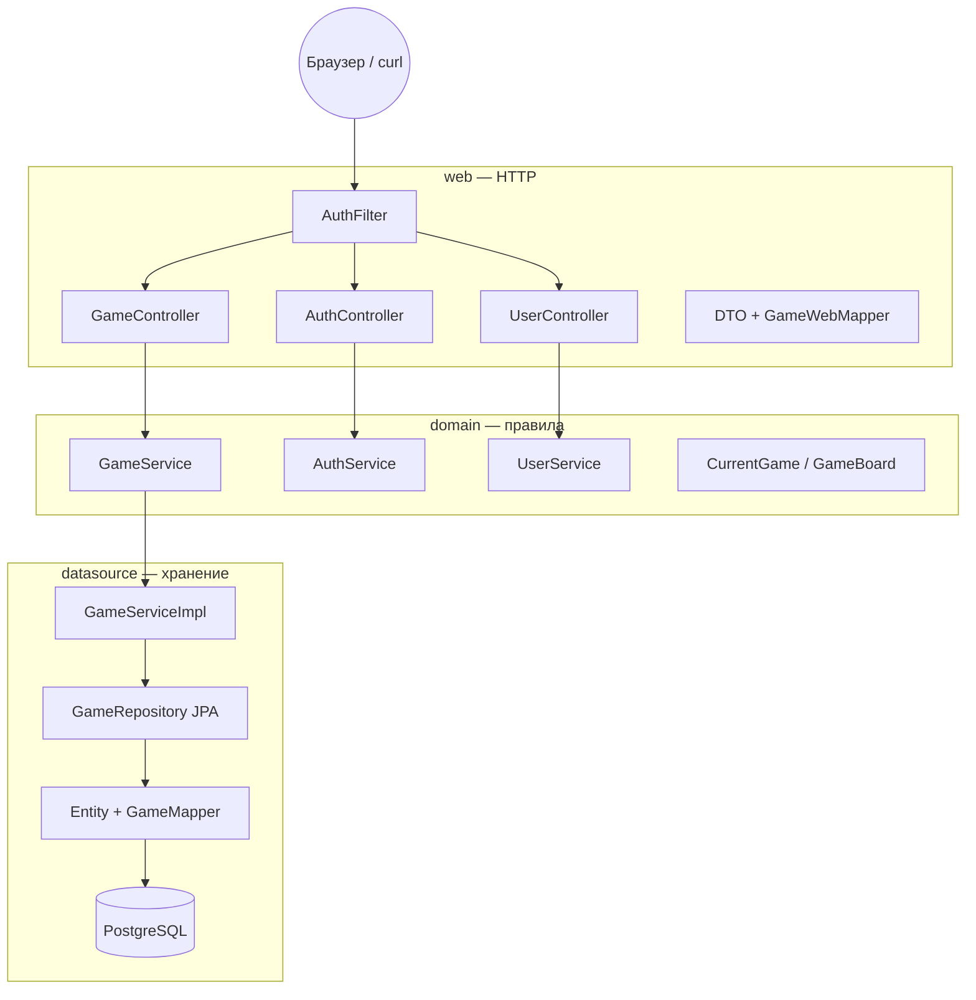
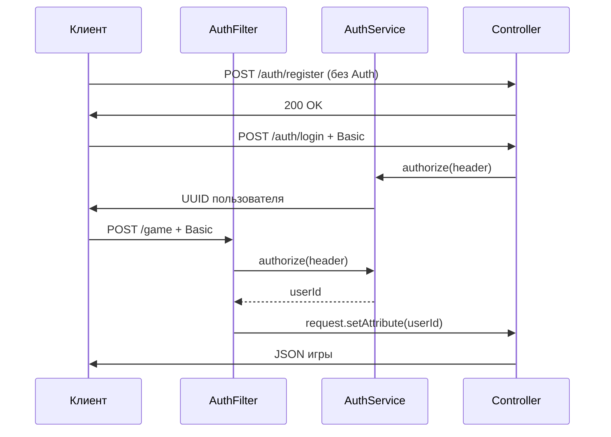
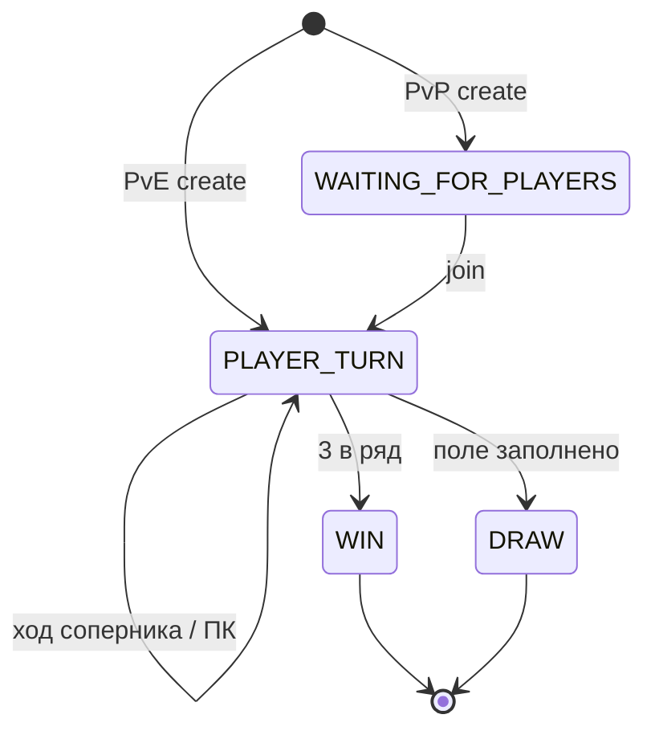

# T04 — Разработка построчно: от пустой папки до сдачи

> **Самодостаточный мега-туториал.** Пиши код **здесь**, по шагам. Не подглядывай в готовый проект, пока не закроешь блок «Проверка».  
> **Рабочая папка:** `B:\school21\Java\Backend\AP1_Jv_T04B.ID_1421426-1\src\TicTacToe_1.2_sql_auth\`  
> **Углубиться в теорию (опционально):** [`T04_07_ТЕОРИЯ_ПОЛНОСТЬЮ.md`](T04_07_ТЕОРИЯ_ПОЛНОСТЬЮ.md)

Привет! Ты собираешь **крестики-нолики** как настоящий backend: Spring Boot, PostgreSQL, Basic Auth, PvE с Minimax и PvP с лобби. Каждый шаг — маленький коммит в голове: написал → проверил → пошёл дальше.

**Правило одного шага:** не открывай следующий блок, пока текущий не прошёл «Проверку». Сломалось — смотри «Если сломалось», не прыгай через три файла.

---

## Оглавление

- [ ] **Этап A** — Среда, Gradle, первый `bootRun`
- [ ] **Этап B** — T03 в памяти (PvE vs компьютер), ~20 блоков
- [ ] **Этап C** — Задание 1: PostgreSQL + JPA
- [ ] **Этап D** — Задание 2: регистрация и Basic Auth
- [ ] **Этап E** — Задание 3: PvP, состояния игры, все эндпоинты
- [ ] **Этап F** — Полные сценарии curl
- [ ] **Этап G** — Браузерный UI

---

## Карта архитектуры



**Слои:** `web` не знает SQL. `domain` не знает HTTP. `datasource` связывает правила с БД.

---

## Поток авторизации (этап D)



---

## Машина состояний игры (этап E)



---

## Minimax — дерево на пальцах (ASCII)

Пустая доска, компьютер (O=2) выбирает ход. Упрощённо — только верхний уровень:

```
                    [пусто]
           /        |        \
        O@00      O@01      O@02 ... (все пустые клетки)
         |          |
    minimax(...)  minimax(...)
         |          |
       score       score
      -10..+10    -10..+10

Лучший ход = клетка с максимальным score для компьютера.
```

**Рекурсия:** на каждом уровне чередуем «макс» (ход O) и «мин» (ход X). Листья: победа O → +10, победа X → −10, ничья → 0. `depth` уменьшает score, чтобы выигрывать **быстрее**.

---

## Команды по умолчанию (Windows)

Перед каждым запуском сервера:

```powershell
cd B:\school21\Java\Backend\AP1_Jv_T04B.ID_1421426-1\src\TicTacToe_1.2_sql_auth
$env:JAVA_HOME = "C:\Program Files\Java\jdk-21"   # путь к твоему JDK 17–21
.\gradlew.bat bootRun
```

<details><summary>Bash (macOS / Linux)</summary>

```bash
cd src/TicTacToe_1.2_sql_auth
export JAVA_HOME=$(/usr/libexec/java_home -v 21)
./gradlew bootRun
```

</details>

---

# ЭТАП A — Среда и первый запуск


## Блок A.1 — JDK и проверка Java

| | |
|---|---|
| **Цель** | Убедиться, что Gradle видит JDK 17–21, не 26. |
| **Время** | 5 мин |
| **Сложность** | ★☆☆ |

### Зачем
Spring Boot 3 не дружит с «экспериментальной» Java 26. Ошибка `What went wrong: 26.x` — классика School21.

### Перед тем как писать
Установи [Eclipse Temurin 21](https://adoptium.net/) или JDK из IntelliJ. Запомни путь к папке `jdk-...`.

### Напиши
```powershell
# PowerShell — подставь свой путь
$env:JAVA_HOME = "C:\Program Files\Java\jdk-21"
& "$env:JAVA_HOME\bin\java.exe" -version
```

### Разбор построчно
| Строка | Код | Что делает |
|--------|-----|------------|
| 1 | `$env:JAVA_HOME = ...` | Переменная среды для текущей сессии PowerShell |
| 2 | `java.exe -version` | Печатает версию; нужна 17, 21 — ок |

### Сделай паузу
**Вопрос:** Почему именно `JAVA_HOME`, а не просто `java` в PATH?

### Проверка
**PowerShell (Windows):**
```powershell
В выводе: `openjdk version "21"` или `"17"`.
```

<details><summary>Bash (macOS / Linux)</summary>

```bash
java -version
```

</details>

### Если сломалось
Версия 26.x → поставь 21 и выставь JAVA_HOME. `java` не найден → добавь `%JAVA_HOME%\bin` в PATH.

### Микро-итог
Java под контролем — полдела с Gradle.

---

## Блок A.2 — Структура пакетов

| | |
|---|---|
| **Цель** | Создать дерево пакетов до первого `.java`. |
| **Время** | 10 мин |
| **Сложность** | ★☆☆ |

### Зачем
Пакеты = слои. Смешаешь web и SQL — потом больно рефакторить.

### Перед тем как писать
В IntelliJ: ПКМ на `src/main/java` → New → Package. Создай по одному пакету.

### Напиши
```text
tictactoe
tictactoe.domain.model
tictactoe.domain.service
tictactoe.datasource.model
tictactoe.datasource.repository
tictactoe.datasource.mapper
tictactoe.datasource.service
tictactoe.datasource.storage
tictactoe.web.controller
tictactoe.web.model
tictactoe.web.mapper
tictactoe.di
```

### Разбор построчно
| Строка | Код | Что делает |
|--------|-----|------------|
| — | `tictactoe.*` | Корень; Spring сканирует отсюда |
| — | `domain` | Бизнес-правила без Spring и SQL |
| — | `datasource` | Реализации и хранение |
| — | `web` | REST и DTO |
| — | `di` | Ручные @Bean (на этапе B) |

### Сделай паузу
**Вопрос:** Зачем `GameBoard` лежит в `domain`, а не в `web`?

### Проверка
**PowerShell (Windows):**
```powershell
# Только структура — компиляция пока не обязательна
```

<details><summary>Bash (macOS / Linux)</summary>

```bash
# дерево папок как выше
```

</details>

### Если сломалось
IntelliJ не создаёт вложенные пакеты одним именем — пиши полное имя `tictactoe.domain.model`.

### Микро-итог
Скелет готов — наполняем кодом на этапе B.

---

## Блок A.3 — `build.gradle.kts` (только Web)

| | |
|---|---|
| **Цель** | Подключить Spring Boot Web для T03. |
| **Время** | 10 мин |
| **Сложность** | ★★☆ |

### Зачем
`starter-web` тянет Tomcat, Jackson (JSON), Spring MVC — всё для REST.

### Перед тем как писать
Файл в корне проекта `TicTacToe_1.2_sql_auth`. После правки: Gradle Reload в IDE.

### Напиши
```kotlin
plugins {
    id("java")
    id("org.springframework.boot") version "3.2.0"
    id("io.spring.dependency-management") version "1.1.4"
}

group = "org.example"
version = "1.0-SNAPSHOT"

java {
    sourceCompatibility = JavaVersion.VERSION_17
    targetCompatibility = JavaVersion.VERSION_17
}

repositories {
    mavenCentral()
}

dependencies {
    implementation("org.springframework.boot:spring-boot-starter-web")
    testImplementation(platform("org.junit:junit-bom:5.10.0"))
    testImplementation("org.junit.jupiter:junit-jupiter")
}

tasks.test {
    useJUnitPlatform()
}
```

### Разбор построчно
| Строка | Код | Что делает |
|--------|-----|------------|
| 1-4 | `plugins { ... }` | Java + Spring Boot 3.2.0 |
| 10-13 | `java { ... VERSION_17 }` | Bytecode 17 — минимум для Boot 3 |
| 19 | `starter-web` | HTTP API без БД пока |

### Сделай паузу
**Вопрос:** Чем `implementation` отличается от `testImplementation`?

### Проверка
**PowerShell (Windows):**
```powershell
cd B:\school21\Java\Backend\AP1_Jv_T04B.ID_1421426-1\src\TicTacToe_1.2_sql_auth
.\gradlew.bat dependencies --configuration compileClasspath | Select-String spring-web
```

<details><summary>Bash (macOS / Linux)</summary>

```bash
./gradlew dependencies --configuration compileClasspath | grep spring-web
```

</details>

### Если сломалось
Gradle sync failed → File → Invalidate Caches. Нет `gradlew.bat` → скопируй из T04_00 или соседнего проекта.

### Микро-итог
Gradle знает про Spring Web.

---

## Блок A.4 — `TicTacToeApplication.java`

| | |
|---|---|
| **Цель** | Точка входа Spring Boot. |
| **Время** | 5 мин |
| **Сложность** | ★☆☆ |

### Зачем
`@SpringBootApplication` включает автоконфигурацию: Tomcat на 8080, сканирование бинов.

### Перед тем как писать
Путь: `src/main/java/tictactoe/TicTacToeApplication.java`.

### Напиши
```java
package tictactoe;

import org.springframework.boot.SpringApplication;
import org.springframework.boot.autoconfigure.SpringBootApplication;

@SpringBootApplication
public class TicTacToeApplication {

    public static void main(String[] args) {
        SpringApplication.run(TicTacToeApplication.class, args);
    }
}
```

### Разбор построчно
| Строка | Код | Что делает |
|--------|-----|------------|
| 1 | `package tictactoe` | Корневой пакет |
| 6 | `@SpringBootApplication` | Сканирует `tictactoe` и подпакеты |
| 10 | `SpringApplication.run` | Стартует embedded Tomcat |

### Сделай паузу
**Вопрос:** Что произойдёт, если положить этот класс в пакет `com.other` без `@ComponentScan`?

### Проверка
**PowerShell (Windows):**
```powershell
cd B:\school21\Java\Backend\AP1_Jv_T04B.ID_1421426-1\src\TicTacToe_1.2_sql_auth
.\gradlew.bat bootRun
# В другом окне:
Invoke-WebRequest http://localhost:8080/ -UseBasicParsing | Select-Object StatusCode
```

<details><summary>Bash (macOS / Linux)</summary>

```bash
./gradlew bootRun & sleep 8 && curl -s -o /dev/null -w '%{http_code}' http://localhost:8080/
```

</details>

### Если сломалось
Порт 8080 занят → `netstat -ano | findstr 8080`, убей процесс. `bootRun not found` → нет Spring Boot plugin в build.gradle.kts.

### Микро-итог
Сервер поднимается — этап A закрыт.

---


---

# ЭТАП B — T03 в памяти (игрок vs компьютер)

> На этом этапе игра **живёт в RAM** (`GameStorage`). API: один эндпоинт `POST /game/{uuid}`. После этапа C память заменим на PostgreSQL.


## Блок B.1 — `GameBoard.java`

| | |
|---|---|
| **Цель** | Модель поля 3×3 в domain. |
| **Время** | 15 мин |
| **Сложность** | ★★☆ |

### Зачем
Доска — сердце игры. Числа 0/1/2 проще для Minimax и JSON, чем enum в каждой клетке.

### Перед тем как писать
Создай файл в `domain/model`. Константы `SIZE`, `EMPTY`, `PLAYER`, `COMPUTER` — договорённость всего проекта.

### Напиши
```java
package tictactoe.domain.model;

/**
 * Игровое поле 3x3.
 * 0 — пусто, 1 — X (игрок), 2 — O (компьютер).
 */
public class GameBoard {

    public static final int SIZE = 3;
    public static final int EMPTY = 0;
    public static final int PLAYER = 1;    // X
    public static final int COMPUTER = 2;  // O

    private final int[][] cells;

    public GameBoard() {
        this.cells = new int[SIZE][SIZE];
    }

    public GameBoard(int[][] cells) {
        this.cells = new int[SIZE][SIZE];
        for (int i = 0; i < SIZE; i++) {
            System.arraycopy(cells[i], 0, this.cells[i], 0, SIZE);
        }
    }

    public int get(int row, int col) {
        return cells[row][col];
    }

    public void set(int row, int col, int value) {
        cells[row][col] = value;
    }

    public int[][] getCells() {
        int[][] copy = new int[SIZE][SIZE];
        for (int i = 0; i < SIZE; i++) {
            System.arraycopy(cells[i], 0, copy[i], 0, SIZE);
        }
        return copy;
    }

    public GameBoard copy() {
        return new GameBoard(cells);
    }
}
```

### Разбор построчно
| Строка | Код | Что делает |
|--------|-----|------------|
| 14-17 | `public static final int ...` | Контракт: 0 пусто, 1 X, 2 O |
| 21-23 | `new int[SIZE][SIZE]` | Пустая доска |
| 26-29 | `System.arraycopy` | Копия строки массива — безопасное клонирование |
| 40-46 | `getCells()` | Наружу только копия — защита инкапсуляции |
| 48-50 | `copy()` | Minimax мутирует копию, не оригинал |

### Сделай паузу
**Вопрос:** Что сломается, если `getCells()` вернёт внутренний `cells` без копии?

### Проверка
**PowerShell (Windows):**
```powershell
# Файл создан — компиляция после следующих классов
```

<details><summary>Bash (macOS / Linux)</summary>

```bash
# то же
```

</details>

### Если сломалось
cannot find symbol GameBoard → проверь package и имя файла.

### Микро-итог
Есть тип «доска» — можно хранить состояние.

---

## Блок B.2 — `CurrentGame.java` (простая версия)

| | |
|---|---|
| **Цель** | Игра = UUID + доска (T03). |
| **Время** | 10 мин |
| **Сложность** | ★☆☆ |

### Зачем
Пока без игроков и PvP — только id сессии и поле. В этапе E расширим.

### Перед тем как писать
Immutable поля: после создания игры меняем доску через **новый** `CurrentGame` в сервисе.

### Напиши
```java
package tictactoe.domain.model;

import java.util.UUID;

/**
 * Текущая игра: id + доска.
 */
public class CurrentGame {

    private final UUID id;
    private final GameBoard board;

    public CurrentGame(UUID id, GameBoard board) {
        this.id = id;
        this.board = board;
    }

    public UUID getId() {
        return id;
    }

    public GameBoard getBoard() {
        return board;
    }
}
```

### Разбор построчно
| Строка | Код | Что делает |
|--------|-----|------------|
| 11-12 | `final UUID id` | Клиент генерирует или получает id |
| 13 | `final GameBoard board` | Снимок позиции |
| 15-18 | `конструктор` | Spring/Jackson позже используют геттеры |

### Сделай паузу
**Вопрос:** Почему `id` и `board` объявлены `final`?

### Проверка
**PowerShell (Windows):**
```powershell
# компиляция позже
```

<details><summary>Bash (macOS / Linux)</summary>

```bash
# то же
```

</details>

### Если сломалось
getBoard() отдаёт ссылку на внутренний board → в T03 сервис всегда делает copy() перед ходом.

### Микро-итог
Минимальная модель «текущая игра» готова.

---

## Блок B.3 — интерфейс `GameService.java`

| | |
|---|---|
| **Цель** | Контракт правил в domain. |
| **Время** | 10 мин |
| **Сложность** | ★★☆ |

### Зачем
Интерфейс в domain — контроллер не знает про Minimax. Завтра подменишь реализацию — API тот же.

### Перед тем как писать
Четыре метода — ровно то, что нужно T03 API.

### Напиши
```java
package tictactoe.domain.service;

import tictactoe.domain.model.CurrentGame;

public interface GameService {

    /** Ход компьютера (Minimax) после хода игрока. */
    CurrentGame getNextMove(CurrentGame game);

    /** Проверка: клиент не изменил старые клетки. */
    boolean validateBoard(CurrentGame game);

    /** Игра завершена (победа или ничья)? */
    boolean isGameEnded(CurrentGame game);

    /** Первый ход компьютера (игрок играет за O). */
    CurrentGame getFirstMove(CurrentGame game);
}
```

### Разбор построчно
| Строка | Код | Что делает |
|--------|-----|------------|
| 7-8 | `getNextMove` | Ход ИИ после хода человека |
| 10-11 | `validateBoard` | Античит: одна новая клетка X |
| 13-14 | `isGameEnded` | Стоп если win/draw |
| 16-17 | `getFirstMove` | Режим «я играю O» |

### Сделай паузу
**Вопрос:** Зачем интерфейс, если одна реализация? (Подсказка: тесты и слои.)

### Проверка
**PowerShell (Windows):**
```powershell
# интерфейс без impl — проект не соберётся до B.14
```

<details><summary>Bash (macOS / Linux)</summary>

```bash
# то же
```

</details>

### Если сломалось
—

### Микро-итог
Domain-контракт записан.

---

## Блок B.4 — `GameBoardEntity.java`

| | |
|---|---|
| **Цель** | Зеркало доски для слоя хранения. |
| **Время** | 10 мин |
| **Сложность** | ★☆☆ |

### Зачем
Domain и storage разделены: в T04 БД не протечёт в `GameBoard`.

### Перед тем как писать
POJO без JPA-аннотаций — на этапе B это просто мешок для `int[][]`.

### Напиши
```java
package tictactoe.datasource.model;

import tictactoe.domain.model.GameBoard;

public class GameBoardEntity {

    private int[][] cells;

    public GameBoardEntity() {
        this.cells = new int[GameBoard.SIZE][GameBoard.SIZE];
    }

    public GameBoardEntity(int[][] cells) {
        this.cells = new int[GameBoard.SIZE][GameBoard.SIZE];
        for (int i = 0; i < GameBoard.SIZE; i++) {
            System.arraycopy(cells[i], 0, this.cells[i], 0, GameBoard.SIZE);
        }
    }

    public int[][] getCells() {
        int[][] copy = new int[GameBoard.SIZE][GameBoard.SIZE];
        for (int i = 0; i < GameBoard.SIZE; i++) {
            System.arraycopy(cells[i], 0, copy[i], 0, GameBoard.SIZE);
        }
        return copy;
    }

    public void setCells(int[][] cells) {
        this.cells = new int[GameBoard.SIZE][GameBoard.SIZE];
        for (int i = 0; i < GameBoard.SIZE; i++) {
            System.arraycopy(cells[i], 0, this.cells[i], 0, GameBoard.SIZE);
        }
    }
}
```

### Разбор построчно
| Строка | Код | Что делает |
|--------|-----|------------|
| 5 | `private int[][] cells` | Не final — JPA на C попросит setter |
| 24-30 | `setCells` | Запись с копированием |

### Сделай паузу
**Вопрос:** Чем entity отличается от domain `GameBoard`?

### Проверка
**PowerShell (Windows):**
```powershell
# —
```

<details><summary>Bash (macOS / Linux)</summary>

```bash
# —
```

</details>

### Если сломалось
—

### Микро-итог
Слой storage умеет хранить доску.

---

## Блок B.5 — `CurrentGameEntity.java`

| | |
|---|---|
| **Цель** | Entity игры для in-memory. |
| **Время** | 10 мин |
| **Сложность** | ★☆☆ |

### Зачем
Пара id + board в storage. Пустой конструктор — привычка под JPA.

### Перед тем как писать
Геттеры/сеттеры для маппера.

### Напиши
```java
package tictactoe.datasource.model;

import java.util.UUID;

public class CurrentGameEntity {

    private UUID id;
    private GameBoardEntity board;

    public CurrentGameEntity() {
    }

    public CurrentGameEntity(UUID id, GameBoardEntity board) {
        this.id = id;
        this.board = board;
    }

    public UUID getId() { return id; }
    public void setId(UUID id) { this.id = id; }
    public GameBoardEntity getBoard() { return board; }
    public void setBoard(GameBoardEntity board) { this.board = board; }
}
```

### Разбор построчно
| Строка | Код | Что делает |
|--------|-----|------------|
| 9-10 | `пустой конструктор` | Hibernate/JPA позже |
| 12-15 | `конструктор с полями` | Удобно в GameMapper |

### Сделай паузу
**Вопрос:** Зачем пустой конструктор, если есть конструктор с аргументами?

### Проверка
**PowerShell (Windows):**
```powershell
# —
```

<details><summary>Bash (macOS / Linux)</summary>

```bash
# —
```

</details>

### Если сломалось
—

### Микро-итог
Entity игры есть.

---

## Блок B.6 — `GameMapper.java`

| | |
|---|---|
| **Цель** | Перевод entity ↔ domain. |
| **Время** | 15 мин |
| **Сложность** | ★★☆ |

### Зачем
Контроллер не должен знать про `CurrentGameEntity`. Маппер — мост.

### Перед тем как писать
Класс `final` + приватный конструктор = набор статических функций.

### Напиши
```java
package tictactoe.datasource.mapper;

import tictactoe.datasource.model.CurrentGameEntity;
import tictactoe.datasource.model.GameBoardEntity;
import tictactoe.domain.model.CurrentGame;
import tictactoe.domain.model.GameBoard;

public final class GameMapper {

    private GameMapper() {
    }

    public static CurrentGame toDomain(CurrentGameEntity entity) {
        if (entity == null) {
            return null;
        }
        GameBoard board = toDomainBoard(entity.getBoard());
        return new CurrentGame(entity.getId(), board);
    }

    public static CurrentGameEntity toEntity(CurrentGame game) {
        if (game == null) {
            return null;
        }
        return new CurrentGameEntity(game.getId(), toEntityBoard(game.getBoard()));
    }

    public static GameBoard toDomainBoard(GameBoardEntity entity) {
        if (entity == null) {
            return null;
        }
        return new GameBoard(entity.getCells());
    }

    public static GameBoardEntity toEntityBoard(GameBoard board) {
        if (board == null) {
            return null;
        }
        return new GameBoardEntity(board.getCells());
    }
}
```

### Разбор построчно
| Строка | Код | Что делает |
|--------|-----|------------|
| 9-10 | `private GameMapper()` | Утилита, не бин |
| 13-18 | `toDomain` | В БД → в правила |
| 21-26 | `toEntity` | После хода → в storage |

### Сделай паузу
**Вопрос:** Почему маппер статический, а не `@Component`?

### Проверка
**PowerShell (Windows):**
```powershell
# —
```

<details><summary>Bash (macOS / Linux)</summary>

```bash
# —
```

</details>

### Если сломалось
—

### Микро-итог
Два мира связаны маппером.

---

## Блок B.7 — `GameStorage.java`

| | |
|---|---|
| **Цель** | RAM-база игр. |
| **Время** | 10 мин |
| **Сложность** | ★★☆ |

### Зачем
`ConcurrentHashMap` — два параллельных запроса не ломают map.

### Перед тем как писать
На этапе C файл **удаляешь** — данные переедут в PostgreSQL.

### Напиши
```java
package tictactoe.datasource.storage;

import tictactoe.datasource.model.CurrentGameEntity;

import java.util.Map;
import java.util.Optional;
import java.util.UUID;
import java.util.concurrent.ConcurrentHashMap;

/**
 * In-memory хранилище. В T04 Задание 1 — УДАЛИШЬ этот класс.
 */
public class GameStorage {

    private final Map<UUID, CurrentGameEntity> games = new ConcurrentHashMap<>();

    public void put(UUID id, CurrentGameEntity game) {
        games.put(id, game);
    }

    public Optional<CurrentGameEntity> get(UUID id) {
        return Optional.ofNullable(games.get(id));
    }
}
```

### Разбор построчно
| Строка | Код | Что делает |
|--------|-----|------------|
| 14 | `ConcurrentHashMap` | Потокобезопасность |
| 16-18 | `put` | Сохранить/перезаписать игру |
| 20-22 | `get` | Optional — нет игры ≠ exception |

### Сделай паузу
**Вопрос:** Что будет при обычном `HashMap` под нагрузкой?

### Проверка
**PowerShell (Windows):**
```powershell
# —
```

<details><summary>Bash (macOS / Linux)</summary>

```bash
# —
```

</details>

### Если сломалось
—

### Микро-итог
Игры живут в памяти.

---

## Блок B.8 — `GameRepository` + `GameRepositoryImpl`

| | |
|---|---|
| **Цель** | Абстракция хранения для сервиса. |
| **Время** | 15 мин |
| **Сложность** | ★★☆ |

### Зачем
Сервис вызывает `findById`, не зная — память это или Postgres.

### Перед тем как писать
Два файла: интерфейс в `repository`, impl рядом.

### Напиши
```java
package tictactoe.datasource.repository;

import tictactoe.domain.model.CurrentGame;

import java.util.Optional;
import java.util.UUID;

public interface GameRepository {

    void save(CurrentGame game);

    Optional<CurrentGame> findById(UUID id);
}

// --- GameRepositoryImpl.java ---

package tictactoe.datasource.repository;

import tictactoe.datasource.mapper.GameMapper;
import tictactoe.datasource.storage.GameStorage;
import tictactoe.domain.model.CurrentGame;

import java.util.Optional;
import java.util.UUID;

public class GameRepositoryImpl implements GameRepository {

    private final GameStorage storage;

    public GameRepositoryImpl(GameStorage storage) {
        this.storage = storage;
    }

    @Override
    public void save(CurrentGame game) {
        storage.put(game.getId(), GameMapper.toEntity(game));
    }

    @Override
    public Optional<CurrentGame> findById(UUID id) {
        return storage.get(id).map(GameMapper::toDomain);
    }
}
```

### Разбор построчно
| Строка | Код | Что делает |
|--------|-----|------------|
| IF 7-9 | `save / findById` | Минимальный контракт T03 |
| Impl 16-18 | `GameStorage в конструкторе` | DI вручную через SpringConfig |
| 26-28 | `map(GameMapper::toDomain)` | Из entity в domain |

### Сделай паузу
**Вопрос:** Зачем интерфейс `GameRepository`, если impl один?

### Проверка
**PowerShell (Windows):**
```powershell
# —
```

<details><summary>Bash (macOS / Linux)</summary>

```bash
# —
```

</details>

### Если сломалось
—

### Микро-итог
Репозиторий прячет storage.

---

## Блок B.9a — Разбор Minimax на примере

| | |
|---|---|
| **Цель** | Понять рекурсию до отладки. |
| **Время** | 20 мин |
| **Сложность** | ★★★ |

### Зачем
Не обязательно дебажить каждый уровень — но понимание спасает на защите.

### Перед тем как писать
Возьми доску: X в центре, остальное пусто. Компьютер перебирает углы и рёбра.

### Напиши
```text
Доска после хода X в (1,1):
  . | . | .
  -----------
  . | X | .
  -----------
  . | . | .

Компьютер пробует O в (0,0):
  O | . | .
  -----------
  . | X | .
  -----------
  . | . | .

Дальше minimax(..., isMax=false) — ход X в детях, и т.д.
Счёт листа: +10 если O выиграл, -10 если X, 0 ничья.
choose max среди детей верхнего уровня.
```

### Разбор построчно
| Строка | Код | Что делает |
|--------|-----|------------|
| — | `findBestMove` | Внешний цикл по клеткам |
| — | `minimax` | Рекурсивный спуск |
| — | `depth` | Предпочтение быстрой победы |

### Сделай паузу
**Вопрос:** На листе дерева кто делает ход — max или min?

### Проверка
**PowerShell (Windows):**
```powershell
# теория — код уже в B.9
```

<details><summary>Bash (macOS / Linux)</summary>

```bash
# то же
```

</details>

### Если сломалось
—

### Микро-итог
Minimax в голове, не только в коде.

---

## Блок B.9 — `GameServiceImpl.java` (Minimax)

| | |
|---|---|
| **Цель** | Вся логика PvE: валидация, win/draw, ИИ. |
| **Время** | 45 мин |
| **Сложность** | ★★★ |

### Зачем
Самый плотный файл T03. Minimax гарантирует оптимальный ход O.

### Перед тем как писать
Копируй **целиком**. После вставки — прочитай ASCII-дерево в начале файла.

### Напиши
```java
package tictactoe.datasource.service;

import tictactoe.domain.model.CurrentGame;
import tictactoe.domain.model.GameBoard;
import tictactoe.domain.service.GameService;
import tictactoe.datasource.repository.GameRepository;

public class GameServiceImpl implements GameService {

    private final GameRepository repository;

    public GameServiceImpl(GameRepository repository) {
        this.repository = repository;
    }

    @Override
    public CurrentGame getNextMove(CurrentGame game) {
        GameBoard board = game.getBoard().copy();
        int[] bestMove = findBestMove(board);
        if (bestMove != null) {
            board.set(bestMove[0], bestMove[1], GameBoard.COMPUTER);
        }
        return new CurrentGame(game.getId(), board);
    }

    @Override
    public CurrentGame getFirstMove(CurrentGame game) {
        GameBoard board = game.getBoard().copy();
        board.set(1, 1, GameBoard.COMPUTER);
        return new CurrentGame(game.getId(), board);
    }

    @Override
    public boolean validateBoard(CurrentGame game) {
        return repository.findById(game.getId())
                .map(stored -> boardsMatchExceptOnePlayerMove(stored.getBoard(), game.getBoard()))
                .orElseGet(() -> isFirstMoveOnlyOnePlayer(game.getBoard()));
    }

    private boolean isFirstMoveOnlyOnePlayer(GameBoard board) {
        int count = 0;
        for (int i = 0; i < GameBoard.SIZE; i++) {
            for (int j = 0; j < GameBoard.SIZE; j++) {
                if (board.get(i, j) == GameBoard.PLAYER) {
                    count++;
                } else if (board.get(i, j) != GameBoard.EMPTY) {
                    return false;
                }
            }
        }
        return count == 1;
    }

    @Override
    public boolean isGameEnded(CurrentGame game) {
        GameBoard board = game.getBoard();
        return hasWinner(board) || isDraw(board);
    }

    private boolean boardsMatchExceptOnePlayerMove(GameBoard stored, GameBoard incoming) {
        int playerDiff = 0;
        for (int i = 0; i < GameBoard.SIZE; i++) {
            for (int j = 0; j < GameBoard.SIZE; j++) {
                int s = stored.get(i, j);
                int inc = incoming.get(i, j);
                if (s != inc) {
                    if (s == GameBoard.EMPTY && inc == GameBoard.PLAYER) {
                        playerDiff++;
                    } else {
                        return false;
                    }
                }
            }
        }
        return playerDiff == 1;
    }

    private boolean hasWinner(GameBoard board) {
        return evaluate(board) != 0;
    }

    private boolean isDraw(GameBoard board) {
        for (int i = 0; i < GameBoard.SIZE; i++) {
            for (int j = 0; j < GameBoard.SIZE; j++) {
                if (board.get(i, j) == GameBoard.EMPTY) {
                    return false;
                }
            }
        }
        return true;
    }

    private int[] findBestMove(GameBoard board) {
        int bestScore = Integer.MIN_VALUE;
        int[] bestMove = null;
        for (int i = 0; i < GameBoard.SIZE; i++) {
            for (int j = 0; j < GameBoard.SIZE; j++) {
                if (board.get(i, j) == GameBoard.EMPTY) {
                    board.set(i, j, GameBoard.COMPUTER);
                    int score = minimax(board, 0, false);
                    board.set(i, j, GameBoard.EMPTY);
                    if (score > bestScore) {
                        bestScore = score;
                        bestMove = new int[]{i, j};
                    }
                }
            }
        }
        return bestMove;
    }

    private int minimax(GameBoard board, int depth, boolean isMax) {
        int score = evaluate(board);
        if (score == 10) return score - depth;
        if (score == -10) return score + depth;
        if (isDraw(board)) return 0;

        if (isMax) {
            int best = Integer.MIN_VALUE;
            for (int i = 0; i < GameBoard.SIZE; i++) {
                for (int j = 0; j < GameBoard.SIZE; j++) {
                    if (board.get(i, j) == GameBoard.EMPTY) {
                        board.set(i, j, GameBoard.COMPUTER);
                        best = Math.max(best, minimax(board, depth + 1, false));
                        board.set(i, j, GameBoard.EMPTY);
                    }
                }
            }
            return best;
        } else {
            int best = Integer.MAX_VALUE;
            for (int i = 0; i < GameBoard.SIZE; i++) {
                for (int j = 0; j < GameBoard.SIZE; j++) {
                    if (board.get(i, j) == GameBoard.EMPTY) {
                        board.set(i, j, GameBoard.PLAYER);
                        best = Math.min(best, minimax(board, depth + 1, true));
                        board.set(i, j, GameBoard.EMPTY);
                    }
                }
            }
            return best;
        }
    }

    private int evaluate(GameBoard board) {
        for (int i = 0; i < GameBoard.SIZE; i++) {
            if (board.get(i, 0) == board.get(i, 1) && board.get(i, 1) == board.get(i, 2) && board.get(i, 0) != GameBoard.EMPTY) {
                return board.get(i, 0) == GameBoard.COMPUTER ? 10 : -10;
            }
            if (board.get(0, i) == board.get(1, i) && board.get(1, i) == board.get(2, i) && board.get(0, i) != GameBoard.EMPTY) {
                return board.get(0, i) == GameBoard.COMPUTER ? 10 : -10;
            }
        }
        if (board.get(0, 0) == board.get(1, 1) && board.get(1, 1) == board.get(2, 2) && board.get(0, 0) != GameBoard.EMPTY) {
            return board.get(0, 0) == GameBoard.COMPUTER ? 10 : -10;
        }
        if (board.get(0, 2) == board.get(1, 1) && board.get(1, 1) == board.get(2, 0) && board.get(0, 2) != GameBoard.EMPTY) {
            return board.get(0, 2) == GameBoard.COMPUTER ? 10 : -10;
        }
        return 0;
    }
}
```

### Разбор построчно
| Строка | Код | Что делает |
|--------|-----|------------|
| 17-24 | `getNextMove` | copy → findBestMove → поставить O |
| 40-44 | `validateBoard` | Сравнение с сохранённой доской |
| 95-108 | `findBestMove` | Перебор пустых клеток |
| 110-114 | `minimax base` | Оценка листа + depth |
| 116-131 | `isMax ветка` | Ход компьютера — максимизируем |
| 133-147 | `else ветка` | Ход игрока — минимизируем |

### Сделай паузу
**Вопрос:** Почему в score вычитаем `depth` при победе компьютера?

### Проверка
**PowerShell (Windows):**
```powershell
# компиляция: .\gradlew.bat compileJava
```

<details><summary>Bash (macOS / Linux)</summary>

```bash
./gradlew compileJava
```

</details>

### Если сломалось
StackOverflow на minimax → проверь, что откатываешь клетку в EMPTY после рекурсии.

### Микро-итог
Компьютер играет умно.

---

## Блок B.10 — DTO: `ErrorResponse`, `GameBoardDto`, `CurrentGameDto`

| | |
|---|---|
| **Цель** | JSON-формы запроса/ответа. |
| **Время** | 15 мин |
| **Сложность** | ★★☆ |

### Зачем
DTO ≠ domain: можно менять API, не трогая Minimax.

### Перед тем как писать
Три файла в `web/model`. Пустые конструкторы — для Jackson.

### Напиши
```java
package tictactoe.web.model;

public class ErrorResponse {

    private String error;

    public ErrorResponse() {
    }

    public ErrorResponse(String error) {
        this.error = error;
    }

    public String getError() {
        return error;
    }

    public void setError(String error) {
        this.error = error;
    }
}

// GameBoardDto

package tictactoe.web.model;

import tictactoe.domain.model.GameBoard;

public class GameBoardDto {

    private int[][] board;

    public GameBoardDto() {
        this.board = new int[GameBoard.SIZE][GameBoard.SIZE];
    }

    public GameBoardDto(int[][] board) {
        this.board = board;
    }

    public int[][] getBoard() {
        return board;
    }

    public void setBoard(int[][] board) {
        this.board = board;
    }
}

// CurrentGameDto

package tictactoe.web.model;

import java.util.UUID;

public class CurrentGameDto {

    private UUID id;
    private GameBoardDto board;
    private Boolean computerStarts;

    public CurrentGameDto() {
    }

    public CurrentGameDto(UUID id, GameBoardDto board) {
        this.id = id;
        this.board = board;
    }

    public UUID getId() {
        return id;
    }

    public void setId(UUID id) {
        this.id = id;
    }

    public GameBoardDto getBoard() {
        return board;
    }

    public void setBoard(GameBoardDto board) {
        this.board = board;
    }

    public Boolean getComputerStarts() {
        return computerStarts;
    }

    public void setComputerStarts(Boolean computerStarts) {
        this.computerStarts = computerStarts;
    }
}
```

### Разбор построчно
| Строка | Код | Что делает |
|--------|-----|------------|
| ER 3 | `private String error` | Текст для клиента |
| GB 5 | `int[][] board` | Вложенный объект JSON board.board |
| CG 7 | `computerStarts` | Флаг «ПК ходит первым» |

### Сделай паузу
**Вопрос:** Почему поле называется `board` внутри `GameBoardDto`, а не `cells`?

### Проверка
**PowerShell (Windows):**
```powershell
# —
```

<details><summary>Bash (macOS / Linux)</summary>

```bash
# —
```

</details>

### Если сломалось
—

### Микро-итог
JSON-контракт определён.

---

## Блок B.11 — `GameWebMapper.java`

| | |
|---|---|
| **Цель** | Мост HTTP ↔ domain. |
| **Время** | 10 мин |
| **Сложность** | ★★☆ |

### Зачем
Контроллер оперирует DTO; сервис — `CurrentGame`.

### Перед тем как писать
Не путай с `GameMapper` (entity).

### Напиши
```java
package tictactoe.web.mapper;

import tictactoe.domain.model.CurrentGame;
import tictactoe.domain.model.GameBoard;
import tictactoe.web.model.CurrentGameDto;
import tictactoe.web.model.GameBoardDto;

public final class GameWebMapper {

    private GameWebMapper() {
    }

    public static CurrentGameDto toDto(CurrentGame game) {
        if (game == null) {
            return null;
        }
        return new CurrentGameDto(game.getId(), toDto(game.getBoard()));
    }

    public static CurrentGame toDomain(CurrentGameDto dto) {
        if (dto == null) {
            return null;
        }
        return new CurrentGame(dto.getId(), toDomainBoard(dto.getBoard()));
    }

    public static GameBoardDto toDto(GameBoard board) {
        if (board == null) {
            return null;
        }
        return new GameBoardDto(board.getCells());
    }

    public static GameBoard toDomainBoard(GameBoardDto dto) {
        if (dto == null || dto.getBoard() == null) {
            return null;
        }
        return new GameBoard(dto.getBoard());
    }
}
```

### Разбор построчно
| Строка | Код | Что делает |
|--------|-----|------------|
| 12-17 | `toDto` | Ответ клиенту |
| 19-24 | `toDomain` | Тело POST → domain |

### Сделай паузу
**Вопрос:** Сколько мапперов в проекте и за что каждый?

### Проверка
**PowerShell (Windows):**
```powershell
# —
```

<details><summary>Bash (macOS / Linux)</summary>

```bash
# —
```

</details>

### Если сломалось
—

### Микро-итог
Web отрезан от domain.

---

## Блок B.12 — `GameController.java` (T03)

| | |
|---|---|
| **Цель** | Единственный эндпоинт `POST /game/{id}`. |
| **Время** | 25 мин |
| **Сложность** | ★★★ |

### Зачем
Связывает HTTP, валидацию и Minimax. Клиент шлёт **полную** доску после своего хода.

### Перед тем как писать
Путь UUID в URL должен совпадать с `id` в JSON.

### Напиши
```java
package tictactoe.web.controller;

import org.springframework.http.HttpStatus;
import org.springframework.http.ResponseEntity;
import org.springframework.web.bind.annotation.PathVariable;
import org.springframework.web.bind.annotation.PostMapping;
import org.springframework.web.bind.annotation.RequestBody;
import org.springframework.web.bind.annotation.RequestMapping;
import org.springframework.web.bind.annotation.RestController;
import tictactoe.domain.model.CurrentGame;
import tictactoe.domain.model.GameBoard;
import tictactoe.domain.service.GameService;
import tictactoe.datasource.repository.GameRepository;
import tictactoe.web.mapper.GameWebMapper;
import tictactoe.web.model.CurrentGameDto;
import tictactoe.web.model.ErrorResponse;

import java.util.UUID;

@RestController
@RequestMapping("/game")
public class GameController {

    private final GameService gameService;
    private final GameRepository gameRepository;

    public GameController(GameService gameService, GameRepository gameRepository) {
        this.gameService = gameService;
        this.gameRepository = gameRepository;
    }

    @PostMapping("/{gameId}")
    public ResponseEntity<?> makeMove(@PathVariable("gameId") UUID gameId,
                                      @RequestBody CurrentGameDto request) {
        if (request == null || request.getBoard() == null) {
            return ResponseEntity.badRequest()
                    .body(new ErrorResponse("Некорректный запрос: отсутствует игровое поле"));
        }
        if (!gameId.equals(request.getId())) {
            return ResponseEntity.badRequest()
                    .body(new ErrorResponse("UUID в пути и в теле запроса не совпадают"));
        }

        CurrentGame game = GameWebMapper.toDomain(request);
        if (game.getBoard() == null) {
            return ResponseEntity.badRequest()
                    .body(new ErrorResponse("Некорректное игровое поле"));
        }

        if (Boolean.TRUE.equals(request.getComputerStarts()) && isBoardEmpty(game.getBoard())) {
            CurrentGame withFirstMove = gameService.getFirstMove(game);
            gameRepository.save(withFirstMove);
            return ResponseEntity.ok(GameWebMapper.toDto(withFirstMove));
        }

        if (!gameService.validateBoard(game)) {
            return ResponseEntity.status(HttpStatus.UNPROCESSABLE_ENTITY)
                    .body(new ErrorResponse("Некорректное состояние игры"));
        }

        if (gameService.isGameEnded(game)) {
            return ResponseEntity.status(HttpStatus.UNPROCESSABLE_ENTITY)
                    .body(new ErrorResponse("Игра уже завершена"));
        }

        CurrentGame withComputerMove = gameService.getNextMove(game);
        gameRepository.save(withComputerMove);

        return ResponseEntity.ok(GameWebMapper.toDto(withComputerMove));
    }

    private static boolean isBoardEmpty(GameBoard board) {
        for (int i = 0; i < GameBoard.SIZE; i++) {
            for (int j = 0; j < GameBoard.SIZE; j++) {
                if (board.get(i, j) != GameBoard.EMPTY) {
                    return false;
                }
            }
        }
        return true;
    }
}
```

### Разбор построчно
| Строка | Код | Что делает |
|--------|-----|------------|
| 24-25 | `@RestController` | JSON in/out |
| 36-37 | `@PostMapping /{gameId}` | Один ход за запрос |
| 54-58 | `computerStarts` | ПК в центр, игрок за O |
| 61-64 | `validateBoard` | 422 если читерят |
| 71-73 | `getNextMove + save` | Ответ с ходом O |

### Сделай паузу
**Вопрос:** Почему 422, а не 400, при неверной доске?

### Проверка
**PowerShell (Windows):**
```powershell
# после SpringConfig
```

<details><summary>Bash (macOS / Linux)</summary>

```bash
# после SpringConfig
```

</details>

### Если сломалось
404 → проверь `@RequestMapping`. 500 → нет бина GameService.

### Микро-итог
REST для T03 готов.

---

## Блок B.13 — `SpringConfig.java`

| | |
|---|---|
| **Цель** | Ручная сборка графа бинов. |
| **Время** | 15 мин |
| **Сложность** | ★★☆ |

### Зачем
Spring создаёт цепочку Storage → Repository → Service → Controller.

### Перед тем как писать
Позже `@Service` и JPA заменят часть `@Bean`.

### Напиши
```java
package tictactoe.di;

import org.springframework.context.annotation.Bean;
import org.springframework.context.annotation.Configuration;
import tictactoe.datasource.repository.GameRepository;
import tictactoe.datasource.repository.GameRepositoryImpl;
import tictactoe.datasource.service.GameServiceImpl;
import tictactoe.datasource.storage.GameStorage;
import tictactoe.domain.service.GameService;

@Configuration
public class SpringConfig {

    @Bean
    public GameStorage gameStorage() {
        return new GameStorage();
    }

    @Bean
    public GameRepository gameRepository(GameStorage gameStorage) {
        return new GameRepositoryImpl(gameStorage);
    }

    @Bean
    public GameService gameService(GameRepository gameRepository) {
        return new GameServiceImpl(gameRepository);
    }
}
```

### Разбор построчно
| Строка | Код | Что делает |
|--------|-----|------------|
| 14 | `@Configuration` | Класс с фабрикой бинов |
| 18-20 | `gameStorage` | Первое звено |
| 23-25 | `gameRepository(storage)` | Spring подставит аргумент |
| 28-30 | `gameService(repository)` | GameServiceImpl в контексте |

### Сделай паузу
**Вопрос:** Кто вызывает `gameRepository(gameStorage)` — ты или Spring?

### Проверка
**PowerShell (Windows):**
```powershell
$gameId = [guid]::NewGuid().ToString()
$body = '{"id":"' + $gameId + '","board":{"board":[[0,0,0],[0,1,0],[0,0,0]]}}'
Invoke-RestMethod -Uri "http://localhost:8080/game/$gameId" -Method POST -ContentType "application/json" -Body $body
```

<details><summary>Bash (macOS / Linux)</summary>

```bash
GAME_ID=$(uuidgen | tr '[:upper:]' '[:lower:]')
curl -s -X POST "http://localhost:8080/game/$GAME_ID" -H "Content-Type: application/json" -d "{\"id\":\"$GAME_ID\",\"board\":{\"board\":[[0,0,0],[0,1,0],[0,0,0]]}}"
```

</details>

### Если сломалось
Ответ без `2` на доске → GameServiceImpl не в контексте. Connection refused → bootRun.

### Микро-итог
🎉 T03 в памяти работает — этап B закрыт!

---


---

# ЭТАП C — Задание 1: PostgreSQL + JPA

> **Стратегия:** файлы из этапа B с пометкой «замени целиком». Удали `GameStorage.java` и `GameRepositoryImpl.java`.


## Блок C.1 — Установка PostgreSQL и базы `tictactoe`

| | |
|---|---|
| **Цель** | Поднять БД локально. |
| **Время** | 20 мин |
| **Сложность** | ★★☆ |

### Зачем
Без Postgres этап C не стартует. Поставь сейчас — кофе пока качается.

### Перед тем как писать
Windows: установщик с postgresql.org. Запомни пароль суперпользователя.

### Напиши
```sql
# После установки — psql или pgAdmin
CREATE DATABASE tictactoe;
```

### Разбор построчно
| Строка | Код | Что делает |
|--------|-----|------------|
| 1 | `CREATE DATABASE` | Отдельная БД для проекта |

### Сделай паузу
**Вопрос:** Чем `localhost:5432` отличается от URL в properties?

### Проверка
**PowerShell (Windows):**
```powershell
psql -U postgres -c "SELECT 1;"
# или
& "C:\Program Files\PostgreSQL\16\bin\psql.exe" -U postgres -c "SELECT 1;"
```

<details><summary>Bash (macOS / Linux)</summary>

```bash
psql -U postgres -c 'SELECT 1;'
```

</details>

### Если сломалось
Connection refused → служба PostgreSQL не запущена (services.msc).

### Микро-итог
Postgres ждёт подключений.

---

## Блок C.2 — `build.gradle.kts` — добавить JPA и драйвер

| | |
|---|---|
| **Цель** | Замени файл целиком. |
| **Время** | 10 мин |
| **Сложность** | ★★☆ |

### Зачем
data-jpa + postgresql runtime — Hibernate и JDBC.

### Перед тем как писать
Удали старый `build.gradle.kts`, вставь версию ниже. Gradle Reload.

### Напиши
```kotlin
plugins {
    id("java")
    id("org.springframework.boot") version "3.2.0"
    id("io.spring.dependency-management") version "1.1.4"
}

group = "org.example"
version = "1.0-SNAPSHOT"

java {
    sourceCompatibility = JavaVersion.VERSION_17
    targetCompatibility = JavaVersion.VERSION_17
}

repositories {
    mavenCentral()
}

dependencies {
    implementation("org.springframework.boot:spring-boot-starter-web")
    implementation("org.springframework.boot:spring-boot-starter-data-jpa")
    implementation("org.springframework.boot:spring-boot-starter-security") // включает Spring Security. Без него не будет SecurityFilterChain и фильтров. После добавления все /game/* по умолчанию начнут требовать auth
    runtimeOnly("org.postgresql:postgresql")
    testImplementation(platform("org.junit:junit-bom:5.10.0"))
    testImplementation("org.junit.jupiter:junit-jupiter")
}

tasks.test {
    useJUnitPlatform()
}

/* добавили две зависимости — data-jpa (Hibernate + репозитории) и драйвер PostgreSQL.
Без них Spring не знает как ходить в БД. После Reload IDE подтянет jakarta.persistence.*/
```

### Разбор построчно
| Строка | Код | Что делает |
|--------|-----|------------|
| 21 | `starter-data-jpa` | Hibernate + репозитории |
| 23 | `postgresql runtimeOnly` | JDBC-драйвер в runtime |

### Сделай паузу
**Вопрос:** Почему драйвер `runtimeOnly`, а не `implementation`?

### Проверка
**PowerShell (Windows):**
```powershell
.\gradlew.bat dependencies --configuration runtimeClasspath | Select-String postgresql
```

<details><summary>Bash (macOS / Linux)</summary>

```bash
./gradlew dependencies --configuration runtimeClasspath | grep postgresql
```

</details>

### Если сломалось
—

### Микро-итог
Gradle тянет JPA.

---

## Блок C.3 — `application.properties`

| | |
|---|---|
| **Цель** | Подключение к БД (плейсхолдеры!). |
| **Время** | 5 мин |
| **Сложность** | ★☆☆ |

### Зачем
Логин/пароль — **твои**, не коммить реальные в публичный репо.

### Перед тем как писать
Путь: `src/main/resources/application.properties`.

### Напиши
```properties
spring.datasource.url=jdbc:postgresql://localhost:5432/tictactoe
spring.datasource.username=ТВОЙ_ЛОГИН
spring.datasource.password=ТВОЙ_ПАРОЛЬ

spring.jpa.hibernate.ddl-auto=update
spring.jpa.show-sql=true
spring.jpa.properties.hibernate.dialect=org.hibernate.dialect.PostgreSQLDialect
```

### Разбор построчно
| Строка | Код | Что делает |
|--------|-----|------------|
| 1-3 | `datasource.*` | JDBC URL и credentials |
| 5 | `ddl-auto=update` | Hibernate создаёт/обновляет таблицы |
| 6 | `show-sql=true` | SQL в консоли — учебный режим |

### Сделай паузу
**Вопрос:** Что делает `ddl-auto=update` при добавлении колонки в entity?

### Проверка
**PowerShell (Windows):**
```powershell
# bootRun — в логах Hibernate CREATE TABLE
```

<details><summary>Bash (macOS / Linux)</summary>

```bash
# то же
```

</details>

### Если сломалось
Login failed → проверь ТВОЙ_ЛОГИН/ПАРОЛЬ. БД нет → CREATE DATABASE.

### Микро-итог
Spring видит Postgres.

---

## Блок C.4 — `GameBoardEntity.java` (JPA Embeddable)

| | |
|---|---|
| **Цель** | Замени целиком — 9 колонок cell_XY. |
| **Время** | 20 мин |
| **Сложность** | ★★★ |

### Зачем
JPA не любит `int[][]` — раскладываем в отдельные колонки.

### Перед тем как писать
Удали старую версию с массивом.

### Напиши
```java
package tictactoe.datasource.model;

import jakarta.persistence.Column;
import jakarta.persistence.Embeddable;
import tictactoe.domain.model.GameBoard;

/**
 * Доска 3x3 как встраиваемый объект в таблице games.
 * 9 отдельных колонок: cell_00 ... cell_22
 */
@Embeddable
public class GameBoardEntity {

    @Column(name = "cell_00") private int cell00;
    @Column(name = "cell_01") private int cell01;
    @Column(name = "cell_02") private int cell02;
    @Column(name = "cell_10") private int cell10;
    @Column(name = "cell_11") private int cell11;
    @Column(name = "cell_12") private int cell12;
    @Column(name = "cell_20") private int cell20;
    @Column(name = "cell_21") private int cell21;
    @Column(name = "cell_22") private int cell22;

    public GameBoardEntity() {
    }

    public GameBoardEntity(int[][] cells) {
        cell00 = cells[0][0]; cell01 = cells[0][1]; cell02 = cells[0][2];
        cell10 = cells[1][0]; cell11 = cells[1][1]; cell12 = cells[1][2];
        cell20 = cells[2][0]; cell21 = cells[2][1]; cell22 = cells[2][2];
    }

    public int[][] getCells() {
        return new int[][]{
                {cell00, cell01, cell02},
                {cell10, cell11, cell12},
                {cell20, cell21, cell22}
        };
    }

    public void setFromBoard(int[][] cells) {
        cell00 = cells[0][0]; cell01 = cells[0][1]; cell02 = cells[0][2];
        cell10 = cells[1][0]; cell11 = cells[1][1]; cell12 = cells[1][2];
        cell20 = cells[2][0]; cell21 = cells[2][1]; cell22 = cells[2][2];
    }

    public int get(int row, int col) {
        return getCells()[row][col];
    }

    public void set(int row, int col, int value) {
        switch (row * GameBoard.SIZE + col) {
            case 0 -> cell00 = value;
            case 1 -> cell01 = value;
            case 2 -> cell02 = value;
            case 3 -> cell10 = value;
            case 4 -> cell11 = value;
            case 5 -> cell12 = value;
            case 6 -> cell20 = value;
            case 7 -> cell21 = value;
            case 8 -> cell22 = value;
            default -> throw new IllegalArgumentException("Invalid cell");
        }
    }
}

//Замена двумерных массивов, т.к jpa плохо хранит двумерные массивы
//@Embeddable — «кусок таблицы», не отдельная таблица. Доска ляжет колонками cell_00…cell_22 внутри games.
//setFromBoard нужен мапперу — копирует int[][] в поля.
```

### Разбор построчно
| Строка | Код | Что делает |
|--------|-----|------------|
| 11 | `@Embeddable` | Часть таблицы games |
| 14-22 | `cell_00..cell_22` | Колонки в БД |
| 51-63 | `set(row,col)` | switch для записи в поле |

### Сделай паузу
**Вопрос:** Почему `@Embeddable`, а не `@Entity`?

### Проверка
**PowerShell (Windows):**
```powershell
# —
```

<details><summary>Bash (macOS / Linux)</summary>

```bash
# —
```

</details>

### Если сломалось
—

### Микро-итог
Доска маппится в SQL.

---

## Блок C.5 — `CurrentGameEntity.java` (JPA Entity)

| | |
|---|---|
| **Цель** | Замени целиком. |
| **Время** | 15 мин |
| **Сложность** | ★★☆ |

### Зачем
Таблица `games` с UUID PK и вложенной доской.

### Перед тем как писать
Пока только id + board — поля PvP добавим на этапе E.

### Напиши
```java
package tictactoe.datasource.model;

import jakarta.persistence.Embedded;
import jakarta.persistence.Entity;
import jakarta.persistence.Id;
import jakarta.persistence.Table;

import java.util.UUID;

@Entity
@Table(name = "games")
public class CurrentGameEntity {

    @Id
    private UUID id;

    @Embedded
    private GameBoardEntity board;

    public CurrentGameEntity() {
        this.board = new GameBoardEntity();
    }

    public UUID getId() { return id; }
    public void setId(UUID id) { this.id = id; }
    public GameBoardEntity getBoard() { return board; }
    public void setBoard(GameBoardEntity board) { this.board = board; }
}
```

### Разбор построчно
| Строка | Код | Что делает |
|--------|-----|------------|
| 13-14 | `@Entity @Table` | Таблица games |
| 19-20 | `@Embedded board` | Колонки cell_* внутри games |

### Сделай паузу
**Вопрос:** Где физически лежат cell_00 — в отдельной таблице или в games?

### Проверка
**PowerShell (Windows):**
```powershell
# bootRun → CREATE TABLE games
```

<details><summary>Bash (macOS / Linux)</summary>

```bash
# то же
```

</details>

### Если сломалось
—

### Микро-итог
Entity готова к T04-BД.

---

## Блок C.6 — `GameRepository.java` (Spring Data)

| | |
|---|---|
| **Цель** | Замени интерфейс — extends CrudRepository. |
| **Время** | 10 мин |
| **Сложность** | ★★☆ |

### Зачем
Реализацию писать не нужно — Spring Data сгенерирует.

### Перед тем как писать
**Удали** `GameRepositoryImpl.java`.

### Напиши
```java
package tictactoe.datasource.repository;

import org.springframework.data.repository.CrudRepository;
import tictactoe.datasource.model.CurrentGameEntity;
import tictactoe.domain.model.CurrentGame;
import tictactoe.domain.model.GameState;

import java.util.List;
import java.util.UUID;

public interface GameRepository extends CrudRepository<CurrentGameEntity, UUID>{
    List<CurrentGameEntity>
}
```

### Разбор построчно
| Строка | Код | Что делает |
|--------|-----|------------|
| 11 | `extends CrudRepository` | save/findById из коробки |

### Сделай паузу
**Вопрос:** Куда делся класс GameRepositoryImpl?

### Проверка
**PowerShell (Windows):**
```powershell
# —
```

<details><summary>Bash (macOS / Linux)</summary>

```bash
# —
```

</details>

### Если сломалось
—

### Микро-итог
JPA-репозиторий объявлен.

---

## Блок C.7 — `GameMapper.java` — обновить под Embeddable

| | |
|---|---|
| **Цель** | Замени целиком. |
| **Время** | 10 мин |
| **Сложность** | ★★☆ |

### Зачем
`setFromBoard` вместо конструктора с массивом.

### Перед тем как писать
GameServiceImpl должен вызывать `repository.save(GameMapper.toEntity(...))` — добавим на E; пока контроллер T03 ещё save через repo.

### Напиши
```java
package tictactoe.datasource.mapper;

import tictactoe.datasource.model.CurrentGameEntity;
import tictactoe.datasource.model.GameBoardEntity;
import tictactoe.domain.model.CurrentGame;
import tictactoe.domain.model.GameBoard;

public final class GameMapper {

    private GameMapper() {
    }

    public static CurrentGame toDomain(CurrentGameEntity entity) {
        if (entity == null) {
            return null;
        }
        GameBoard board = toDomainBoard(entity.getBoard());
        return new CurrentGame(entity.getId(), board);
    }

    public static CurrentGameEntity toEntity(CurrentGame game) {
        if (game == null) {
            return null;
        }
        CurrentGameEntity entity = new CurrentGameEntity();
        entity.setId(game.getId());
        entity.setBoard(toEntityBoard(game.getBoard()));
        return entity;
    }

    public static GameBoard toDomainBoard(GameBoardEntity entity) {
        if (entity == null) {
            return null;
        }
        return new GameBoard(entity.getCells());
    }

    public static GameBoardEntity toEntityBoard(GameBoard board) {
        if (board == null) {
            return null;
        }
        GameBoardEntity entity = new GameBoardEntity();
        entity.setFromBoard(board.getCells());
        return entity;
    }
}
```

### Разбор построчно
| Строка | Код | Что делает |
|--------|-----|------------|
| 32-38 | `toEntity` | setter-стиль для JPA |
| 48-52 | `setFromBoard` | Копия int[][] в cell_* |

### Сделай паузу
**Вопрос:** Почему в toEntity создаём entity и сеттеры, а не конструктор?

### Проверка
**PowerShell (Windows):**
```powershell
# —
```

<details><summary>Bash (macOS / Linux)</summary>

```bash
# —
```

</details>

### Если сломалось
—

### Микро-итог
Маппер совместим с JPA.

---

## Блок C.8 — Удалить memory-слой, упростить SpringConfig

| | |
|---|---|
| **Цель** | GameStorage, GameRepositoryImpl — в корзину. |
| **Время** | 10 мин |
| **Сложность** | ★☆☆ |

### Зачем
In-memory больше не нужен. GameServiceImpl позже станет `@Service`.

### Перед тем как писать
Удали файлы. Замени `SpringConfig` на пустой `@Configuration` (временно).

### Напиши
```java
package tictactoe.di;

import org.springframework.context.annotation.Configuration;

/**
 * GameServiceImpl и GameRepository — Spring создаёт автоматически
 * (@Service и CrudRepository).
 */
@Configuration
public class SpringConfig {
}
```

### Разбор построчно
| Строка | Код | Что делает |
|--------|-----|------------|
| 9-10 | `пустой класс` | Бины — через @Service и Spring Data |

### Сделай паузу
**Вопрос:** Кто теперь создаёт GameRepository?

### Проверка
**PowerShell (Windows):**
```powershell
# Удали GameStorage.java, GameRepositoryImpl.java
.\gradlew.bat bootRun
# Ход как в B.13 — данные должны пережить рестарт
```

<details><summary>Bash (macOS / Linux)</summary>

```bash
# то же + рестарт bootRun
```

</details>

### Если сломалось
Table doesn't exist → ddl-auto=update. Драйвер → build.gradle postgresql.

### Микро-итог
Данные в Postgres — задание 1 выполнено.

---

---

# ЭТАП D — Задание 2: пользователи и Basic Auth

> После этого этапа `POST /game` без заголовка `Authorization` → **401**. Регистрация и логин — публичные.


## Блок D.1 — `UserEntity.java`

| | |
|---|---|
| **Цель** | Таблица users в PostgreSQL. |
| **Время** | 15 мин |
| **Сложность** | ★★☆ |

### Зачем
Логин уникален; пароль пока plain text (учебный проект).

### Перед тем как писать
Пакет `datasource/model`.

### Напиши
```java
package tictactoe.datasource.model;

import jakarta.persistence.Column;
import jakarta.persistence.Entity;
import jakarta.persistence.Id;
import jakarta.persistence.Table;

import java.util.UUID;

@Entity
@Table(name = "users")
public class UserEntity {
    @Id
    private UUID id;

    @Column(nullable = false, unique = true)
    private String login;

    @Column(nullable = false)
    private String password;

    public UserEntity(){
    }

    public UserEntity(UUID id, String login, String password) {
        this.id = id;
        this.login = login;
        this.password = password;
    }

    public UUID getId() {
        return id;
    }

    public void setId(UUID id) {
        this.id = id;
    }

    public String getLogin() {
        return login;
    }

    public void setLogin(String login) {
        this.login = login;
    }

    public String getPassword() {
        return password;
    }

    public void setPassword(String password) {
        this.password = password;
    }
}

// таблица users — login уникальный, пароль пока plain text
// @Entity + @Table — Hibernate создаст таблицу при старте, как с games.
```

### Разбор построчно
| Строка | Код | Что делает |
|--------|-----|------------|
| 10-11 | `@Entity @Table(users)` | Отдельная таблица |
| 16-17 | `unique login` | Два alice нельзя |

### Сделай паузу
**Вопрос:** Почему пароль не в domain-модели?

### Проверка
**PowerShell (Windows):**
```powershell
# bootRun → CREATE TABLE users
```

<details><summary>Bash (macOS / Linux)</summary>

```bash
# то же
```

</details>

### Если сломалось
—

### Микро-итог
Пользователи персистентны.

---

## Блок D.2 — `UserRepository.java`

| | |
|---|---|
| **Цель** | Spring Data для users. |
| **Время** | 10 мин |
| **Сложность** | ★☆☆ |

### Зачем
findByLogin / existsByLogin — SQL по имени метода.

### Перед тем как писать
Интерфейс без impl.

### Напиши
```java
package tictactoe.datasource.repository;

import org.springframework.data.repository.CrudRepository;
import tictactoe.datasource.model.UserEntity;

import java.util.Optional;
import java.util.UUID;

public interface UserRepository extends CrudRepository<UserEntity, UUID> {
    Optional<UserEntity> findByLogin(String login);

    boolean existsByLogin(String login);
}

//findByLogin и existsByLogin — Spring Data сам сгенерирует SQL по имени метода.
// Не нужно писать SELECT * FROM users WHERE login = ?.
```

### Разбор построчно
| Строка | Код | Что делает |
|--------|-----|------------|
| 10 | `findByLogin` | SELECT по login |
| 12 | `existsByLogin` | Проверка при register |

### Сделай паузу
**Вопрос:** Кто пишет SQL для findByLogin?

### Проверка
**PowerShell (Windows):**
```powershell
# —
```

<details><summary>Bash (macOS / Linux)</summary>

```bash
# —
```

</details>

### Если сломалось
—

### Микро-итог
Репозиторий users готов.

---

## Блок D.3 — `UserService` + `UserServiceImpl`

| | |
|---|---|
| **Цель** | Регистрация и аутентификация. |
| **Время** | 20 мин |
| **Сложность** | ★★☆ |

### Зачем
Domain-интерфейс + @Service impl.

### Перед тем как писать
Два файла: domain/service и datasource/service.

### Напиши
```java
package tictactoe.domain.service;

import java.util.Optional;
import java.util.UUID;

public interface UserService {
    boolean register(String login, String password); // Вернет тру - если успешная авторизация
    Optional<UUID> authenticate(String login, String password); // Вернет айди если авторизация успешна
    Optional<String> findLoginById(UUID id);
}


// UserServiceImpl

package tictactoe.datasource.service;

import org.springframework.stereotype.Service;
import tictactoe.datasource.model.UserEntity;
import tictactoe.datasource.repository.UserRepository;
import tictactoe.domain.service.UserService;

import java.util.Optional;
import java.util.UUID;

@Service
public class UserServiceImpl implements UserService {
    private final UserRepository userRepository;

    public UserServiceImpl(UserRepository userRepository) {
        this.userRepository = userRepository;
    }

    @Override
    public boolean register(String login, String password) {
        if (login == null || password == null || login.isBlank() || password.isBlank()) return false;
        if (userRepository.existsByLogin(login)) return false;
        UUID id = UUID.randomUUID();
        userRepository.save(new UserEntity(id, login, password));
        return true;
    }

    @Override
    public Optional<UUID> authenticate(String login, String password) {
        return userRepository.findByLogin(login)
                .filter(user -> user.getPassword().equals(password))
                .map(UserEntity::getId);
    }

    @Override
    public Optional<String> findLoginById(UUID id) {
        return userRepository.findById(id).map(UserEntity::getLogin);
    }
}
```

### Разбор построчно
| Строка | Код | Что делает |
|--------|-----|------------|
| 20-25 | `register` | UUID + save если login свободен |
| 29-32 | `authenticate` | login+password → Optional UUID |

### Сделай паузу
**Вопрос:** Почему register возвращает boolean, а не UUID?

### Проверка
**PowerShell (Windows):**
```powershell
Invoke-RestMethod -Uri http://localhost:8080/auth/register -Method POST -ContentType "application/json" -Body '{"login":"alice","password":"secret"}'
```

<details><summary>Bash (macOS / Linux)</summary>

```bash
curl -s -X POST http://localhost:8080/auth/register -H "Content-Type: application/json" -d '{"login":"alice","password":"secret"}'
```

</details>

### Если сломалось
400 login exists → норма при повторе.

### Микро-итог
Бизнес-логика users есть.

---

## Блок D.4 — `SignUpRequest.java`

| | |
|---|---|
| **Цель** | Тело POST /auth/register. |
| **Время** | 5 мин |
| **Сложность** | ★☆☆ |

### Зачем
DTO только для входа регистрации.

### Перед тем как писать
web/model.

### Напиши
```java
package tictactoe.web.model;

public class SignUpRequest {

    private String login;
    private String password;

    public SignUpRequest() {
    }

    public SignUpRequest(String login, String password) {
        this.login = login;
        this.password = password;
    }

    public String getLogin() {
        return login;
    }

    public void setLogin(String login) {
        this.login = login;
    }

    public String getPassword() {
        return password;
    }

    public void setPassword(String password) {
        this.password = password;
    }
}
```

### Разбор построчно
| Строка | Код | Что делает |
|--------|-----|------------|
| 5-6 | `login, password` | JSON поля |

### Сделай паузу
**Вопрос:** Почему не переиспользуем UserEntity в контроллере?

### Проверка
**PowerShell (Windows):**
```powershell
# —
```

<details><summary>Bash (macOS / Linux)</summary>

```bash
# —
```

</details>

### Если сломалось
—

### Микро-итог
DTO регистрации готов.

---

## Блок D.5 — `AuthService` + `AuthServiceImpl`

| | |
|---|---|
| **Цель** | register + parse Basic Auth. |
| **Время** | 25 мин |
| **Сложность** | ★★★ |

### Зачем
Сердце авторизации: Base64 `login:password`.

### Перед тем как писать
Обрати внимание на parseBasicAuth — спросят на защите.

### Напиши
```java
package tictactoe.domain.service;

import tictactoe.web.model.SignUpRequest;

import java.util.UUID;

public interface AuthService {

    boolean register(SignUpRequest request);

    /** @return UUID пользователя или null если неверные credentials */
    UUID authorize(String authorizationHeader);
}


// AuthServiceImpl

package tictactoe.datasource.service;

import org.springframework.stereotype.Service;
import tictactoe.domain.service.AuthService;
import tictactoe.domain.service.UserService;
import tictactoe.web.model.SignUpRequest;

import java.nio.charset.StandardCharsets;
import java.util.Base64;
import java.util.UUID;

@Service
public class AuthServiceImpl implements AuthService {
    private final UserService userService;

    public AuthServiceImpl(UserService userService) {
        this.userService = userService;
    }

    @Override
    public boolean register(SignUpRequest request) {
        if (request == null) return false;
        return userService.register(request.getLogin(), request.getPassword());
    }

    @Override
    public UUID authorize(String authorizationHeader) {
        String[] credentials = parseBasicAuth(authorizationHeader);
        if (credentials == null) {
            return null;
        }
        return userService.authenticate(credentials[0], credentials[1]).orElse(null);
    }

    private String[] parseBasicAuth(String header) {
        if (header == null || !header.startsWith("Basic ")) {
            return null;
        }
        try {
            String base64 = header.substring(6).trim();
            String decoded = new String(Base64.getDecoder().decode(base64), StandardCharsets.UTF_8);
            int colonIndex = decoded.indexOf(':');
            if (colonIndex < 0) {
                return null;
            }
            String login = decoded.substring(0, colonIndex);
            String password = decoded.substring(colonIndex + 1);
            return new String[]{login, password};
        } catch (IllegalArgumentException e) {
            return null;
        }
    }
}


//parseBasicAuth — сердце Basic Auth. Берёт заголовок, отрезает "Basic ", декодирует Base64,
// режет по первому :. Если что-то не так — null, фильтр вернёт 401.
```

### Разбор построчно
| Строка | Код | Что делает |
|--------|-----|------------|
| 35-48 | `parseBasicAuth` | Отрезать Basic , decode Base64, split : |
| 27-32 | `authorize` | null если неверно |

### Сделай паузу
**Вопрос:** Почему режем по **первому** двоеточию?

### Проверка
**PowerShell (Windows):**
```powershell
$pair = [Convert]::ToBase64String([Text.Encoding]::UTF8.GetBytes("alice:secret"))
Invoke-RestMethod -Uri http://localhost:8080/auth/login -Method POST -Headers @{Authorization="Basic $pair"}
```

<details><summary>Bash (macOS / Linux)</summary>

```bash
curl -s -X POST http://localhost:8080/auth/login -H "Authorization: Basic $(echo -n 'alice:secret' | base64)"
```

</details>

### Если сломалось
401 → неверный пароль или нет заголовка.

### Микро-итог
AuthService умеет проверять Basic.

---

## Блок D.6 — `AuthController.java`

| | |
|---|---|
| **Цель** | POST /auth/register и /auth/login. |
| **Время** | 15 мин |
| **Сложность** | ★★☆ |

### Зачем
Публичные эндпоинты без фильтра.

### Перед тем как писать
login возвращает UUID строкой в JSON.

### Напиши
```java
package tictactoe.web.controller;

import org.springframework.http.ResponseEntity;
import org.springframework.web.bind.annotation.PostMapping;
import org.springframework.web.bind.annotation.RequestBody;
import org.springframework.web.bind.annotation.RequestHeader;
import org.springframework.web.bind.annotation.RequestMapping;
import org.springframework.web.bind.annotation.RestController;
import tictactoe.domain.service.AuthService;
import tictactoe.web.model.ErrorResponse;
import tictactoe.web.model.SignUpRequest;

import java.util.UUID;

@RestController
@RequestMapping("/auth")
public class AuthController {
    private final AuthService authService;

    public AuthController(AuthService authService) {
        this.authService = authService;
    }

    @PostMapping("/register")
    public ResponseEntity<?> register(@RequestBody SignUpRequest request) {
        boolean success = authService.register(request);
        if (success) return ResponseEntity.ok().build();
        return ResponseEntity.badRequest()
                .body(new ErrorResponse("Registration failed: login may already exist"));
    }

    @PostMapping("/login")
    public ResponseEntity<?> login(@RequestHeader(value = "Authorization", required = false) String authHeader) {
        UUID userId = authService.authorize(authHeader);
        if (userId == null) return ResponseEntity.status(401)
                .body(new ErrorResponse("Unauthorized"));
        return ResponseEntity.ok(userId);
    }

}
```

### Разбор построчно
| Строка | Код | Что делает |
|--------|-----|------------|
| 24-29 | `register` | 200 или 400 |
| 32-37 | `login` | authorize header → UUID |

### Сделай паузу
**Вопрос:** Чем login отличается от register по HTTP-коду ошибки?

### Проверка
**PowerShell (Windows):**
```powershell
# register + login как выше
```

<details><summary>Bash (macOS / Linux)</summary>

```bash
# то же
```

</details>

### Если сломалось
401 на register → AuthFilter режет путь (исправим в D.7).

### Микро-итог
REST auth есть.

---

## Блок D.7 — `AuthFilter.java`

| | |
|---|---|
| **Цель** | Фильтр до контроллера. |
| **Время** | 25 мин |
| **Сложность** | ★★★ |

### Зачем
Нет Authorization → 401, chain не продолжается.

### Перед тем как писать
extends GenericFilterBean; CURRENT_USER_ID_ATTR для PvP.

### Напиши
```java
package tictactoe.web.filter;

import jakarta.servlet.*;
import jakarta.servlet.http.HttpServletRequest;
import jakarta.servlet.http.HttpServletResponse;
import org.springframework.web.filter.GenericFilterBean;
import tictactoe.domain.service.AuthService;

import java.io.IOException;
import java.util.UUID;

public class AuthFilter extends GenericFilterBean {
    public static final String CURRENT_USER_ID_ATTR = "currentUserId";

    private final AuthService authService;

    public AuthFilter(AuthService authService) {
        this.authService = authService;
    }

    @Override
    public void doFilter(ServletRequest request, ServletResponse response, FilterChain chain)
            throws IOException, ServletException {

        HttpServletRequest httpRequest = (HttpServletRequest) request;
        HttpServletResponse httpResponse = (HttpServletResponse) response;

        String path = httpRequest.getRequestURI();
        if (isPublicPath(path)) {
            chain.doFilter(request, response);
            return;
        }

        String authHeader = httpRequest.getHeader("Authorization");
        UUID userId = authService.authorize(authHeader);

        if (userId == null) {
            httpResponse.setStatus(HttpServletResponse.SC_UNAUTHORIZED);
            return; // НЕ вызываем chain.doFilter — запрос не доходит до контроллера
        }

        httpRequest.setAttribute(CURRENT_USER_ID_ATTR, userId);
        chain.doFilter(request, response);
    }

    private static boolean isPublicPath(String path) {
        if ("/auth/register".equals(path) || "/auth/login".equals(path)) {
            return true;
        }
        if ("/".equals(path) || "/index.html".equals(path) || "/game.html".equals(path)) {
            return true;
        }
        return path.startsWith("/css/") || path.startsWith("/js/")
                || path.endsWith(".txt"); // test.txt при проверке шага 6.1
    }
}

//фильтр стоит до контроллера. Нет auth → 401, запрос не доходит до GameController.
// Есть auth → кладём userId в request attribute — в PvP (Задание 3) оттуда узнаем «кто ходит».
```

### Разбор построчно
| Строка | Код | Что делает |
|--------|-----|------------|
| 13 | `CURRENT_USER_ID_ATTR` | Ключ для userId в request |
| 29-32 | `isPublicPath` | register/login/static |
| 37-39 | `userId null → 401` | Жёсткий стоп |

### Сделай паузу
**Вопрос:** Что будет, если вызвать chain.doFilter после 401?

### Проверка
**PowerShell (Windows):**
```powershell
# login с Basic → 200; GET /game без auth → 401
```

<details><summary>Bash (macOS / Linux)</summary>

```bash
# curl без auth на /game → 401
```

</details>

### Если сломалось
401 на static → добавь /css/ в isPublicPath.

### Микро-итог
Запросы без auth отсекаются.

---

## Блок D.8 — `SecurityConfig.java`

| | |
|---|---|
| **Цель** | Включить Spring Security + цепочку фильтров. |
| **Время** | 20 мин |
| **Сложность** | ★★★ |

### Зачем
csrf off, permitAll + наш AuthFilter.

### Перед тем как писать
Добавь starter-security в build.gradle если ещё нет.

### Напиши
```java
package tictactoe.di;

import org.springframework.context.annotation.Bean;
import org.springframework.context.annotation.Configuration;
import org.springframework.security.config.annotation.web.builders.HttpSecurity;
import org.springframework.security.config.annotation.web.configuration.EnableWebSecurity;
import org.springframework.security.web.SecurityFilterChain;
import org.springframework.security.web.authentication.UsernamePasswordAuthenticationFilter;
import tictactoe.domain.service.AuthService;
import tictactoe.web.filter.AuthFilter;

@Configuration
@EnableWebSecurity
public class SecurityConfig {
    @Bean
    public AuthFilter authFilter(AuthService authService) {
        return new AuthFilter(authService);
    }

    @Bean
    public SecurityFilterChain securityFilterChain(HttpSecurity http, AuthFilter authFilter) throws Exception {
        http
                .csrf(csrf -> csrf.disable())
                .authorizeHttpRequests(auth -> auth
                        .requestMatchers("/auth/register", "/auth/login").permitAll()
                        .requestMatchers(
                                "/",
                                "/index.html",
                                "/game.html",
                                "/css/**",
                                "/js/**"
                        ).permitAll()
                        .anyRequest().permitAll()
                )
                .addFilterBefore(authFilter, UsernamePasswordAuthenticationFilter.class);

        return http.build();
    }
}
//csrf.disable() — REST API без форм, CSRF не нужен
//permitAll для /auth/register, /auth/login — без Authorization
//anyRequest().permitAll() — Spring Security не дублирует проверку; 401/403 даёт AuthFilter
//addFilterBefore — наш фильтр в цепочке Spring Security
//Spring Security по умолчанию блокирует всё. Мы открываем только register/login, остальное — через наш AuthFilter.
// csrf.disable() — для REST без браузерных форм.

//permitAll — без заголовка Authorization
//game/** API не в списке — ходы по-прежнему только с Basic Auth
//Статику открываем, API — защищаем
```

### Разбор построчно
| Строка | Код | Что делает |
|--------|-----|------------|
| 23 | `csrf.disable` | REST без форм |
| 33 | `anyRequest().permitAll()` | 403 не дублирует фильтр |
| 35 | `addFilterBefore` | AuthFilter в цепочке |

### Сделай паузу
**Вопрос:** Зачем permitAll если AuthFilter всё режет?

### Проверка
**PowerShell (Windows):**
```powershell
$cred = "Basic " + [Convert]::ToBase64String([Text.Encoding]::UTF8.GetBytes("alice:secret"))
try { Invoke-WebRequest http://localhost:8080/game/available -Headers @{Authorization=$cred} } catch { $_.Exception.Response.StatusCode }
```

<details><summary>Bash (macOS / Linux)</summary>

```bash
# curl /game/available с Basic
```

</details>

### Если сломалось
403 → замени authenticated() на permitAll().

### Микро-итог
Security + AuthFilter работают вместе.

---

## Блок D.9 — `UserDto` + `UserController`

| | |
|---|---|
| **Цель** | GET /user/{uuid} — login без пароля. |
| **Время** | 15 мин |
| **Сложность** | ★★☆ |

### Зачем
Соперник в PvP узнаёт ник по UUID.

### Перед тем как писать
Только GET, password никогда не отдаём.

### Напиши
```java
package tictactoe.web.model;

import java.util.UUID;

public class UserDto {

    private UUID id;
    private String login;

    public UserDto() {
    }

    public UserDto(UUID id, String login) {
        this.id = id;
        this.login = login;
    }

    public UUID getId() {
        return id;
    }

    public void setId(UUID id) {
        this.id = id;
    }

    public String getLogin() {
        return login;
    }

    public void setLogin(String login) {
        this.login = login;
    }
}
```

### Разбор построчно
| Строка | Код | Что делает |
|--------|-----|------------|
| 23-27 | `getUser` | 404 если нет id |

### Сделай паузу
**Вопрос:** Почему нельзя вернуть UserEntity из контроллера?

### Проверка
**PowerShell (Windows):**
```powershell
# после register — login, взять UUID, GET /user/{uuid}
```

<details><summary>Bash (macOS / Linux)</summary>

```bash
# то же
```

</details>

### Если сломалось
400 UUID → кавычки в JSON от login; используй tr -d '"'.

### Микро-итог
Профиль по UUID доступен.

---


### Чеклист этапа D

- [ ] `POST /auth/register` без Auth → 200
- [ ] `POST /auth/login` с Basic → UUID
- [ ] Любой `/game/*` без Auth → 401
- [ ] `GET /user/{id}` с Auth → login

---

# ЭТАП E — Задание 3: PvP и полная модель игры

> **Замени целиком:** `CurrentGame`, `GameState`, `Symbol`, `GameService`, `GameServiceImpl`, `CurrentGameEntity`, `GameMapper`, `GameRepository`, `GameWebMapper`, `CurrentGameDto`, `CreateGameRequest`, `GameController`.


## Блок E.1 — `GameState.java` и `Symbol.java`

| | |
|---|---|
| **Цель** | Enum состояний и символов. |
| **Время** | 10 мин |
| **Сложность** | ★☆☆ |

### Зачем
WAITING / TURN / WIN / DRAW — машина состояний из диаграммы в начале.

### Перед тем как писать
domain/model.

### Напиши
```java
package tictactoe.domain.model;

public enum GameState {
    WAITING_FOR_PLAYERS, // ждём второго игрока
    PLAYER_TURN, // ход игрока
    DRAW, // ничья
    WIN //Победа
}


package tictactoe.domain.model;

public enum Symbol {
    X, O;

    public int toBoardValue() {
        return this == X ? 1 : 2;
    }

    public static Symbol fromBoardValue(int value) {
        return value == 1 ? X : O;
    }
}
// Меняем крестики и нолики на 1 и 2 И наоборот
```

### Разбор построчно
| Строка | Код | Что делает |
|--------|-----|------------|
| GS 4-7 | `enum GameState` | Четыре состояния |
| Sym 6-8 | `toBoardValue` | X→1, O→2 |

### Сделай паузу
**Вопрос:** Зачем Symbol, если на доске уже есть 1 и 2?

### Проверка
**PowerShell (Windows):**
```powershell
# —
```

<details><summary>Bash (macOS / Linux)</summary>

```bash
# —
```

</details>

### Если сломалось
—

### Микро-итог
Типы для PvP готовы.

---

## Блок E.2 — `CurrentGame.java` (полная версия)

| | |
|---|---|
| **Цель** | Игроки, ход, победитель, PvE/PvP. |
| **Время** | 30 мин |
| **Сложность** | ★★★ |

### Зачем
Immutable with*-методы — удобно в сервисе.

### Перед тем как писать
Замени простую версию из B.2 целиком.

### Напиши
```java
package tictactoe.domain.model;

import java.util.UUID;

public class CurrentGame {

    private final UUID id;
    private final GameBoard board;
    private final GameState state;
    private final UUID player1Id;
    private final UUID player2Id;           // null если vsComputer или ждём игрока
    private final Symbol player1Symbol;
    private final Symbol player2Symbol;
    private final UUID currentTurnPlayerId; // чей ход (при PLAYER_TURN)
    private final UUID winnerId;            // кто победил (при WIN)
    private final boolean vsComputer;

    public CurrentGame(UUID id, GameBoard board, GameState state,
                       UUID player1Id, UUID player2Id,
                       Symbol player1Symbol, Symbol player2Symbol,
                       UUID currentTurnPlayerId, UUID winnerId,
                       boolean vsComputer) {
        this.id = id;
        this.board = board;
        this.state = state;
        this.player1Id = player1Id;
        this.player2Id = player2Id;
        this.player1Symbol = player1Symbol;
        this.player2Symbol = player2Symbol;
        this.currentTurnPlayerId = currentTurnPlayerId;
        this.winnerId = winnerId;
        this.vsComputer = vsComputer;
    }

    /** Упрощённый конструктор для обратной совместимости (T03) */
    public CurrentGame(UUID id, GameBoard board) {
        this(id, board, GameState.PLAYER_TURN,
                null, null, Symbol.X, Symbol.O,
                null, null, true);
    }

    public UUID getId() { return id; }
    public GameBoard getBoard() { return board; }
    public GameState getState() { return state; }
    public UUID getPlayer1Id() { return player1Id; }
    public UUID getPlayer2Id() { return player2Id; }
    public Symbol getPlayer1Symbol() { return player1Symbol; }
    public Symbol getPlayer2Symbol() { return player2Symbol; }
    public UUID getCurrentTurnPlayerId() { return currentTurnPlayerId; }
    public UUID getWinnerId() { return winnerId; }
    public boolean isVsComputer() { return vsComputer; }

    public CurrentGame withBoard(GameBoard newBoard) {
        return new CurrentGame(id, newBoard, state, player1Id, player2Id,
                player1Symbol, player2Symbol, currentTurnPlayerId, winnerId, vsComputer);
    }

    public CurrentGame withState(GameState newState) {
        return new CurrentGame(id, board, newState, player1Id, player2Id,
                player1Symbol, player2Symbol, currentTurnPlayerId, winnerId, vsComputer);
    }

    public CurrentGame withCurrentTurn(UUID turnPlayerId) {
        return new CurrentGame(id, board, state, player1Id, player2Id,
                player1Symbol, player2Symbol, turnPlayerId, winnerId, vsComputer);
    }

    public CurrentGame withPlayer2(UUID p2) {
        return new CurrentGame(id, board, state, player1Id, p2,
                player1Symbol, player2Symbol, currentTurnPlayerId, winnerId, vsComputer);
    }

    public CurrentGame withWinner(UUID winner) {
        return new CurrentGame(id, board, GameState.WIN, player1Id, player2Id,
                player1Symbol, player2Symbol, null, winner, vsComputer);
    }

    public CurrentGame asDraw() {
        return new CurrentGame(id, board, GameState.DRAW, player1Id, player2Id,
                player1Symbol, player2Symbol, null, null, vsComputer);
    }

    /** UUID игрока, у которого symbol X или O */
    public UUID getPlayerIdBySymbol(Symbol symbol) {
        if (symbol == player1Symbol) return player1Id;
        if (symbol == player2Symbol) return player2Id;
        return null;
    }

    public Symbol getSymbolByPlayerId(UUID playerId) {
        if (playerId != null && playerId.equals(player1Id)) return player1Symbol;
        if (playerId != null && playerId.equals(player2Id)) return player2Symbol;
        return null;
    }
}

// раньше игра = id + доска. Теперь ещё игроки, символы, чей ход,
// победитель, PvE или PvP. Методы withBoard, withState… — immutable-стиль:
// не мутируем объект, а создаём копию с изменением (удобно в сервисе).
```

### Разбор построчно
| Строка | Код | Что делает |
|--------|-----|------------|
| 35-40 | `конструктор T03` | Обратная совместимость |
| 53-56 | `withBoard` | Новый объект с новой доской |
| 73-76 | `withWinner` | state=WIN |

### Сделай паузу
**Вопрос:** Почему with* вместо сеттеров?

### Проверка
**PowerShell (Windows):**
```powershell
# —
```

<details><summary>Bash (macOS / Linux)</summary>

```bash
# —
```

</details>

### Если сломалось
—

### Микро-итог
Domain-игра полная.

---

## Блок E.3 — `GameService.java` (интерфейс T04)

| | |
|---|---|
| **Цель** | create, join, makeMove, save… |
| **Время** | 15 мин |
| **Сложность** | ★★☆ |

### Зачем
Расширяем контракт T03 методами лобби.

### Перед тем как писать
Замени интерфейс из B.3.

### Напиши
```java
package tictactoe.domain.service;

import tictactoe.domain.model.CurrentGame;

import java.util.List;
import java.util.Optional;
import java.util.UUID;

public interface GameService {

    CurrentGame createGame(UUID creatorId, boolean vsComputer);

    List<CurrentGame> getAvailableGames();

    CurrentGame joinGame(UUID gameId, UUID playerId);

    Optional<CurrentGame> getGame(UUID gameId);

    CurrentGame makeMove(UUID gameId, CurrentGame incoming, UUID playerId);

    void saveGame(CurrentGame game);

    // --- методы T03 (Minimax PvE) ---
    CurrentGame getNextMove(CurrentGame game);
    CurrentGame getFirstMove(CurrentGame game);
    boolean validateBoard(CurrentGame stored, CurrentGame incoming, UUID playerId);
    CurrentGame updateGameState(CurrentGame game);
}
```

### Разбор построчно
| Строка | Код | Что делает |
|--------|-----|------------|
| 11 | `createGame` | PvE или PvP лобби |
| 19 | `makeMove` | Единая точка хода |

### Сделай паузу
**Вопрос:** Где остались методы T03 getNextMove?

### Проверка
**PowerShell (Windows):**
```powershell
# —
```

<details><summary>Bash (macOS / Linux)</summary>

```bash
# —
```

</details>

### Если сломалось
—

### Микро-итог
Интерфейс T04 записан.

---

## Блок E.4 — `CurrentGameEntity.java` (все колонки)

| | |
|---|---|
| **Цель** | JPA entity с state и игроками. |
| **Время** | 20 мин |
| **Сложность** | ★★☆ |

### Зачем
Все поля CurrentGame → колонки games.

### Перед тем как писать
Замени C.5 целиком.

### Напиши
```java
package tictactoe.datasource.model;

import jakarta.persistence.Column;
import jakarta.persistence.Embedded;
import jakarta.persistence.Entity;
import jakarta.persistence.EnumType;
import jakarta.persistence.Enumerated;
import jakarta.persistence.Id;
import jakarta.persistence.Table;
import tictactoe.domain.model.GameState;
import tictactoe.domain.model.Symbol;

import java.util.UUID;

@Entity
@Table(name = "games")
public class CurrentGameEntity {

    @Id
    private UUID id;

    @Embedded
    private GameBoardEntity board;

    @Enumerated(EnumType.STRING)
    @Column(nullable = false)
    private GameState state;

    @Column(name = "player1_id")
    private UUID player1Id;

    @Column(name = "player2_id")
    private UUID player2Id;

    @Enumerated(EnumType.STRING)
    @Column(name = "player1_symbol")
    private Symbol player1Symbol;

    @Enumerated(EnumType.STRING)
    @Column(name = "player2_symbol")
    private Symbol player2Symbol;

    @Column(name = "current_turn_player_id")
    private UUID currentTurnPlayerId;

    @Column(name = "winner_id")
    private UUID winnerId;

    @Column(name = "vs_computer", nullable = false)
    private boolean vsComputer;

    public CurrentGameEntity() {
        this.board = new GameBoardEntity();
        this.state = GameState.PLAYER_TURN;
        this.vsComputer = false;
    }

    public UUID getId() { return id; }
    public void setId(UUID id) { this.id = id; }

    public GameBoardEntity getBoard() { return board; }
    public void setBoard(GameBoardEntity board) { this.board = board; }

    public GameState getState() { return state; }
    public void setState(GameState state) { this.state = state; }

    public UUID getPlayer1Id() { return player1Id; }
    public void setPlayer1Id(UUID player1Id) { this.player1Id = player1Id; }

    public UUID getPlayer2Id() { return player2Id; }
    public void setPlayer2Id(UUID player2Id) { this.player2Id = player2Id; }

    public Symbol getPlayer1Symbol() { return player1Symbol; }
    public void setPlayer1Symbol(Symbol player1Symbol) { this.player1Symbol = player1Symbol; }

    public Symbol getPlayer2Symbol() { return player2Symbol; }
    public void setPlayer2Symbol(Symbol player2Symbol) { this.player2Symbol = player2Symbol; }

    public UUID getCurrentTurnPlayerId() { return currentTurnPlayerId; }
    public void setCurrentTurnPlayerId(UUID currentTurnPlayerId) { this.currentTurnPlayerId = currentTurnPlayerId; }

    public UUID getWinnerId() { return winnerId; }
    public void setWinnerId(UUID winnerId) { this.winnerId = winnerId; }

    public boolean isVsComputer() { return vsComputer; }
    public void setVsComputer(boolean vsComputer) { this.vsComputer = vsComputer; }
}

// те же поля, что в domain, но с JPA-колонками. Hibernate добавит колонки в games (или обновит схему).
// @Enumerated(STRING) — в БД хранится WAITING_FOR_PLAYERS, а не число.
```

### Разбор построчно
| Строка | Код | Что делает |
|--------|-----|------------|
| 25-27 | `GameState state` | STRING в БД |
| 49-50 | `vsComputer` | Флаг PvE |

### Сделай паузу
**Вопрос:** Что будет со старыми строками games без state?

### Проверка
**PowerShell (Windows):**
```powershell
psql -U postgres -d tictactoe -c "DROP TABLE IF EXISTS games;"
```

<details><summary>Bash (macOS / Linux)</summary>

```bash
# то же
```

</details>

### Если сломалось
column contains null → DROP TABLE games и перезапуск.

### Микро-итог
Таблица games готова к PvP.

---

## Блок E.5 — `GameRepository` + `GameMapper` (финал)

| | |
|---|---|
| **Цель** | findByState для лобби. |
| **Время** | 15 мин |
| **Сложность** | ★★☆ |

### Зачем
Репозиторий и маппер должны знать про state и игроков.

### Перед тем как писать
Замени оба файла из этапа C.

### Напиши
```java
package tictactoe.datasource.repository;

import org.springframework.data.repository.CrudRepository;
import tictactoe.datasource.model.CurrentGameEntity;
import tictactoe.domain.model.CurrentGame;
import tictactoe.domain.model.GameState;

import java.util.List;
import java.util.UUID;

public interface GameRepository extends CrudRepository<CurrentGameEntity, UUID>{
    List<CurrentGameEntity> findByState(GameState state);
}

//findByState(WAITING_FOR_PLAYERS) — список игр для GET /game/available.
// Spring Data снова генерирует SQL по имени метода.

package tictactoe.datasource.mapper;

import tictactoe.datasource.model.CurrentGameEntity;
import tictactoe.datasource.model.GameBoardEntity;
import tictactoe.domain.model.CurrentGame;
import tictactoe.domain.model.GameBoard;

public final class GameMapper {

    private GameMapper() {
    }

    public static CurrentGame toDomain(CurrentGameEntity entity) {
        if (entity == null) {
            return null;
        }
        GameBoard board = toDomainBoard(entity.getBoard());
        return new CurrentGame(
                entity.getId(),
                board,
                entity.getState(),
                entity.getPlayer1Id(),
                entity.getPlayer2Id(),
                entity.getPlayer1Symbol(),
                entity.getPlayer2Symbol(),
                entity.getCurrentTurnPlayerId(),
                entity.getWinnerId(),
                entity.isVsComputer()
        );
    }

    public static CurrentGameEntity toEntity(CurrentGame game) {
        if (game == null) {
            return null;
        }
        CurrentGameEntity entity = new CurrentGameEntity();
        entity.setId(game.getId());
        entity.setBoard(toEntityBoard(game.getBoard()));
        entity.setState(game.getState());
        entity.setPlayer1Id(game.getPlayer1Id());
        entity.setPlayer2Id(game.getPlayer2Id());
        entity.setPlayer1Symbol(game.getPlayer1Symbol());
        entity.setPlayer2Symbol(game.getPlayer2Symbol());
        entity.setCurrentTurnPlayerId(game.getCurrentTurnPlayerId());
        entity.setWinnerId(game.getWinnerId());
        entity.setVsComputer(game.isVsComputer());
        return entity;
    }

    public static GameBoard toDomainBoard(GameBoardEntity entity) {
        if (entity == null) {
            return null;
        }
        return new GameBoard(entity.getCells());
    }

    public static GameBoardEntity toEntityBoard(GameBoard board) {
        if (board == null) {
            return null;
        }
        GameBoardEntity entity = new GameBoardEntity();
        entity.setFromBoard(board.getCells());
        return entity;
    }
}

// маппер расширили под новые поля.
// Репозиторий по-прежнему работает только с entity — domain остаётся чистым от @Column.
```

### Разбор построчно
| Строка | Код | Что делает |
|--------|-----|------------|
| 12 | `findByState` | WAITING_FOR_PLAYERS |

### Сделай паузу
**Вопрос:** Зачем findByState в репозитории, а не в сервисе SQL?

### Проверка
**PowerShell (Windows):**
```powershell
# —
```

<details><summary>Bash (macOS / Linux)</summary>

```bash
# —
```

</details>

### Если сломалось
—

### Микро-итог
Persistence слой PvP готов.

---

## Блок E.6 — `GameServiceImpl.java` (финал)

| | |
|---|---|
| **Цель** | PvE + PvP + Minimax в одном сервисе. |
| **Время** | 45 мин |
| **Сложность** | ★★★ |

### Зачем
Самый важный файл T04. makeMove разветвляет vsComputer.

### Перед тем как писать
Замени T03 impl целиком. @Service — Spring подхватит.

### Напиши
```java
package tictactoe.datasource.service;

import org.springframework.stereotype.Service;
import tictactoe.domain.model.CurrentGame;
import tictactoe.domain.model.GameBoard;
import tictactoe.domain.model.GameState;
import tictactoe.domain.model.Symbol;
import tictactoe.domain.service.GameService;
import tictactoe.datasource.mapper.GameMapper;
import tictactoe.datasource.repository.GameRepository;

import java.util.List;
import java.util.Optional;
import java.util.UUID;

@Service
public class GameServiceImpl implements GameService {

    private final GameRepository gameRepository;

    public GameServiceImpl(GameRepository gameRepository) {
        this.gameRepository = gameRepository;
    }

    @Override
    public void saveGame(CurrentGame game) {
        gameRepository.save(GameMapper.toEntity(game));
    }

    @Override
    public CurrentGame createGame(UUID creatorId, boolean vsComputer) {
        UUID gameId = UUID.randomUUID();
        GameBoard emptyBoard = new GameBoard();

        if (vsComputer) {
            return new CurrentGame(
                    gameId, emptyBoard,
                    GameState.PLAYER_TURN,
                    creatorId, null,
                    Symbol.X, Symbol.O,
                    creatorId,
                    null,
                    true
            );
        }

        return new CurrentGame(
                gameId, emptyBoard,
                GameState.WAITING_FOR_PLAYERS,
                creatorId, null,
                Symbol.X, Symbol.O,
                null, null,
                false
        );
    }

    @Override
    public List<CurrentGame> getAvailableGames() {
        return gameRepository.findByState(GameState.WAITING_FOR_PLAYERS)
                .stream()
                .map(GameMapper::toDomain)
                .toList();
    }

    @Override
    public CurrentGame joinGame(UUID gameId, UUID playerId) {
        CurrentGame game = getGame(gameId)
                .orElseThrow(() -> new IllegalArgumentException("Game not found"));

        if (game.getState() != GameState.WAITING_FOR_PLAYERS) {
            throw new IllegalStateException("Game is not waiting for players");
        }
        if (game.getPlayer1Id().equals(playerId)) {
            throw new IllegalStateException("Cannot join your own game");
        }

        return new CurrentGame(
                game.getId(), game.getBoard(),
                GameState.PLAYER_TURN,
                game.getPlayer1Id(), playerId,
                game.getPlayer1Symbol(), Symbol.O,
                game.getPlayer1Id(),
                null,
                false
        );
    }

    @Override
    public Optional<CurrentGame> getGame(UUID gameId) {
        return gameRepository.findById(gameId).map(GameMapper::toDomain);
    }

    @Override
    public CurrentGame makeMove(UUID gameId, CurrentGame incoming, UUID playerId) {
        CurrentGame stored = getGame(gameId)
                .orElseThrow(() -> new IllegalArgumentException("Game not found"));

        if (stored.getState() != GameState.PLAYER_TURN) {
            throw new IllegalStateException("Game is not in progress");
        }
        if (!playerId.equals(stored.getCurrentTurnPlayerId())) {
            throw new IllegalStateException("Not your turn");
        }
        if (!validateBoard(stored, incoming, playerId)) {
            throw new IllegalStateException("Invalid board");
        }

        CurrentGame afterPlayerMove = stored.withBoard(incoming.getBoard());
        CurrentGame afterPlayerMoveChecked = updateGameState(afterPlayerMove);

        if (afterPlayerMoveChecked.getState() == GameState.WIN
                || afterPlayerMoveChecked.getState() == GameState.DRAW) {
            return afterPlayerMoveChecked;
        }

        if (stored.isVsComputer()) {
            CurrentGame afterComputer = getNextMove(afterPlayerMoveChecked);
            return updateGameState(afterComputer);
        }

        UUID nextPlayer = stored.getPlayer1Id().equals(playerId)
                ? stored.getPlayer2Id()
                : stored.getPlayer1Id();

        return updateGameState(afterPlayerMoveChecked.withCurrentTurn(nextPlayer));
    }

    @Override
    public CurrentGame getFirstMove(CurrentGame game) {
        GameBoard board = game.getBoard().copy();
        board.set(1, 1, GameBoard.COMPUTER);
        CurrentGame afterComputer = game.withBoard(board);
        return updateGameState(afterComputer.withCurrentTurn(game.getPlayer1Id()));
    }

    @Override
    public CurrentGame getNextMove(CurrentGame game) {
        GameBoard board = game.getBoard().copy();
        int[] bestMove = findBestMove(board);
        if (bestMove != null) {
            board.set(bestMove[0], bestMove[1], GameBoard.COMPUTER);
        }
        return game.withBoard(board);
    }

    @Override
    public boolean validateBoard(CurrentGame stored, CurrentGame incoming, UUID playerId) {
        Symbol playerSymbol = stored.getSymbolByPlayerId(playerId);
        if (playerSymbol == null) {
            return false;
        }
        int expectedValue = playerSymbol.toBoardValue();
        return boardsMatchExceptOneMove(stored.getBoard(), incoming.getBoard(), expectedValue);
    }

    @Override
    public CurrentGame updateGameState(CurrentGame game) {
        int winnerValue = evaluateWinner(game.getBoard());

        if (winnerValue != 0) {
            Symbol winnerSymbol = Symbol.fromBoardValue(winnerValue);
            UUID winnerId = game.getPlayerIdBySymbol(winnerSymbol);
            if (game.isVsComputer() && winnerSymbol == Symbol.O) {
                winnerId = null; // победа компьютера
            }
            return game.withWinner(winnerId);
        }

        if (isBoardFull(game.getBoard())) {
            return game.asDraw();
        }

        return game.withState(GameState.PLAYER_TURN);
    }

    private boolean boardsMatchExceptOneMove(GameBoard stored, GameBoard incoming, int expectedValue) {
        int diff = 0;
        for (int i = 0; i < GameBoard.SIZE; i++) {
            for (int j = 0; j < GameBoard.SIZE; j++) {
                int s = stored.get(i, j);
                int inc = incoming.get(i, j);
                if (s != inc) {
                    if (s == GameBoard.EMPTY && inc == expectedValue) {
                        diff++;
                    } else {
                        return false;
                    }
                }
            }
        }
        return diff == 1;
    }

    private boolean isBoardFull(GameBoard board) {
        for (int i = 0; i < GameBoard.SIZE; i++) {
            for (int j = 0; j < GameBoard.SIZE; j++) {
                if (board.get(i, j) == GameBoard.EMPTY) {
                    return false;
                }
            }
        }
        return true;
    }

    private int evaluateWinner(GameBoard board) {
        for (int i = 0; i < GameBoard.SIZE; i++) {
            if (board.get(i, 0) != GameBoard.EMPTY
                    && board.get(i, 0) == board.get(i, 1)
                    && board.get(i, 1) == board.get(i, 2)) {
                return board.get(i, 0);
            }
            if (board.get(0, i) != GameBoard.EMPTY
                    && board.get(0, i) == board.get(1, i)
                    && board.get(1, i) == board.get(2, i)) {
                return board.get(0, i);
            }
        }
        if (board.get(0, 0) != GameBoard.EMPTY
                && board.get(0, 0) == board.get(1, 1)
                && board.get(1, 1) == board.get(2, 2)) {
            return board.get(0, 0);
        }
        if (board.get(0, 2) != GameBoard.EMPTY
                && board.get(0, 2) == board.get(1, 1)
                && board.get(1, 1) == board.get(2, 0)) {
            return board.get(0, 2);
        }
        return 0;
    }

    // --- Minimax (без изменений из T03) ---

    private int[] findBestMove(GameBoard board) {
        int bestScore = Integer.MIN_VALUE;
        int[] bestMove = null;
        for (int i = 0; i < GameBoard.SIZE; i++) {
            for (int j = 0; j < GameBoard.SIZE; j++) {
                if (board.get(i, j) == GameBoard.EMPTY) {
                    board.set(i, j, GameBoard.COMPUTER);
                    int score = minimax(board, 0, false);
                    board.set(i, j, GameBoard.EMPTY);
                    if (score > bestScore) {
                        bestScore = score;
                        bestMove = new int[]{i, j};
                    }
                }
            }
        }
        return bestMove;
    }

    private int minimax(GameBoard board, int depth, boolean isMax) {
        int score = evaluateMinimax(board);
        if (score == 10) return score - depth;
        if (score == -10) return score + depth;
        if (isBoardFull(board)) return 0;

        if (isMax) {
            int best = Integer.MIN_VALUE;
            for (int i = 0; i < GameBoard.SIZE; i++) {
                for (int j = 0; j < GameBoard.SIZE; j++) {
                    if (board.get(i, j) == GameBoard.EMPTY) {
                        board.set(i, j, GameBoard.COMPUTER);
                        best = Math.max(best, minimax(board, depth + 1, false));
                        board.set(i, j, GameBoard.EMPTY);
                    }
                }
            }
            return best;
        } else {
            int best = Integer.MAX_VALUE;
            for (int i = 0; i < GameBoard.SIZE; i++) {
                for (int j = 0; j < GameBoard.SIZE; j++) {
                    if (board.get(i, j) == GameBoard.EMPTY) {
                        board.set(i, j, GameBoard.PLAYER);
                        best = Math.min(best, minimax(board, depth + 1, true));
                        board.set(i, j, GameBoard.EMPTY);
                    }
                }
            }
            return best;
        }
    }

    private int evaluateMinimax(GameBoard board) {
        int w = evaluateWinner(board);
        if (w == GameBoard.COMPUTER) return 10;
        if (w == GameBoard.PLAYER) return -10;
        return 0;
    }
}
```

### Разбор построчно
| Строка | Код | Что делает |
|--------|-----|------------|
| 31-54 | `createGame` | PvE сразу TURN, PvP WAITING |
| 94-126 | `makeMove` | validate → PvE minimax или смена хода |
| 157-174 | `updateGameState` | win/draw/turn |

### Сделай паузу
**Вопрос:** Где в makeMove вызывается minimax и почему не всегда?

### Проверка
**PowerShell (Windows):**
```powershell
# компиляция
```

<details><summary>Bash (macOS / Linux)</summary>

```bash
./gradlew compileJava
```

</details>

### Если сломалось
Minimax в PvP → проверь if (stored.isVsComputer()).

### Микро-итог
Вся игровая логика в сервисе.

---

## Блок E.7 — `CreateGameRequest`, `CurrentGameDto`, `GameWebMapper`

| | |
|---|---|
| **Цель** | Web-модели T04. |
| **Время** | 20 мин |
| **Сложность** | ★★☆ |

### Зачем
DTO отражает state, игроков, vsComputer.

### Перед тем как писать
Три файла web.

### Напиши
```java
package tictactoe.web.model;

public class CreateGameRequest {
    private boolean vsComputer;

    public CreateGameRequest(){}

    public boolean isVsComputer() {
        return vsComputer;
    }

    public void setVsComputer(boolean vsComputer) {
        this.vsComputer = vsComputer;
    }
}


package tictactoe.web.model;

import tictactoe.domain.model.GameState;
import tictactoe.domain.model.Symbol;

import java.util.UUID;

public class CurrentGameDto {

    private UUID id;
    private GameBoardDto board;
    private GameState state;
    private UUID player1Id;
    private UUID player2Id;
    private Symbol player1Symbol;
    private Symbol player2Symbol;
    private UUID currentTurnPlayerId;
    private UUID winnerId;
    private boolean vsComputer;
    private Boolean computerStarts; // legacy для PvE «играю за O»

    public CurrentGameDto() {
    }

    public UUID getId() { return id; }
    public void setId(UUID id) { this.id = id; }

    public GameBoardDto getBoard() { return board; }
    public void setBoard(GameBoardDto board) { this.board = board; }

    public GameState getState() { return state; }
    public void setState(GameState state) { this.state = state; }

    public UUID getPlayer1Id() { return player1Id; }
    public void setPlayer1Id(UUID player1Id) { this.player1Id = player1Id; }

    public UUID getPlayer2Id() { return player2Id; }
    public void setPlayer2Id(UUID player2Id) { this.player2Id = player2Id; }

    public Symbol getPlayer1Symbol() { return player1Symbol; }
    public void setPlayer1Symbol(Symbol player1Symbol) { this.player1Symbol = player1Symbol; }

    public Symbol getPlayer2Symbol() { return player2Symbol; }
    public void setPlayer2Symbol(Symbol player2Symbol) { this.player2Symbol = player2Symbol; }

    public UUID getCurrentTurnPlayerId() { return currentTurnPlayerId; }
    public void setCurrentTurnPlayerId(UUID currentTurnPlayerId) { this.currentTurnPlayerId = currentTurnPlayerId; }

    public UUID getWinnerId() { return winnerId; }
    public void setWinnerId(UUID winnerId) { this.winnerId = winnerId; }

    public boolean isVsComputer() { return vsComputer; }
    public void setVsComputer(boolean vsComputer) { this.vsComputer = vsComputer; }

    public Boolean getComputerStarts() { return computerStarts; }
    public void setComputerStarts(Boolean computerStarts) { this.computerStarts = computerStarts; }
}

package tictactoe.web.mapper;

import tictactoe.domain.model.CurrentGame;
import tictactoe.domain.model.GameBoard;
import tictactoe.web.model.CurrentGameDto;
import tictactoe.web.model.GameBoardDto;

public final class GameWebMapper {

    private GameWebMapper() {
    }

    public static CurrentGameDto toDto(CurrentGame game) {
        if (game == null) {
            return null;
        }
        CurrentGameDto dto = new CurrentGameDto();
        dto.setId(game.getId());
        dto.setBoard(toDto(game.getBoard()));
        dto.setState(game.getState());
        dto.setPlayer1Id(game.getPlayer1Id());
        dto.setPlayer2Id(game.getPlayer2Id());
        dto.setPlayer1Symbol(game.getPlayer1Symbol());
        dto.setPlayer2Symbol(game.getPlayer2Symbol());
        dto.setCurrentTurnPlayerId(game.getCurrentTurnPlayerId());
        dto.setWinnerId(game.getWinnerId());
        dto.setVsComputer(game.isVsComputer());
        return dto;
    }

    public static CurrentGame toDomain(CurrentGameDto dto) {
        if (dto == null) {
            return null;
        }
        GameBoard board = toDomainBoard(dto.getBoard());
        return new CurrentGame(
                dto.getId(),
                board,
                dto.getState() != null ? dto.getState() : tictactoe.domain.model.GameState.PLAYER_TURN,
                dto.getPlayer1Id(),
                dto.getPlayer2Id(),
                dto.getPlayer1Symbol() != null ? dto.getPlayer1Symbol() : tictactoe.domain.model.Symbol.X,
                dto.getPlayer2Symbol() != null ? dto.getPlayer2Symbol() : tictactoe.domain.model.Symbol.O,
                dto.getCurrentTurnPlayerId(),
                dto.getWinnerId(),
                dto.isVsComputer()
        );
    }

    public static GameBoardDto toDto(GameBoard board) {
        if (board == null) {
            return null;
        }
        return new GameBoardDto(board.getCells());
    }

    public static GameBoard toDomainBoard(GameBoardDto dto) {
        if (dto == null || dto.getBoard() == null) {
            return null;
        }
        return new GameBoard(dto.getBoard());
    }
}

// DTO — то, что уходит/приходит по HTTP. CreateGameRequest — только флаг PvE/PvP.
// CurrentGameDto — полная картина для клиента. GameWebMapper — мост web ↔ domain
// (не путать с GameMapper entity ↔ domain).
```

### Разбор построчно
| Строка | Код | Что делает |
|--------|-----|------------|
| CGR 4 | `vsComputer` | POST /game body |
| CGD 12 | `state` | Клиент видит WAITING/TURN |

### Сделай паузу
**Вопрос:** Зачем computerStarts остался в DTO?

### Проверка
**PowerShell (Windows):**
```powershell
# —
```

<details><summary>Bash (macOS / Linux)</summary>

```bash
# —
```

</details>

### Если сломалось
—

### Микро-итог
JSON для PvP готов.

---

## Блок E.8 — `GameController.java` (все эндпоинты)

| | |
|---|---|
| **Цель** | POST /game, GET available, join, GET, move. |
| **Время** | 30 мин |
| **Сложность** | ★★★ |

### Зачем
userId из AuthFilter — не из тела запроса!

### Перед тем как писать
Замени B.12 целиком.

### Напиши
```java
package tictactoe.web.controller;

import jakarta.servlet.http.HttpServletRequest;
import org.springframework.http.HttpStatus;
import org.springframework.http.ResponseEntity;
import org.springframework.web.bind.annotation.GetMapping;
import org.springframework.web.bind.annotation.PathVariable;
import org.springframework.web.bind.annotation.PostMapping;
import org.springframework.web.bind.annotation.RequestBody;
import org.springframework.web.bind.annotation.RequestMapping;
import org.springframework.web.bind.annotation.RestController;
import tictactoe.domain.model.CurrentGame;
import tictactoe.domain.model.GameBoard;
import tictactoe.domain.model.GameState;
import tictactoe.domain.service.GameService;
import tictactoe.web.filter.AuthFilter;
import tictactoe.web.mapper.GameWebMapper;
import tictactoe.web.model.CreateGameRequest;
import tictactoe.web.model.CurrentGameDto;
import tictactoe.web.model.ErrorResponse;

import java.util.List;
import java.util.UUID;

@RestController
@RequestMapping("/game")
public class GameController {

    private final GameService gameService;

    public GameController(GameService gameService) {
        this.gameService = gameService;
    }

    @PostMapping
    public ResponseEntity<?> createGame(@RequestBody CreateGameRequest request,
                                        HttpServletRequest httpRequest) {
        UUID userId = currentUserId(httpRequest);
        boolean vsComputer = request != null && request.isVsComputer();
        CurrentGame game = gameService.createGame(userId, vsComputer);
        gameService.saveGame(game);
        return ResponseEntity.ok(GameWebMapper.toDto(game));
    }

    @GetMapping("/available")
    public ResponseEntity<List<CurrentGameDto>> getAvailableGames() {
        List<CurrentGameDto> games = gameService.getAvailableGames()
                .stream()
                .map(GameWebMapper::toDto)
                .toList();
        return ResponseEntity.ok(games);
    }

    @PostMapping("/{gameId}/join")
    public ResponseEntity<?> joinGame(@PathVariable UUID gameId,
                                      HttpServletRequest httpRequest) {
        try {
            UUID userId = currentUserId(httpRequest);
            CurrentGame game = gameService.joinGame(gameId, userId);
            gameService.saveGame(game);
            return ResponseEntity.ok(GameWebMapper.toDto(game));
        } catch (IllegalArgumentException | IllegalStateException e) {
            return ResponseEntity.badRequest().body(new ErrorResponse(e.getMessage()));
        }
    }

    @GetMapping("/{gameId}")
    public ResponseEntity<?> getGame(@PathVariable UUID gameId) {
        return gameService.getGame(gameId)
                .map(g -> ResponseEntity.ok(GameWebMapper.toDto(g)))
                .orElse(ResponseEntity.notFound().build());
    }

    @PostMapping("/{gameId}")
    public ResponseEntity<?> makeMove(@PathVariable UUID gameId,
                                      @RequestBody CurrentGameDto request,
                                      HttpServletRequest httpRequest) {
        if (request == null || request.getBoard() == null) {
            return ResponseEntity.badRequest()
                    .body(new ErrorResponse("Missing board"));
        }
        if (!gameId.equals(request.getId())) {
            return ResponseEntity.badRequest()
                    .body(new ErrorResponse("Game id mismatch"));
        }

        UUID userId = currentUserId(httpRequest);
        CurrentGame incoming = GameWebMapper.toDomain(request);

        if (Boolean.TRUE.equals(request.getComputerStarts()) && isBoardEmpty(incoming.getBoard())) {
            return gameService.getGame(gameId)
                    .map(stored -> {
                        CurrentGame afterFirst = gameService.getFirstMove(stored);
                        gameService.saveGame(afterFirst);
                        return ResponseEntity.ok(GameWebMapper.toDto(afterFirst));
                    })
                    .orElse(ResponseEntity.notFound().build());
        }

        try {
            CurrentGame result = gameService.makeMove(gameId, incoming, userId);
            gameService.saveGame(result);
            return ResponseEntity.ok(GameWebMapper.toDto(result));
        } catch (IllegalStateException e) {
            return ResponseEntity.status(HttpStatus.UNPROCESSABLE_ENTITY)
                    .body(new ErrorResponse(e.getMessage()));
        }
    }

    private static UUID currentUserId(HttpServletRequest request) {
        return (UUID) request.getAttribute(AuthFilter.CURRENT_USER_ID_ATTR);
    }

    private static boolean isBoardEmpty(GameBoard board) {
        for (int i = 0; i < GameBoard.SIZE; i++) {
            for (int j = 0; j < GameBoard.SIZE; j++) {
                if (board.get(i, j) != GameBoard.EMPTY) {
                    return false;
                }
            }
        }
        return true;
    }
}

// контроллер достаёт userId из AuthFilter.
// CURRENT_USER_ID_ATTR — без этого не узнаешь,
// кто создаёт игру или ходит. Новые маршруты:
// POST /game, GET /game/available, POST /game/{id}/join, GET /game/{id} плюс старый POST /game/{id} для хода.
```

### Разбор построчно
| Строка | Код | Что делает |
|--------|-----|------------|
| 35-42 | `POST /game` | createGame + save |
| 45-51 | `GET /available` | Лобби |
| 54-64 | `POST join` | Второй игрок |
| 110-112 | `currentUserId` | Из request attribute |

### Сделай паузу
**Вопрос:** Почему userId не передаём в JSON хода?

### Проверка
**PowerShell (Windows):**
```powershell
$h = @{Authorization="Basic "+[Convert]::ToBase64String([Text.Encoding]::UTF8.GetBytes("alice:secret"))}
Invoke-RestMethod http://localhost:8080/game -Method POST -Headers $h -ContentType "application/json" -Body '{"vsComputer":true}'
```

<details><summary>Bash (macOS / Linux)</summary>

```bash
curl -s -X POST http://localhost:8080/game -H "Authorization: Basic $(echo -n 'alice:secret'|base64)" -H "Content-Type: application/json" -d '{"vsComputer":true}'
```

</details>

### Если сломалось
500 No bean → @Service на GameServiceImpl.

### Микро-итог
API T04 полный.

---


### Таблица эндпоинтов (этап E)

| Метод | Путь | Auth | Действие |
|-------|------|------|----------|
| POST | `/auth/register` | нет | регистрация |
| POST | `/auth/login` | Basic | UUID |
| GET | `/user/{id}` | да | login по id |
| POST | `/game` | да | создать игру |
| GET | `/game/available` | да | лобби PvP |
| POST | `/game/{id}/join` | да | войти в PvP |
| GET | `/game/{id}` | да | состояние |
| POST | `/game/{id}` | да | ход |

---

# ЭТАП F — Тестирование curl


## Блок F.1 — Сценарий PvE

| | |
|---|---|
| **Цель** | alice vs компьютер от регистрации до хода. |
| **Время** | 20 мин |
| **Сложность** | ★★☆ |

### Зачем
Повторяешь — значит понимаешь поток.

### Перед тем как писать
Сервер запущен. PowerShell 5+ или curl.exe.

### Напиши
```powershell
$Base = "http://localhost:8080"
$Auth = "Basic " + [Convert]::ToBase64String([Text.Encoding]::UTF8.GetBytes("alice:secret"))

# Регистрация
Invoke-RestMethod -Uri "$Base/auth/register" -Method POST -ContentType "application/json" -Body '{"login":"alice","password":"secret"}'

# Login
$aliceId = Invoke-RestMethod -Uri "$Base/auth/login" -Method POST -Headers @{Authorization=$Auth}
Write-Host "Alice: $aliceId"

# Создать PvE
$game = Invoke-RestMethod -Uri "$Base/game" -Method POST -Headers @{Authorization=$Auth} -ContentType "application/json" -Body '{"vsComputer":true}'
$gameId = $game.id

# Ход в центр
$body = @{id=$gameId; board=@{board=@(@(0,0,0),@(0,1,0),@(0,0,0))}} | ConvertTo-Json -Depth 5
Invoke-RestMethod -Uri "$Base/game/$gameId" -Method POST -Headers @{Authorization=$Auth} -ContentType "application/json" -Body $body

# Состояние
Invoke-RestMethod -Uri "$Base/game/$gameId" -Headers @{Authorization=$Auth}
```

### Разбор построчно
| Строка | Код | Что делает |
|--------|-----|------------|
| — | `vsComputer:true` | Режим PvE |
| — | `board center=1` | X игрока |

### Сделай паузу
**Вопрос:** Какое значение на доске появится после ответа компьютера?

### Проверка
**PowerShell (Windows):**
```powershell
# выполни скрипт — на доске должна быть 2
```

<details><summary>Bash (macOS / Linux)</summary>

```bash
# bash сценарий из T04_05
```

</details>

### Если сломалось
401 → Auth. 422 → не твой ход или неверная доска.

### Микро-итог
PvE по curl работает.

---

## Блок F.2 — Сценарий PvP (alice + bob)

| | |
|---|---|
| **Цель** | Лобби, join, два хода. |
| **Время** | 25 мин |
| **Сложность** | ★★★ |

### Зачем
Проверяешь очередь ходов и state.

### Перед тем как писать
Нужны два пользователя и два Basic заголовка.

### Напиши
```powershell
$Base = "http://localhost:8080"
$AuthA = "Basic " + [Convert]::ToBase64String([Text.Encoding]::UTF8.GetBytes("alice:secret"))
$AuthB = "Basic " + [Convert]::ToBase64String([Text.Encoding]::UTF8.GetBytes("bob:pass2"))

Invoke-RestMethod "$Base/auth/register" -Method POST -ContentType "application/json" -Body '{"login":"bob","password":"pass2"}'

$game = Invoke-RestMethod "$Base/game" -Method POST -Headers @{Authorization=$AuthA} -ContentType "application/json" -Body '{"vsComputer":false}'
$id = $game.id

Invoke-RestMethod "$Base/game/available" -Headers @{Authorization=$AuthB}
Invoke-RestMethod "$Base/game/$id/join" -Method POST -Headers @{Authorization=$AuthB}

# Alice X центр
$b1 = '{"id":"' + $id + '","board":{"board":[[0,0,0],[0,1,0],[0,0,0]]}}'
Invoke-RestMethod "$Base/game/$id" -Method POST -Headers @{Authorization=$AuthA} -ContentType "application/json" -Body $b1

# Bob O угол
$b2 = '{"id":"' + $id + '","board":{"board":[[2,0,0],[0,1,0],[0,0,0]]}}'
Invoke-RestMethod "$Base/game/$id" -Method POST -Headers @{Authorization=$AuthB} -ContentType "application/json" -Body $b2
```

### Разбор построчно
| Строка | Код | Что делает |
|--------|-----|------------|
| — | `join` | WAITING → PLAYER_TURN |
| — | `два Auth` | Разные игроки |

### Сделай паузу
**Вопрос:** Кто должен ходить третьим — alice или bob?

### Проверка
**PowerShell (Windows):**
```powershell
# state PLAYER_TURN, currentTurnPlayerId чередуется
```

<details><summary>Bash (macOS / Linux)</summary>

```bash
# bash PvP из T04_05
```

</details>

### Если сломалось
Not your turn → шлёшь ход не тем пользователем.

### Микро-итог
PvP по curl работает.

---

## Блок F.3 — Чеклист перед сдачей

| | |
|---|---|
| **Цель** | Финальная самопроверка. |
| **Время** | 15 мин |
| **Сложность** | ★☆☆ |

### Зачем
Пройди галочки — сдача спокойнее.

### Перед тем как писать
Честно отметь каждый пункт.

### Напиши
```text
Структура:
- Проект в src/TicTacToe_1.2_sql_auth/
- НЕТ GameStorage.java, GameRepositoryImpl.java
- application.properties с ТВОЙ_ЛОГИН / ТВОЙ_ПАРОЛЬ

Задание 1:
- @Entity CurrentGameEntity, @Embeddable GameBoardEntity
- Данные переживают рестарт bootRun

Задание 2:
- AuthFilter + SecurityConfig
- register/login без auth, game с auth

Задание 3:
- GameState, Symbol, все 5 game-эндпоинтов
- GET /user/{uuid}
```

### Разбор построчно
| Строка | Код | Что делает |
|--------|-----|------------|
| — | `чеклист` | См. выше |

### Сделай паузу
**Вопрос:** Какой один curl-команды хватит, чтобы убедиться в БД?

### Проверка
**PowerShell (Windows):**
```powershell
# рестарт bootRun + GET игры
```

<details><summary>Bash (macOS / Linux)</summary>

```bash
# psql SELECT * FROM games;
```

</details>

### Если сломалось
—

### Микро-итог
Готов к UI или сдаче API.

---


---

# ЭТАП G — Браузерный UI

> Статика в `src/main/resources/static/`. Spring отдаёт как есть. AuthFilter пропускает `/`, `/index.html`, `/css/**`, `/js/**`.


## Блок G.1 — `css/app.css`

| | |
|---|---|
| **Цель** | Тёмная тема и сетка 3×3. |
| **Время** | 15 мин |
| **Сложность** | ★☆☆ |

### Зачем
Без CSS игра — девять серых кнопок. С CSS — «вау, я сделал продукт».

### Перед тем как писать
Папка `static/css/`.

### Напиши
```css
* { box-sizing: border-box; }
body {
    font-family: system-ui, sans-serif;
    background: #1a1a2e;
    color: #eee;
    margin: 0;
    min-height: 100vh;
    display: flex;
    align-items: center;
    justify-content: center;
}
.wrap { width: 100%; max-width: 420px; padding: 1.5rem; text-align: center; }
h1 { margin: 0 0 0.5rem; color: #00d9ff; }
.sub { color: #8892a0; margin-bottom: 1rem; }
label { display: block; text-align: left; margin: 0.5rem 0; font-size: 0.9rem; }
input[type="text"], input[type="password"] {
    width: 100%; padding: 0.5rem; border-radius: 6px; border: 1px solid #444; background: #0f0f1a; color: #fff;
}
.actions { display: flex; gap: 0.5rem; justify-content: center; margin-top: 1rem; flex-wrap: wrap; }
button, .btn {
    padding: 0.5rem 1rem; border: none; border-radius: 6px; cursor: pointer;
    background: #00d9ff; color: #0f0f1a; font-weight: 600;
}
button.secondary { background: #2d3748; color: #eee; }
.msg { min-height: 1.5rem; margin-top: 1rem; color: #00ff88; }
.msg.err { color: #ff6b6b; }
.board {
    display: grid; grid-template-columns: repeat(3, 64px);
    gap: 6px; justify-content: center; margin: 1rem auto;
}
.cell {
    width: 64px; height: 64px; font-size: 28px; font-weight: bold;
    display: flex; align-items: center; justify-content: center;
    background: #252b3b; border-radius: 8px; cursor: pointer; border: 2px solid #2d3748;
}
.cell:hover { border-color: #00d9ff; }
.cell.x { color: #00d9ff; }
.cell.o { color: #ff6b9d; }
.cell.disabled { cursor: default; opacity: 0.7; }
.toolbar { display: flex; gap: 0.5rem; justify-content: center; flex-wrap: wrap; margin-bottom: 1rem; }
```

### Разбор построчно
| Строка | Код | Что делает |
|--------|-----|------------|
| 27-30 | `.board grid` | 3 колонки по 64px |
| 36-38 | `.cell.x / .o` | Цвета символов |

### Сделай паузу
**Вопрос:** Почему `box-sizing: border-box` на *?

### Проверка
**PowerShell (Windows):**
```powershell
Start-Process http://localhost:8080/index.html
```

<details><summary>Bash (macOS / Linux)</summary>

```bash
open http://localhost:8080/index.html
```

</details>

### Если сломалось
404 css → файл не в static/css.

### Микро-итог
Стиль подключён.

---

## Блок G.2 — `js/auth.js`

| | |
|---|---|
| **Цель** | sessionStorage + Basic + apiFetch. |
| **Время** | 20 мин |
| **Сложность** | ★★☆ |

### Зачем
Общий модуль для index и game.

### Перед тем как писать
Ключи ttt_login / ttt_password.

### Напиши
```javascript
const AUTH_LOGIN_KEY = 'ttt_login'; 
const AUTH_PASS_KEY = 'ttt_password';

function saveCredentials(login, password) {
    sessionStorage.setItem(AUTH_LOGIN_KEY, login);
    sessionStorage.setItem(AUTH_PASS_KEY, password);
}

function clearCredentials() {
    sessionStorage.removeItem(AUTH_LOGIN_KEY);
    sessionStorage.removeItem(AUTH_PASS_KEY);
}

function getCredentials() {
    const login = 
    sessionStorage.getItem(AUTH_LOGIN_KEY);
    const password = 
    sessionStorage.getItem(AUTH_PASS_KEY);
    if (!login || !password) return null;
    return { login, password };
}

function isLoggedIn() {
    return getCredentials() != null;
}

// Заголовок

function authHeader() {
    const creds = getCredentials();
    if (!creds) return {};
    const token = btoa(creds.login + ':' + creds.password);
    return { 'Authorization': 'Basic ' + token };
}

async function apiFetch(url, options = {}) {
    const headers = {
        'Content-Type': 'application/json',
        ...authHeader(),
        ...(options.headers || {})
    };
    const response = await fetch(url, {...options, headers });
    let body = null;
    const text = await response.text();
    if (text) {
        try { body = JSON.parse(text); } catch { body = text; }
    }
    return { response, body };
}

function requireAuth() {
    if (!isLoggedIn()) {
        window.location.href = '/index.html';
    }
}

function logout() {
    if (typeof stopWaitPoll === 'function') stopWaitPoll();
    clearCredentials();
    sessionStorage.removeItem('ttt_userId');
    window.location.href = '/index.html';
}
```

### Разбор построчно
| Строка | Код | Что делает |
|--------|-----|------------|
| 29-33 | `authHeader btoa` | Basic как в curl |
| 36-48 | `apiFetch` | JSON parse + auth |
| 51-54 | `requireAuth` | Редирект на login |

### Сделай паузу
**Вопрос:** Почему пароль в sessionStorage, а не localStorage?

### Проверка
**PowerShell (Windows):**
```powershell
# —
```

<details><summary>Bash (macOS / Linux)</summary>

```bash
# —
```

</details>

### Если сломалось
—

### Микро-итог
Клиент умеет авторизоваться.

---

## Блок G.3 — `index.html`

| | |
|---|---|
| **Цель** | Регистрация и вход. |
| **Время** | 20 мин |
| **Сложность** | ★★☆ |

### Зачем
Первая страница пользователя.

### Перед тем как писать
Подключает auth.js и inline-обработчики.

### Напиши
```html
<!DOCTYPE html>
<html lang="ru">
<head>
    <meta charset="UTF-8">
    <meta name="viewport" content="width=device-width, initial-scale=1">
    <title>Вход — Крестики-нолики</title>
    <link rel="stylesheet" href="/css/app.css">
</head>
<body>
<div class="wrap">
    <h1>Крестики-нолики</h1>
    <p class="sub">Войди или зарегистрируйся</p>

    <label>Логин <input type="text" id="login" autocomplete="username"></label>
    <label>Пароль <input type="password" id="password" autocomplete="current-password"></label>

    <div class="actions">
        <button type="button" id="btnRegister">Регистрация</button>
        <button type="button" id="btnLogin">Войти</button>
        <button type="button" id="btnGoGame" class="btn" style="display:none">К игре</button>
        <button type="button" id="btnLogout" class="secondary" style="display:none">Выйти</button>
    </div>

    <p class="msg" id="msg"></p>
</div>
<script src="/js/auth.js"></script>
<script>
const msgEl = document.getElementById('msg');

function showMsg(text, isError) {
    msgEl.textContent = text || '';
    msgEl.className = 'msg' + (isError ? ' err' : '');
}

document.getElementById('btnRegister').onclick = async () => {
    const login = document.getElementById('login').value.trim();
    const password = document.getElementById('password').value;
    if (!login || !password) { showMsg('Введи логин и пароль', true); return; }

    const { response, body } = await apiFetch('/auth/register', {
        method: 'POST',
        body: JSON.stringify({ login, password })
    });

    if (response.ok) {
        showMsg('Регистрация OK — теперь нажми «Войти»', false);
    } else {
        showMsg(body?.error || 'Ошибка регистрации', true);
    }
};

document.getElementById('btnLogin').onclick = async () => {
    const login = document.getElementById('login').value.trim();
    const password = document.getElementById('password').value;
    if (!login || !password) { showMsg('Введи логин и пароль', true); return; }

    saveCredentials(login, password);
    const { response, body } = await apiFetch('/auth/login', { method: 'POST' });

    if (response.ok) {
        sessionStorage.setItem('ttt_userId', body);
        window.location.href = '/game.html';
    } else {
        clearCredentials();
        showMsg(body?.error || 'Неверный логин или пароль', true);
    }
};

document.getElementById('btnLogout').onclick = () => logout();

if (isLoggedIn()) {
    const creds = getCredentials();
    document.getElementById('btnGoGame').style.display = '';
    document.getElementById('btnLogout').style.display = '';
    document.getElementById('btnGoGame').onclick = () => { window.location.href = '/game.html'; };
    showMsg('Ты уже вошёл как ' + creds.login, false);
}
</script>
</body>
</html>
```

### Разбор построчно
| Строка | Код | Что делает |
|--------|-----|------------|
| 35-43 | `btnRegister` | POST /auth/register |
| 52-66 | `btnLogin` | saveCredentials + login → game.html |

### Сделай паузу
**Вопрос:** Зачем после register не логинить автоматически?

### Проверка
**PowerShell (Windows):**
```powershell
Открой http://localhost:8080/ — форма видна
```

<details><summary>Bash (macOS / Linux)</summary>

```bash
# то же
```

</details>

### Если сломалось
CORS не нужен — same origin.

### Микро-итог
Вход с браузера работает.

---

## Блок G.4 — `game.html` + `game-pve.js`

| | |
|---|---|
| **Цель** | Поле и новая игра vs ПК. |
| **Время** | 25 мин |
| **Сложность** | ★★☆ |

### Зачем
game-pve рисует доску и шлёт POST /game/{id}.

### Перед тем как писать
game.html подключает auth, pve, pvp.

### Напиши
```html
<!DOCTYPE html>
<html lang="ru">
<head>
    <meta charset="UTF-8">
    <meta name="viewport" content="width=device-width, initial-scale=1">
    <title>Игра — Крестики-нолики</title>
    <link rel="stylesheet" href="/css/app.css">
</head>
<body>
<div class="wrap">
    <h1>Крестики-нолики</h1>
    <p class="sub" id="userLabel"></p>

    <div class="toolbar">
        <button type="button" id="btnNewPve" class="btn">Новая игра vs ПК</button>
        <button type="button" id="btnNewPvp" class="btn">Создать PvP</button>
        <button type="button" id="btnRefreshLobby" class="secondary">Обновить список</button>
        <button type="button" id="btnLogout" class="secondary">Выйти</button>
    </div>

    <p class="sub" id="lobbyLabel">Доступные PvP-игры:</p>
    <ul id="lobbyList"></ul>

    <p class="sub" id="gameIdLabel" style="word-break:break-all;color:#00d9ff;"></p>

    <p class="msg" id="msg"></p>
    <div class="board" id="board"></div>
    <p class="sub" id="stateLabel"></p>
</div>
<script src="/js/auth.js"></script>
<script src="/js/game-pve.js"></script>
<script src="/js/game-pvp.js"></script>
</body>
</html>

// game-pve.js

requireAuth();

const boardEl = document.getElementById('board');
const msgEl = document.getElementById('msg');
const stateEl = document.getElementById('stateLabel');
const gameIdEl = document.getElementById('gameIdLabel');
const creds = getCredentials();
document.getElementById('userLabel').textContent = 'Игрок: ' + (creds?.login || '');

let gameId = null;
let board = [[0,0,0],[0,0,0],[0,0,0]];
let gameState = null;
let lastDto = null;

document.getElementById('btnLogout').onclick = () => logout();

function getMyUserId() {
    return sessionStorage.getItem('ttt_userId');
}

function showMsg(text, isError) {
    msgEl.textContent = text || '';
    msgEl.className = 'msg' + (isError ? ' err' : '');
}

function updateGameIdLabel(dto) {
    if (!gameIdEl) return;
    if (!dto || !dto.id || dto.vsComputer) {
        gameIdEl.textContent = '';
        return;
    }
    gameIdEl.textContent = 'ID игры: ' + dto.id;
}

function cellChar(v) {
    if (v === 0) return '';
    if (v === 1) return 'X';
    if (v === 2) return 'O';
    return '?';
}

function myBoardValue() {
    const myId = getMyUserId();
    if (!lastDto || lastDto.vsComputer) return 1;
    if (lastDto.player1Id === myId) return 1;
    if (lastDto.player2Id === myId) return 2;
    return 0;
}

function canPlay() {
    if (gameState === 'WAITING_FOR_PLAYERS') return false;
    if (gameState !== 'PLAYER_TURN') return false;
    if (lastDto && !lastDto.vsComputer) {
        const myId = getMyUserId();
        return myId && lastDto.currentTurnPlayerId === myId;
    }
    return true;
}

function renderBoard() {
    boardEl.innerHTML = '';
    for (let r = 0; r < 3; r++) {
        for (let c = 0; c < 3; c++) {
            const div = document.createElement('div');
            div.className = 'cell ' + (board[r][c] === 1 ? 'x' : board[r][c] === 2 ? 'o' : '');
            if (!canPlay() || board[r][c] !== 0) div.classList.add('disabled');
            div.textContent = cellChar(board[r][c]);
            if (canPlay() && board[r][c] === 0) {
                div.onclick = () => onCellClick(r, c);
            }
            boardEl.appendChild(div);
        }
    }
    stateEl.textContent = stateLabelText();
}

function stateLabelText() {
    if (!gameState) return '';
    if (gameState === 'WIN') return 'Состояние: игра окончена';
    if (gameState === 'DRAW') return 'Состояние: ничья';
    if (gameState === 'PLAYER_TURN') return 'Состояние: ход';
    if (gameState === 'WAITING_FOR_PLAYERS') return 'Состояние: ожидание игрока';
    return 'Состояние: ' + gameState;
}

async function onCellClick(row, col) {
    if (!canPlay() || board[row][col] !== 0) return;

    const symbol = myBoardValue();
    if (symbol === 0) {
        showMsg('Ты не участник этой игры', true);
        return;
    }

    board[row][col] = symbol;
    renderBoard();
    showMsg('Ход отправляется...', false);

    const { response, body } = await apiFetch('/game/' + gameId, {
        method: 'POST',
        body: JSON.stringify({
            id: gameId,
            board: { board: board }
        })
    });

    if (!response.ok) {
        showMsg(body?.error || 'Ошибка хода', true);
        board[row][col] = 0;
        renderBoard();
        return;
    }

    applyGameDto(body);

    if (body.state === 'WIN' || body.state === 'DRAW') {
        return; // сообщение уже выставил applyGameDto — не затираем
    }
    if (body.state === 'PLAYER_TURN') {
        const myId = getMyUserId();
        if (!body.vsComputer && body.currentTurnPlayerId !== myId) {
            showMsg('Жди хода соперника', false);
        } else {
            showMsg('Твой ход!', false);
        }
    } else {
        showMsg('');
    }
}

function applyGameDto(dto) {
    lastDto = dto;
    gameId = dto.id;
    board = dto.board.board;
    gameState = dto.state;
    renderBoard();
    updateGameIdLabel(dto);

    if (gameState === 'WIN') {
        const myId = getMyUserId();
        if (dto.winnerId === myId) {
            showMsg('Игра окончена: победа!', false);
        } else if (dto.vsComputer) {
            showMsg('Игра окончена: победил компьютер', false);
        } else {
            showMsg('Игра окончена: поражение', false);
        }
    }
    if (gameState === 'DRAW') showMsg('Ничья!', false);
    if (gameState === 'WAITING_FOR_PLAYERS') {
        showMsg('UUID игры: ' + dto.id + ' — ждём второго игрока', false);
    }

    if (typeof syncPvpPolling === 'function') syncPvpPolling(dto);
}

async function startNewPveGame() {
    showMsg('Создаём игру...', false);
    const { response, body } = await apiFetch('/game', {
        method: 'POST',
        body: JSON.stringify({ vsComputer: true })
    });

    if (!response.ok) {
        showMsg(body?.error || 'Не удалось создать игру', true);
        return;
    }

    applyGameDto(body);
    showMsg('Твой ход!');
}

document.getElementById('btnNewPve').onclick = startNewPveGame;

renderBoard();
```

### Разбор построчно
| Строка | Код | Что делает |
|--------|-----|------------|
| 86-105 | `onCellClick` | Локально X → POST |
| 157-171 | `startNewPveGame` | POST /game vsComputer |

### Сделай паузу
**Вопрос:** Почему шлём всю доску, а не только {row,col}?

### Проверка
**PowerShell (Windows):**
```powershell
Войти → Новая игра vs ПК → клик по клетке
```

<details><summary>Bash (macOS / Linux)</summary>

```bash
# то же
```

</details>

### Если сломалось
Клетки не кликаются → canPlay() false, смотри state.

### Микро-итог
PvE в браузере играбелен.

---

## Блок G.5 — `game-pvp.js`

| | |
|---|---|
| **Цель** | Лобби, join, polling. |
| **Время** | 30 мин |
| **Сложность** | ★★★ |

### Зачем
setInterval 2s пока ждёшь соперника или его ход.

### Перед тем как писать
Отдельный файл — не путать с PvE.

### Напиши
```javascript
let waitPollTimer = null;

function stopWaitPoll() {
    if (waitPollTimer) {
        clearInterval(waitPollTimer);
        waitPollTimer = null;
    }
}

function showTurnMessage(dto) {
    const myId = sessionStorage.getItem('ttt_userId');
    if (dto.state === 'WIN' || dto.state === 'DRAW') return;
    if (dto.currentTurnPlayerId === myId) {
        showMsg('Твой ход!', false);
    } else if (dto.state === 'PLAYER_TURN') {
        showMsg('Жди хода соперника', false);
    }
}

async function refreshCurrentGame(id) {
    const { response, body } = await apiFetch('/game/' + id);
    if (!response.ok) return null;
    applyGameDto(body);
    return body;
}

// Нужен опрос, пока: (1) ждём join или (2) соперник думает над ходом
function needsPvpPoll(dto) {
    if (!dto || dto.vsComputer) return false;
    if (dto.state === 'WAITING_FOR_PLAYERS') return true;
    if (dto.state === 'PLAYER_TURN') {
        const myId = sessionStorage.getItem('ttt_userId');
        return myId && dto.currentTurnPlayerId !== myId;
    }
    return false;
}

function syncPvpPolling(dto) {
    if (!needsPvpPoll(dto)) {
        stopWaitPoll();
        return;
    }
    if (waitPollTimer) return;

    const id = dto.id;
    waitPollTimer = setInterval(async () => {
        const updated = await refreshCurrentGame(id);
        if (!updated) return;

        if (!needsPvpPoll(updated)) {
            stopWaitPoll();
            showTurnMessage(updated);
        }
    }, 2000);
}

async function startNewPvpGame() {
    showMsg('Создаём PvP-игру...', false);
    stopWaitPoll();

    const { response, body } = await apiFetch('/game', {
        method: 'POST',
        body: JSON.stringify({ vsComputer: false })
    });

    if (!response.ok) {
        showMsg(body?.error || 'Не удалось создать PvP', true);
        return;
    }

    applyGameDto(body);
    showMsg('UUID игры: ' + body.id + ' — ждём второго игрока. Скажи сопернику этот ID.', false);
}

async function joinGame(id) {
    showMsg('Присоединяемся...', false);
    stopWaitPoll();

    const { response, body } = await apiFetch('/game/' + id + '/join', {
        method: 'POST'
    });

    if (!response.ok) {
        showMsg(body?.error || 'Не удалось присоединиться', true);
        return;
    }

    applyGameDto(body);
    showTurnMessage(body);
}

async function refreshLobby() {
    const listEl = document.getElementById('lobbyList');
    listEl.innerHTML = '';

    const { response, body } = await apiFetch('/game/available');

    if (!response.ok) {
        showMsg(body?.error || 'Не удалось загрузить список', true);
        listEl.innerHTML = '<li>Ошибка загрузки</li>';
        return;
    }

    if (!body || body.length === 0) {
        listEl.innerHTML = '<li>Нет игр в ожидании</li>';
        return;
    }

    body.forEach(game => {
        const li = document.createElement('li');
        li.textContent = game.id + ' ';
        const btn = document.createElement('button');
        btn.type = 'button';
        btn.className = 'secondary';
        btn.textContent = 'Присоединиться';
        btn.onclick = () => joinGame(game.id);
        li.appendChild(btn);
        listEl.appendChild(li);
    });
}

document.getElementById('btnNewPvp').onclick = startNewPvpGame;
document.getElementById('btnRefreshLobby').onclick = refreshLobby;
```

### Разбор построчно
| Строка | Код | Что делает |
|--------|-----|------------|
| 28-35 | `needsPvpPoll` | Когда крутить опрос |
| 46-54 | `setInterval 2000` | refresh GET /game/id |
| 92-119 | `refreshLobby` | Список join |

### Сделай паузу
**Вопрос:** Почему polling, а не WebSocket? (для T04)

### Проверка
**PowerShell (Windows):**
```powershell
Два браузера / два логина — PvP end-to-end
```

<details><summary>Bash (macOS / Linux)</summary>

```bash
# два профиля chrome + firefox
```

</details>

### Если сломалось
Список пуст → никто не создал PvP с WAITING.

### Микро-итог
PvP в UI с лобби.

---


---

## Частые ошибки (все этапы)

| Симптом | Решение |
|---------|---------|
| `What went wrong: 26.x` | JAVA_HOME на JDK 21 |
| `bootRun` not found | Spring Boot plugin в build.gradle.kts |
| PostgreSQL connection refused | Запусти службу PostgreSQL |
| `401` на `/auth/register` | Добавь путь в `AuthFilter.isPublicPath` |
| `403` на `/game` с Basic | `anyRequest().permitAll()` в SecurityConfig |
| Hibernate `null values` в state | `DROP TABLE games;` после миграции с T03 |
| Minimax ходит в PvP | `if (stored.isVsComputer())` в makeMove |
| `Not your turn` | Ходит не currentTurnPlayerId |
| UI 401 на API | Сначала login на index.html |

---

## Эпилог — ты это сделал

Ты прошёл путь **от пустых пакетов** до:

1. **REST API** с слоями domain / datasource / web  
2. **PostgreSQL** вместо ConcurrentHashMap  
3. **Basic Auth** и фильтр  
4. **PvE** с Minimax и **PvP** с лобби  
5. **Браузерный UI** без фреймворков на фронте  

На защите покажи: один PvE ход в curl, создание PvP, join вторым пользователем, и объясни ASCII-дерево Minimax из начала файла.

**Углубиться:** [`T04_07_ТЕОРИЯ_ПОЛНОСТЬЮ.md`](T04_07_ТЕОРИЯ_ПОЛНОСТЬЮ.md) — DI, JPA, Security в деталях.

Удачи на сдаче! 🎯

