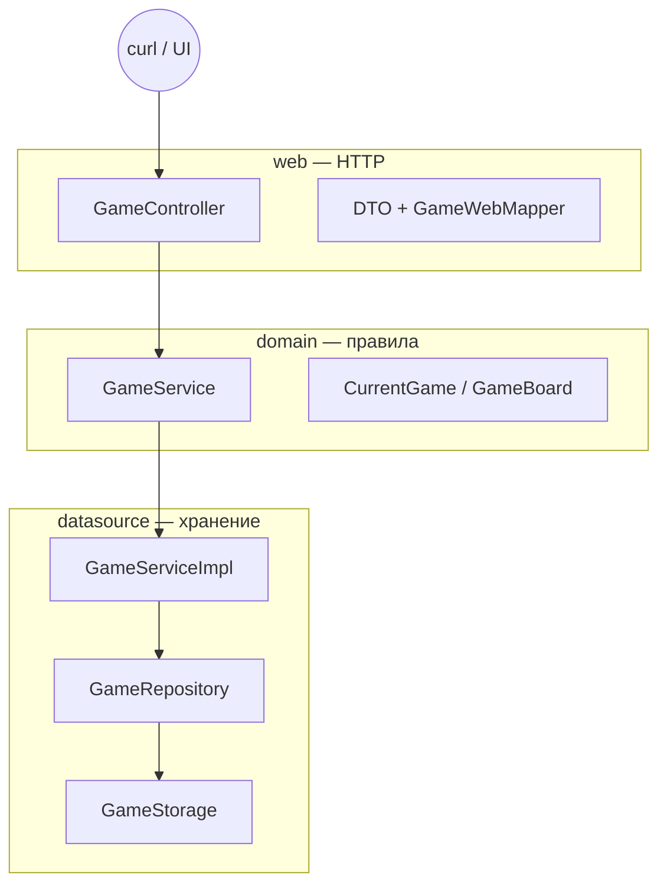

# T04_08 v2 — Часть 1: Пролог + Этап A + Этап B

> **Самодостаточный мега-туториал (часть 1 из 2).** Пиши код **здесь**, по микро-шагам. Не подглядывай в готовый проект, пока не закроешь блок «Проверка».
> **Рабочая папка:** `B:\school21\Java\Backend\AP1_Jv_T04B.ID_1421426-1\src\TicTacToe_1.2_sql_auth`
> **Углубиться в теорию (опционально):** [`T04_07_ТЕОРИЯ_ПОЛНОСТЬЮ.md`](T04_07_ТЕОРИЯ_ПОЛНОСТЬЮ.md)

Привет! Ты собираешь **крестики-нолики** как настоящий backend: Spring Boot, PostgreSQL, Basic Auth, PvE с Minimax и PvP с лобби. **Часть 1** доводит тебя от пустой папки до **работающего T03 в памяти** — один эндпоинт `POST /game/{uuid}`, компьютер отвечает умным ходом.

**Правило одного шага:** не открывай следующий блок, пока текущий не прошёл «Проверку». Сломалось — смотри «Если сломалось», не прыгай через три файла.

**Формат v2:** в каждом блоке сначала теория, потом картина в голове, потом микро-шаги с **короткими** вставками кода (5–20 строк), и только в конце — **полный файл** для сверки.

---

# Пролог — зачем всё это и куда мы идём

### Теория (прочитай до кода)

**HTTP** — язык, на котором браузер и сервер разговаривают. Клиент шлёт **запрос**: метод (`GET`, `POST`, …), URL (`http://localhost:8080/game/...`), заголовки (`Content-Type: application/json`) и иногда **тело** (body) — текст или байты. Сервер отвечает **статусом** (`200 OK`, `400 Bad Request`, `404 Not Found`, `422 Unprocessable Entity`) и своим телом. Ты не «вызываешь функцию» напрямую — ты отправляешь сообщение по сети и ждёшь ответ.

Для backend-разработчика важно различать **идемпотентность** и **безопасность** методов. `GET` должен только читать данные и не менять состояние на сервере. `POST` создаёт или изменяет ресурс — каждый вызов может дать новый результат. В T03 у нас один `POST /game/{uuid}`: клиент присылает **целую доску** после своего хода, сервер валидирует, считает ответ компьютера и возвращает обновлённую игру.

**REST** (Representational State Transfer) — стиль проектирования API поверх HTTP. Ресурс — «игра», «пользователь» — имеет URL. Состояние передаётся **представлением** (representation), чаще всего JSON. Хороший REST предсказуем: коды ответов честные, ошибки в едином формате (`ErrorResponse`), идентификаторы в пути (`/game/{gameId}`) совпадают с телом запроса.

**JSON** (JavaScript Object Notation) — текстовый формат обмена данными. Spring Boot с библиотекой **Jackson** автоматически превращает JSON в Java-объекты (DTO) и обратно. Вложенность в JSON соответствует полям: `board.board` — это поле `board` внутри объекта `board` в `CurrentGameDto`. Пустые конструкторы и геттеры/сеттеры в DTO нужны именно для Jackson.

**Слои архитектуры** защищают проект от хаоса. **web** знает про HTTP и DTO, но не про Minimax и не про SQL. **domain** знает правила игры и интерфейсы сервисов, но не знает про Tomcat. **datasource** реализует хранение и алгоритмы, связывая domain с памятью (позже — с PostgreSQL). **di** (dependency injection) собирает граф объектов: кто кому передаётся в конструктор.

Представь конвейер одного запроса T03: `GameController` принимает JSON → `GameWebMapper` делает `CurrentGame` → `GameService.validateBoard` сверяет с сохранённым → `GameService.getNextMove` запускает Minimax → результат маппится в DTO → Jackson отдаёт JSON клиенту. Параллельно `GameRepository.save` кладёт игру в `GameStorage`. Ни один слой не делает чужую работу.

**Дорожная карта всего T04** (часть 1 покрывает только начало): **Этап A** — JDK, Gradle, первый `bootRun`. **Этап B** — T03 в RAM (~20 блоков). **Этап C** — PostgreSQL + JPA (часть 2). **Этап D** — регистрация и Basic Auth. **Этап E** — PvP, лобби, все эндпоинты. **Этап F** — полные сценарии curl. **Этап G** — браузерный UI. Не торопись: каждый этап — отдельная «версия продукта».

### Картина в голове

```

Клиент (curl / браузер)

        |  HTTP + JSON

        v

   [ web: Controller, DTO, Mapper ]

        |  вызовы интерфейсов

        v

   [ domain: GameBoard, GameService ]

        |  реализация

        v

   [ datasource: GameServiceImpl, Repository, Storage ]

        |

        v

   RAM (позже PostgreSQL)

```

Твоя задача в части 1 — пройти путь сверху вниз, пока нижний ящик — это `ConcurrentHashMap`, а не база данных.

### Карта архитектуры (mermaid)



### Команды по умолчанию

Перед каждым запуском сервера:

```powershell
cd B:\school21\Java\Backend\AP1_Jv_T04B.ID_1421426-1\src\TicTacToe_1.2_sql_auth
$env:JAVA_HOME = "C:\Program Files\Java\jdk-21"   # путь к твоему JDK 17–21
.\gradlew.bat bootRun
```

<details><summary>Bash (macOS / Linux)</summary>

```bash
cd src/TicTacToe_1.2_sql_auth
export JAVA_HOME=$(/usr/libexec/java_home -v 21)
./gradlew bootRun
```

</details>

---

# Теория перед Этапом A — JDK, Gradle, Spring Boot

### Теория (прочитай до кода)

**JDK** (Java Development Kit) — компилятор `javac`, runtime `java`, стандартная библиотека. Spring Boot 3 требует **Java 17+**. На School21 часто стоит Java 26 — она слишком новая для Gradle/Spring в этом проекте. Выставляй `JAVA_HOME` на **17 или 21** (Eclipse Temurin — хороший выбор).

**Gradle** — система сборки. Файл `build.gradle.kts` (Kotlin DSL) описывает плагины, зависимости, версию Java. Wrapper (`gradlew.bat` / `gradlew`) фиксирует версию Gradle в проекте — не нужно ставить Gradle глобально. Команды: `bootRun` (запуск), `compileJava` (только компиляция), `dependencies` (дерево библиотек).

**Spring Boot** — надстройка над Spring Framework: встраивает Tomcat, автоконфигурирует Jackson, поднимает контекст приложения. Аннотация `@SpringBootApplication` на `TicTacToeApplication` включает сканирование пакета `tictactoe` и всех вложенных. Точка входа — `main`, который вызывает `SpringApplication.run`.

На этапе A мы подключаем только `spring-boot-starter-web` — без JPA, без Security. Этого достаточно, чтобы Tomcat слушал порт **8080** и отвечал на HTTP. Позже, на этапе C, добавишь `data-jpa` и драйвер PostgreSQL — Gradle подтянет новые jar-файлы после Reload.

Связка **JDK + Gradle + Spring Boot** — фундамент. Если JDK неверный, Gradle даже не стартует. Если `build.gradle.kts` битый — `bootRun` не найдёт плагин. Если нет `@SpringBootApplication` — контекст пустой. Этап A проверяет все три звена по отдельности, чтобы на этапе B ты думал о логике игры, а не о среде.

---

# ЭТАП A — Среда и первый запуск

> Цель этапа: JDK на месте, пакеты созданы, Gradle тянет Spring Web, Tomcat слушает 8080. Кода игры пока нет — и это нормально.

## Блок A.1 — JDK и проверка Java

| | |
|---|---|
| **Цель** | Убедиться, что Gradle видит JDK 17–21, не 26. |
| **Время** | 5 мин |
| **Сложность** | ★☆☆ |

### Теория (прочитай до кода)

**JDK** (Java Development Kit) — это не только команда `java`, а весь набор: компилятор, runtime, стандартная библиотека. Gradle при сборке вызывает `javac` из `$JAVA_HOME`. Если там Java 26, а Spring Boot 3.2 рассчитан на 17–21, получишь загадочные ошибки плагинов.

Переменная **`JAVA_HOME`** указывает на корень установки JDK (папка с `bin/java`). На Windows в PowerShell её задают на сессию: `$env:JAVA_HOME = "..."`. Это не ломает систему навсегда — только текущее окно терминала.

School21 часто ставит несколько JDK. **Правило:** перед `./gradlew bootRun` всегда проверяй `java -version`. Нужно увидеть `17` или `21`. Строка `26` — стоп, смени JDK.

Eclipse Temurin (Adoptium) — удобный бесплатный JDK. IntelliJ тоже может скачать JDK 21 в Settings → Build Tools → Gradle → Gradle JVM.

Когда будешь отлаживать **JDK**, держи в голове один вопрос: «какой слой за это отвечает?» Если ошибка в JSON — смотри web/DTO. Если в логике хода — domain/service. Если «игра не сохранилась» — repository/storage.

На защите проекта часто спрашивают про **JDK** не «что написано в коде», а «зачем так». Ответ всегда про разделение ответственности: меньше связей — проще тестировать и менять БД без переписывания контроллера.

Типичная ловушка с **JDK**: скопировать готовый файл целиком и не понять половину строк. Формат v2 как раз против этого — сначала 5–20 строк, разбор, потом сверка. Не пропускай микро-шаги даже если «и так понятно».

### Картина в голове

```

Терминал → JAVA_HOME → java -version → Gradle → Spring Boot

Если первое звено битое — дальше не едет.

```

### Микро-шаг 1 — Путь к JDK

**Добавляем:** Проверь, что папка существует и внутри есть `bin\java.exe`.

**Напиши:**

```powershell
$env:JAVA_HOME = "C:\Program Files\Java\jdk-21"
Test-Path "$env:JAVA_HOME\bin\java.exe"
```

**Разбор:**

| Строка / фрагмент | Код | Что делает |
|-------------------|-----|------------|
| 1 | `$env:JAVA_HOME` | Путь к корню JDK |
| 2 | `Test-Path` | Проверка наличия java.exe |

### Микро-шаг 2 — Версия Java

**Добавляем:** Запусти java из JAVA_HOME — не из случайного PATH.

**Напиши:**

```text
& "$env:JAVA_HOME\bin\java.exe" -version
```

**Разбор:**

| Строка / фрагмент | Код | Что делает |
|-------------------|-----|------------|
| 1 | `java.exe -version` | Печатает версию JVM |
| 2 | `openjdk 21` | Ожидаемый результат |

### Микро-шаг 3 — Gradle JVM

**Добавляем:** Gradle должен использовать тот же JDK (позже в IDE).

**Напиши:**

```powershell
cd B:\school21\Java\Backend\AP1_Jv_T04B.ID_1421426-1\src\TicTacToe_1.2_sql_auth
.\gradlew.bat -version
```

**Разбор:**

| Строка / фрагмент | Код | Что делает |
|-------------------|-----|------------|
| 1 | `gradlew -version` | Показывает JVM Gradle |
| 2 | `Launcher JVM` | Должна совпасть с JAVA_HOME |

### Сверка: файл целиком — `commands-jdk-check.ps1`

```powershell
$env:JAVA_HOME = "C:\Program Files\Java\jdk-21"
& "$env:JAVA_HOME\bin\java.exe" -version
```

### Сделай паузу

**Вопрос:** Почему именно JAVA_HOME, а не просто java в PATH?

### Проверка

**PowerShell (Windows):**

```powershell
$env:JAVA_HOME = "C:\Program Files\Java\jdk-21"
& "$env:JAVA_HOME\bin\java.exe" -version
```

<details><summary>Bash (macOS / Linux)</summary>

```bash
java -version
```

</details>

### Если сломалось

Версия 26.x → установи JDK 21, выставь JAVA_HOME. `java` не найден → добавь `%JAVA_HOME%\bin` в PATH или вызывай полный путь.

### Микро-итог

Java под контролем — полдела с Gradle.

### Дальше

Блок **A.2** — структура пакетов.

---

## Блок A.2 — Структура пакетов

| | |
|---|---|
| **Цель** | Создать дерево пакетов до первого `.java`. |
| **Время** | 10 мин |
| **Сложность** | ★☆☆ |

### Теория (прочитай до кода)

В Java **пакет** — это namespace и одновременно папка под `src/main/java`. Класс `tictactoe.domain.model.GameBoard` лежит в `tictactoe/domain/model/GameBoard.java`.

Мы делим код на **слои**: `domain` (правила), `datasource` (хранение и реализация), `web` (HTTP), `di` (сборка Spring-бинов). Это не требование Java — это дисциплина архитектуры.

Spring Boot сканирует компоненты начиная с пакета `@SpringBootApplication` — у нас `tictactoe`. Все подпакеты `tictactoe.*` попадают в контекст. Если положить контроллер в `com.other` без `@ComponentScan` — Spring его не увидит.

Создавай пакеты **до** классов: в IntelliJ ПКМ → New → Package, вводи полное имя `tictactoe.domain.model`.

Когда будешь отлаживать **пакеты**, держи в голове один вопрос: «какой слой за это отвечает?» Если ошибка в JSON — смотри web/DTO. Если в логике хода — domain/service. Если «игра не сохранилась» — repository/storage.

На защите проекта часто спрашивают про **пакеты** не «что написано в коде», а «зачем так». Ответ всегда про разделение ответственности: меньше связей — проще тестировать и менять БД без переписывания контроллера.

Типичная ловушка с **пакеты**: скопировать готовый файл целиком и не понять половину строк. Формат v2 как раз против этого — сначала 5–20 строк, разбор, потом сверка. Не пропускай микро-шаги даже если «и так понятно».

### Картина в голове

```

src/main/java/tictactoe/

  domain/   web/   datasource/   di/

```

### Микро-шаг 1 — Корень

**Добавляем:** Пакет приложения — `tictactoe`.

**Напиши:**

```text
tictactoe
```

**Разбор:**

| Строка / фрагмент | Код | Что делает |
|-------------------|-----|------------|
| — | `tictactoe` | Корень; Spring сканирует отсюда |

### Микро-шаг 2 — Domain

**Добавляем:** Бизнес-модели и интерфейсы сервисов.

**Напиши:**

```text
tictactoe.domain.model
tictactoe.domain.service
```

**Разбор:**

| Строка / фрагмент | Код | Что делает |
|-------------------|-----|------------|
| — | `domain.model` | GameBoard, CurrentGame |
| — | `domain.service` | GameService interface |

### Микро-шаг 3 — Datasource + Web + DI

**Добавляем:** Остальные слои — по одному пакету на роль.

**Напиши:**

```text
tictactoe.datasource.model
tictactoe.datasource.repository
tictactoe.datasource.mapper
tictactoe.datasource.service
tictactoe.datasource.storage
tictactoe.web.controller
tictactoe.web.model
tictactoe.web.mapper
tictactoe.di
```

**Разбор:**

| Строка / фрагмент | Код | Что делает |
|-------------------|-----|------------|
| — | `datasource.*` | Entity, repo, storage, impl |
| — | `web.*` | Controller, DTO |
| — | `di` | SpringConfig @Bean |

### Сверка: файл целиком — `структура пакетов`

```text
tictactoe
tictactoe.domain.model
tictactoe.domain.service
tictactoe.datasource.model
tictactoe.datasource.repository
tictactoe.datasource.mapper
tictactoe.datasource.service
tictactoe.datasource.storage
tictactoe.web.controller
tictactoe.web.model
tictactoe.web.mapper
tictactoe.di
```

### Сделай паузу

**Вопрос:** Зачем `GameBoard` в domain, а не в web?

### Проверка

**PowerShell (Windows):**

```powershell
# дерево папок как выше
```

<details><summary>Bash (macOS / Linux)</summary>

```bash
# ls -R src/main/java/tictactoe
```

</details>

### Если сломалось

IntelliJ не создаёт вложенные пакеты одним именем — пиши полное имя `tictactoe.domain.model`.

### Микро-итог

Скелет пакетов готов — наполняем на этапе B.

### Дальше

Блок **A.3** — `build.gradle.kts`.

---

## Блок A.3 — `build.gradle.kts` (только Web)

| | |
|---|---|
| **Цель** | Подключить Spring Boot Web для T03. |
| **Время** | 10 мин |
| **Сложность** | ★★☆ |

### Теория (прочитай до кода)

**Gradle** описывает сборку декларативно. Файл `build.gradle.kts` — Kotlin DSL (скобки и строки как в Kotlin). Плагин `org.springframework.boot` добавляет задачу `bootRun` и управление версиями Spring.

`spring-boot-starter-web` — **starter**, набор зависимостей: Spring MVC, embedded Tomcat, Jackson для JSON. Одна строка вместо десяти jar вручную.

`sourceCompatibility = VERSION_17` — bytecode 17. Spring Boot 3 не поддерживает Java 8/11.

После правки — **Gradle Reload** в IDE (иконка слона). Без reload IDE может показывать старые зависимости.

Когда будешь отлаживать **Gradle**, держи в голове один вопрос: «какой слой за это отвечает?» Если ошибка в JSON — смотри web/DTO. Если в логике хода — domain/service. Если «игра не сохранилась» — repository/storage.

На защите проекта часто спрашивают про **Gradle** не «что написано в коде», а «зачем так». Ответ всегда про разделение ответственности: меньше связей — проще тестировать и менять БД без переписывания контроллера.

Типичная ловушка с **Gradle**: скопировать готовый файл целиком и не понять половину строк. Формат v2 как раз против этого — сначала 5–20 строк, разбор, потом сверка. Не пропускай микро-шаги даже если «и так понятно».

### Картина в голове

```

build.gradle.kts → plugins → dependencies → bootRun

```

### Микро-шаг 1 — Плагины

**Добавляем:** Java + Spring Boot 3.2.0 + dependency-management.

**Напиши:**

```kotlin
plugins {
    id("java")
    id("org.springframework.boot") version "3.2.0"
    id("io.spring.dependency-management") version "1.1.4"
}
```

**Разбор:**

| Строка / фрагмент | Код | Что делает |
|-------------------|-----|------------|
| 1-4 | `plugins` | Подключают Java и Spring Boot |

### Микро-шаг 2 — Java 17

**Добавляем:** Минимальная версия для Boot 3.

**Напиши:**

```text
java {
    sourceCompatibility = JavaVersion.VERSION_17
    targetCompatibility = JavaVersion.VERSION_17
}
```

**Разбор:**

| Строка / фрагмент | Код | Что делает |
|-------------------|-----|------------|
| — | `VERSION_17` | Bytecode 17 |

### Микро-шаг 3 — Web starter

**Добавляем:** HTTP API без БД пока.

**Напиши:**

```text
dependencies {
    implementation("org.springframework.boot:spring-boot-starter-web")
    testImplementation(platform("org.junit:junit-bom:5.10.0"))
    testImplementation("org.junit.jupiter:junit-jupiter")
}
```

**Разбор:**

| Строка / фрагмент | Код | Что делает |
|-------------------|-----|------------|
| — | `starter-web` | Tomcat + MVC + Jackson |

### Микро-шаг 4 — JUnit

**Добавляем:** Задача test использует JUnit 5.

**Напиши:**

```text
tasks.test {
    useJUnitPlatform()
}
```

**Разбор:**

| Строка / фрагмент | Код | Что делает |
|-------------------|-----|------------|
| — | `useJUnitPlatform` | JUnit 5 для тестов |

### Сверка: файл целиком — `build.gradle.kts`

```kotlin
plugins {
    id("java")
    id("org.springframework.boot") version "3.2.0"
    id("io.spring.dependency-management") version "1.1.4"
}

group = "org.example"
version = "1.0-SNAPSHOT"

java {
    sourceCompatibility = JavaVersion.VERSION_17
    targetCompatibility = JavaVersion.VERSION_17
}

repositories {
    mavenCentral()
}

dependencies {
    implementation("org.springframework.boot:spring-boot-starter-web")
    testImplementation(platform("org.junit:junit-bom:5.10.0"))
    testImplementation("org.junit.jupiter:junit-jupiter")
}

tasks.test {
    useJUnitPlatform()
}
```

### Сделай паузу

**Вопрос:** Чем `implementation` отличается от `testImplementation`?

### Проверка

**PowerShell (Windows):**

```powershell
cd B:\school21\Java\Backend\AP1_Jv_T04B.ID_1421426-1\src\TicTacToe_1.2_sql_auth
.\gradlew.bat dependencies --configuration compileClasspath | Select-String spring-web
```

<details><summary>Bash (macOS / Linux)</summary>

```bash
./gradlew dependencies --configuration compileClasspath | grep spring-web
```

</details>

### Если сломалось

Gradle sync failed → File → Invalidate Caches. Нет gradlew.bat → скопируй wrapper из соседнего проекта.

### Микро-итог

Gradle знает про Spring Web.

### Дальше

Блок **A.4** — `TicTacToeApplication`.

---

## Блок A.4 — `TicTacToeApplication.java`

| | |
|---|---|
| **Цель** | Точка входа Spring Boot. |
| **Время** | 5 мин |
| **Сложность** | ★☆☆ |

### Теория (прочитай до кода)

`@SpringBootApplication` — мета-аннотация: включает `@Configuration`, `@EnableAutoConfiguration`, `@ComponentScan` для пакета класса и ниже.

`SpringApplication.run` поднимает **ApplicationContext** — контейнер бинов. Tomcat стартует внутри JVM на порту 8080 (если не переопределён).

Класс лежит в `tictactoe` — корне сканирования. Контроллеры и `@Configuration` в подпакетах подхватятся автоматически.

Когда будешь отлаживать **Spring Boot entry point**, держи в голове один вопрос: «какой слой за это отвечает?» Если ошибка в JSON — смотри web/DTO. Если в логике хода — domain/service. Если «игра не сохранилась» — repository/storage.

На защите проекта часто спрашивают про **Spring Boot entry point** не «что написано в коде», а «зачем так». Ответ всегда про разделение ответственности: меньше связей — проще тестировать и менять БД без переписывания контроллера.

Типичная ловушка с **Spring Boot entry point**: скопировать готовый файл целиком и не понять половину строк. Формат v2 как раз против этого — сначала 5–20 строк, разбор, потом сверка. Не пропускай микро-шаги даже если «и так понятно».

### Картина в голове

```

main() → SpringApplication.run → Tomcat :8080

```

### Микро-шаг 1 — Package

**Добавляем:** Корневой пакет приложения.

**Напиши:**

```java
package tictactoe;
```

**Разбор:**

| Строка / фрагмент | Код | Что делает |
|-------------------|-----|------------|
| 1 | `package tictactoe` | Корень сканирования |

### Микро-шаг 2 — Imports + аннотация

**Добавляем:** Spring Boot автоконфигурация.

**Напиши:**

```java
import org.springframework.boot.SpringApplication;
import org.springframework.boot.autoconfigure.SpringBootApplication;

@SpringBootApplication
public class TicTacToeApplication {
```

**Разбор:**

| Строка / фрагмент | Код | Что делает |
|-------------------|-----|------------|
| — | `@SpringBootApplication` | Auto-config + component scan |

### Микро-шаг 3 — main

**Добавляем:** Точка входа JVM.

**Напиши:**

```text
    public static void main(String[] args) {
        SpringApplication.run(TicTacToeApplication.class, args);
    }
}
```

**Разбор:**

| Строка / фрагмент | Код | Что делает |
|-------------------|-----|------------|
| — | `SpringApplication.run` | Стартует embedded Tomcat |

### Сверка: файл целиком — `TicTacToeApplication.java`

```java
package tictactoe;

import org.springframework.boot.SpringApplication;
import org.springframework.boot.autoconfigure.SpringBootApplication;

@SpringBootApplication
public class TicTacToeApplication {

    public static void main(String[] args) {
        SpringApplication.run(TicTacToeApplication.class, args);
    }
}
```

### Сделай паузу

**Вопрос:** Что если класс в `com.other` без @ComponentScan?

### Проверка

**PowerShell (Windows):**

```powershell
cd B:\school21\Java\Backend\AP1_Jv_T04B.ID_1421426-1\src\TicTacToe_1.2_sql_auth
.\gradlew.bat bootRun
# В другом окне:
Invoke-WebRequest http://localhost:8080/ -UseBasicParsing | Select-Object StatusCode
```

<details><summary>Bash (macOS / Linux)</summary>

```bash
./gradlew bootRun & sleep 8 && curl -s -o /dev/null -w '%{http_code}' http://localhost:8080/
```

</details>

### Если сломалось

Порт 8080 занят → netstat -ano | findstr 8080. bootRun not found → нет Spring Boot plugin.

### Микро-итог

Сервер поднимается — этап A закрыт.

### Дальше

Теория перед этапом B, затем блок **B.0**.

---

# Теория перед Этапом B — Domain, DTO, Repository, immutability

### Теория (прочитай до кода)

**Domain-модель** (`GameBoard`, `CurrentGame`) описывает предметную область: правила игры, не JSON и не таблицы SQL. Она не знает про `@RestController` и `@Entity`. Если завтра API станет XML или gRPC — domain останется тем же.

**DTO** (Data Transfer Object) — форма данных для HTTP. `CurrentGameDto` повторяет поля domain, но с сеттерами для Jackson. DTO может иметь `computerStarts`, которого нет в domain — это флаг протокола, не бизнес-сущность.

**Repository** — абстракция хранения. Интерфейс `GameRepository` в datasource объявляет `save` и `findById`. Domain-сервис и контроллер зависят от интерфейса, не от `ConcurrentHashMap`. На этапе C заменишь `GameRepositoryImpl` на JPA — контроллер не тронешь.

**Immutability (неизменяемость)** — `CurrentGame` с `final` полями: новый ход = новый объект с новой доской (`new CurrentGame(id, board.copy())`). Minimax мутирует **копию** доски, не ту, что лежит в storage. Это защита от «тихих» багов, когда два запроса делят один массив.

**Mapper** (`GameMapper`, `GameWebMapper`) — перевод между слоями без `new` в контроллере на десять строк. Один класс — одно направление: entity↔domain, domain↔dto.

Этап B — ~20 блоков от `settings.gradle.kts` до полного curl-теста. Каждый блок — один файл или логическая часть. Не беги: T03 в памяти — фундамент для Postgres и Auth.

---

# ЭТАП B — T03 в памяти (игрок vs компьютер)

> Игра живёт в RAM (`GameStorage`). API: `POST /game/{uuid}`. После этапа C память заменим на PostgreSQL.

## Блок B.0 — `settings.gradle.kts`

| | |
|---|---|
| **Цель** | Имя корневого Gradle-проекта. |
| **Время** | 3 мин |
| **Сложность** | ★☆☆ |

### Теория (прочитай до кода)

Файл `settings.gradle.kts` в корне задаёт **имя проекта** для IDE и артефактов. Одна строка — но без неё Gradle всё равно работает с дефолтным именем папки.

Когда будешь отлаживать **settings.gradle**, держи в голове один вопрос: «какой слой за это отвечает?» Если ошибка в JSON — смотри web/DTO. Если в логике хода — domain/service. Если «игра не сохранилась» — repository/storage.

На защите проекта часто спрашивают про **settings.gradle** не «что написано в коде», а «зачем так». Ответ всегда про разделение ответственности: меньше связей — проще тестировать и менять БД без переписывания контроллера.

### Картина в голове

```

TicTacToe_1.2_sql_auth/settings.gradle.kts

```

### Микро-шаг 1 — Имя проекта

**Добавляем:** rootProject.name для Gradle и IntelliJ.

**Напиши:**

```kotlin
rootProject.name = "TicTacToe"
```

**Разбор:**

| Строка / фрагмент | Код | Что делает |
|-------------------|-----|------------|
| 1 | `rootProject.name` | Отображаемое имя проекта |

### Сверка: файл целиком — `settings.gradle.kts`

```kotlin
rootProject.name = "TicTacToe"
```

### Сделай паузу

**Вопрос:** Зачем отдельный файл settings?

### Проверка

**PowerShell (Windows):**

```powershell
cd B:\school21\Java\Backend\AP1_Jv_T04B.ID_1421426-1\src\TicTacToe_1.2_sql_auth
Get-Content settings.gradle.kts
```

<details><summary>Bash (macOS / Linux)</summary>

```bash
cat settings.gradle.kts
```

</details>

### Если сломалось

Файл не там → положи в корень рядом с build.gradle.kts.

### Микро-итог

Имя проекта зафиксировано.

### Дальше

Блок **B.1** — GameBoard.

---

## Блок B.1 — `GameBoard.java`

| | |
|---|---|
| **Цель** | Модель поля 3×3 в domain. |
| **Время** | 15 мин |
| **Сложность** | ★★☆ |

### Теория (прочитай до кода)

Доска — **сердце** T03. Клетки — `int`: 0 пусто, 1 игрок (X), 2 компьютер (O). Числа проще enum для Minimax и JSON.

`getCells()` и `copy()` возвращают **копии** — инкапсуляция. Снаружи нельзя испортить внутренний массив.

Minimax будет вызывать `set` на копии, откатывая клетки в EMPTY после рекурсии.

Когда будешь отлаживать **GameBoard**, держи в голове один вопрос: «какой слой за это отвечает?» Если ошибка в JSON — смотри web/DTO. Если в логике хода — domain/service. Если «игра не сохранилась» — repository/storage.

На защите проекта часто спрашивают про **GameBoard** не «что написано в коде», а «зачем так». Ответ всегда про разделение ответственности: меньше связей — проще тестировать и менять БД без переписывания контроллера.

Типичная ловушка с **GameBoard**: скопировать готовый файл целиком и не понять половину строк. Формат v2 как раз против этого — сначала 5–20 строк, разбор, потом сверка. Не пропускай микро-шаги даже если «и так понятно».

Сравни **GameBoard** с монолитом «всё в одном Main.java»: там бы HTTP, массив int[][] и SQL в одной куче. Слои дороже по файлам, но дешевле по нервам при T04, когда добавятся Postgres, Security и PvP.

### Картина в голове

```

GameBoard: int[3][3], константы, get/set, copy

```

### Микро-шаг 1 — Константы

**Добавляем:** SIZE, EMPTY, PLAYER, COMPUTER — контракт всего проекта.

**Напиши:**

```java
package tictactoe.domain.model;

public class GameBoard {
    public static final int SIZE = 3;
    public static final int EMPTY = 0;
    public static final int PLAYER = 1;
    public static final int COMPUTER = 2;
```

**Разбор:**

| Строка / фрагмент | Код | Что делает |
|-------------------|-----|------------|
| — | `SIZE = 3` | Поле 3x3 |
| — | `0/1/2` | Пусто / X / O |

### Микро-шаг 2 — Поле cells

**Добавляем:** Двумерный массив — состояние доски.

**Напиши:**

```text
    private final int[][] cells;

    public GameBoard() {
        this.cells = new int[SIZE][SIZE];
    }
```

**Разбор:**

| Строка / фрагмент | Код | Что делает |
|-------------------|-----|------------|
| — | `final int[][]` | Ссылка не меняется, содержимое — да |

### Микро-шаг 3 — Копирующий конструктор

**Добавляем:** Безопасное клонирование из другого массива.

**Напиши:**

```text
    public GameBoard(int[][] cells) {
        this.cells = new int[SIZE][SIZE];
        for (int i = 0; i < SIZE; i++) {
            System.arraycopy(cells[i], 0, this.cells[i], 0, SIZE);
        }
    }
```

**Разбор:**

| Строка / фрагмент | Код | Что делает |
|-------------------|-----|------------|
| — | `arraycopy` | Копия строки массива |

### Микро-шаг 4 — get / set

**Добавляем:** Доступ к клетке по row, col.

**Напиши:**

```text
    public int get(int row, int col) {
        return cells[row][col];
    }

    public void set(int row, int col, int value) {
        cells[row][col] = value;
    }
```

**Разбор:**

| Строка / фрагмент | Код | Что делает |
|-------------------|-----|------------|
| — | `get/set` | Minimax мутирует через set |

### Микро-шаг 5 — getCells и copy

**Добавляем:** Наружу только копии.

**Напиши:**

```text
    public int[][] getCells() {
        int[][] copy = new int[SIZE][SIZE];
        for (int i = 0; i < SIZE; i++) {
            System.arraycopy(cells[i], 0, copy[i], 0, SIZE);
        }
        return copy;
    }

    public GameBoard copy() {
        return new GameBoard(cells);
    }
}
```

**Разбор:**

| Строка / фрагмент | Код | Что делает |
|-------------------|-----|------------|
| — | `getCells()` | Защита инкапсуляции |
| — | `copy()` | Новая доска для хода |

### Сверка: файл целиком — `GameBoard.java`

```java
package tictactoe.domain.model;

/**
 * Игровое поле 3x3.
 * 0 — пусто, 1 — X (игрок), 2 — O (компьютер).
 */
public class GameBoard {

    public static final int SIZE = 3;
    public static final int EMPTY = 0;
    public static final int PLAYER = 1;    // X
    public static final int COMPUTER = 2;  // O

    private final int[][] cells;

    public GameBoard() {
        this.cells = new int[SIZE][SIZE];
    }

    public GameBoard(int[][] cells) {
        this.cells = new int[SIZE][SIZE];
        for (int i = 0; i < SIZE; i++) {
            System.arraycopy(cells[i], 0, this.cells[i], 0, SIZE);
        }
    }

    public int get(int row, int col) {
        return cells[row][col];
    }

    public void set(int row, int col, int value) {
        cells[row][col] = value;
    }

    public int[][] getCells() {
        int[][] copy = new int[SIZE][SIZE];
        for (int i = 0; i < SIZE; i++) {
            System.arraycopy(cells[i], 0, copy[i], 0, SIZE);
        }
        return copy;
    }

    public GameBoard copy() {
        return new GameBoard(cells);
    }
}
```

### Сделай паузу

**Вопрос:** Что сломается, если getCells() вернёт cells без копии?

### Проверка

**PowerShell (Windows):**

```powershell
# файл создан — compileJava позже
```

<details><summary>Bash (macOS / Linux)</summary>

```bash
# то же
```

</details>

### Если сломалось

cannot find symbol → проверь package и имя файла.

### Микро-итог

Есть тип «доска» — можно хранить состояние.

### Дальше

Блок **B.2** — CurrentGame.

---

## Блок B.2 — `CurrentGame.java`

| | |
|---|---|
| **Цель** | Игра = UUID + доска (T03). |
| **Время** | 10 мин |
| **Сложность** | ★☆☆ |

### Теория (прочитай до кода)

`CurrentGame` — агрегат: идентификатор сессии и снимок доски. В T03 клиент сам генерирует UUID и шлёт в URL и JSON.

Поля `final`: логически «новый ход» = новый объект, не мутация старого.

Когда будешь отлаживать **CurrentGame**, держи в голове один вопрос: «какой слой за это отвечает?» Если ошибка в JSON — смотри web/DTO. Если в логике хода — domain/service. Если «игра не сохранилась» — repository/storage.

На защите проекта часто спрашивают про **CurrentGame** не «что написано в коде», а «зачем так». Ответ всегда про разделение ответственности: меньше связей — проще тестировать и менять БД без переписывания контроллера.

Типичная ловушка с **CurrentGame**: скопировать готовый файл целиком и не понять половину строк. Формат v2 как раз против этого — сначала 5–20 строк, разбор, потом сверка. Не пропускай микро-шаги даже если «и так понятно».

### Картина в голове

```

UUID id + GameBoard board

```

### Микро-шаг 1 — Package и поля

**Добавляем:** id и board — final.

**Напиши:**

```java
package tictactoe.domain.model;

import java.util.UUID;

public class CurrentGame {
    private final UUID id;
    private final GameBoard board;
```

**Разбор:**

| Строка / фрагмент | Код | Что делает |
|-------------------|-----|------------|
| — | `final UUID` | Не меняется после создания |

### Микро-шаг 2 — Конструктор и геттеры

**Добавляем:** Доступ к полям.

**Напиши:**

```text
    public CurrentGame(UUID id, GameBoard board) {
        this.id = id;
        this.board = board;
    }

    public UUID getId() { return id; }
    public GameBoard getBoard() { return board; }
}
```

**Разбор:**

| Строка / фрагмент | Код | Что делает |
|-------------------|-----|------------|
| — | `getBoard()` | Сервис делает copy() перед ходом |

### Сверка: файл целиком — `CurrentGame.java`

```java
package tictactoe.domain.model;

import java.util.UUID;

/**
 * Текущая игра: id + доска.
 */
public class CurrentGame {

    private final UUID id;
    private final GameBoard board;

    public CurrentGame(UUID id, GameBoard board) {
        this.id = id;
        this.board = board;
    }

    public UUID getId() {
        return id;
    }

    public GameBoard getBoard() {
        return board;
    }
}
```

### Сделай паузу

**Вопрос:** Почему id и board final?

### Проверка

**PowerShell (Windows):**

```powershell
# компиляция позже
```

<details><summary>Bash (macOS / Linux)</summary>

```bash
# то же
```

</details>

### Если сломалось

getBoard() отдаёт ссылку → сервис всегда copy() перед ходом.

### Микро-итог

Минимальная модель «текущая игра» готова.

### Дальше

Блок **B.3** — GameService.

---

## Блок B.3 — интерфейс `GameService.java`

| | |
|---|---|
| **Цель** | Контракт правил в domain. |
| **Время** | 10 мин |
| **Сложность** | ★★☆ |

### Теория (прочитай до кода)

Интерфейс в **domain** — контроллер знает «что нужно», не «как Minimax устроен».

Четыре метода покрывают T03 API: ход ИИ, валидация, конец игры, первый ход компьютера.

Когда будешь отлаживать **GameService**, держи в голове один вопрос: «какой слой за это отвечает?» Если ошибка в JSON — смотри web/DTO. Если в логике хода — domain/service. Если «игра не сохранилась» — repository/storage.

На защите проекта часто спрашивают про **GameService** не «что написано в коде», а «зачем так». Ответ всегда про разделение ответственности: меньше связей — проще тестировать и менять БД без переписывания контроллера.

Типичная ловушка с **GameService**: скопировать готовый файл целиком и не понять половину строк. Формат v2 как раз против этого — сначала 5–20 строк, разбор, потом сверка. Не пропускай микро-шаги даже если «и так понятно».

### Картина в голове

```

GameService: getNextMove, validateBoard, isGameEnded, getFirstMove

```

### Микро-шаг 1 — Interface

**Добавляем:** Объявление методов без реализации.

**Напиши:**

```java
package tictactoe.domain.service;

import tictactoe.domain.model.CurrentGame;

public interface GameService {
```

**Разбор:**

| Строка / фрагмент | Код | Что делает |
|-------------------|-----|------------|
| — | `interface` | Контракт для impl |

### Микро-шаг 2 — Методы

**Добавляем:** Четыре операции T03.

**Напиши:**

```text
    CurrentGame getNextMove(CurrentGame game);
    boolean validateBoard(CurrentGame game);
    boolean isGameEnded(CurrentGame game);
    CurrentGame getFirstMove(CurrentGame game);
}
```

**Разбор:**

| Строка / фрагмент | Код | Что делает |
|-------------------|-----|------------|
| — | `getNextMove` | Minimax после хода X |
| — | `validateBoard` | Античит |

### Сверка: файл целиком — `GameService.java`

```java
package tictactoe.domain.service;

import tictactoe.domain.model.CurrentGame;

public interface GameService {

    /** Ход компьютера (Minimax) после хода игрока. */
    CurrentGame getNextMove(CurrentGame game);

    /** Проверка: клиент не изменил старые клетки. */
    boolean validateBoard(CurrentGame game);

    /** Игра завершена (победа или ничья)? */
    boolean isGameEnded(CurrentGame game);

    /** Первый ход компьютера (игрок играет за O). */
    CurrentGame getFirstMove(CurrentGame game);
}
```

### Сделай паузу

**Вопрос:** Зачем interface при одной impl?

### Проверка

**PowerShell (Windows):**

```powershell
# impl в B.9
```

<details><summary>Bash (macOS / Linux)</summary>

```bash
# то же
```

</details>

### Если сломалось

—

### Микро-итог

Domain-контракт записан.

### Дальше

Блок **B.4** — GameBoardEntity.

---

## Блок B.4 — `GameBoardEntity.java`

| | |
|---|---|
| **Цель** | Зеркало доски для слоя хранения. |
| **Время** | 10 мин |
| **Сложность** | ★☆☆ |

### Теория (прочитай до кода)

Entity — POJO для storage/JPA. Domain `GameBoard` и entity разделены: смена БД не трогает domain.

Поле `cells` не final — JPA на этапе C попросит setter.

Когда будешь отлаживать **GameBoardEntity**, держи в голове один вопрос: «какой слой за это отвечает?» Если ошибка в JSON — смотри web/DTO. Если в логике хода — domain/service. Если «игра не сохранилась» — repository/storage.

На защите проекта часто спрашивают про **GameBoardEntity** не «что написано в коде», а «зачем так». Ответ всегда про разделение ответственности: меньше связей — проще тестировать и менять БД без переписывания контроллера.

### Картина в голове

```

GameBoardEntity ≈ GameBoard, но в datasource.model

```

### Микро-шаг 1 — Класс и конструкторы

**Добавляем:** Пустой и из массива.

**Напиши:**

```java
package tictactoe.datasource.model;

import tictactoe.domain.model.GameBoard;

public class GameBoardEntity {
    private int[][] cells;

    public GameBoardEntity() {
        this.cells = new int[GameBoard.SIZE][GameBoard.SIZE];
    }
```

**Разбор:**

| Строка / фрагмент | Код | Что делает |
|-------------------|-----|------------|
| — | `GameBoard.SIZE` | Без magic number 3 |

### Микро-шаг 2 — getCells / setCells

**Добавляем:** Копирование при чтении и записи.

**Напиши:**

```text
    public int[][] getCells() { /* copy */ return copy; }
    public void setCells(int[][] cells) { /* copy into this.cells */ }
```

**Разбор:**

| Строка / фрагмент | Код | Что делает |
|-------------------|-----|------------|
| — | `setCells` | Нужен для JPA позже |

### Сверка: файл целиком — `GameBoardEntity.java`

```java
package tictactoe.datasource.model;

import tictactoe.domain.model.GameBoard;

public class GameBoardEntity {

    private int[][] cells;

    public GameBoardEntity() {
        this.cells = new int[GameBoard.SIZE][GameBoard.SIZE];
    }

    public GameBoardEntity(int[][] cells) {
        this.cells = new int[GameBoard.SIZE][GameBoard.SIZE];
        for (int i = 0; i < GameBoard.SIZE; i++) {
            System.arraycopy(cells[i], 0, this.cells[i], 0, GameBoard.SIZE);
        }
    }

    public int[][] getCells() {
        int[][] copy = new int[GameBoard.SIZE][GameBoard.SIZE];
        for (int i = 0; i < GameBoard.SIZE; i++) {
            System.arraycopy(cells[i], 0, copy[i], 0, GameBoard.SIZE);
        }
        return copy;
    }

    public void setCells(int[][] cells) {
        this.cells = new int[GameBoard.SIZE][GameBoard.SIZE];
        for (int i = 0; i < GameBoard.SIZE; i++) {
            System.arraycopy(cells[i], 0, this.cells[i], 0, GameBoard.SIZE);
        }
    }
}
```

### Сделай паузу

**Вопрос:** Чем entity от domain GameBoard?

### Проверка

**PowerShell (Windows):**

```powershell
# —
```

<details><summary>Bash (macOS / Linux)</summary>

```bash
# —
```

</details>

### Если сломалось

—

### Микро-итог

Entity доски готова.

### Дальше

Блок **B.5** — CurrentGameEntity.

---

## Блок B.5 — `CurrentGameEntity.java`

| | |
|---|---|
| **Цель** | Entity игры: UUID + GameBoardEntity. |
| **Время** | 8 мин |
| **Сложность** | ★☆☆ |

### Теория (прочитай до кода)

Аналог `CurrentGame`, но с сеттерами для persistence.

Пустой конструктор — требование JPA/Hibernate позже.

Когда будешь отлаживать **CurrentGameEntity**, держи в голове один вопрос: «какой слой за это отвечает?» Если ошибка в JSON — смотри web/DTO. Если в логике хода — domain/service. Если «игра не сохранилась» — repository/storage.

На защите проекта часто спрашивают про **CurrentGameEntity** не «что написано в коде», а «зачем так». Ответ всегда про разделение ответственности: меньше связей — проще тестировать и менять БД без переписывания контроллера.

### Картина в голове

```

CurrentGameEntity: id + board entity

```

### Микро-шаг 1 — Поля

**Добавляем:** UUID и вложенная entity доски.

**Напиши:**

```java
package tictactoe.datasource.model;

import java.util.UUID;

public class CurrentGameEntity {
    private UUID id;
    private GameBoardEntity board;
```

**Разбор:**

| Строка / фрагмент | Код | Что делает |
|-------------------|-----|------------|
| — | `GameBoardEntity` | Вложенный объект |

### Микро-шаг 2 — Конструкторы и accessors

**Добавляем:** Геттеры/сеттеры для всех полей.

**Напиши:**

```text
    public CurrentGameEntity() {}
    public CurrentGameEntity(UUID id, GameBoardEntity board) { this.id = id; this.board = board; }
    // getId setId getBoard setBoard
```

**Разбор:**

| Строка / фрагмент | Код | Что делает |
|-------------------|-----|------------|
| — | `setBoard` | Hibernate запишет JSON/embedded |

### Сверка: файл целиком — `CurrentGameEntity.java`

```java
package tictactoe.datasource.model;

import java.util.UUID;

public class CurrentGameEntity {

    private UUID id;
    private GameBoardEntity board;

    public CurrentGameEntity() {
    }

    public CurrentGameEntity(UUID id, GameBoardEntity board) {
        this.id = id;
        this.board = board;
    }

    public UUID getId() {
        return id;
    }

    public void setId(UUID id) {
        this.id = id;
    }

    public GameBoardEntity getBoard() {
        return board;
    }

    public void setBoard(GameBoardEntity board) {
        this.board = board;
    }
}
```

### Сделай паузу

**Вопрос:** Зачем пустой конструктор?

### Проверка

**PowerShell (Windows):**

```powershell
# —
```

<details><summary>Bash (macOS / Linux)</summary>

```bash
# —
```

</details>

### Если сломалось

—

### Микро-итог

Entity игры готова.

### Дальше

Блок **B.6** — GameMapper.

---

## Блок B.6 — `GameMapper.java`

| | |
|---|---|
| **Цель** | Перевод entity ↔ domain. |
| **Время** | 12 мин |
| **Сложность** | ★★☆ |

### Теория (прочитай до кода)

Mapper — статические методы, private constructor. Нет Spring-бина — просто утилита.

null-safe: if (entity == null) return null.

Когда будешь отлаживать **GameMapper**, держи в голове один вопрос: «какой слой за это отвечает?» Если ошибка в JSON — смотри web/DTO. Если в логике хода — domain/service. Если «игра не сохранилась» — repository/storage.

На защите проекта часто спрашивают про **GameMapper** не «что написано в коде», а «зачем так». Ответ всегда про разделение ответственности: меньше связей — проще тестировать и менять БД без переписывания контроллера.

### Картина в голове

```

toDomain / toEntity / toDomainBoard / toEntityBoard

```

### Микро-шаг 1 — Класс

**Добавляем:** final + private ctor.

**Напиши:**

```java
package tictactoe.datasource.mapper;

public final class GameMapper {
    private GameMapper() {}
```

**Разбор:**

| Строка / фрагмент | Код | Что делает |
|-------------------|-----|------------|
| — | `private GameMapper()` | Утилита, не new |

### Микро-шаг 2 — toDomain / toEntity

**Добавляем:** CurrentGame ↔ CurrentGameEntity.

**Напиши:**

```text
    public static CurrentGame toDomain(CurrentGameEntity entity) { ... }
    public static CurrentGameEntity toEntity(CurrentGame game) { ... }
```

**Разбор:**

| Строка / фрагмент | Код | Что делает |
|-------------------|-----|------------|
| — | `toDomain` | Перед работой сервиса |

### Сверка: файл целиком — `GameMapper.java`

```java
package tictactoe.datasource.mapper;

import tictactoe.datasource.model.CurrentGameEntity;
import tictactoe.datasource.model.GameBoardEntity;
import tictactoe.domain.model.CurrentGame;
import tictactoe.domain.model.GameBoard;

public final class GameMapper {

    private GameMapper() {
    }

    public static CurrentGame toDomain(CurrentGameEntity entity) {
        if (entity == null) {
            return null;
        }
        GameBoard board = toDomainBoard(entity.getBoard());
        return new CurrentGame(entity.getId(), board);
    }

    public static CurrentGameEntity toEntity(CurrentGame game) {
        if (game == null) {
            return null;
        }
        return new CurrentGameEntity(game.getId(), toEntityBoard(game.getBoard()));
    }

    public static GameBoard toDomainBoard(GameBoardEntity entity) {
        if (entity == null) {
            return null;
        }
        return new GameBoard(entity.getCells());
    }

    public static GameBoardEntity toEntityBoard(GameBoard board) {
        if (board == null) {
            return null;
        }
        return new GameBoardEntity(board.getCells());
    }
}
```

### Сделай паузу

**Вопрос:** Почему mapper не в domain?

### Проверка

**PowerShell (Windows):**

```powershell
# —
```

<details><summary>Bash (macOS / Linux)</summary>

```bash
# —
```

</details>

### Если сломалось

—

### Микро-итог

Маппинг storage↔domain есть.

### Дальше

Блок **B.7** — GameStorage.

---

## Блок B.7 — `GameStorage.java`

| | |
|---|---|
| **Цель** | In-memory Map UUID → игра. |
| **Время** | 10 мин |
| **Сложность** | ★☆☆ |

### Теория (прочитай до кода)

`ConcurrentHashMap` — потокобезопасность при параллельных POST.

На этапе C **удалишь** этот класс — заменит PostgreSQL.

Когда будешь отлаживать **GameStorage**, держи в голове один вопрос: «какой слой за это отвечает?» Если ошибка в JSON — смотри web/DTO. Если в логике хода — domain/service. Если «игра не сохранилась» — repository/storage.

На защите проекта часто спрашивают про **GameStorage** не «что написано в коде», а «зачем так». Ответ всегда про разделение ответственности: меньше связей — проще тестировать и менять БД без переписывания контроллера.

Типичная ловушка с **GameStorage**: скопировать готовый файл целиком и не понять половину строк. Формат v2 как раз против этого — сначала 5–20 строк, разбор, потом сверка. Не пропускай микро-шаги даже если «и так понятно».

### Картина в голове

```

Map<UUID, CurrentGameEntity> in RAM

```

### Микро-шаг 1 — Поле map

**Добавляем:** ConcurrentHashMap.

**Напиши:**

```java
package tictactoe.datasource.storage;

public class GameStorage {
    private final Map<UUID, CurrentGameEntity> games = new ConcurrentHashMap<>();
```

**Разбор:**

| Строка / фрагмент | Код | Что делает |
|-------------------|-----|------------|
| — | `ConcurrentHashMap` | Thread-safe |

### Микро-шаг 2 — put / get

**Добавляем:** Сохранение и поиск.

**Напиши:**

```text
    public void put(UUID id, CurrentGameEntity game) { games.put(id, game); }
    public Optional<CurrentGameEntity> get(UUID id) { return Optional.ofNullable(games.get(id)); }
}
```

**Разбор:**

| Строка / фрагмент | Код | Что делает |
|-------------------|-----|------------|
| — | `Optional` | Игра может не существовать |

### Сверка: файл целиком — `GameStorage.java`

```java
package tictactoe.datasource.storage;

import tictactoe.datasource.model.CurrentGameEntity;

import java.util.Map;
import java.util.Optional;
import java.util.UUID;
import java.util.concurrent.ConcurrentHashMap;

/**
 * In-memory хранилище. В T04 Задание 1 — УДАЛИШЬ этот класс.
 */
public class GameStorage {

    private final Map<UUID, CurrentGameEntity> games = new ConcurrentHashMap<>();

    public void put(UUID id, CurrentGameEntity game) {
        games.put(id, game);
    }

    public Optional<CurrentGameEntity> get(UUID id) {
        return Optional.ofNullable(games.get(id));
    }
}
```

### Сделай паузу

**Вопрос:** Зачем Concurrent, не HashMap?

### Проверка

**PowerShell (Windows):**

```powershell
# —
```

<details><summary>Bash (macOS / Linux)</summary>

```bash
# —
```

</details>

### Если сломалось

—

### Микро-итог

RAM-хранилище работает.

### Дальше

Блок **B.8** — Repository.

---

## Блок B.8 — `GameRepository` + `GameRepositoryImpl`

| | |
|---|---|
| **Цель** | Абстракция save/findById. |
| **Время** | 15 мин |
| **Сложность** | ★★☆ |

### Теория (прочитай до кода)

Repository скрывает storage и mapper от сервиса.

Impl — единственное место, где вызывается GameMapper.toEntity.

Когда будешь отлаживать **GameRepository**, держи в голове один вопрос: «какой слой за это отвечает?» Если ошибка в JSON — смотри web/DTO. Если в логике хода — domain/service. Если «игра не сохранилась» — repository/storage.

На защите проекта часто спрашивают про **GameRepository** не «что написано в коде», а «зачем так». Ответ всегда про разделение ответственности: меньше связей — проще тестировать и менять БД без переписывания контроллера.

Типичная ловушка с **GameRepository**: скопировать готовый файл целиком и не понять половину строк. Формат v2 как раз против этого — сначала 5–20 строк, разбор, потом сверка. Не пропускай микро-шаги даже если «и так понятно».

### Картина в голове

```

GameRepository interface → GameRepositoryImpl(storage)

```

### Микро-шаг 1 — Interface

**Добавляем:** save + findById.

**Напиши:**

```java
package tictactoe.datasource.repository;

public interface GameRepository {
    void save(CurrentGame game);
    Optional<CurrentGame> findById(UUID id);
}
```

**Разбор:**

| Строка / фрагмент | Код | Что делает |
|-------------------|-----|------------|
| — | `save` | После каждого хода |

### Микро-шаг 2 — Impl

**Добавляем:** Делегирует storage + mapper.

**Напиши:**

```java
public class GameRepositoryImpl implements GameRepository {
    private final GameStorage storage;
    public void save(CurrentGame game) { storage.put(game.getId(), GameMapper.toEntity(game)); }
    public Optional<CurrentGame> findById(UUID id) { return storage.get(id).map(GameMapper::toDomain); }
}
```

**Разбор:**

| Строка / фрагмент | Код | Что делает |
|-------------------|-----|------------|
| — | `GameMapper::toDomain` | Method reference |

### Сверка: файл целиком — `GameRepository.java + GameRepositoryImpl.java`

```java
package tictactoe.datasource.repository;

import tictactoe.domain.model.CurrentGame;

import java.util.Optional;
import java.util.UUID;

public interface GameRepository {

    void save(CurrentGame game);

    Optional<CurrentGame> findById(UUID id);
}

// --- GameRepositoryImpl ---

package tictactoe.datasource.repository;

import tictactoe.datasource.mapper.GameMapper;
import tictactoe.datasource.storage.GameStorage;
import tictactoe.domain.model.CurrentGame;

import java.util.Optional;
import java.util.UUID;

public class GameRepositoryImpl implements GameRepository {

    private final GameStorage storage;

    public GameRepositoryImpl(GameStorage storage) {
        this.storage = storage;
    }

    @Override
    public void save(CurrentGame game) {
        storage.put(game.getId(), GameMapper.toEntity(game));
    }

    @Override
    public Optional<CurrentGame> findById(UUID id) {
        return storage.get(id).map(GameMapper::toDomain);
    }
}
```

### Сделай паузу

**Вопрос:** Зачем interface, если impl один?

### Проверка

**PowerShell (Windows):**

```powershell
# —
```

<details><summary>Bash (macOS / Linux)</summary>

```bash
# —
```

</details>

### Если сломалось

—

### Микро-итог

Репозиторий прячет storage.

### Дальше

Блок **B.9a** — теория Minimax.

---

## Блок B.9a — Разбор Minimax на примере

| | |
|---|---|
| **Цель** | Понять рекурсию до отладки. |
| **Время** | 20 мин |
| **Сложность** | ★★★ |

### Теория (прочитай до кода)

**Minimax** — алгоритм для нулевой суммы: компьютер (max) максимизирует score, игрок (min) минимизирует.

Листья: победа O → +10, победа X → −10, ничья → 0. **`depth`** сдвигает score, чтобы выбирать **быструю** победу.

На доске 3×3 полный перебор мал — рекурсия без alpha-beta всё равно мгновенная.

Когда будешь отлаживать **Minimax**, держи в голове один вопрос: «какой слой за это отвечает?» Если ошибка в JSON — смотри web/DTO. Если в логике хода — domain/service. Если «игра не сохранилась» — repository/storage.

На защите проекта часто спрашивают про **Minimax** не «что написано в коде», а «зачем так». Ответ всегда про разделение ответственности: меньше связей — проще тестировать и менять БД без переписывания контроллера.

Типичная ловушка с **Minimax**: скопировать готовый файл целиком и не понять половину строк. Формат v2 как раз против этого — сначала 5–20 строк, разбор, потом сверка. Не пропускай микро-шаги даже если «и так понятно».

Сравни **Minimax** с монолитом «всё в одном Main.java»: там бы HTTP, массив int[][] и SQL в одной куче. Слои дороже по файлам, но дешевле по нервам при T04, когда добавятся Postgres, Security и PvP.

Если застрял на **Minimax** больше 30 минут — остановись, прочитай «Картину в голове» ещё раз, ответь на вопрос в «Сделай паузу» вслух. Часто проблема не в синтаксисе Java, а в неверном пакете или пропущенном `@Bean`.

### Картина в голове

```

findBestMove → для каждой пустой: поставить O → minimax → откат

```

### Микро-шаг 1 — Пример доски

**Добавляем:** X в центре, компьютер выбирает угол или ребро.

**Напиши:**

```text
Доска после хода X в (1,1):
  . | . | .
  ---
  . | X | .
  ---
  . | . | .
```

**Разбор:**

| Строка / фрагмент | Код | Что делает |
|-------------------|-----|------------|
| — | `(1,1)` | PLAYER в центре |

### Микро-шаг 2 — Один вариант O

**Добавляем:** Пробуем O в (0,0), рекурсия для X.

**Напиши:**

```text
Компьютер пробует O в (0,0):
  O | . | .
  ---
  . | X | .
  ---
  . | . | .

minimax(..., isMax=false) — ход X в детях.
```

**Разбор:**

| Строка / фрагмент | Код | Что делает |
|-------------------|-----|------------|
| — | `isMax=false` | Следующий — min (игрок) |

### Микро-шаг 3 — Выбор

**Добавляем:** max score среди всех первых ходов O.

**Напиши:**

```text
Счёт листа: +10 O win, -10 X win, 0 draw.
Лучший ход = клетка с максимальным score на верхнем уровне.
```

**Разбор:**

| Строка / фрагмент | Код | Что делает |
|-------------------|-----|------------|
| — | `findBestMove` | Внешний цикл по клеткам |

### Сверка: файл целиком — `trace-minimax.txt`

```text
Доска после хода X в (1,1):
  . | . | .
  ---
  . | X | .
  ---
  . | . | .

Компьютер пробует O в (0,0) → minimax → score
choose max среди детей верхнего уровня.
```

### Сделай паузу

**Вопрос:** На листе дерева кто ходит — max или min?

### Проверка

**PowerShell (Windows):**

```powershell
# теория — код в B.9
```

<details><summary>Bash (macOS / Linux)</summary>

```bash
# то же
```

</details>

### Если сломалось

—

### Микро-итог

Minimax в голове, не только в коде.

### Дальше

Блок **B.9** — GameServiceImpl.

---

## Блок B.9 — `GameServiceImpl.java` (Minimax)

| | |
|---|---|
| **Цель** | Вся логика PvE: валидация, win/draw, ИИ. |
| **Время** | 45 мин |
| **Сложность** | ★★★ |

### Теория (прочитай до кода)

Самый плотный файл T03. Реализует `GameService` и содержит Minimax.

Пиши **микро-шагами** — не вставляй 170 строк сразу, если впервые видишь алгоритм.

Ключ: после каждого рекурсивного `set` — откат `set(..., EMPTY)`.

Когда будешь отлаживать **GameServiceImpl**, держи в голове один вопрос: «какой слой за это отвечает?» Если ошибка в JSON — смотри web/DTO. Если в логике хода — domain/service. Если «игра не сохранилась» — repository/storage.

На защите проекта часто спрашивают про **GameServiceImpl** не «что написано в коде», а «зачем так». Ответ всегда про разделение ответственности: меньше связей — проще тестировать и менять БД без переписывания контроллера.

Типичная ловушка с **GameServiceImpl**: скопировать готовый файл целиком и не понять половину строк. Формат v2 как раз против этого — сначала 5–20 строк, разбор, потом сверка. Не пропускай микро-шаги даже если «и так понятно».

Сравни **GameServiceImpl** с монолитом «всё в одном Main.java»: там бы HTTP, массив int[][] и SQL в одной куче. Слои дороже по файлам, но дешевле по нервам при T04, когда добавятся Postgres, Security и PvP.

Если застрял на **GameServiceImpl** больше 30 минут — остановись, прочитай «Картину в голове» ещё раз, ответь на вопрос в «Сделай паузу» вслух. Часто проблема не в синтаксисе Java, а в неверном пакете или пропущенном `@Bean`.

### Картина в голове

```

skeleton → moves → validate → win/draw → findBestMove → minimax → evaluate

```

### Микро-шаг 1 — Skeleton

**Добавляем:** Класс, repository, constructor.

**Напиши:**

```java
package tictactoe.datasource.service;

public class GameServiceImpl implements GameService {
    private final GameRepository repository;
    public GameServiceImpl(GameRepository repository) { this.repository = repository; }
```

**Разбор:**

| Строка / фрагмент | Код | Что делает |
|-------------------|-----|------------|
| — | `GameRepository` | Для validateBoard |

### Микро-шаг 2 — getNextMove + getFirstMove

**Добавляем:** Ход компьютера.

**Напиши:**

```text
    public CurrentGame getNextMove(CurrentGame game) {
        GameBoard board = game.getBoard().copy();
        int[] bestMove = findBestMove(board);
        if (bestMove != null) board.set(bestMove[0], bestMove[1], GameBoard.COMPUTER);
        return new CurrentGame(game.getId(), board);
    }
    public CurrentGame getFirstMove(CurrentGame game) {
        GameBoard board = game.getBoard().copy();
        board.set(1, 1, GameBoard.COMPUTER);
        return new CurrentGame(game.getId(), board);
    }
```

**Разбор:**

| Строка / фрагмент | Код | Что делает |
|-------------------|-----|------------|
| — | `copy()` | Не мутируем stored board |

### Микро-шаг 3 — validateBoard

**Добавляем:** Сверка с repository.

**Напиши:**

```text
    public boolean validateBoard(CurrentGame game) {
        return repository.findById(game.getId())
            .map(stored -> boardsMatchExceptOnePlayerMove(...))
            .orElseGet(() -> isFirstMoveOnlyOnePlayer(...));
    }
```

**Разбор:**

| Строка / фрагмент | Код | Что делает |
|-------------------|-----|------------|
| — | `orElseGet` | Первый ход — особый случай |

### Микро-шаг 4 — isFirstMove + boardsMatch

**Добавляем:** Античит: одна новая X.

**Напиши:**

```text
    private boolean isFirstMoveOnlyOnePlayer(GameBoard board) { /* count PLAYER == 1 */ }
    private boolean boardsMatchExceptOnePlayerMove(GameBoard stored, GameBoard incoming) { /* playerDiff == 1 */ }
```

**Разбор:**

| Строка / фрагмент | Код | Что делает |
|-------------------|-----|------------|
| — | `playerDiff` | Ровно одна новая клетка X |

### Микро-шаг 5 — isGameEnded + evaluate helpers

**Добавляем:** Победа или ничья.

**Напиши:**

```text
    public boolean isGameEnded(CurrentGame game) { return hasWinner(board) || isDraw(board); }
    private boolean hasWinner(GameBoard board) { return evaluate(board) != 0; }
```

**Разбор:**

| Строка / фрагмент | Код | Что делает |
|-------------------|-----|------------|
| — | `isDraw` | Нет EMPTY — ничья |

### Микро-шаг 6 — findBestMove

**Добавляем:** Перебор пустых для O.

**Напиши:**

```text
    private int[] findBestMove(GameBoard board) {
        int bestScore = Integer.MIN_VALUE;
        int[] bestMove = null;
        for (...) { board.set(i,j,COMPUTER); int score = minimax(board,0,false); board.set(i,j,EMPTY); ... }
        return bestMove;
    }
```

**Разбор:**

| Строка / фрагмент | Код | Что делает |
|-------------------|-----|------------|
| — | `Integer.MIN_VALUE` | Старт max |

### Микро-шаг 7 — minimax + evaluate

**Добавляем:** Рекурсия и оценка линий.

**Напиши:**

```text
    private int minimax(GameBoard board, int depth, boolean isMax) { ... }
    private int evaluate(GameBoard board) { /* 8 линий */ return 0; }
```

**Разбор:**

| Строка / фрагмент | Код | Что делает |
|-------------------|-----|------------|
| — | `score - depth` | Быстрая победа |

### Сверка: файл целиком — `GameServiceImpl.java`

```java
package tictactoe.datasource.service;

import tictactoe.domain.model.CurrentGame;
import tictactoe.domain.model.GameBoard;
import tictactoe.domain.service.GameService;
import tictactoe.datasource.repository.GameRepository;

public class GameServiceImpl implements GameService {

    private final GameRepository repository;

    public GameServiceImpl(GameRepository repository) {
        this.repository = repository;
    }

    @Override
    public CurrentGame getNextMove(CurrentGame game) {
        GameBoard board = game.getBoard().copy();
        int[] bestMove = findBestMove(board);
        if (bestMove != null) {
            board.set(bestMove[0], bestMove[1], GameBoard.COMPUTER);
        }
        return new CurrentGame(game.getId(), board);
    }

    @Override
    public CurrentGame getFirstMove(CurrentGame game) {
        GameBoard board = game.getBoard().copy();
        board.set(1, 1, GameBoard.COMPUTER);
        return new CurrentGame(game.getId(), board);
    }

    @Override
    public boolean validateBoard(CurrentGame game) {
        return repository.findById(game.getId())
                .map(stored -> boardsMatchExceptOnePlayerMove(stored.getBoard(), game.getBoard()))
                .orElseGet(() -> isFirstMoveOnlyOnePlayer(game.getBoard()));
    }

    private boolean isFirstMoveOnlyOnePlayer(GameBoard board) {
        int count = 0;
        for (int i = 0; i < GameBoard.SIZE; i++) {
            for (int j = 0; j < GameBoard.SIZE; j++) {
                if (board.get(i, j) == GameBoard.PLAYER) {
                    count++;
                } else if (board.get(i, j) != GameBoard.EMPTY) {
                    return false;
                }
            }
        }
        return count == 1;
    }

    @Override
    public boolean isGameEnded(CurrentGame game) {
        GameBoard board = game.getBoard();
        return hasWinner(board) || isDraw(board);
    }

    private boolean boardsMatchExceptOnePlayerMove(GameBoard stored, GameBoard incoming) {
        int playerDiff = 0;
        for (int i = 0; i < GameBoard.SIZE; i++) {
            for (int j = 0; j < GameBoard.SIZE; j++) {
                int s = stored.get(i, j);
                int inc = incoming.get(i, j);
                if (s != inc) {
                    if (s == GameBoard.EMPTY && inc == GameBoard.PLAYER) {
                        playerDiff++;
                    } else {
                        return false;
                    }
                }
            }
        }
        return playerDiff == 1;
    }

    private boolean hasWinner(GameBoard board) {
        return evaluate(board) != 0;
    }

    private boolean isDraw(GameBoard board) {
        for (int i = 0; i < GameBoard.SIZE; i++) {
            for (int j = 0; j < GameBoard.SIZE; j++) {
                if (board.get(i, j) == GameBoard.EMPTY) {
                    return false;
                }
            }
        }
        return true;
    }

    private int[] findBestMove(GameBoard board) {
        int bestScore = Integer.MIN_VALUE;
        int[] bestMove = null;
        for (int i = 0; i < GameBoard.SIZE; i++) {
            for (int j = 0; j < GameBoard.SIZE; j++) {
                if (board.get(i, j) == GameBoard.EMPTY) {
                    board.set(i, j, GameBoard.COMPUTER);
                    int score = minimax(board, 0, false);
                    board.set(i, j, GameBoard.EMPTY);
                    if (score > bestScore) {
                        bestScore = score;
                        bestMove = new int[]{i, j};
                    }
                }
            }
        }
        return bestMove;
    }

    private int minimax(GameBoard board, int depth, boolean isMax) {
        int score = evaluate(board);
        if (score == 10) return score - depth;
        if (score == -10) return score + depth;
        if (isDraw(board)) return 0;

        if (isMax) {
            int best = Integer.MIN_VALUE;
            for (int i = 0; i < GameBoard.SIZE; i++) {
                for (int j = 0; j < GameBoard.SIZE; j++) {
                    if (board.get(i, j) == GameBoard.EMPTY) {
                        board.set(i, j, GameBoard.COMPUTER);
                        best = Math.max(best, minimax(board, depth + 1, false));
                        board.set(i, j, GameBoard.EMPTY);
                    }
                }
            }
            return best;
        } else {
            int best = Integer.MAX_VALUE;
            for (int i = 0; i < GameBoard.SIZE; i++) {
                for (int j = 0; j < GameBoard.SIZE; j++) {
                    if (board.get(i, j) == GameBoard.EMPTY) {
                        board.set(i, j, GameBoard.PLAYER);
                        best = Math.min(best, minimax(board, depth + 1, true));
                        board.set(i, j, GameBoard.EMPTY);
                    }
                }
            }
            return best;
        }
    }

    private int evaluate(GameBoard board) {
        for (int i = 0; i < GameBoard.SIZE; i++) {
            if (board.get(i, 0) == board.get(i, 1) && board.get(i, 1) == board.get(i, 2) && board.get(i, 0) != GameBoard.EMPTY) {
                return board.get(i, 0) == GameBoard.COMPUTER ? 10 : -10;
            }
            if (board.get(0, i) == board.get(1, i) && board.get(1, i) == board.get(2, i) && board.get(0, i) != GameBoard.EMPTY) {
                return board.get(0, i) == GameBoard.COMPUTER ? 10 : -10;
            }
        }
        if (board.get(0, 0) == board.get(1, 1) && board.get(1, 1) == board.get(2, 2) && board.get(0, 0) != GameBoard.EMPTY) {
            return board.get(0, 0) == GameBoard.COMPUTER ? 10 : -10;
        }
        if (board.get(0, 2) == board.get(1, 1) && board.get(1, 1) == board.get(2, 0) && board.get(0, 2) != GameBoard.EMPTY) {
            return board.get(0, 2) == GameBoard.COMPUTER ? 10 : -10;
        }
        return 0;
    }
}
```

### Сделай паузу

**Вопрос:** Почему в score вычитаем depth при победе O?

### Проверка

**PowerShell (Windows):**

```powershell
cd B:\school21\Java\Backend\AP1_Jv_T04B.ID_1421426-1\src\TicTacToe_1.2_sql_auth
.\gradlew.bat compileJava
```

<details><summary>Bash (macOS / Linux)</summary>

```bash
./gradlew compileJava
```

</details>

### Если сломалось

StackOverflow → проверь откат клетки в EMPTY после рекурсии.

### Микро-итог

Компьютер играет умно.

### Дальше

Блок **B.10** — DTO.

---

## Блок B.10 — DTO: ErrorResponse, GameBoardDto, CurrentGameDto

| | |
|---|---|
| **Цель** | JSON-формы запроса/ответа. |
| **Время** | 15 мин |
| **Сложность** | ★★☆ |

### Теория (прочитай до кода)

DTO ≠ domain. Jackson нужны пустой конструктор + getters/setters.

`computerStarts` — только в DTO, флаг протокола.

Когда будешь отлаживать **DTO**, держи в голове один вопрос: «какой слой за это отвечает?» Если ошибка в JSON — смотри web/DTO. Если в логике хода — domain/service. Если «игра не сохранилась» — repository/storage.

На защите проекта часто спрашивают про **DTO** не «что написано в коде», а «зачем так». Ответ всегда про разделение ответственности: меньше связей — проще тестировать и менять БД без переписывания контроллера.

Типичная ловушка с **DTO**: скопировать готовый файл целиком и не понять половину строк. Формат v2 как раз против этого — сначала 5–20 строк, разбор, потом сверка. Не пропускай микро-шаги даже если «и так понятно».

### Картина в голове

```

web/model: ErrorResponse, GameBoardDto, CurrentGameDto

```

### Микро-шаг 1 — ErrorResponse

**Добавляем:** Поле error для 400/422.

**Напиши:**

```java
package tictactoe.web.model;

public class ErrorResponse {
    private String error;
    public ErrorResponse() {}
    public ErrorResponse(String error) { this.error = error; }
    // getter setter
}
```

**Разбор:**

| Строка / фрагмент | Код | Что делает |
|-------------------|-----|------------|
| — | `error` | Текст для клиента |

### Микро-шаг 2 — GameBoardDto

**Добавляем:** Обёртка int[][] board.

**Напиши:**

```java
public class GameBoardDto {
    private int[][] board;
    public GameBoardDto() { this.board = new int[GameBoard.SIZE][GameBoard.SIZE]; }
}
```

**Разбор:**

| Строка / фрагмент | Код | Что делает |
|-------------------|-----|------------|
| — | `board` | JSON: board.board |

### Микро-шаг 3 — CurrentGameDto

**Добавляем:** id + board + computerStarts.

**Напиши:**

```java
public class CurrentGameDto {
    private UUID id;
    private GameBoardDto board;
    private Boolean computerStarts;
}
```

**Разбор:**

| Строка / фрагмент | Код | Что делает |
|-------------------|-----|------------|
| — | `computerStarts` | Режим «я O» |

### Сверка: файл целиком — `ErrorResponse.java, GameBoardDto.java, CurrentGameDto.java`

```java
package tictactoe.web.model;

public class ErrorResponse {

    private String error;

    public ErrorResponse() {
    }

    public ErrorResponse(String error) {
        this.error = error;
    }

    public String getError() {
        return error;
    }

    public void setError(String error) {
        this.error = error;
    }
}

// --- GameBoardDto ---

package tictactoe.web.model;

import tictactoe.domain.model.GameBoard;

public class GameBoardDto {

    private int[][] board;

    public GameBoardDto() {
        this.board = new int[GameBoard.SIZE][GameBoard.SIZE];
    }

    public GameBoardDto(int[][] board) {
        this.board = board;
    }

    public int[][] getBoard() {
        return board;
    }

    public void setBoard(int[][] board) {
        this.board = board;
    }
}

// --- CurrentGameDto ---

package tictactoe.web.model;

import java.util.UUID;

public class CurrentGameDto {

    private UUID id;
    private GameBoardDto board;
    private Boolean computerStarts;

    public CurrentGameDto() {
    }

    public CurrentGameDto(UUID id, GameBoardDto board) {
        this.id = id;
        this.board = board;
    }

    public UUID getId() {
        return id;
    }

    public void setId(UUID id) {
        this.id = id;
    }

    public GameBoardDto getBoard() {
        return board;
    }

    public void setBoard(GameBoardDto board) {
        this.board = board;
    }

    public Boolean getComputerStarts() {
        return computerStarts;
    }

    public void setComputerStarts(Boolean computerStarts) {
        this.computerStarts = computerStarts;
    }
}
```

### Сделай паузу

**Вопрос:** Зачем DTO, если есть domain?

### Проверка

**PowerShell (Windows):**

```powershell
# —
```

<details><summary>Bash (macOS / Linux)</summary>

```bash
# —
```

</details>

### Если сломалось

—

### Микро-итог

JSON-модели готовы.

### Дальше

Блок **B.11** — GameWebMapper.

---

## Блок B.11 — `GameWebMapper.java`

| | |
|---|---|
| **Цель** | Domain ↔ DTO для HTTP. |
| **Время** | 12 мин |
| **Сложность** | ★★☆ |

### Теория (прочитай до кода)

Зеркало GameMapper, но web↔domain.

Контроллер не создаёт CurrentGame вручную.

Когда будешь отлаживать **GameWebMapper**, держи в голове один вопрос: «какой слой за это отвечает?» Если ошибка в JSON — смотри web/DTO. Если в логике хода — domain/service. Если «игра не сохранилась» — repository/storage.

На защите проекта часто спрашивают про **GameWebMapper** не «что написано в коде», а «зачем так». Ответ всегда про разделение ответственности: меньше связей — проще тестировать и менять БД без переписывания контроллера.

### Картина в голове

```

toDto(CurrentGame) / toDomain(CurrentGameDto)

```

### Микро-шаг 1 — Класс

**Добавляем:** static util.

**Напиши:**

```java
package tictactoe.web.mapper;

public final class GameWebMapper {
    private GameWebMapper() {}
```

**Разбор:**

| Строка / фрагмент | Код | Что делает |
|-------------------|-----|------------|
| — | `final class` | Только static |

### Микро-шаг 2 — toDto / toDomain

**Добавляем:** CurrentGame ↔ CurrentGameDto.

**Напиши:**

```text
    public static CurrentGameDto toDto(CurrentGame game) { ... }
    public static CurrentGame toDomain(CurrentGameDto dto) { ... }
```

**Разбор:**

| Строка / фрагмент | Код | Что делает |
|-------------------|-----|------------|
| — | `toDomainBoard` | GameBoardDto → GameBoard |

### Сверка: файл целиком — `GameWebMapper.java`

```java
package tictactoe.web.mapper;

import tictactoe.domain.model.CurrentGame;
import tictactoe.domain.model.GameBoard;
import tictactoe.web.model.CurrentGameDto;
import tictactoe.web.model.GameBoardDto;

public final class GameWebMapper {

    private GameWebMapper() {
    }

    public static CurrentGameDto toDto(CurrentGame game) {
        if (game == null) {
            return null;
        }
        return new CurrentGameDto(game.getId(), toDto(game.getBoard()));
    }

    public static CurrentGame toDomain(CurrentGameDto dto) {
        if (dto == null) {
            return null;
        }
        return new CurrentGame(dto.getId(), toDomainBoard(dto.getBoard()));
    }

    public static GameBoardDto toDto(GameBoard board) {
        if (board == null) {
            return null;
        }
        return new GameBoardDto(board.getCells());
    }

    public static GameBoard toDomainBoard(GameBoardDto dto) {
        if (dto == null || dto.getBoard() == null) {
            return null;
        }
        return new GameBoard(dto.getBoard());
    }
}
```

### Сделай паузу

**Вопрос:** Почему два mapper — GameMapper и GameWebMapper?

### Проверка

**PowerShell (Windows):**

```powershell
# —
```

<details><summary>Bash (macOS / Linux)</summary>

```bash
# —
```

</details>

### Если сломалось

—

### Микро-итог

HTTP-слой маппит JSON.

### Дальше

Блок **B.12** — GameController.

---

## Блок B.12 — `GameController.java` (T03)

| | |
|---|---|
| **Цель** | REST POST /game/{gameId}. |
| **Время** | 25 мин |
| **Сложность** | ★★★ |

### Теория (прочитай до кода)

`@RestController` + `@PostMapping`. Валидация → service → save → DTO.

422 UNPROCESSABLE_ENTITY для читерства и завершённой игры.

Когда будешь отлаживать **GameController**, держи в голове один вопрос: «какой слой за это отвечает?» Если ошибка в JSON — смотри web/DTO. Если в логике хода — domain/service. Если «игра не сохранилась» — repository/storage.

На защите проекта часто спрашивают про **GameController** не «что написано в коде», а «зачем так». Ответ всегда про разделение ответственности: меньше связей — проще тестировать и менять БД без переписывания контроллера.

Типичная ловушка с **GameController**: скопировать готовый файл целиком и не понять половину строк. Формат v2 как раз против этого — сначала 5–20 строк, разбор, потом сверка. Не пропускай микро-шаги даже если «и так понятно».

Сравни **GameController** с монолитом «всё в одном Main.java»: там бы HTTP, массив int[][] и SQL в одной куче. Слои дороже по файлам, но дешевле по нервам при T04, когда добавятся Postgres, Security и PvP.

### Картина в голове

```

POST /game/{uuid} → validate → getNextMove → save → 200

```

### Микро-шаг 1 — Class + mapping

**Добавляем:** RestController /game.

**Напиши:**

```text
@RestController
@RequestMapping("/game")
public class GameController {
    private final GameService gameService;
    private final GameRepository gameRepository;
```

**Разбор:**

| Строка / фрагмент | Код | Что делает |
|-------------------|-----|------------|
| — | `/game` | Base path |

### Микро-шаг 2 — makeMove signature

**Добавляем:** Path UUID + body DTO.

**Напиши:**

```text
    @PostMapping("/{gameId}")
    public ResponseEntity<?> makeMove(@PathVariable UUID gameId, @RequestBody CurrentGameDto request) {
```

**Разбор:**

| Строка / фрагмент | Код | Что делает |
|-------------------|-----|------------|
| — | `@RequestBody` | Jackson → DTO |

### Микро-шаг 3 — Validation + flow

**Добавляем:** 400/422 и успех.

**Напиши:**

```text
        if (!gameService.validateBoard(game)) return 422;
        if (gameService.isGameEnded(game)) return 422;
        CurrentGame withComputerMove = gameService.getNextMove(game);
        gameRepository.save(withComputerMove);
        return ResponseEntity.ok(GameWebMapper.toDto(withComputerMove));
```

**Разбор:**

| Строка / фрагмент | Код | Что делает |
|-------------------|-----|------------|
| — | `validateBoard` | Античит |

### Сверка: файл целиком — `GameController.java`

```java
package tictactoe.web.controller;

import org.springframework.http.HttpStatus;
import org.springframework.http.ResponseEntity;
import org.springframework.web.bind.annotation.PathVariable;
import org.springframework.web.bind.annotation.PostMapping;
import org.springframework.web.bind.annotation.RequestBody;
import org.springframework.web.bind.annotation.RequestMapping;
import org.springframework.web.bind.annotation.RestController;
import tictactoe.domain.model.CurrentGame;
import tictactoe.domain.model.GameBoard;
import tictactoe.domain.service.GameService;
import tictactoe.datasource.repository.GameRepository;
import tictactoe.web.mapper.GameWebMapper;
import tictactoe.web.model.CurrentGameDto;
import tictactoe.web.model.ErrorResponse;

import java.util.UUID;

@RestController
@RequestMapping("/game")
public class GameController {

    private final GameService gameService;
    private final GameRepository gameRepository;

    public GameController(GameService gameService, GameRepository gameRepository) {
        this.gameService = gameService;
        this.gameRepository = gameRepository;
    }

    @PostMapping("/{gameId}")
    public ResponseEntity<?> makeMove(@PathVariable("gameId") UUID gameId,
                                      @RequestBody CurrentGameDto request) {
        if (request == null || request.getBoard() == null) {
            return ResponseEntity.badRequest()
                    .body(new ErrorResponse("Некорректный запрос: отсутствует игровое поле"));
        }
        if (!gameId.equals(request.getId())) {
            return ResponseEntity.badRequest()
                    .body(new ErrorResponse("UUID в пути и в теле запроса не совпадают"));
        }

        CurrentGame game = GameWebMapper.toDomain(request);
        if (game.getBoard() == null) {
            return ResponseEntity.badRequest()
                    .body(new ErrorResponse("Некорректное игровое поле"));
        }

        if (Boolean.TRUE.equals(request.getComputerStarts()) && isBoardEmpty(game.getBoard())) {
            CurrentGame withFirstMove = gameService.getFirstMove(game);
            gameRepository.save(withFirstMove);
            return ResponseEntity.ok(GameWebMapper.toDto(withFirstMove));
        }

        if (!gameService.validateBoard(game)) {
            return ResponseEntity.status(HttpStatus.UNPROCESSABLE_ENTITY)
                    .body(new ErrorResponse("Некорректное состояние игры"));
        }

        if (gameService.isGameEnded(game)) {
            return ResponseEntity.status(HttpStatus.UNPROCESSABLE_ENTITY)
                    .body(new ErrorResponse("Игра уже завершена"));
        }

        CurrentGame withComputerMove = gameService.getNextMove(game);
        gameRepository.save(withComputerMove);

        return ResponseEntity.ok(GameWebMapper.toDto(withComputerMove));
    }

    private static boolean isBoardEmpty(GameBoard board) {
        for (int i = 0; i < GameBoard.SIZE; i++) {
            for (int j = 0; j < GameBoard.SIZE; j++) {
                if (board.get(i, j) != GameBoard.EMPTY) {
                    return false;
                }
            }
        }
        return true;
    }
}
```

### Сделай паузу

**Вопрос:** Почему controller вызывает repository.save?

### Проверка

**PowerShell (Windows):**

```powershell
# compileJava
```

<details><summary>Bash (macOS / Linux)</summary>

```bash
./gradlew compileJava
```

</details>

### Если сломалось

Bean not found → проверь SpringConfig.

### Микро-итог

REST для T03 готов.

### Дальше

Блок **B.13** — SpringConfig.

---

## Блок B.13 — `SpringConfig.java`

| | |
|---|---|
| **Цель** | Ручная сборка графа бинов. |
| **Время** | 15 мин |
| **Сложность** | ★★☆ |

### Теория (прочитай до кода)

`@Configuration` + `@Bean` — цепочка Storage → Repository → Service.

Spring подставляет аргументы в @Bean методы.

Когда будешь отлаживать **SpringConfig DI**, держи в голове один вопрос: «какой слой за это отвечает?» Если ошибка в JSON — смотри web/DTO. Если в логике хода — domain/service. Если «игра не сохранилась» — repository/storage.

На защите проекта часто спрашивают про **SpringConfig DI** не «что написано в коде», а «зачем так». Ответ всегда про разделение ответственности: меньше связей — проще тестировать и менять БД без переписывания контроллера.

Типичная ловушка с **SpringConfig DI**: скопировать готовый файл целиком и не понять половину строк. Формат v2 как раз против этого — сначала 5–20 строк, разбор, потом сверка. Не пропускай микро-шаги даже если «и так понятно».

### Картина в голове

```

GameStorage → GameRepositoryImpl → GameServiceImpl

```

### Микро-шаг 1 — Configuration

**Добавляем:** Класс с @Bean методами.

**Напиши:**

```text
@Configuration
public class SpringConfig {
```

**Разбор:**

| Строка / фрагмент | Код | Что делает |
|-------------------|-----|------------|
| — | `@Configuration` | Фабрика бинов |

### Микро-шаг 2 — Beans

**Добавляем:** Три @Bean метода.

**Напиши:**

```text
    @Bean public GameStorage gameStorage() { return new GameStorage(); }
    @Bean public GameRepository gameRepository(GameStorage s) { return new GameRepositoryImpl(s); }
    @Bean public GameService gameService(GameRepository r) { return new GameServiceImpl(r); }
```

**Разбор:**

| Строка / фрагмент | Код | Что делает |
|-------------------|-----|------------|
| — | `gameService` | Inject в Controller |

### Сверка: файл целиком — `SpringConfig.java`

```java
package tictactoe.di;

import org.springframework.context.annotation.Bean;
import org.springframework.context.annotation.Configuration;
import tictactoe.datasource.repository.GameRepository;
import tictactoe.datasource.repository.GameRepositoryImpl;
import tictactoe.datasource.service.GameServiceImpl;
import tictactoe.datasource.storage.GameStorage;
import tictactoe.domain.service.GameService;

@Configuration
public class SpringConfig {

    @Bean
    public GameStorage gameStorage() {
        return new GameStorage();
    }

    @Bean
    public GameRepository gameRepository(GameStorage gameStorage) {
        return new GameRepositoryImpl(gameStorage);
    }

    @Bean
    public GameService gameService(GameRepository gameRepository) {
        return new GameServiceImpl(gameRepository);
    }
}
```

### Сделай паузу

**Вопрос:** Кто вызывает gameRepository(gameStorage) — ты или Spring?

### Проверка

**PowerShell (Windows):**

```powershell
$gameId = [guid]::NewGuid().ToString()
$body = '{"id":"' + $gameId + '","board":{"board":[[0,0,0],[0,1,0],[0,0,0]]}}'
Invoke-RestMethod -Uri "http://localhost:8080/game/$gameId" -Method POST -ContentType "application/json" -Body $body
```

<details><summary>Bash (macOS / Linux)</summary>

```bash
GAME_ID=$(uuidgen | tr '[:upper:]' '[:lower:]')
curl -s -X POST "http://localhost:8080/game/$GAME_ID" -H "Content-Type: application/json" -d "{\"id\":\"$GAME_ID\",\"board\":{\"board\":[[0,0,0],[0,1,0],[0,0,0]]}}"
```

</details>

### Если сломалось

Ответ без 2 на доске → GameServiceImpl не в контексте. Connection refused → bootRun.

### Микро-итог

T03 в памяти работает — ядро этапа B закрыто.

### Дальше

Блоки **B.14–B.20** — доводка и сценарии.

---

## Блок B.14 — Проверка компиляции (`compileJava`)

| | |
|---|---|
| **Цель** | Убедиться, что все слои собираются без bootRun. |
| **Время** | 5 мин |
| **Сложность** | ★☆☆ |

### Теория (прочитай до кода)

`compileJava` быстрее `bootRun` — ловит ошибки пакетов и import до запуска Tomcat.

Когда будешь отлаживать **compileJava**, держи в голове один вопрос: «какой слой за это отвечает?» Если ошибка в JSON — смотри web/DTO. Если в логике хода — domain/service. Если «игра не сохранилась» — repository/storage.

На защите проекта часто спрашивают про **compileJava** не «что написано в коде», а «зачем так». Ответ всегда про разделение ответственности: меньше связей — проще тестировать и менять БД без переписывания контроллера.

### Картина в голове

```

gradlew compileJava → BUILD SUCCESSFUL

```

### Микро-шаг 1 — Команда

**Добавляем:** Компиляция main sources.

**Напиши:**

```powershell
cd B:\school21\Java\Backend\AP1_Jv_T04B.ID_1421426-1\src\TicTacToe_1.2_sql_auth
.\gradlew.bat compileJava --no-daemon
```

**Разбор:**

| Строка / фрагмент | Код | Что делает |
|-------------------|-----|------------|
| — | `compileJava` | Только javac, без Tomcat |

### Сверка: файл целиком — `compile-check.ps1`

```powershell
cd B:\school21\Java\Backend\AP1_Jv_T04B.ID_1421426-1\src\TicTacToe_1.2_sql_auth
.\gradlew.bat compileJava --no-daemon
```

### Сделай паузу

**Вопрос:** Чем compileJava отличается от bootRun?

### Проверка

**PowerShell (Windows):**

```powershell
cd B:\school21\Java\Backend\AP1_Jv_T04B.ID_1421426-1\src\TicTacToe_1.2_sql_auth
.\gradlew.bat compileJava
```

<details><summary>Bash (macOS / Linux)</summary>

```bash
./gradlew compileJava
```

</details>

### Если сломалось

cannot find symbol → открой файл из ошибки, сверь package.

### Микро-итог

Проект компилируется.

### Дальше

Блок **B.15** — application.properties.

---

## Блок B.15 — `application.properties`

| | |
|---|---|
| **Цель** | Порт и имя приложения. |
| **Время** | 5 мин |
| **Сложность** | ★☆☆ |

### Теория (прочитай до кода)

Spring Boot читает `src/main/resources/application.properties`. Порт 8080 по умолчанию — явно задаём для ясности.

Когда будешь отлаживать **application.properties**, держи в голове один вопрос: «какой слой за это отвечает?» Если ошибка в JSON — смотри web/DTO. Если в логике хода — domain/service. Если «игра не сохранилась» — repository/storage.

На защите проекта часто спрашивают про **application.properties** не «что написано в коде», а «зачем так». Ответ всегда про разделение ответственности: меньше связей — проще тестировать и менять БД без переписывания контроллера.

### Картина в голове

```

server.port=8080

```

### Микро-шаг 1 — Properties

**Добавляем:** Минимальный конфиг T03.

**Напиши:**

```properties
server.port=8080
spring.application.name=TicTacToe
# PostgreSQL — добавим на этапе C (часть 2)
# spring.datasource.url=jdbc:postgresql://localhost:5432/tictactoe
```

**Разбор:**

| Строка / фрагмент | Код | Что делает |
|-------------------|-----|------------|
| — | `server.port` | Tomcat слушает 8080 |

### Сверка: файл целиком — `application.properties`

```properties
server.port=8080
spring.application.name=TicTacToe
# PostgreSQL — добавим на этапе C (часть 2)
# spring.datasource.url=jdbc:postgresql://localhost:5432/tictactoe
```

### Сделай паузу

**Вопрос:** Где Spring ищет properties?

### Проверка

**PowerShell (Windows):**

```powershell
cd B:\school21\Java\Backend\AP1_Jv_T04B.ID_1421426-1\src\TicTacToe_1.2_sql_auth
Get-Content src\main\resources\application.properties
```

<details><summary>Bash (macOS / Linux)</summary>

```bash
cat src/main/resources/application.properties
```

</details>

### Если сломалось

Файл не в resources → Spring не видит.

### Микро-итог

Конфиг на месте.

### Дальше

Блок **B.16** — curl сценарии.

---

## Блок B.16 — Сценарии curl — полная партия

| | |
|---|---|
| **Цель** | Пройти игру от первого POST до ничьей/победы. |
| **Время** | 20 мин |
| **Сложность** | ★★☆ |

### Теория (прочитай до кода)

Клиент шлёт **целую доску** каждый раз. UUID в URL = UUID в JSON.

После каждого 200 сохраняй доску из ответа для следующего хода.

Когда будешь отлаживать **curl сценарии**, держи в голове один вопрос: «какой слой за это отвечает?» Если ошибка в JSON — смотри web/DTO. Если в логике хода — domain/service. Если «игра не сохранилась» — repository/storage.

На защите проекта часто спрашивают про **curl сценарии** не «что написано в коде», а «зачем так». Ответ всегда про разделение ответственности: меньше связей — проще тестировать и менять БД без переписывания контроллера.

Типичная ловушка с **curl сценарии**: скопировать готовый файл целиком и не понять половину строк. Формат v2 как раз против этого — сначала 5–20 строк, разбор, потом сверка. Не пропускай микро-шаги даже если «и так понятно».

Сравни **curl сценарии** с монолитом «всё в одном Main.java»: там бы HTTP, массив int[][] и SQL в одной куче. Слои дороже по файлам, но дешевле по нервам при T04, когда добавятся Postgres, Security и PvP.

### Картина в голове

```

POST → 200 + доска с 2 → POST → ...

```

### Микро-шаг 1 — Старт

**Добавляем:** Новый UUID, X в центр.

**Напиши:**

```powershell
$gameId = [guid]::NewGuid().ToString()
$body = '{"id":"' + $gameId + '","board":{"board":[[0,0,0],[0,1,0],[0,0,0]]}}'
Invoke-RestMethod -Uri "http://localhost:8080/game/$gameId" -Method POST -ContentType "application/json" -Body $body
```

**Разбор:**

| Строка / фрагмент | Код | Что делает |
|-------------------|-----|------------|
| — | `[0,1,0]` | PLAYER в центре |

### Микро-шаг 2 — Второй ход

**Добавляем:** Подставь доску из ответа, добавь свой X.

**Напиши:**

```text
# Возьми board из JSON ответа, поставь 1 в свободную клетку, POST снова
```

**Разбор:**

| Строка / фрагмент | Код | Что делает |
|-------------------|-----|------------|
| — | `2 в ответе` | COMPUTER сходил |

### Сверка: файл целиком — `curl-scenarios.ps1`

```text
# см. микро-шаги + bash в проверке
```

### Сделай паузу

**Вопрос:** Почему UUID и в path, и в body?

### Проверка

**PowerShell (Windows):**

```powershell
cd B:\school21\Java\Backend\AP1_Jv_T04B.ID_1421426-1\src\TicTacToe_1.2_sql_auth
.\gradlew.bat bootRun
# второй терминал — curl из микро-шага 1
```

<details><summary>Bash (macOS / Linux)</summary>

```bash
./gradlew bootRun & sleep 10 && curl ...
```

</details>

### Если сломалось

422 → validateBoard: ты изменил две клетки или старые.

### Микро-итог

Полный цикл API понятен.

### Дальше

Блок **B.17** — computerStarts.

---

## Блок B.17 — Режим `computerStarts`

| | |
|---|---|
| **Цель** | Игрок играет за O — компьютер ходит первым. |
| **Время** | 10 мин |
| **Сложность** | ★★☆ |

### Теория (прочитай до кода)

`computerStarts: true` + пустая доска → `getFirstMove` ставит O в центр (1,1).

Проверка `isBoardEmpty` в контроллере.

Когда будешь отлаживать **computerStarts**, держи в голове один вопрос: «какой слой за это отвечает?» Если ошибка в JSON — смотри web/DTO. Если в логике хода — domain/service. Если «игра не сохранилась» — repository/storage.

На защите проекта часто спрашивают про **computerStarts** не «что написано в коде», а «зачем так». Ответ всегда про разделение ответственности: меньше связей — проще тестировать и менять БД без переписывания контроллера.

Типичная ловушка с **computerStarts**: скопировать готовый файл целиком и не понять половину строк. Формат v2 как раз против этого — сначала 5–20 строк, разбор, потом сверка. Не пропускай микро-шаги даже если «и так понятно».

### Картина в голове

```

POST с computerStarts:true и нулями → ответ с 2 в центре

```

### Микро-шаг 1 — JSON

**Добавляем:** Флаг computerStarts.

**Напиши:**

```text
{"id":"<uuid>","computerStarts":true,"board":{"board":[[0,0,0],[0,0,0],[0,0,0]]}}
```

**Разбор:**

| Строка / фрагмент | Код | Что делает |
|-------------------|-----|------------|
| — | `computerStarts` | Boolean в DTO |

### Сверка: файл целиком — `computerStarts-request.json`

```text
{"id":"<uuid>","computerStarts":true,"board":{"board":[[0,0,0],[0,0,0],[0,0,0]]}}
```

### Сделай паузу

**Вопрос:** Где обрабатывается computerStarts — controller или service?

### Проверка

**PowerShell (Windows):**

```powershell
$gameId = [guid]::NewGuid().ToString()
$body = '{"id":"' + $gameId + '","computerStarts":true,"board":{"board":[[0,0,0],[0,0,0],[0,0,0]]}}'
```

<details><summary>Bash (macOS / Linux)</summary>

```bash
curl -X POST ... -d '{"computerStarts":true,...}'
```

</details>

### Если сломалось

200 без 2 в (1,1) → проверь getFirstMove и isBoardEmpty.

### Микро-итог

Режим «компьютер первым» работает.

### Дальше

Блок **B.18** — античит.

---

## Блок B.18 — Античит — `validateBoard`

| | |
|---|---|
| **Цель** | 422 при подмене старых клеток. |
| **Время** | 15 мин |
| **Сложность** | ★★☆ |

### Теория (прочитай до кода)

Клиент не может «стереть» ход компьютера или поставить две X за раз.

`boardsMatchExceptOnePlayerMove` — ровно одна новая PLAYER.

Когда будешь отлаживать **validateBoard античит**, держи в голове один вопрос: «какой слой за это отвечает?» Если ошибка в JSON — смотри web/DTO. Если в логике хода — domain/service. Если «игра не сохранилась» — repository/storage.

На защите проекта часто спрашивают про **validateBoard античит** не «что написано в коде», а «зачем так». Ответ всегда про разделение ответственности: меньше связей — проще тестировать и менять БД без переписывания контроллера.

Типичная ловушка с **validateBoard античит**: скопировать готовый файл целиком и не понять половину строк. Формат v2 как раз против этого — сначала 5–20 строк, разбор, потом сверка. Не пропускай микро-шаги даже если «и так понятно».

Сравни **validateBoard античит** с монолитом «всё в одном Main.java»: там бы HTTP, массив int[][] и SQL в одной куче. Слои дороже по файлам, но дешевле по нервам при T04, когда добавятся Postgres, Security и PvP.

### Картина в голове

```

Измени старую 2 на 0 → 422

```

### Микро-шаг 1 — Читерский запрос

**Добавляем:** Две единицы без сохранённой игры или смена 2.

**Напиши:**

```text
# Отправь доску с двумя новыми 1 или удали 2 с прошлого ответа
```

**Разбор:**

| Строка / фрагмент | Код | Что делает |
|-------------------|-----|------------|
| — | `422` | UNPROCESSABLE_ENTITY |

### Сверка: файл целиком — `anti-cheat-test`

```text
# тест вручную через curl
```

### Сделай паузу

**Вопрос:** Почему 422, а не 400?

### Проверка

**PowerShell (Windows):**

```powershell
# Ожидай ErrorResponse с текстом про некорректное состояние
```

<details><summary>Bash (macOS / Linux)</summary>

```bash
# curl с двумя единицами
```

</details>

### Если сломалось

400 только для битого JSON; логика игры — 422.

### Микро-итог

Античит проверен.

### Дальше

Блок **B.19** — Gradle Wrapper.

---

## Блок B.19 — Gradle Wrapper

| | |
|---|---|
| **Цель** | gradlew.bat / gradlew без глобального Gradle. |
| **Время** | 5 мин |
| **Сложность** | ★☆☆ |

### Теория (прочитай до кода)

Wrapper фиксирует версию Gradle в `gradle/wrapper/gradle-wrapper.properties`.

На Windows — `gradlew.bat`, на Unix — `./gradlew`.

Когда будешь отлаживать **Gradle Wrapper**, держи в голове один вопрос: «какой слой за это отвечает?» Если ошибка в JSON — смотри web/DTO. Если в логике хода — domain/service. Если «игра не сохранилась» — repository/storage.

На защите проекта часто спрашивают про **Gradle Wrapper** не «что написано в коде», а «зачем так». Ответ всегда про разделение ответственности: меньше связей — проще тестировать и менять БД без переписывания контроллера.

### Картина в голове

```

gradle/wrapper/ + gradlew*

```

### Микро-шаг 1 — Проверка wrapper

**Добавляем:** Версия Gradle из wrapper.

**Напиши:**

```powershell
cd B:\school21\Java\Backend\AP1_Jv_T04B.ID_1421426-1\src\TicTacToe_1.2_sql_auth
.\gradlew.bat --version
```

**Разбор:**

| Строка / фрагмент | Код | Что делает |
|-------------------|-----|------------|
| — | `Gradle` | Версия из wrapper |

### Сверка: файл целиком — `gradle-wrapper`

```powershell
cd B:\school21\Java\Backend\AP1_Jv_T04B.ID_1421426-1\src\TicTacToe_1.2_sql_auth
.\gradlew.bat --version
```

### Сделай паузу

**Вопрос:** Зачем wrapper, если Gradle в IDE?

### Проверка

**PowerShell (Windows):**

```powershell
cd B:\school21\Java\Backend\AP1_Jv_T04B.ID_1421426-1\src\TicTacToe_1.2_sql_auth
.\gradlew.bat --version
```

<details><summary>Bash (macOS / Linux)</summary>

```bash
./gradlew --version
```

</details>

### Если сломалось

Нет gradlew → скопируй из шаблонного Spring Boot проекта.

### Микро-итог

Wrapper на месте.

### Дальше

Блок **B.20** — milestone.

---

## Блок B.20 — Milestone — T03 в памяти ✅

| | |
|---|---|
| **Цель** | Зафиксировать результат части 1. |
| **Время** | 10 мин |
| **Сложность** | ★☆☆ |

### Теория (прочитай до кода)

**Часть 1 завершена**, когда: `bootRun` стартует, POST /game/{uuid} возвращает 200, на доске появляется 2 после хода X, computerStarts работает, читерство → 422.

Дальше (часть 2): PostgreSQL, JPA, Security, PvP — но фундамент T03 уже твой.

Опционально: [`T04_07_ТЕОРИЯ_ПОЛНОСТЬЮ.md`](T04_07_ТЕОРИЯ_ПОЛНОСТЬЮ.md) для углубления.

Когда будешь отлаживать **milestone T03**, держи в голове один вопрос: «какой слой за это отвечает?» Если ошибка в JSON — смотри web/DTO. Если в логике хода — domain/service. Если «игра не сохранилась» — repository/storage.

На защите проекта часто спрашивают про **milestone T03** не «что написано в коде», а «зачем так». Ответ всегда про разделение ответственности: меньше связей — проще тестировать и менять БД без переписывания контроллера.

Типичная ловушка с **milestone T03**: скопировать готовый файл целиком и не понять половину строк. Формат v2 как раз против этого — сначала 5–20 строк, разбор, потом сверка. Не пропускай микро-шаги даже если «и так понятно».

Сравни **milestone T03** с монолитом «всё в одном Main.java»: там бы HTTP, массив int[][] и SQL в одной куче. Слои дороже по файлам, но дешевле по нервам при T04, когда добавятся Postgres, Security и PvP.

### Картина в голове

```

✅ JDK ✅ Gradle ✅ Spring ✅ Domain ✅ Minimax ✅ REST ✅ RAM storage

```

### Микро-шаг 1 — Чеклист

**Добавляем:** Отметь галочки.

**Напиши:**

```text
- [ ] bootRun без ошибок
- [ ] POST /game → 200 + computer move
- [ ] computerStarts → O в центре
- [ ] validateBoard → 422 на чит
- [ ] compileJava SUCCESS
```

**Разбор:**

| Строка / фрагмент | Код | Что делает |
|-------------------|-----|------------|
| — | `чеклист` | Критерии части 1 |

### Сверка: файл целиком — `milestone-part1.md`

```text
- [ ] bootRun
- [ ] POST /game
- [ ] computerStarts
- [ ] anti-cheat 422
- [ ] compileJava
```

### Сделай паузу

**Вопрос:** Какой один файл ты бы объяснил на защите первым?

### Проверка

**PowerShell (Windows):**

```powershell
cd B:\school21\Java\Backend\AP1_Jv_T04B.ID_1421426-1\src\TicTacToe_1.2_sql_auth
.\gradlew.bat bootRun
```

<details><summary>Bash (macOS / Linux)</summary>

```bash
./gradlew bootRun
```

</details>

### Если сломалось

Если что-то из чеклиста нет — вернись к блоку, не к готовому проекту.

### Микро-итог

🎉 **Часть 1 закрыта.** T03 в памяти работает. Часть 2 — PostgreSQL и задания T04.

### Дальше

Продолжение в части 2 генератора / следующем файле туториала.

---

## FAQ — частые вопросы по части 1

**Почему не один Main.java?** Слои позволяют менять БД и API независимо. На T04 это окупится.

**Зачем entity, если есть domain?** Разделение storage и правил. JPA аннотации не должны быть в domain.

**Minimax обязателен?** Для PvE vs компьютер — да. Алгоритм в GameServiceImpl — ядро задания.

**Можно ли пропустить этап A?** Только если JDK и bootRun уже работают. Иначе отладка B будет адом.

**Где PostgreSQL?** Часть 2. Сейчас GameStorage — намеренно временный.

## Шпаргалка: коды HTTP в T03

| Код | Когда |
|-----|-------|
| 200 | Успешный ход, доска с ответом компьютера |
| 400 | Битый JSON, нет board, UUID не совпадает |
| 422 | Чит, игра уже ended |

## Шпаргалка: значения клеток

| int | Кто |
|-----|-----|
| 0 | Пусто |
| 1 | Игрок (X) |
| 2 | Комputer (O) |

### Слой `domain.model`

Чистые модели без Spring. Файлы: **GameBoard, CurrentGame**.

Если ошибка компиляции в этом слое — не трогай другие пакеты, пока не закроешь «Сверку» для текущего блока.

Перед коммитом (когда будешь готов) мысленно проговори: кто вызывает кого сверху вниз. Controller → GameService (interface) → GameServiceImpl → GameRepository → GameStorage.

### Слой `domain.service`

Интерфейсы правил. Файлы: **GameService**.

Если ошибка компиляции в этом слое — не трогай другие пакеты, пока не закроешь «Сверку» для текущего блока.

Перед коммитом (когда будешь готов) мысленно проговори: кто вызывает кого сверху вниз. Controller → GameService (interface) → GameServiceImpl → GameRepository → GameStorage.

### Слой `datasource.model`

Entity для storage. Файлы: **GameBoardEntity, CurrentGameEntity**.

Если ошибка компиляции в этом слое — не трогай другие пакеты, пока не закроешь «Сверку» для текущего блока.

Перед коммитом (когда будешь готов) мысленно проговори: кто вызывает кого сверху вниз. Controller → GameService (interface) → GameServiceImpl → GameRepository → GameStorage.

### Слой `datasource.mapper`

entity↔domain. Файлы: **GameMapper**.

Если ошибка компиляции в этом слое — не трогай другие пакеты, пока не закроешь «Сверку» для текущего блока.

Перед коммитом (когда будешь готов) мысленно проговори: кто вызывает кого сверху вниз. Controller → GameService (interface) → GameServiceImpl → GameRepository → GameStorage.

### Слой `datasource.storage`

RAM. Файлы: **GameStorage**.

Если ошибка компиляции в этом слое — не трогай другие пакеты, пока не закроешь «Сверку» для текущего блока.

Перед коммитом (когда будешь готов) мысленно проговори: кто вызывает кого сверху вниз. Controller → GameService (interface) → GameServiceImpl → GameRepository → GameStorage.

### Слой `datasource.repository`

save/findById. Файлы: **GameRepository, GameRepositoryImpl**.

Если ошибка компиляции в этом слое — не трогай другие пакеты, пока не закроешь «Сверку» для текущего блока.

Перед коммитом (когда будешь готов) мысленно проговори: кто вызывает кого сверху вниз. Controller → GameService (interface) → GameServiceImpl → GameRepository → GameStorage.

### Слой `datasource.service`

Minimax + validation. Файлы: **GameServiceImpl**.

Если ошибка компиляции в этом слое — не трогай другие пакеты, пока не закроешь «Сверку» для текущего блока.

Перед коммитом (когда будешь готов) мысленно проговори: кто вызывает кого сверху вниз. Controller → GameService (interface) → GameServiceImpl → GameRepository → GameStorage.

### Слой `web.model`

JSON DTO. Файлы: **ErrorResponse, GameBoardDto, CurrentGameDto**.

Если ошибка компиляции в этом слое — не трогай другие пакеты, пока не закроешь «Сверку» для текущего блока.

Перед коммитом (когда будешь готов) мысленно проговори: кто вызывает кого сверху вниз. Controller → GameService (interface) → GameServiceImpl → GameRepository → GameStorage.

### Слой `web.mapper`

dto↔domain. Файлы: **GameWebMapper**.

Если ошибка компиляции в этом слое — не трогай другие пакеты, пока не закроешь «Сверку» для текущего блока.

Перед коммитом (когда будешь готов) мысленно проговори: кто вызывает кого сверху вниз. Controller → GameService (interface) → GameServiceImpl → GameRepository → GameStorage.

### Слой `web.controller`

HTTP. Файлы: **GameController**.

Если ошибка компиляции в этом слое — не трогай другие пакеты, пока не закроешь «Сверку» для текущего блока.

Перед коммитом (когда будешь готов) мысленно проговори: кто вызывает кого сверху вниз. Controller → GameService (interface) → GameServiceImpl → GameRepository → GameStorage.

### Слой `di`

Beans. Файлы: **SpringConfig**.

Если ошибка компиляции в этом слое — не трогай другие пакеты, пока не закроешь «Сверку» для текущего блока.

Перед коммитом (когда будешь готов) мысленно проговори: кто вызывает кого сверху вниз. Controller → GameService (interface) → GameServiceImpl → GameRepository → GameStorage.

---

## Конец части 1

Ты прошёл путь от JDK до работающего REST API с Minimax в памяти. **Не удаляй** код — на нём построим PostgreSQL в части 2.

# Справочник — повторение ключевых идей

## Справочник 1: HTTP-запрос

Метод + URL + заголовки + тело. Для T03: POST, Content-Type: application/json, тело CurrentGameDto.

**Связь с проектом:** рабочая папка `B:\school21\Java\Backend\AP1_Jv_T04B.ID_1421426-1\src\TicTacToe_1.2_sql_auth`. Открой соответствующий блок B.x и сверь «Сверку: файл целиком».

**Типичная ошибка:** перепутать слои — положить `@RestController` в domain или Minimax в controller. Архитектура T04 строится на разделении.

**Мини-упражнение:** объясни вслух одним предложением, зачем нужен этот элемент. Если не можешь — перечитай «Теорию» блока, где он впервые появился.

---

## Справочник 2: HTTP-ответ

Статус + тело. 200 + JSON доски или 422 + ErrorResponse.

**Связь с проектом:** рабочая папка `B:\school21\Java\Backend\AP1_Jv_T04B.ID_1421426-1\src\TicTacToe_1.2_sql_auth`. Открой соответствующий блок B.x и сверь «Сверку: файл целиком».

**Типичная ошибка:** перепутать слои — положить `@RestController` в domain или Minimax в controller. Архитектура T04 строится на разделении.

**Мини-упражнение:** объясни вслух одним предложением, зачем нужен этот элемент. Если не можешь — перечитай «Теорию» блока, где он впервые появился.

---

## Справочник 3: REST

Ресурс «игра» по URL /game/{id}. Состояние в теле JSON.

**Связь с проектом:** рабочая папка `B:\school21\Java\Backend\AP1_Jv_T04B.ID_1421426-1\src\TicTacToe_1.2_sql_auth`. Открой соответствующий блок B.x и сверь «Сверку: файл целиком».

**Типичная ошибка:** перепутать слои — положить `@RestController` в domain или Minimax в controller. Архитектура T04 строится на разделении.

**Мини-упражнение:** объясни вслух одним предложением, зачем нужен этот элемент. Если не можешь — перечитай «Теорию» блока, где он впервые появился.

---

## Справочник 4: JSON

Текстовый формат. Jackson маппит на DTO с getters/setters.

**Связь с проектом:** рабочая папка `B:\school21\Java\Backend\AP1_Jv_T04B.ID_1421426-1\src\TicTacToe_1.2_sql_auth`. Открой соответствующий блок B.x и сверь «Сверку: файл целиком».

**Типичная ошибка:** перепутать слои — положить `@RestController` в domain или Minimax в controller. Архитектура T04 строится на разделении.

**Мини-упражнение:** объясни вслух одним предложением, зачем нужен этот элемент. Если не можешь — перечитай «Теорию» блока, где он впервые появился.

---

## Справочник 5: Domain

GameBoard, CurrentGame, GameService — без Spring и SQL.

**Связь с проектом:** рабочая папка `B:\school21\Java\Backend\AP1_Jv_T04B.ID_1421426-1\src\TicTacToe_1.2_sql_auth`. Открой соответствующий блок B.x и сверь «Сверку: файл целиком».

**Типичная ошибка:** перепутать слои — положить `@RestController` в domain или Minimax в controller. Архитектура T04 строится на разделении.

**Мини-упражнение:** объясни вслух одним предложением, зачем нужен этот элемент. Если не можешь — перечитай «Теорию» блока, где он впервые появился.

---

## Справочник 6: DTO

CurrentGameDto для wire format. computerStarts только здесь.

**Связь с проектом:** рабочая папка `B:\school21\Java\Backend\AP1_Jv_T04B.ID_1421426-1\src\TicTacToe_1.2_sql_auth`. Открой соответствующий блок B.x и сверь «Сверку: файл целиком».

**Типичная ошибка:** перепутать слои — положить `@RestController` в domain или Minimax в controller. Архитектура T04 строится на разделении.

**Мини-упражнение:** объясни вслух одним предложением, зачем нужен этот элемент. Если не можешь — перечитай «Теорию» блока, где он впервые появился.

---

## Справочник 7: Repository

save/findById — абстракция над storage.

**Связь с проектом:** рабочая папка `B:\school21\Java\Backend\AP1_Jv_T04B.ID_1421426-1\src\TicTacToe_1.2_sql_auth`. Открой соответствующий блок B.x и сверь «Сверку: файл целиком».

**Типичная ошибка:** перепутать слои — положить `@RestController` в domain или Minimax в controller. Архитектура T04 строится на разделении.

**Мини-упражнение:** объясни вслух одним предложением, зачем нужен этот элемент. Если не можешь — перечитай «Теорию» блока, где он впервые появился.

---

## Справочник 8: Mapper

Перевод между слоями без дублирования логики в controller.

**Связь с проектом:** рабочая папка `B:\school21\Java\Backend\AP1_Jv_T04B.ID_1421426-1\src\TicTacToe_1.2_sql_auth`. Открой соответствующий блок B.x и сверь «Сверку: файл целиком».

**Типичная ошибка:** перепутать слои — положить `@RestController` в domain или Minimax в controller. Архитектура T04 строится на разделении.

**Мини-упражнение:** объясни вслух одним предложением, зачем нужен этот элемент. Если не можешь — перечитай «Теорию» блока, где он впервые появился.

---

## Справочник 9: DI

SpringConfig @Bean — ручная сборка на этапе B.

**Связь с проектом:** рабочая папка `B:\school21\Java\Backend\AP1_Jv_T04B.ID_1421426-1\src\TicTacToe_1.2_sql_auth`. Открой соответствующий блок B.x и сверь «Сверку: файл целиком».

**Типичная ошибка:** перепутать слои — положить `@RestController` в domain или Minimax в controller. Архитектура T04 строится на разделении.

**Мини-упражнение:** объясни вслух одним предложением, зачем нужен этот элемент. Если не можешь — перечитай «Теорию» блока, где он впервые появился.

---

## Справочник 10: Minimax

max/min рекурсия, score ±10, depth для быстрой победы.

**Связь с проектом:** рабочая папка `B:\school21\Java\Backend\AP1_Jv_T04B.ID_1421426-1\src\TicTacToe_1.2_sql_auth`. Открой соответствующий блок B.x и сверь «Сверку: файл целиком».

**Типичная ошибка:** перепутать слои — положить `@RestController` в domain или Minimax в controller. Архитектура T04 строится на разделении.

**Мини-упражнение:** объясни вслух одним предложением, зачем нужен этот элемент. Если не можешь — перечитай «Теорию» блока, где он впервые появился.

---

## Справочник 11: Immutability

copy() доски, new CurrentGame после хода.

**Связь с проектом:** рабочая папка `B:\school21\Java\Backend\AP1_Jv_T04B.ID_1421426-1\src\TicTacToe_1.2_sql_auth`. Открой соответствующий блок B.x и сверь «Сверку: файл целиком».

**Типичная ошибка:** перепутать слои — положить `@RestController` в domain или Minimax в controller. Архитектура T04 строится на разделении.

**Мини-упражнение:** объясни вслух одним предложением, зачем нужен этот элемент. Если не можешь — перечитай «Теорию» блока, где он впервые появился.

---

## Справочник 12: ConcurrentHashMap

Потокобезопасное RAM-хранилище.

**Связь с проектом:** рабочая папка `B:\school21\Java\Backend\AP1_Jv_T04B.ID_1421426-1\src\TicTacToe_1.2_sql_auth`. Открой соответствующий блок B.x и сверь «Сверку: файл целиком».

**Типичная ошибка:** перепутать слои — положить `@RestController` в domain или Minimax в controller. Архитектура T04 строится на разделении.

**Мини-упражнение:** объясни вслух одним предложением, зачем нужен этот элемент. Если не можешь — перечитай «Теорию» блока, где он впервые появился.

---

## Справочник 13: validateBoard

Ровно одна новая клетка PLAYER vs stored.

**Связь с проектом:** рабочая папка `B:\school21\Java\Backend\AP1_Jv_T04B.ID_1421426-1\src\TicTacToe_1.2_sql_auth`. Открой соответствующий блок B.x и сверь «Сверку: файл целиком».

**Типичная ошибка:** перепутать слои — положить `@RestController` в domain или Minimax в controller. Архитектура T04 строится на разделении.

**Мини-упражнение:** объясни вслух одним предложением, зачем нужен этот элемент. Если не можешь — перечитай «Теорию» блока, где он впервые появился.

---

## Справочник 14: Gradle

build.gradle.kts, bootRun, compileJava, wrapper.

**Связь с проектом:** рабочая папка `B:\school21\Java\Backend\AP1_Jv_T04B.ID_1421426-1\src\TicTacToe_1.2_sql_auth`. Открой соответствующий блок B.x и сверь «Сверку: файл целиком».

**Типичная ошибка:** перепутать слои — положить `@RestController` в domain или Minimax в controller. Архитектура T04 строится на разделении.

**Мини-упражнение:** объясни вслух одним предложением, зачем нужен этот элемент. Если не можешь — перечитай «Теорию» блока, где он впервые появился.

---

## Справочник 15: Spring Boot

@SpringBootApplication, embedded Tomcat :8080.

**Связь с проектом:** рабочая папка `B:\school21\Java\Backend\AP1_Jv_T04B.ID_1421426-1\src\TicTacToe_1.2_sql_auth`. Открой соответствующий блок B.x и сверь «Сверку: файл целиком».

**Типичная ошибка:** перепутать слои — положить `@RestController` в domain или Minimax в controller. Архитектура T04 строится на разделении.

**Мини-упражнение:** объясни вслух одним предложением, зачем нужен этот элемент. Если не можешь — перечитай «Теорию» блока, где он впервые появился.

---

# Пошаговый trace одного POST-запроса

1. Клиент генерирует UUID и формирует JSON с доской (одна клетка = 1).
2. HTTP POST на http://localhost:8080/game/{uuid}.
3. Tomcat принимает соединение, Spring MVC находит GameController.makeMove.
4. Jackson десериализует body в CurrentGameDto.
5. Controller проверяет gameId == request.id, board != null.
6. GameWebMapper.toDomain → CurrentGame.
7. Если computerStarts и пустая доска → getFirstMove → save → 200.
8. Иначе validateBoard: repository.findById, сравнение досок.
9. Если isGameEnded → 422.
10. gameService.getNextMove: copy board, findBestMove (Minimax), set COMPUTER.
11. gameRepository.save(withComputerMove).
12. GameWebMapper.toDto → JSON response 200.

---

# Глоссарий (часть 1)

| Термин | Кратко |
|--------|--------|
| Bean | Объект в Spring Context, созданный @Bean или @Component. |
| Starter | Набор зависимостей Spring Boot (starter-web). |
| Wrapper | gradlew — фиксированная версия Gradle. |
| Entity | POJO слоя storage (позже @Entity JPA). |
| Optional | Java wrapper — findById может быть пустым. |
| 422 | Unprocessable Entity — логика игры отклонила запрос. |
| PvE | Player vs Environment — человек против компьютера. |
| UUID | 128-bit id игры, клиент задаёт сам. |
| Tomcat | Embedded servlet container в Spring Boot. |
| Jackson | Библиотека JSON ↔ Java. |

---

# Таблица всех блоков части 1

| Блок | Фокус | Ключевое |
|------|-------|----------|
| A.1 | JDK 17–21 | java -version |
| A.2 | Пакеты слоёв | tictactoe.* |
| A.3 | build.gradle.kts web | starter-web |
| A.4 | TicTacToeApplication | bootRun |
| B.0 | settings.gradle.kts | rootProject.name |
| B.1 | GameBoard | SIZE, copy |
| B.2 | CurrentGame | UUID + board |
| B.3 | GameService | interface |
| B.4 | GameBoardEntity | storage POJO |
| B.5 | CurrentGameEntity | id + board entity |
| B.6 | GameMapper | entity↔domain |
| B.7 | GameStorage | ConcurrentHashMap |
| B.8 | GameRepository | save/findById |
| B.9a | Minimax theory | trace |
| B.9 | GameServiceImpl | Minimax code |
| B.10 | DTO trio | JSON models |
| B.11 | GameWebMapper | dto↔domain |
| B.12 | GameController | POST /game |
| B.13 | SpringConfig | @Bean chain |
| B.14 | compileJava | compile check |
| B.15 | application.properties | port 8080 |
| B.16 | curl scenarios | full game |
| B.17 | computerStarts | O first |
| B.18 | anti-cheat | 422 |
| B.19 | Gradle wrapper | gradlew |
| B.20 | milestone | part 1 done |

---

# Minimax — дополнительные примеры (ASCII)

### Доска: Пустая

```
. . .
. . .
. . .
```

Представь, как findBestMove перебирает пустые клетки на этой позиции. Для пустой — 9 веток на первом уровне; для почти полной — 1–2.

### Доска: X центр

```
. . .
. X .
. . .
```

Представь, как findBestMove перебирает пустые клетки на этой позиции. Для пустой — 9 веток на первом уровне; для почти полной — 1–2.

### Доска: После O

```
O . .
. X .
. . .
```

Представь, как findBestMove перебирает пустые клетки на этой позиции. Для пустой — 9 веток на первом уровне; для почти полной — 1–2.

### Доска: Ничья

```
X O X
O O X
O X O
```

Представь, как findBestMove перебирает пустые клетки на этой позиции. Для пустой — 9 веток на первом уровне; для почти полной — 1–2.

---

# Углубление: почему слои не «для галочки»

**Параграф 1.** На реальном backend изменения приходят по одному: новый формат JSON, смена БД, добавление auth. Если web, domain и storage смешаны, каждое изменение ломает всё. В T03 controller не импортирует GameStorage — он не знает, RAM это или Postgres. GameServiceImpl не знает про HTTP status codes. Так ты меняешь **один** слой за раз. Это не академическая схема — это то, как переживают T04 без переписывания с нуля.

*Связанные блоки для повторения (параграф 1):* A.1–A.4 (среда), B.1–B.3 (domain), B.4–B.8 (storage), B.9 (Minimax), B.10–B.13 (REST), B.14–B.20 (доводка).

**Параграф 2.** На реальном backend изменения приходят по одному: новый формат JSON, смена БД, добавление auth. Если web, domain и storage смешаны, каждое изменение ломает всё. В T03 controller не импортирует GameStorage — он не знает, RAM это или Postgres. GameServiceImpl не знает про HTTP status codes. Так ты меняешь **один** слой за раз. Это не академическая схема — это то, как переживают T04 без переписывания с нуля.

*Связанные блоки для повторения (параграф 2):* A.1–A.4 (среда), B.1–B.3 (domain), B.4–B.8 (storage), B.9 (Minimax), B.10–B.13 (REST), B.14–B.20 (доводка).

**Параграф 3.** На реальном backend изменения приходят по одному: новый формат JSON, смена БД, добавление auth. Если web, domain и storage смешаны, каждое изменение ломает всё. В T03 controller не импортирует GameStorage — он не знает, RAM это или Postgres. GameServiceImpl не знает про HTTP status codes. Так ты меняешь **один** слой за раз. Это не академическая схема — это то, как переживают T04 без переписывания с нуля.

*Связанные блоки для повторения (параграф 3):* A.1–A.4 (среда), B.1–B.3 (domain), B.4–B.8 (storage), B.9 (Minimax), B.10–B.13 (REST), B.14–B.20 (доводка).

**Параграф 4.** На реальном backend изменения приходят по одному: новый формат JSON, смена БД, добавление auth. Если web, domain и storage смешаны, каждое изменение ломает всё. В T03 controller не импортирует GameStorage — он не знает, RAM это или Postgres. GameServiceImpl не знает про HTTP status codes. Так ты меняешь **один** слой за раз. Это не академическая схема — это то, как переживают T04 без переписывания с нуля.

*Связанные блоки для повторения (параграф 4):* A.1–A.4 (среда), B.1–B.3 (domain), B.4–B.8 (storage), B.9 (Minimax), B.10–B.13 (REST), B.14–B.20 (доводка).

**Параграф 5.** На реальном backend изменения приходят по одному: новый формат JSON, смена БД, добавление auth. Если web, domain и storage смешаны, каждое изменение ломает всё. В T03 controller не импортирует GameStorage — он не знает, RAM это или Postgres. GameServiceImpl не знает про HTTP status codes. Так ты меняешь **один** слой за раз. Это не академическая схема — это то, как переживают T04 без переписывания с нуля.

*Связанные блоки для повторения (параграф 5):* A.1–A.4 (среда), B.1–B.3 (domain), B.4–B.8 (storage), B.9 (Minimax), B.10–B.13 (REST), B.14–B.20 (доводка).

**Параграф 6.** На реальном backend изменения приходят по одному: новый формат JSON, смена БД, добавление auth. Если web, domain и storage смешаны, каждое изменение ломает всё. В T03 controller не импортирует GameStorage — он не знает, RAM это или Postgres. GameServiceImpl не знает про HTTP status codes. Так ты меняешь **один** слой за раз. Это не академическая схема — это то, как переживают T04 без переписывания с нуля.

*Связанные блоки для повторения (параграф 6):* A.1–A.4 (среда), B.1–B.3 (domain), B.4–B.8 (storage), B.9 (Minimax), B.10–B.13 (REST), B.14–B.20 (доводка).

**Параграф 7.** На реальном backend изменения приходят по одному: новый формат JSON, смена БД, добавление auth. Если web, domain и storage смешаны, каждое изменение ломает всё. В T03 controller не импортирует GameStorage — он не знает, RAM это или Postgres. GameServiceImpl не знает про HTTP status codes. Так ты меняешь **один** слой за раз. Это не академическая схема — это то, как переживают T04 без переписывания с нуля.

*Связанные блоки для повторения (параграф 7):* A.1–A.4 (среда), B.1–B.3 (domain), B.4–B.8 (storage), B.9 (Minimax), B.10–B.13 (REST), B.14–B.20 (доводка).

**Параграф 8.** На реальном backend изменения приходят по одному: новый формат JSON, смена БД, добавление auth. Если web, domain и storage смешаны, каждое изменение ломает всё. В T03 controller не импортирует GameStorage — он не знает, RAM это или Postgres. GameServiceImpl не знает про HTTP status codes. Так ты меняешь **один** слой за раз. Это не академическая схема — это то, как переживают T04 без переписывания с нуля.

*Связанные блоки для повторения (параграф 8):* A.1–A.4 (среда), B.1–B.3 (domain), B.4–B.8 (storage), B.9 (Minimax), B.10–B.13 (REST), B.14–B.20 (доводка).

**Параграф 9.** На реальном backend изменения приходят по одному: новый формат JSON, смена БД, добавление auth. Если web, domain и storage смешаны, каждое изменение ломает всё. В T03 controller не импортирует GameStorage — он не знает, RAM это или Postgres. GameServiceImpl не знает про HTTP status codes. Так ты меняешь **один** слой за раз. Это не академическая схема — это то, как переживают T04 без переписывания с нуля.

*Связанные блоки для повторения (параграф 9):* A.1–A.4 (среда), B.1–B.3 (domain), B.4–B.8 (storage), B.9 (Minimax), B.10–B.13 (REST), B.14–B.20 (доводка).

**Параграф 10.** На реальном backend изменения приходят по одному: новый формат JSON, смена БД, добавление auth. Если web, domain и storage смешаны, каждое изменение ломает всё. В T03 controller не импортирует GameStorage — он не знает, RAM это или Postgres. GameServiceImpl не знает про HTTP status codes. Так ты меняешь **один** слой за раз. Это не академическая схема — это то, как переживают T04 без переписывания с нуля.

*Связанные блоки для повторения (параграф 10):* A.1–A.4 (среда), B.1–B.3 (domain), B.4–B.8 (storage), B.9 (Minimax), B.10–B.13 (REST), B.14–B.20 (доводка).

**Параграф 11.** На реальном backend изменения приходят по одному: новый формат JSON, смена БД, добавление auth. Если web, domain и storage смешаны, каждое изменение ломает всё. В T03 controller не импортирует GameStorage — он не знает, RAM это или Postgres. GameServiceImpl не знает про HTTP status codes. Так ты меняешь **один** слой за раз. Это не академическая схема — это то, как переживают T04 без переписывания с нуля.

*Связанные блоки для повторения (параграф 11):* A.1–A.4 (среда), B.1–B.3 (domain), B.4–B.8 (storage), B.9 (Minimax), B.10–B.13 (REST), B.14–B.20 (доводка).

**Параграф 12.** На реальном backend изменения приходят по одному: новый формат JSON, смена БД, добавление auth. Если web, domain и storage смешаны, каждое изменение ломает всё. В T03 controller не импортирует GameStorage — он не знает, RAM это или Postgres. GameServiceImpl не знает про HTTP status codes. Так ты меняешь **один** слой за раз. Это не академическая схема — это то, как переживают T04 без переписывания с нуля.

*Связанные блоки для повторения (параграф 12):* A.1–A.4 (среда), B.1–B.3 (domain), B.4–B.8 (storage), B.9 (Minimax), B.10–B.13 (REST), B.14–B.20 (доводка).

**Параграф 13.** На реальном backend изменения приходят по одному: новый формат JSON, смена БД, добавление auth. Если web, domain и storage смешаны, каждое изменение ломает всё. В T03 controller не импортирует GameStorage — он не знает, RAM это или Postgres. GameServiceImpl не знает про HTTP status codes. Так ты меняешь **один** слой за раз. Это не академическая схема — это то, как переживают T04 без переписывания с нуля.

*Связанные блоки для повторения (параграф 13):* A.1–A.4 (среда), B.1–B.3 (domain), B.4–B.8 (storage), B.9 (Minimax), B.10–B.13 (REST), B.14–B.20 (доводка).

**Параграф 14.** На реальном backend изменения приходят по одному: новый формат JSON, смена БД, добавление auth. Если web, domain и storage смешаны, каждое изменение ломает всё. В T03 controller не импортирует GameStorage — он не знает, RAM это или Postgres. GameServiceImpl не знает про HTTP status codes. Так ты меняешь **один** слой за раз. Это не академическая схема — это то, как переживают T04 без переписывания с нуля.

*Связанные блоки для повторения (параграф 14):* A.1–A.4 (среда), B.1–B.3 (domain), B.4–B.8 (storage), B.9 (Minimax), B.10–B.13 (REST), B.14–B.20 (доводка).

**Параграф 15.** На реальном backend изменения приходят по одному: новый формат JSON, смена БД, добавление auth. Если web, domain и storage смешаны, каждое изменение ломает всё. В T03 controller не импортирует GameStorage — он не знает, RAM это или Postgres. GameServiceImpl не знает про HTTP status codes. Так ты меняешь **один** слой за раз. Это не академическая схема — это то, как переживают T04 без переписывания с нуля.

*Связанные блоки для повторения (параграф 15):* A.1–A.4 (среда), B.1–B.3 (domain), B.4–B.8 (storage), B.9 (Minimax), B.10–B.13 (REST), B.14–B.20 (доводка).

**Параграф 16.** На реальном backend изменения приходят по одному: новый формат JSON, смена БД, добавление auth. Если web, domain и storage смешаны, каждое изменение ломает всё. В T03 controller не импортирует GameStorage — он не знает, RAM это или Postgres. GameServiceImpl не знает про HTTP status codes. Так ты меняешь **один** слой за раз. Это не академическая схема — это то, как переживают T04 без переписывания с нуля.

*Связанные блоки для повторения (параграф 16):* A.1–A.4 (среда), B.1–B.3 (domain), B.4–B.8 (storage), B.9 (Minimax), B.10–B.13 (REST), B.14–B.20 (доводка).

**Параграф 17.** На реальном backend изменения приходят по одному: новый формат JSON, смена БД, добавление auth. Если web, domain и storage смешаны, каждое изменение ломает всё. В T03 controller не импортирует GameStorage — он не знает, RAM это или Postgres. GameServiceImpl не знает про HTTP status codes. Так ты меняешь **один** слой за раз. Это не академическая схема — это то, как переживают T04 без переписывания с нуля.

*Связанные блоки для повторения (параграф 17):* A.1–A.4 (среда), B.1–B.3 (domain), B.4–B.8 (storage), B.9 (Minimax), B.10–B.13 (REST), B.14–B.20 (доводка).

**Параграф 18.** На реальном backend изменения приходят по одному: новый формат JSON, смена БД, добавление auth. Если web, domain и storage смешаны, каждое изменение ломает всё. В T03 controller не импортирует GameStorage — он не знает, RAM это или Postgres. GameServiceImpl не знает про HTTP status codes. Так ты меняешь **один** слой за раз. Это не академическая схема — это то, как переживают T04 без переписывания с нуля.

*Связанные блоки для повторения (параграф 18):* A.1–A.4 (среда), B.1–B.3 (domain), B.4–B.8 (storage), B.9 (Minimax), B.10–B.13 (REST), B.14–B.20 (доводка).

**Параграф 19.** На реальном backend изменения приходят по одному: новый формат JSON, смена БД, добавление auth. Если web, domain и storage смешаны, каждое изменение ломает всё. В T03 controller не импортирует GameStorage — он не знает, RAM это или Postgres. GameServiceImpl не знает про HTTP status codes. Так ты меняешь **один** слой за раз. Это не академическая схема — это то, как переживают T04 без переписывания с нуля.

*Связанные блоки для повторения (параграф 19):* A.1–A.4 (среда), B.1–B.3 (domain), B.4–B.8 (storage), B.9 (Minimax), B.10–B.13 (REST), B.14–B.20 (доводка).

**Параграф 20.** На реальном backend изменения приходят по одному: новый формат JSON, смена БД, добавление auth. Если web, domain и storage смешаны, каждое изменение ломает всё. В T03 controller не импортирует GameStorage — он не знает, RAM это или Postgres. GameServiceImpl не знает про HTTP status codes. Так ты меняешь **один** слой за раз. Это не академическая схема — это то, как переживают T04 без переписывания с нуля.

*Связанные блоки для повторения (параграф 20):* A.1–A.4 (среда), B.1–B.3 (domain), B.4–B.8 (storage), B.9 (Minimax), B.10–B.13 (REST), B.14–B.20 (доводка).

**Параграф 21.** На реальном backend изменения приходят по одному: новый формат JSON, смена БД, добавление auth. Если web, domain и storage смешаны, каждое изменение ломает всё. В T03 controller не импортирует GameStorage — он не знает, RAM это или Postgres. GameServiceImpl не знает про HTTP status codes. Так ты меняешь **один** слой за раз. Это не академическая схема — это то, как переживают T04 без переписывания с нуля.

*Связанные блоки для повторения (параграф 21):* A.1–A.4 (среда), B.1–B.3 (domain), B.4–B.8 (storage), B.9 (Minimax), B.10–B.13 (REST), B.14–B.20 (доводка).

**Параграф 22.** На реальном backend изменения приходят по одному: новый формат JSON, смена БД, добавление auth. Если web, domain и storage смешаны, каждое изменение ломает всё. В T03 controller не импортирует GameStorage — он не знает, RAM это или Postgres. GameServiceImpl не знает про HTTP status codes. Так ты меняешь **один** слой за раз. Это не академическая схема — это то, как переживают T04 без переписывания с нуля.

*Связанные блоки для повторения (параграф 22):* A.1–A.4 (среда), B.1–B.3 (domain), B.4–B.8 (storage), B.9 (Minimax), B.10–B.13 (REST), B.14–B.20 (доводка).

**Параграф 23.** На реальном backend изменения приходят по одному: новый формат JSON, смена БД, добавление auth. Если web, domain и storage смешаны, каждое изменение ломает всё. В T03 controller не импортирует GameStorage — он не знает, RAM это или Postgres. GameServiceImpl не знает про HTTP status codes. Так ты меняешь **один** слой за раз. Это не академическая схема — это то, как переживают T04 без переписывания с нуля.

*Связанные блоки для повторения (параграф 23):* A.1–A.4 (среда), B.1–B.3 (domain), B.4–B.8 (storage), B.9 (Minimax), B.10–B.13 (REST), B.14–B.20 (доводка).

**Параграф 24.** На реальном backend изменения приходят по одному: новый формат JSON, смена БД, добавление auth. Если web, domain и storage смешаны, каждое изменение ломает всё. В T03 controller не импортирует GameStorage — он не знает, RAM это или Postgres. GameServiceImpl не знает про HTTP status codes. Так ты меняешь **один** слой за раз. Это не академическая схема — это то, как переживают T04 без переписывания с нуля.

*Связанные блоки для повторения (параграф 24):* A.1–A.4 (среда), B.1–B.3 (domain), B.4–B.8 (storage), B.9 (Minimax), B.10–B.13 (REST), B.14–B.20 (доводка).

**Параграф 25.** На реальном backend изменения приходят по одному: новый формат JSON, смена БД, добавление auth. Если web, domain и storage смешаны, каждое изменение ломает всё. В T03 controller не импортирует GameStorage — он не знает, RAM это или Postgres. GameServiceImpl не знает про HTTP status codes. Так ты меняешь **один** слой за раз. Это не академическая схема — это то, как переживают T04 без переписывания с нуля.

*Связанные блоки для повторения (параграф 25):* A.1–A.4 (среда), B.1–B.3 (domain), B.4–B.8 (storage), B.9 (Minimax), B.10–B.13 (REST), B.14–B.20 (доводка).

**Параграф 26.** На реальном backend изменения приходят по одному: новый формат JSON, смена БД, добавление auth. Если web, domain и storage смешаны, каждое изменение ломает всё. В T03 controller не импортирует GameStorage — он не знает, RAM это или Postgres. GameServiceImpl не знает про HTTP status codes. Так ты меняешь **один** слой за раз. Это не академическая схема — это то, как переживают T04 без переписывания с нуля.

*Связанные блоки для повторения (параграф 26):* A.1–A.4 (среда), B.1–B.3 (domain), B.4–B.8 (storage), B.9 (Minimax), B.10–B.13 (REST), B.14–B.20 (доводка).

**Параграф 27.** На реальном backend изменения приходят по одному: новый формат JSON, смена БД, добавление auth. Если web, domain и storage смешаны, каждое изменение ломает всё. В T03 controller не импортирует GameStorage — он не знает, RAM это или Postgres. GameServiceImpl не знает про HTTP status codes. Так ты меняешь **один** слой за раз. Это не академическая схема — это то, как переживают T04 без переписывания с нуля.

*Связанные блоки для повторения (параграф 27):* A.1–A.4 (среда), B.1–B.3 (domain), B.4–B.8 (storage), B.9 (Minimax), B.10–B.13 (REST), B.14–B.20 (доводка).

**Параграф 28.** На реальном backend изменения приходят по одному: новый формат JSON, смена БД, добавление auth. Если web, domain и storage смешаны, каждое изменение ломает всё. В T03 controller не импортирует GameStorage — он не знает, RAM это или Postgres. GameServiceImpl не знает про HTTP status codes. Так ты меняешь **один** слой за раз. Это не академическая схема — это то, как переживают T04 без переписывания с нуля.

*Связанные блоки для повторения (параграф 28):* A.1–A.4 (среда), B.1–B.3 (domain), B.4–B.8 (storage), B.9 (Minimax), B.10–B.13 (REST), B.14–B.20 (доводка).

**Параграф 29.** На реальном backend изменения приходят по одному: новый формат JSON, смена БД, добавление auth. Если web, domain и storage смешаны, каждое изменение ломает всё. В T03 controller не импортирует GameStorage — он не знает, RAM это или Postgres. GameServiceImpl не знает про HTTP status codes. Так ты меняешь **один** слой за раз. Это не академическая схема — это то, как переживают T04 без переписывания с нуля.

*Связанные блоки для повторения (параграф 29):* A.1–A.4 (среда), B.1–B.3 (domain), B.4–B.8 (storage), B.9 (Minimax), B.10–B.13 (REST), B.14–B.20 (доводка).

**Параграф 30.** На реальном backend изменения приходят по одному: новый формат JSON, смена БД, добавление auth. Если web, domain и storage смешаны, каждое изменение ломает всё. В T03 controller не импортирует GameStorage — он не знает, RAM это или Postgres. GameServiceImpl не знает про HTTP status codes. Так ты меняешь **один** слой за раз. Это не академическая схема — это то, как переживают T04 без переписывания с нуля.

*Связанные блоки для повторения (параграф 30):* A.1–A.4 (среда), B.1–B.3 (domain), B.4–B.8 (storage), B.9 (Minimax), B.10–B.13 (REST), B.14–B.20 (доводка).

**Параграф 31.** На реальном backend изменения приходят по одному: новый формат JSON, смена БД, добавление auth. Если web, domain и storage смешаны, каждое изменение ломает всё. В T03 controller не импортирует GameStorage — он не знает, RAM это или Postgres. GameServiceImpl не знает про HTTP status codes. Так ты меняешь **один** слой за раз. Это не академическая схема — это то, как переживают T04 без переписывания с нуля.

*Связанные блоки для повторения (параграф 31):* A.1–A.4 (среда), B.1–B.3 (domain), B.4–B.8 (storage), B.9 (Minimax), B.10–B.13 (REST), B.14–B.20 (доводка).

**Параграф 32.** На реальном backend изменения приходят по одному: новый формат JSON, смена БД, добавление auth. Если web, domain и storage смешаны, каждое изменение ломает всё. В T03 controller не импортирует GameStorage — он не знает, RAM это или Postgres. GameServiceImpl не знает про HTTP status codes. Так ты меняешь **один** слой за раз. Это не академическая схема — это то, как переживают T04 без переписывания с нуля.

*Связанные блоки для повторения (параграф 32):* A.1–A.4 (среда), B.1–B.3 (domain), B.4–B.8 (storage), B.9 (Minimax), B.10–B.13 (REST), B.14–B.20 (доводка).

**Параграф 33.** На реальном backend изменения приходят по одному: новый формат JSON, смена БД, добавление auth. Если web, domain и storage смешаны, каждое изменение ломает всё. В T03 controller не импортирует GameStorage — он не знает, RAM это или Postgres. GameServiceImpl не знает про HTTP status codes. Так ты меняешь **один** слой за раз. Это не академическая схема — это то, как переживают T04 без переписывания с нуля.

*Связанные блоки для повторения (параграф 33):* A.1–A.4 (среда), B.1–B.3 (domain), B.4–B.8 (storage), B.9 (Minimax), B.10–B.13 (REST), B.14–B.20 (доводка).

**Параграф 34.** На реальном backend изменения приходят по одному: новый формат JSON, смена БД, добавление auth. Если web, domain и storage смешаны, каждое изменение ломает всё. В T03 controller не импортирует GameStorage — он не знает, RAM это или Postgres. GameServiceImpl не знает про HTTP status codes. Так ты меняешь **один** слой за раз. Это не академическая схема — это то, как переживают T04 без переписывания с нуля.

*Связанные блоки для повторения (параграф 34):* A.1–A.4 (среда), B.1–B.3 (domain), B.4–B.8 (storage), B.9 (Minimax), B.10–B.13 (REST), B.14–B.20 (доводка).

**Параграф 35.** На реальном backend изменения приходят по одному: новый формат JSON, смена БД, добавление auth. Если web, domain и storage смешаны, каждое изменение ломает всё. В T03 controller не импортирует GameStorage — он не знает, RAM это или Postgres. GameServiceImpl не знает про HTTP status codes. Так ты меняешь **один** слой за раз. Это не академическая схема — это то, как переживают T04 без переписывания с нуля.

*Связанные блоки для повторения (параграф 35):* A.1–A.4 (среда), B.1–B.3 (domain), B.4–B.8 (storage), B.9 (Minimax), B.10–B.13 (REST), B.14–B.20 (доводка).

**Параграф 36.** На реальном backend изменения приходят по одному: новый формат JSON, смена БД, добавление auth. Если web, domain и storage смешаны, каждое изменение ломает всё. В T03 controller не импортирует GameStorage — он не знает, RAM это или Postgres. GameServiceImpl не знает про HTTP status codes. Так ты меняешь **один** слой за раз. Это не академическая схема — это то, как переживают T04 без переписывания с нуля.

*Связанные блоки для повторения (параграф 36):* A.1–A.4 (среда), B.1–B.3 (domain), B.4–B.8 (storage), B.9 (Minimax), B.10–B.13 (REST), B.14–B.20 (доводка).

**Параграф 37.** На реальном backend изменения приходят по одному: новый формат JSON, смена БД, добавление auth. Если web, domain и storage смешаны, каждое изменение ломает всё. В T03 controller не импортирует GameStorage — он не знает, RAM это или Postgres. GameServiceImpl не знает про HTTP status codes. Так ты меняешь **один** слой за раз. Это не академическая схема — это то, как переживают T04 без переписывания с нуля.

*Связанные блоки для повторения (параграф 37):* A.1–A.4 (среда), B.1–B.3 (domain), B.4–B.8 (storage), B.9 (Minimax), B.10–B.13 (REST), B.14–B.20 (доводка).

**Параграф 38.** На реальном backend изменения приходят по одному: новый формат JSON, смена БД, добавление auth. Если web, domain и storage смешаны, каждое изменение ломает всё. В T03 controller не импортирует GameStorage — он не знает, RAM это или Postgres. GameServiceImpl не знает про HTTP status codes. Так ты меняешь **один** слой за раз. Это не академическая схема — это то, как переживают T04 без переписывания с нуля.

*Связанные блоки для повторения (параграф 38):* A.1–A.4 (среда), B.1–B.3 (domain), B.4–B.8 (storage), B.9 (Minimax), B.10–B.13 (REST), B.14–B.20 (доводка).

**Параграф 39.** На реальном backend изменения приходят по одному: новый формат JSON, смена БД, добавление auth. Если web, domain и storage смешаны, каждое изменение ломает всё. В T03 controller не импортирует GameStorage — он не знает, RAM это или Postgres. GameServiceImpl не знает про HTTP status codes. Так ты меняешь **один** слой за раз. Это не академическая схема — это то, как переживают T04 без переписывания с нуля.

*Связанные блоки для повторения (параграф 39):* A.1–A.4 (среда), B.1–B.3 (domain), B.4–B.8 (storage), B.9 (Minimax), B.10–B.13 (REST), B.14–B.20 (доводка).

**Параграф 40.** На реальном backend изменения приходят по одному: новый формат JSON, смена БД, добавление auth. Если web, domain и storage смешаны, каждое изменение ломает всё. В T03 controller не импортирует GameStorage — он не знает, RAM это или Postgres. GameServiceImpl не знает про HTTP status codes. Так ты меняешь **один** слой за раз. Это не академическая схема — это то, как переживают T04 без переписывания с нуля.

*Связанные блоки для повторения (параграф 40):* A.1–A.4 (среда), B.1–B.3 (domain), B.4–B.8 (storage), B.9 (Minimax), B.10–B.13 (REST), B.14–B.20 (доводка).

---

*Сгенерировано `_gen_t04_08_v2_part1.py` — T04_08 v2 Part 1.*

